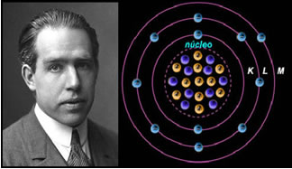
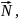
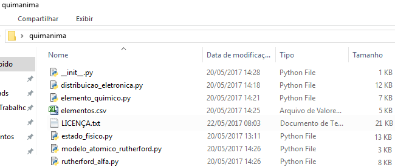
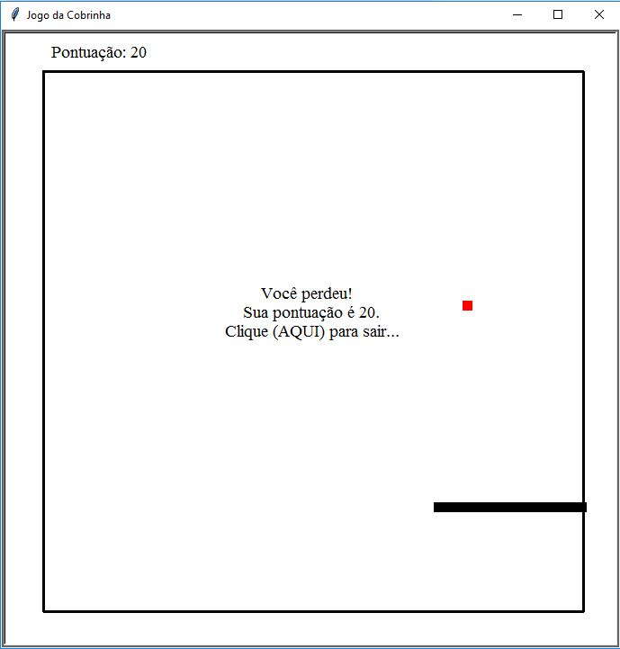
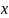
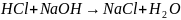

INSTITUTO FEDERAL DE EDUCAÇÃO, CIÊNCIA E TECNOLOGIA DO\
RIO GRANDE DO NORTE\
*CAMPUS* PARNAMIRIM

MATEUS ALVES DE OLIVEIRA

**QUIMANIMA: animações computacionais para química do ensino médio\
\
\
\
\
\
\
\
\
\
\
\
\
\
**\

PARNAMIRIM-RN\
2017

MATEUS ALVES DE OLIVEIRA

**QUIMANIMA: animações computacionais para química do ensino médio**

Relatório técnico científico apresentado ao Curso Técnico em Informática
do Instituto Federal de Educação, Ciência e Tecnologia do Rio Grande do
Norte, em cumprimento às exigências legais como requisito parcial à
obtenção do título de Técnico em Informática.\
\
Orientador: Prof. Jurandy Martins Soares Júnior

PARNAMIRIM-RN\
2017

MATEUS ALVES DE OLIVEIRA

**QUIMANIMA: animações computacionais para química do ensino médio**

Trabalho de Conclusão de Curso apresentado ao Curso Técnico em
Informática do Instituto Federal de Educação, Ciência e Tecnologia do
Rio Grande do Norte, em cumprimento às exigências legais como requisito
parcial à obtenção do título de Técnico em Informática.

Trabalho de Conclusão de Curso apresentado e aprovado em
\_\_\_/\_\_\_/\_\_\_\_ para a seguinte banca examinadora

­­­­­­­­­­­­­­­\_\_\_\_\_\_\_\_\_\_\_\_\_\_\_\_\_\_\_\_\_\_\_\_\_\_\_\_\_\_\_\_\_\_\_\_\_\_\_\_\_\_\_\_\_\_\_\_\_\_\_\_\_\_\_\_\_\_\_\_\
Jurandy Martins Soares Júnior -- Orientador\
Instituto Federal de Educação, Ciência e Tecnologia do Rio Grande do
Norte

­­­­­­­­­­­­­­­­­­­\_\_\_\_\_\_\_\_\_\_\_\_\_\_\_\_\_\_\_\_\_\_\_\_\_\_\_\_\_\_\_\_\_\_\_\_\_\_\_\_\_\_\_\_\_\_\_\_\_\_\_\_\_\_\_\_\_\_\_\_\
Álvaro Hermano da Silva -- Coordenador do curso\
Instituto Federal de Educação, Ciência e Tecnologia do Rio Grande do
Norte

\

\

\

\

\

\

\

\

\

\

\

\

\

\

\

\

\

\

\

\

\

\

\

\

\

\

\

\

\

\

\

\

\

\

\

\

\

\

\

Descobrir a essência de uma determinada ciência é um feito realizado por
quem realmente ama e se identifica com o conhecimento sobre ela.
Descobrir a essência de várias ciências e, se possível, relacioná-las, é
um feito realizado por quem realmente ama conhecer.

(ALVES, Mateus, 2017)

\
\

\
\

**RESUMEN**

¿Es posible aplicar conocimientos de Química de la enseñanza media a
Programación Orientada a Objetos (POO)? En la enseñanza media técnica en
la modalidad integrada, generalmente estas disciplinas son enseñadas de
manera separada, cuando las mismas podrían ser relacionadas, lo que
facilitaría el entendimiento de ambas. Para resolver este problema se
inició el desarrollo de un paquete en el lenguaje de programación Python
para hacer animaciones que abordan fenómenos químicos. En el desarrollo
de este módulo, también se aplicaron conocimientos de otras disciplinas,
como: Matemática, con el uso de coordenadas cartesianas, coordenadas
polares, matriz de rotación y matriz dispers; Física, con conceptos como
las Leyes de la reflexión; y Inglés, para el desarrollo del módulo y en
la lectura de la documentación del lenguaje de programación.

**Palabras clave:** química, programación, integración.

\
\

**SUMÁRIO**

::: {#Table of Contents1 dir="ltr"}
[2. DESENVOLVIMENTO DO QUIMANIMA
12](#__RefHeading___Toc15991_2253905079)

[2.1. FUNDAMENTAÇÃO TEÓRICA 12](#__RefHeading___Toc15993_2253905079)

[2.1.1. O que é a Química? 12](#__RefHeading___Toc15995_2253905079)

[2.1.2. O que é a Programação Orientada a Objetos?
13](#__RefHeading___Toc15997_2253905079)

[2.1.3. Integrando as disciplinas
15](#__RefHeading___Toc15999_2253905079)

[2.2. ABSTRAÇÕES 18](#__RefHeading___Toc16001_2253905079)

[2.2.1. Conceitos gerais 18](#__RefHeading___Toc16003_2253905079)

[2.2.2. Classificação/instanciação
20](#__RefHeading___Toc16005_2253905079)

[2.2.3. Generalização/especialização
23](#__RefHeading___Toc16007_2253905079)

[2.2.4. Agregação/decomposição 24](#__RefHeading___Toc16009_2253905079)

[2.2.5. Associação 26](#__RefHeading___Toc16011_2253905079)

[2.3. APLICAÇÕES EM QUÍMICA 29](#__RefHeading___Toc16013_2253905079)

[2.3.1. Estados físicos da matéria
30](#__RefHeading___Toc16015_2253905079)

[2.3.2. Modelo atômico de Rutherford
35](#__RefHeading___Toc16017_2253905079)

[2.3.3. Experiência de Rutherford com as partículas alfa e a placa de
ouro 41](#__RefHeading___Toc16019_2253905079)

[2.3.4. Distribuição eletrônica 50](#__RefHeading___Toc16021_2253905079)

[2.4. O MÓDULO QUIMANIMA 59](#__RefHeading___Toc16023_2253905079)

[3. OUTRAS APLICAÇÕES 61](#__RefHeading___Toc16025_2253905079)

[3.1. SISTEMA SOLAR 61](#__RefHeading___Toc16027_2253905079)

[3.2. JOGO DA COBRINHA 65](#__RefHeading___Toc16029_2253905079)

[4. TRABALHOS FUTUROS 69](#__RefHeading___Toc16031_2253905079)

[4.1. GEOMETRIA MOLECULAR 69](#__RefHeading___Toc16033_2253905079)

[4.2. REAÇÕES QUÍMICAS INORGÂNICAS
72](#__RefHeading___Toc16035_2253905079)

[4.3. NOMENCLATURAS 74](#__RefHeading___Toc16037_2253905079)

[5. CONSIDERAÇÕES FINAIS 75](#__RefHeading___Toc16039_2253905079)

[REFERÊNCIAS BIBLIOGRÁFICAS 76](#__RefHeading___Toc16041_2253905079)

[APÊNDICE A -- Código da animação sobre estados físicos da matéria.
80](#__RefHeading___Toc16043_2253905079)

[APÊNDICE B -- Código da animação sobre o modelo atômico de Rutherford.
87](#__RefHeading___Toc16045_2253905079)

[APÊNDICE C -- Código da animação sobre a experiência de Rutherford e as
partículas alfa. 90](#__RefHeading___Toc16047_2253905079)

[APÊNDICE D -- Código da animação sobre distribuição eletrônica.
95](#__RefHeading___Toc16049_2253905079)

[APÊNDICE E -- Código do módulo *elemento\_quimico.py* que contém a
leitura do arquivo *elementos.csv* (Apêndice F) e a classe
ElementoQuimico, este módulo foi importado pelo módulo no Apêndice D
101](#__RefHeading___Toc16051_2253905079)

[APÊNDICE F -- Texto do arquivo *elementos.csv* que contém as
características dos elementos químicos
106](#__RefHeading___Toc16053_2253905079)

[APÊNDICE G -- Código da animação do sistema solar.
109](#__RefHeading___Toc16055_2253905079)

[APÊNDICE H -- Código do jogo da cobrinha.
112](#__RefHeading___Toc16057_2253905079)

[APÊNDICE I -- Módulo *formula\_molecular.py* para o treinamento de
expressões regulares 115](#__RefHeading___Toc16059_2253905079)

[ANEXO A -- Licença Pública Geral GNU
117](#__RefHeading___Toc16061_2253905079)
:::

\
\

**LISTA DE ILUSTRAÇÕS**

::: {#Illustration Index1 dir="ltr"}
[[Figura 1:]{style="font-style: normal"}[ Jon Dalton, o idealizador do
primeiro modelo atômico]{style="font-style: normal"}
13](#Figura!0%7Csequence)

[[Figura 2:]{style="font-style: normal"}[ Modelo genérico do diagrama de
classes UML]{style="font-style: normal"} 18](#Figura!1%7Csequence)

[[Figura 3:]{style="font-style: normal"}[ Círculo
simples]{style="font-style: normal"} 19](#Figura!2%7Csequence)

[[Figura 4:]{style="font-style: normal"}[ Representação simples de um
elétron orbitando um núcleo atômico]{style="font-style: normal"}
20](#Figura!3%7Csequence)

[[Figura 5:]{style="font-style: normal"}[ Modelo atômico de
Rutherford-Bohr]{style="font-style: normal"} 21](#Figura!4%7Csequence)

[[Figura 6:]{style="font-style: normal"}[ Operação de
Classificação/Instanciação para a classe Elemento
Químico]{style="font-style: normal"} 22](#Figura!5%7Csequence)

[[Figura 7:]{style="font-style: normal"}[ Tabela periódica, família 8A
-- Gases Nobres]{style="font-style: normal"} 23](#Figura!6%7Csequence)

[[Figura 8:]{style="font-style: normal"}[ Operação de
Generalização/Especialização para o tema Categorias dos elementos
químicos]{style="font-style: normal"} 23](#Figura!7%7Csequence)

[[Figura 9:]{style="font-style: normal"}[ Reação química da formação da
molécula de água]{style="font-style: normal"} 25](#Figura!8%7Csequence)

[[Figura 10:]{style="font-style: normal"}[ Operação de
Agregação/Decomposição para o tema Molécula de
Água]{style="font-style: normal"} 25](#Figura!9%7Csequence)

[[Figura 11:]{style="font-style: normal"}[ Operação de
Agregação/Decomposição para a formação da classe
Átomo]{style="font-style: normal"} 26](#Figura!10%7Csequence)

[[Figura 12:]{style="font-style: normal"}[ Reação química de combustão
entre o]{style="font-style: normal"}[ e
27]{style="font-style: normal"}](#Figura!11%7Csequence)

[[Figura 13:]{style="font-style: normal"}[ Operação de
Associação]{style="font-style: normal"} 28](#Figura!12%7Csequence)

[[Figura 14:]{style="font-style: normal"}[ Diagrama de classes da
animação Estados Físicos da Matéria]{style="font-style: normal"}
31](#Figura!13%7Csequence)

[[Figura 15:]{style="font-style: normal"}[ Solicitação ao usuário sobre
as informações da substância]{style="font-style: normal"}
31](#Figura!14%7Csequence)

[[Figura 16: ]{style="font-style: normal"}[Animação Mudança de estado
físico sendo executada]{style="font-style: normal"}
33](#Figura!15%7Csequence)

[[Figura 17:]{style="font-style: normal"}[ Moléculas saindo do estado
gasoso para o líquido e depois para o sólido, portanto,
precipitam.]{style="font-style: normal"} 34](#Figura!16%7Csequence)

[[Figura 18:]{style="font-style: normal"}[ Coordenadas cartesiana e
polar do ponto P]{style="font-style: normal"} 35](#Figura!17%7Csequence)

[[Figura 19:]{style="font-style: normal"}[ Modelo atômico de
Rutherford]{style="font-style: normal"} 36](#Figura!18%7Csequence)

[[Figura 20:]{style="font-style: normal"}[ Diagrama de classes para a
animação Modelo atômico de Rutherford]{style="font-style: normal"}
37](#Figura!19%7Csequence)

[[Figura 21:]{style="font-style: normal"}[ Experiência de
Rutherford]{style="font-style: normal"} 41](#Figura!20%7Csequence)

[[Figura 22:]{style="font-style: normal"}[ Animação da experiência de
Rutherford sendo executada]{style="font-style: normal"}
42](#Figura!21%7Csequence)

[[Figura 23:]{style="font-style: normal"}[ Diagrama de classes da
animação sobre a experiência de Rutherford]{style="font-style: normal"}
42](#Figura!22%7Csequence)

[[Figura 24:]{style="font-style: normal"}[ Ângulo de colisão/Sentido do
vetor Normal
(]{style="font-style: normal"}[)]{style="font-style: normal"}
47](#Figura!23%7Csequence)

[[Figura 25]{style="font-style: normal"}[: Teste para se calcular o
tamanho da hipotenusa]{style="font-style: normal"}
48](#Figura!24%7Csequence)

[[Figura 26:]{style="font-style: normal"}[ Imagem sobre as propriedades
básicas da reflexão em Física]{style="font-style: normal"}
49](#Figura!25%7Csequence)

[[Figura 27:]{style="font-style: normal"}[ Diagrama de Linus
Pauling]{style="font-style: normal"} 51](#Figura!26%7Csequence)

[[Figura 28:]{style="font-style: normal"}[ Animação sobre distribuição
eletrônica sendo executada]{style="font-style: normal"}
51](#Figura!27%7Csequence)

[[Figura 29:]{style="font-style: normal"}[ Arquivo
]{style="font-style: normal"}elementos.csv 52](#Figura!28%7Csequence)

[[Figura 30:]{style="font-style: normal"}[ Agregação da classe
ElementoQuimico à classe
ElementoDistribuicao]{style="font-style: normal"}
56](#Figura!29%7Csequence)

[[Figura 31:]{style="font-style: normal"}[ Solicitação de um novo
elemento]{style="font-style: normal"} 57](#Figura!30%7Csequence)

[[Figura 32:]{style="font-style: normal"}[ Pacote
quimanima]{style="font-style: normal"} 60](#Figura!31%7Csequence)

[[Figura 33:]{style="font-style: normal"}[ Animação do Sistema Solar
sendo executada]{style="font-style: normal"} 61](#Figura!32%7Csequence)

[[Figura 34:]{style="font-style: normal"}[ Diagrama das classes da
animação sobre o sistema solar]{style="font-style: normal"}
62](#Figura!33%7Csequence)

[[Figura 35: ]{style="font-style: normal"}[Jogo da cobrinha sendo
executado]{style="font-style: normal"} 65](#Figura!34%7Csequence)

[[Figura 36:]{style="font-style: normal"}[ Geometrias
moleculares]{style="font-style: normal"} 70](#Figura!35%7Csequence)

[[Figura 37:]{style="font-style: normal"}[ Representação da molécula de
octano 72]{style="font-style: normal"}](#Figura!36%7Csequence)

[[Figura 38:]{style="font-style: normal"}[ Representação da molécula
de]{style="font-style: normal"} 74](#Figura!37%7Csequence)
:::

\

Este projeto está sendo produzido com intuito de fazer com que os
estudantes de Informática exercitem mais a aplicação dos conhecimentos
adquiridos com o curso, de modo que resolvam determinados problemas. De
certa forma, os estudantes apreenderão mais seus estudos colocando-os em
prática fora da sala de aula. Foi com este pensamento que surgiu a ideia
de se trabalhar com a parte de programação, em que os softwares
produzidos resolveriam determinados problemas.

No entanto, se faz necessário um assunto específico para que sirva de
base para a produção dos softwares. Por isso, foi imaginada a execução
do projeto de uma maneira integrada a alguma disciplina do Ensino Médio.
Dessa forma, os programas feitos têm o objetivo de resolver ou simular
temas relacionados à disciplina integrada. Sendo assim, aqueles que se
interessem pelo projeto devem ter conhecimento híbrido, tanto da parte
de Informática como da disciplina integrada.

A ideia foi concretizada, portanto, na produção de animações
computacionais que simulem ou resolvam fenômenos provenientes da
disciplina integrada. O estudante precursor deste projeto, Mateus Alves
de Oliveira, orientado pelo professor Jurandy Martins Soares Júnior
(idealizador principal do projeto), decidiu integrar a disciplinas de
Química. Com isso, surgiu o *Quimanima*, onde são produzidas animações
computacionais que simulam situações de alguns fenômenos químicos.

No momento, o projeto está no início, pois a agregação de novos
participantes será feita após a realização das primeiras animações e a
documentação delas, pois elas servirão de base para os novos
participantes. No entanto, cada estudante pode ter seus conhecimentos
peculiares, como por exemplo, a linguagem de
programação^[^1^](#sdfootnote1sym){#sdfootnote1anc .sdfootnoteanc}^,
onde um estudante pode ter habilidade com Python e outro com Java, por
exemplo; a disciplina integrada também é outro fator importante, pois
pode acarretar em produções de animações voltadas para outras áreas do
conhecimento.

Os executores deste projeto também estão dispostos a oferecer minicursos
a escolas públicas próximas à região de execução do projeto, de modo tal
que os participantes teriam um conhecimento razoável de programação
através das animações produzidas pelos estudantes responsáveis pelo
projeto. Com isso, os participantes do minicurso poderiam produzir
pequenas animações com o que bem entender como também explorar a
programação mais a fundo.

O presente relatório foi dividido em três partes: a primeira parte é a
seção 2, onde suas subseções têm os conceitos que serviram de base para
o projeto e a aplicação deles; a segunda parte (seção 3) traz ideias
para trabalhos futuros para o projeto *Quimanima*; por último, são
feitas as considerações finais sobre a execução do projeto até o momento
e a sua evolução.

[]{#__RefHeading___Toc15991_2253905079}[]{#_Toc483211293} **2. DESENVOLVIMENTO DO QUIMANIMA** {#desenvolvimento-do-quimanima .western align="justify" style="margin-top: 0in; margin-bottom: 0.11in; line-height: 150%; page-break-before: always"}
=============================================================================================

No decorrer da seção 2, estão presentes as ideias iniciais para a
produção do projeto e também a aplicação destas. Além do objeto
fundamental para execução deste projeto, as animações, outros fatores
preliminares foram considerados, como alguns conceitos obrigatórios para
o entendimento dos processos pelos quais foi passado -- alguns conceitos
não são abordados em sala de aula, portanto, houve uma pesquisa sobre
estes para serem implementados.

A explicação de alguns conceitos será feita nos casos em que são
considerados indispensáveis, no entanto, não é objetivo deste relatório
explicar a fundo os fundamentos de lógica de Programação; tampouco os
conceitos minuciosos da Química.

\
\

[]{#__RefHeading___Toc15993_2253905079}[]{#_Toc483211294} 2.1. FUNDAMENTAÇÃO TEÓRICA {#fundamentação-teórica .western align="justify" style="margin-top: 0in; margin-bottom: 0.11in; line-height: 150%"}
------------------------------------------------------------------------------------

Nesta seção, são apresentadas as ideias principais sobre os assuntos
voltados para Química e Programação Orientada a Objetos -- POO, que
deram base para a execução do projeto, levando em consideração a
influência que traz ao mesmo.

\
\

### []{#__RefHeading___Toc15995_2253905079}[]{#_Toc483211295} **2.1.1. O que é a Química?** {#o-que-é-a-química .western align="justify" style="margin-top: 0in; margin-bottom: 0.11in; line-height: 150%"}

Na natureza, o ser humano está cercado por inúmeras coisas, seres vivos
ou não, alguns visíveis a olho nu, outros não. De qualquer forma, tudo
que existe é composto por alguma coisa. A busca para entender a formação
da matéria surgiu na Grécia antiga. Segundo uma matéria publicada no
site The Best Of Chemistry^[^2^](#sdfootnote2sym){#sdfootnote2anc
.sdfootnoteanc}^, três filósofos, Leucipo (480-430 a.C.), Demócrito
(460-370 a.C.) e Epicuro (341-270 a.C.), argumentavam que a matéria
seria constituída por átomos (*átomo* ­em grego significa indivisível),
que representavam a menor parte de uma matéria, ou seja, a matéria só
poderia ser dividida até o ponto de átomo, o ponto limite.

No entanto, essa ideia foi ignorada até o ano 1803, quando Jon Dalton
(Figura 1) retomou a hipótese atômica para explicar o comportamento dos
gases -- Na seção 2.2.1, o modelo atômico de Dalton é explicado. Assim,
Dalton acreditou que a matéria era composta por partículas minúsculas e
indivisível, chamadas de átomo.

[]{#_Toc483211329} [**Figura 1:**]{style="font-style: normal"}[ Jon
Dalton, o idealizador do primeiro modelo
atômico]{style="font-style: normal"}

{width="211" height="260"}

Fonte: Efemérides do Éfemello (2016)

Desde então, a Química tem evoluído bastante, porém, o que é a Química
de fato? A Química é a ciência que estuda a composição da matéria: os
elementos químicos; as moléculas; a quantidade; suas propriedades como o
ponto de ebulição e de fusão; as transformações que sofrem; etc.
Qualquer matéria, ou seja, um objeto ou ser que ocupe lugar no espaço e
tem massa, pode ser estudado pela Química, inclusive os seres humanos.
"[Independentemente do formato, origem (presente no nosso planeta ou no
universo) ou se vivo ou morto, não existe nenhum material que esteja
fora do alcance da Química." (LOPES, Diogo; FOGAÇA, Jennifer,
2017).]{style="background: #ffffff"}

\
\

### []{#__RefHeading___Toc15997_2253905079}[]{#_Toc483211296} **[2.1.2. O que é a Programação Orientada a Objetos?]{style="background: #ffffff"}** {#o-que-é-a-programação-orientada-a-objetos .western align="justify" style="margin-top: 0in; margin-bottom: 0.11in; line-height: 150%"}

[Tecnologicamente, a humanidade vem avançando cada vez mais. Vem
produzindo soluções inteligentes e sofisticadas para vários tipos de
problemas. Nos dias de hoje, as tecnologias que mais crescem são as
voltadas para a informática. Uma das áreas fundamentais da informática é
o desenvolvimento de softwares. O desenvolvimento de softwares é a
produção de programas ou aplicações digitais (que possuem como
característica principal a lógica de programação) que são executadas em
algum tipo de dispositivo eletrônico compatível -- geralmente computador
ou smartphone.]{style="background: #ffffff"}

[No desenvolvimento de softwares, um programador faz com que uma
aplicação execute determinada tarefa. Há uma sequência básica para a
execução de um software, pois todos possuem uma
]{style="background: #ffffff"}*[Entrada:
]{style="background: #ffffff"}*[dados iniciais, com eles se fará a
execução do programa; ]{style="background: #ffffff"}*[Processamento:
]{style="background: #ffffff"}*[realização das operações com os dados
iniciais para que se chegue à solução desejada;
]{style="background: #ffffff"}*[Saída:
]{style="background: #ffffff"}*[resultado final do processamento.
]{style="background: #ffffff"}

[Por exemplo, um usuário informa seu nome ao programa, este vê quais as
letras vogais presentes no nome e, por fim, retorna o valor da
quantidade de vogais. Percebe-se que a entrada é o nome do usuário, o
processamento é o cálculo de letras vogais e a saída é a quantidade de
vogais presentes no nome.]{style="background: #ffffff"}

[Porém, para que o computador ou dispositivo no qual a aplicação está
sendo executada interprete o código do programa (o algoritmo), é
necessária uma linguagem de programação. Uma linguagem de programação
pode ser entendida como um "idioma" com o qual o programador "conversa"
com o computador e, com isso, o computador faz o que o programador
solicita no algoritmo.]{style="background: #ffffff"}

[Há uma diversidade de linguagens de programação, algumas de baixo
nível: que são interpretadas diretamente pelo computador, tendo
resultado rápido, porém, muito difíceis de serem trabalhadas -- ex.
Assembly; já outras de alto nível: mais fáceis de serem trabalhadas e de
entendidas, pois as ações prescritas pelo programador são representadas
por palavras de ordem, que genericamente significam: faça isso, imprima
isso, enquanto isso faça aquilo, etc. Cada linguagem possui suas
próprias palavras de ordem. "Quando falamos em níveis, podemos dizer que
uma linguagem de alto nível está muito mais próxima do programador do
que do dispositivo, ou seja, é uma linguagem muito mais intuitiva."
(AMARIZ, Luiz, 2017).]{style="background: #ffffff"}

[Além disso, linguagens de alto nível não são interpretadas diretamente
pelo computador, por isso, é necessário um compilador, um programa que
interpreta o código e passa para a linguagem binária (linguagem baseada
em pulsos elétricos que ora significa 0, outrora 1 -- é linguagem padrão
dos computadores e dispositivos eletrônicos), são exemplos de linguagens
de alto nível como Delphi, Java, C, Python,
etc.]{style="background: #ffffff"}

[As animações deste projeto foram produzidas com a linguagem de
programação Python. Toda a pesquisa sobre recursos desta linguagem e
conhecimentos prévios da mesma para elaboração das animações vem
respectivamente do link da documentação do
Python]{style="background: #ffffff"}^[[^3^](#sdfootnote3sym){#sdfootnote3anc
.sdfootnoteanc}]{style="background: #ffffff"}^[ e dos conhecimentos
obtidos em sala de aula. Usou-se também uma biblioteca (um módulo)
interna do Python chamada turtle. O estudo das funções disponibilizadas
pela turtle foi feito a partir da
documentação]{style="background: #ffffff"}^[[^4^](#sdfootnote4sym){#sdfootnote4anc
.sdfootnoteanc}]{style="background: #ffffff"}^[ deste módulo disponível
na internet. As bibliotecas em programação são basicamente o seguinte:
]{style="background: #ffffff"}

[Um conjunto de funções pré-escritas por outros programadores que já
resolvem determinados problemas para você sem que você precise
"reinventar a roda". A esse conjunto de funções damos o nome de
BIBLIOTECA, do inglês,
]{style="background: #ffffff"}*[library]{style="background: #ffffff"}*[.
(JÁCOME, Jarbas,
2010)]{style="background: #ffffff"}[.]{style="background: #ffffff"}

[Para que uma biblioteca seja utilizada em Python, deve ser importada.
Para isso é utilizado o comando
import]{style="background: #ffffff"}^[[^5^](#sdfootnote5sym){#sdfootnote5anc
.sdfootnoteanc}]{style="background: #ffffff"}^[, há dois modos genéricos
e mais utilizados para se usar o import rm Python: "import
nome\_da\_biblioteca"; ou "from nome\_da\_biblioteca import
funções\_ou\_classes\_separadas\_por\_vírgula. Ex: import turtle; from
turtle import Turtle, Screen.]{style="background: #ffffff"}

[As programações se dividem em três aspectos principais: Imperativa,
Funcional e Orientada a Objetos. A programação imperativa executa o
código de maneira sequenciada (de cima para baixo), de modo que as ações
são feitas à medida que um comando é lido pelo interpretador; a
programação funcional não necessariamente seguirá sequência com que os
comandos foram estruturados no código, basicamente são funções que fazem
um pequeno processo e o seu resultado pode servir como entrada para as
outras funções do programa, independentemente da localização delas no
código.]{style="background: #ffffff"}

[Por último, e mais importante para a execução deste projeto, tem-se a
Programação Orientada a Objetos -- POO. Esse tipo de programação, criada
pelo matemático e biólogo molecular Alan Kay, é o que mais busca ter
suas aplicações próximas da realidade -- como será visto melhor na seção
2.2. Basicamente, tudo que participa de uma aplicação, é considerado um
objeto, eles têm suas características específicas e, com isso, cada um
tem suas próprias ações e efeitos no
programa.]{style="background: #ffffff"}

\
\

### []{#__RefHeading___Toc15999_2253905079}[]{#_Toc483211297} **[2.1.3. Integrando as disciplinas]{style="background: #ffffff"}** {#integrando-as-disciplinas .western align="justify" style="margin-top: 0in; margin-bottom: 0.11in; line-height: 150%"}

[Portanto, levando em consideração os conceitos de POO e Química, surgiu
a ideia para integrar as disciplinas para execução de um projeto,
denominado ]{style="background: #ffffff"}*[QUIMANIMA: animações
computacionais para química do ensino
médio]{style="background: #ffffff"}**[.
]{style="background: #ffffff"}***[A ideia se iniciou com o intuito de
produzir animações digitais que representassem diversos fenômenos da
Química. A estrutura de programação das animações se assemelha a jogos
computacionais (também conhecido pelo termo em inglês,
]{style="background: #ffffff"}*[games]{style="background: #ffffff"}*[),
no que diz respeito a alguns aspectos que os
classificam.]{style="background: #ffffff"} [No primeiro capítulo do
livro ]{style="background: #ffffff"}*[Introdução ao Desenvolvimento de
Games -- Volume 1]{style="background: #ffffff"}*[, é possível encontrar
os diferentes gêneros que classificam os tipos de jogos, que não
necessariamente tem um tipo apenas, como informa o
autor:]{style="background: #ffffff"}

[A maioria dos videogames pode ser relacionada a um gênero particular ou
classificada como híbrida de dois ou mais gêneros. Esses gêneros foram
aparecendo durante os anos, em geral como resultado de tentativas e
erros, mas frequentemente também como uma evolução. (RABIN, Steve, 2011,
p. 33).]{style="background: #ffffff"}

[As animações do projeto
]{style="background: #ffffff"}*[Quimanima]{style="background: #ffffff"}*[
possuem gêneros híbridos. Os que se encaixam a elas são:
]{style="background: #ffffff"}

-   -   -   

Apesar da aplicação desses conceitos inicialmente para jogos, eles podem
ser aplicados para as animações por apresentarem características
semelhantes, como a tentativa de representar uma situação real de uma
maneira divertida e compreensível. A grande diferença entre as animações
e jogos computacionais é simples, trata-se do que diz respeito à
interação do usuário com a aplicação.

Nos jogos computacionais, os usuários interagem buscando uma forma para
resolver uma missão ou um problema para chegarem a um objetivo; nas
animações os usuários terão em mãos representações de fenômenos
químicos, mas sem o intuito de resolver algum problema ou controlar um
personagem a algum lugar desejado, no máximo, poderão alterar algumas
características como a temperatura ambiente para ver qual a influência
disso em um corpo qualquer.

Com isso, após a produção das animações, as aulas de químicas podem ser
aperfeiçoadas, contando com um novo recurso para se ensinar determinados
assuntos. Além disso, o pacote com as animações feitas será
disponibilizado para que futuros programadores tenham acesso, para
aprender a programação orientada a objetos como também para ter novas
ideias para novas aplicações.

[]{#__RefHeading___Toc16001_2253905079}[]{#_Toc483211298} 2.2. ABSTRAÇÕES {#abstrações .western align="justify" style="margin-top: 0in; margin-bottom: 0.11in; line-height: 150%; page-break-before: always"}
-------------------------------------------------------------------------

O objetivo desta seção é explicar o que são as abstrações em termos de
Programação Orientada a Objetos. Os exemplos utilizados para a
compreensão do tema estão voltados para a ciência Química também. Para
melhor entendimento da hierarquia de classes, será usado o modelo de
representação de diagrama de classes UML -- Unified Modeling Language,
que significa em português Linguagem de Modelagem Unificada. A Figura 2
mostra um modelo genérico de diagrama de classes, onde as classes são
representadas por retângulos com seus nomes dentro e a hierarquia é
representada pelas linhas interligando as classes:

[]{#_Toc483211330}[]{#_Toc481668006} [**Figura
2:**]{style="font-style: normal"}[ Modelo genérico do diagrama de
classes UML]{style="font-style: normal"}

{width="552" height="301"}

Fonte: Wikipédia (2017).

\
\

### []{#__RefHeading___Toc16003_2253905079}[]{#_Toc483211299} **2.2.1. Conceitos gerais** {#conceitos-gerais .western align="justify" style="margin-top: 0in; margin-bottom: 0.11in; line-height: 150%"}

Desenhos, imagens ou figuras, são alguns exemplos de formas com as quais
se pode representar determinadas coisas, por exemplo, um círculo (Figura
3) pode muito bem representar um anel, porém, não necessariamente
(dependendo da proximidade do desenho com o objeto real) faça com que um
espectador imagine o que de fato o desenho representa, um círculo pode
também lembrar outras coisas além de um anel, como por exemplo uma bola,
a Lua, o Sol, um arco e outras coisas mais. Em Química um círculo não
tão rico em detalhes também pode representar um átomo, especialmente o
modelo atômico de Jon Dalton já que foi o primeiro e mais simples.

[]{#_Toc483211331}[]{#_Toc481668007} [**Figura
3:**]{style="font-style: normal"}[ Círculo
simples]{style="font-style: normal"}

{width="109" height="111"}

Fonte: Alves (2017)

As características do modelo atômico de Dalton são:

-   -   -   -   -   -   

Sendo assim, para que uma representação consiga realmente parecer com o
real, algumas características do objeto ou ser devem ser consideradas
(as características peculiares, que realmente lembram o objeto) e outras
não (características muito específicas, desnecessárias para a
compreensão do espectador e complexas de representar).

Um círculo simples pode lembrar muitas coisas, já um círculo com outro
círculo menor no centro e outro ainda menor "se movendo" (o círculo
amarelo não se move, porém, a linha circular preta pode se parecer com
uma órbita ou sua trajetória, fazendo com que um espectador interprete
que o círculo amarelo se movimenta em torno do círculo azul) ao longo do
comprimento do círculo maior, em torno do círculo azul no centro, seria
algo mais próximo de um elétron girando em torno de um núcleo atômico --
ver Figura 4.

[]{#_Toc483211332}[]{#_Toc481668008} [**Figura
4:**]{style="font-style: normal"}[ Representação simples de um elétron
orbitando um núcleo atômico]{style="font-style: normal"}

{width="105" height="106"}

Fonte: Alves (2017)

No exemplo da Figura 4, três características de um átomo foram
consideradas: o núcleo, o elétron e a eletrosfera, apesar disso, outras
características presentes em um átomo não foram atribuídas, como por
exemplo, os nêutrons e prótons, mesmo assim foi capaz de lembrar um
simples átomo.

Fazer com que uma representação lembre algo real é o que define uma
abstração, as abstrações são exatamente as representações do mundo real
de uma forma mais simples, sem a necessidade de todos os detalhes
presentes no ser, mas apenas o suficiente para que se pareça com o
objeto real. O professor da área de POO da Universidade Federal de Santa
Catarina, Isaias Camilo Boratti, descreve o seguinte sobre as
abstrações:

Abstração é o processo utilizado na análise de determinada situação,
através do qual observa-se uma realidade, tendo-se por objetivo a
determinação dos aspectos e fenômenos considerados essenciais,
excluindo-se todos os aspectos considerados irrelevantes ou secundários.
\[\...\] A abstração constitui em um processo mental através do qual o
ser humano modela uma entidade, isolando as características importantes,
tendo por objetivo a redução de sua complexidade. O processo de
construção de um modelo para resolução de um problema envolverá sempre
um processo de abstração, aliás, o modelo será o resultado dessa
abstração. (CAMILO, Isaias, 2007, p.15).

Em Programação Orientada a Objetos, as abstrações estão bastante
presentes e são definidas por quatro operações de abstração principais:
classificação e instanciação, generalização e especialização, agregação
e decomposição e, por fim, associação. Todas serão explicadas nas quatro
seções seguintes.

\
\

### []{#__RefHeading___Toc16005_2253905079}[]{#_Toc483211300} **2.2.2. Classificação/instanciação** {#classificaçãoinstanciação .western align="justify" style="margin-top: 0in; margin-bottom: 0.11in; line-height: 150%"}

Na natureza existem diversos seres (vivos ou inanimados) que juntos a
formam. Estes seres, direta ou indiretamente, constituem um grupo ou uma
sociedade, cada um com a sua utilidade. Todos os seres possuem
determinadas características que os identificam, muitos têm
características comuns entre si, como sendo uma regra para que todos os
seres daquele tipo tenham obrigatoriamente características semelhantes.
Por exemplo, um tipo de elemento químico (considerando o modelo de
Rutherford-Bohr, ver Figura 5), para ser considerado um átomo deve ter
um núcleo constituído de prótons e nêutrons e, orbitando esse núcleo,
elétrons -- com excessão do hidrogênio D, que não tem nêutrons. A região
onde os elétrons permanecem orbitando o núcleo de um elemento químico é
chamada de eletrosfera.

[]{#_Toc483211333}[]{#_Toc481668009} [**Figura
5:**]{style="font-style: normal"}[ Modelo atômico de
Rutherford-Bohr]{style="font-style: normal"}

{width="324" height="186"}

Fonte: Alunos Online (2017)

Em seu estado natural, um átomo de hidrogênio (que não seja o D) é
composto por um próton e um ou dois nêutrons em seu núcleo e,
orbitando-os, apenas um elétron.

"O hidrogênio encontrado na natureza é constituído por três isótopos:
Prótio  ou
 , o deutério
 ou 
, e o trítio  ou T. Esses isótopos
contem no núcleo 1 próton e zero, 1 ou 2 nêutrons, respectivamente. O
prótio é o mais abundante." (TABELA PERIODICA COMPLETA, 2017).

Já um átomo de oxigênio tem oito prótons e oito nêutrons em seu núcleo,
na eletrosfera tem oito elétrons. Apesar da diferença na quantidade de
prótons, nêutrons e elétrons entre esses dois átomos exemplificados e os
demais átomos provenientes da tabela periódica, todos permanecem sendo
átomos, porque justamente têm as características necessárias para serem
considerados um átomo.

O conceito de átomo consiste em uma entidade física, que contém prótons,
nêutrons e elétrons; os elementos químicos são tipos de átomos
específicos, com o mesmo número atômico (Z -- número de prótons, são os
chamados *isótopos*). Essa afirmação é baseada no seguinte: "Elemento
químico é o conjunto de todos os átomos com o mesmo número atômico
(*Z*)." (FELTRE, Ricardo, 2005, p. 59). Outra classificação foi
pesquisada também, esta diz o seguinte:

"Toda a matéria é feita de várias combinações de formas simples da
matéria, chamadas de elementos químicos. Um elemento é uma substância
formada por um único tipo de átomo." (ATKINS, Peter; JONES, Loretta,
2012, p. F16).

Com isso, pode-se perceber que a classificação de um átomo está
relacionada a um modelo que deve ter como características basicamente
prótons, nêutrons e elétrons. Portanto, tem-se uma classe Átomo. A outra
classe, Elemento Químico, que herda as características da classe Átomo
(o conceito de herança é explicado na seção 2.2.3), contém as
características não físicas do elemento, como o nome, o símbolo, o
número atômico, a massa atômica, etc.

Neste caso, a classe Átomo é definida como classe abstrata, pois "ela é
uma classe que apenas idealiza um tipo, define apenas um rascunho."
(CAELUM, 2016). A classe Átomo idealiza o modelo dos átomos, já a classe
Elemento Químico classifica todos os átomos com suas características
mais importantes, independentemente de serem físicas ou não. Por fim, as
instâncias são todos os elementos da tabela periódica que pertencem à
classe Elemento Químico.

A instanciação é um processo por meio do qual se realiza a cópia de um
objeto (classe) existente. Uma classe, a qual tem a função de determinar
um tipo de dado, deve ser instanciada para que possamos utilizá-la.
Sendo assim, devemos criar sua instância, a qual definimos como sendo um
objeto referente ao tipo de dado que foi definido pela classe. (BALBO,
Wellington, 2016).

A Figura 6 apresenta as operações de classificação e instanciação para a
classe Elemento Químico. A classe abstrata é representada por um
retângulo com o nome dentro (*em* *itálico*) e um pequeno retângulo
pontilhado na parte superior à direita. Essa representação não tem o
objetivo de ser completa. Por isso, trata-se de uma abstração e,
portanto, apresenta determinada visão do problema. A classe Elemento
Químico, que herda da classe abstrata Átomo, descreve como são os
objetos pertencentes a ela. Para se representar a classe, foi usado um
retângulo com o nome dentro, enquanto que os objetos estão sendo
representados por uma figura semelhante a uma elipse. Para indicar a
relação entre o objeto e a classe, foi colocada uma linha tracejada
ligando-os.

[]{#_Toc483211334}[]{#_Toc481668010} [**Figura
6:**]{style="font-style: normal"}[ Operação de
Classificação/Instanciação para a classe Elemento
Químico]{style="font-style: normal"}

{width="540" height="237"}

Fonte: Alves (2017)

Uma classificação em POO é justamente um modelo de objeto a ser seguido,
pois a partir desse modelo, outros objetos serão criados. Os objetos
criados com as características de uma determinada classificação são
denominados instâncias, ou seja, quando um objeto de uma classe é
criado, ocorreu um processo de abstração chamado instanciação.

\
\

### []{#__RefHeading___Toc16007_2253905079}[]{#_Toc483211301} **2.2.3. Generalização/especialização** {#generalizaçãoespecialização .western align="justify" style="margin-top: 0in; margin-bottom: 0.11in; line-height: 150%"}

Imaginando uma partícula atômica é natural dizer que ela apresenta
características de um elemento químico, portanto, é classificado como um
elemento químico. Todo elemento químico possue várias características,
uma delas é a categoria. A categoria, portanto, é uma característica
abstrada dos elementos químicos.

Cada elemento químico possui a sua própria categoria, como por exemplo,
os gases nobres (família 8A na tabela periódica -- ver Figura 7). Eles
são elementos não metais, mas além disso, são considerados gases nobres
por serem elementos naturalmente estáveis (que não necessitam de
ligações químicas com outros elementos para se estabilizarem).

[]{#_Toc483211335}[]{#_Toc481668011} [**Figura
7:**]{style="font-style: normal"}[ Tabela periódica, família 8A -- Gases
Nobres]{style="font-style: normal"}

{width="391" height="190"}

Fonte: Tabela Periódica Completa (2017)

Tem-se, então, uma especialização da classificação da categoria, pois
todas as demais categorias são classes especializadas da classe abstrata
Categorias -- ver Figura 8.

[]{#_Toc483211336}[]{#_Toc481668012} [**Figura
8:**]{style="font-style: normal"}[ Operação de
Generalização/Especialização para o tema Categorias dos elementos
químicos]{style="font-style: normal"}

{width="588" height="194"}

Fonte: Alves (2017)

A Figura 8 mostra a especialização geral da classe abstrata Categorias,
que é especializada em Metal, Semi-metal e Não Metal; duas destas três
classes também possuem classes especializadas: a classe Não Metal é
especializada tanto nas classes Halogênio e Gás Nobre; a classe Metal se
especializa em Metal Alcalino, Metal Alcalino-terroso, Metal
Representativo e Metal de Transição. Por sua vez, Metal de Transição é
especializada em Lantanídeo e Actnídeo.

Sempre que, a partir de uma classe mais genérica, se definir uma classe
mais especializada, está-se fazendo uma Operação de Especialização. A
classe mais especializada mantém (herda) todas as características da
classe mais geral e, adicionalmente, define características específicas.
De maneira inversa, podemos, a partir de um grupo de classe, identificar
características que são comuns a todas e definir, com essas
características comuns, uma nova classe, que será mais geral. (CAMILO,
Isaias, 2007, p.19).

Ainda considerando que a categoria de um elemento seja gás nobre, esta
apresenta todas as características de um não metal, e todo não metal
possui as características da classe abstrada Categorias, no entanto,
todas as categorias de elementos especializadas possuem suas próprias
características que as definem, neste caso, as características da
categoria Gás Nobre. Ou seja, as classes mais gerais tendem a
especificar características mais comuns entre suas instâncias; já as
classes especializadas especificam determinadas características (as
quais a classe da qual ela foi criada não tinha), além de ter todas as
características da classe da qual herda (classe "mãe").

\
\

### []{#__RefHeading___Toc16009_2253905079}[]{#_Toc483211302} **2.2.4. Agregação/decomposição** {#agregaçãodecomposição .western align="justify" style="margin-top: 0in; margin-bottom: 0.11in; line-height: 150%"}

Sabe-se que todo objeto é uma instância de uma classe e que apresenta
determinadas características provenientes da mesma, sabe-se também que
uma especificação de determinada classe é um processo de especialização,
já o processo de agregação é definido pelo seguinte: basicamente um ou
mais objetos de classes iguais ou diferentes fazem parte ou compõem
outro objeto; a agregação também pode ser compreendida como uma classe
composta por outras classes, um agregado de classes, onde as instâncias
das classes que formam determinado objeto são também chamadas de
"Partes" e o objeto composto pelas partes é chamado de "Todo." (CAMILO,
Isaias, 2007, p. 23).

Um exemplo de agregação e decomposição em química está relacionado à
formação de moléculas. São considerados dois isótopos de hidrogênios que
pertencem à classe Elemento Químico, um isótopo oxigênio também. Os três
elementos são instâncias de Elemento Químico e juntos podem formar uma
instância de uma nova classe, que no caso será um objeto da classe
Molécula, a molécula de água ( --
monóxido de dihidrogênio -- ver Figura 9).

[]{#_Toc483211337} [**Figura 9:**]{style="font-style: normal"}[ Reação
química da formação da molécula de água]{style="font-style: normal"}

{width="508" height="99"}

Fonte: Alves (2017)

O processo de decomposição é o inverso da agregação, nesta operação
busca-se identificar todos os objetos presentes em um objeto maior,
formado por todos os objetos menores. Continuando com o exemplo da
molécula de água, se ela for submetida a um aumento de temperatura que
cresce gradativamente, chegará o momento em que ela estará tão aquecida
que as ligações entre os elementos serão quebradas, assim, os dois
hidrogênios e o oxigênio (que são os objetos que formam a molécula)
poderão ser separados e identificados.

[]{#_Toc483211338} [**Figura 10:**]{style="font-style: normal"}[
Operação de Agregação/Decomposição para o tema Molécula de
Água]{style="font-style: normal"}

{width="514" height="256"}

Fonte: Alves (2017)

A Figura 10 mostra o processo de agregação e decomposição para o exemplo
da molécula de água. Para representar o processo de
agregação/decomposição, foram feitas as ligações entre as classes por
uma linha contínua juntamente com um losango em uma das pontas, de modo
que o losango indica o sentido da agregação, ou seja, deve estar ligado
à classe dos objetos que são compostos por outros objetos.

Nota-se que, neste caso, os objetos (os elementos) que agregados formam
outra instância (a molécula de água) podem existir independentemente,
porém, a instância formada pelos objetos agregados existe apenas com a
composição dos mesmos, apesar de possuir características peculiares, por
exemplo, o ponto de fusão e de ebulição, que respectivamente indicam a
temperatura em que a substância passa do estado físico sólido para o
líquido e do estado líquido para o gasoso.

Outro exemplo de agregação e decomposição é o próprio átomo, pois todo
átomo é composto basicamente por prótons, nêutrons e elétrons. Neste
caso, a classe Átomo é uma junção de no mínimo três instâncias de outras
classes. A decomposição é justamente a separação dessas três instâncias
que compõem o Átomo. Os prótons são instâncias da classe Próton; os
nêutrons vêm da classe Nêutron; e os elétrons são da classe Elétron. A
Figura 11 mostra as operações de agregação e decomposição para a classe
Átomo.

[]{#_Toc483211339} [**Figura 11:**]{style="font-style: normal"}[
Operação de Agregação/Decomposição para a formação da classe
Átomo]{style="font-style: normal"}

{width="568" height="139"}

Fonte: Alves (2017)

\
\

### []{#__RefHeading___Toc16011_2253905079}[]{#_Toc483211303} **2.2.5. Associação** {#associação .western align="justify" style="margin-top: 0in; margin-bottom: 0.11in; line-height: 150%"}

Para a exemplificação desta abstração com assuntos químicos, foram
consideradas as classes Hidrocarboneto e Molécula Diatômica. Antes
disso, é necessário entender o que são os hidrocarbonetos e as moléculas
diatômicas. Os "hidrocarbonetos são moléculas que contêm apenas carbono
( ) e hidrogênio
( ) em sua composição." (MICHA, Renan,
2014), e uma "molécula diatômica é uma molécula formada por dois átomos,
sejam eles do mesmo elemento ou não." (WIKIPÉDIA, 2015). Agora são
consideradas instâncias das classes Hidrocarboneto e Molécula Diatômica,
respectivamente  (o gás metano) e
 (o gás oxigênio).

É necessário também ter uma noção do que acontece em uma reação química.
De acordo com uma matéria publicada no site Mundo
Educação^[^6^](#sdfootnote6sym){#sdfootnote6anc .sdfootnoteanc}^, uma
reação química ocorre quando certas substâncias sofrem transformações em
relação ao seu estado inicial (reagentes). Para que isso possa
acontecer, as ligações entre elementos e moléculas devem ser rompidas e
devem ser restabelecidas de outra maneira. A ocorrência de uma reação
química é indicada pelo aparecimento de novas substâncias (produtos),
diferentes das originais, que são os reagentes.

Em Química, as substâncias presentes à esquerda da seta da equação
química são denominadas reagentes; as substâncias à direita, produtos.
Vale ressaltar que não significa que elas reagem somente entre si, mas
também podem reagir com outras substâncias e é assim para todas as
substâncias, por isso, há a grande variedade de reações químicas na
natureza.

[]{#_Toc483211340} [**Figura 12:**]{style="font-style: normal"}[ Reação
química de combustão entre o ]{style="font-style: normal"}
** [ e ]{style="font-style: normal"}
**

{width="379" height="148"}

Fonte: Linkedin (2015)

As moléculas de  e
 , quando reagem, entram em um
processo de combustão e geram como produtos
 e 
, como mostra a Figura 12 com a equação química balanceada (nas
proporções corretas em termos de quantidade mínima de reagentes e
produtos). Percebe-se então que para que as moléculas reagissem, elas
dependiam uma da outra nesta relação, no caso a reação Química.

As duas moléculas existem independentes uma da outra, porém, para que
fizessem esse processo, precisaram estar associadas até que a reação
fosse completada. Porém, neste caso específico de uma reação química,
depois da reação acontecer, novas substâncias são formadas e as
anteriores desfeitas. Ou seja, novos objetos da classe Molecula são
formados a partir da agregação dos componentes presentes na reação e os
anteriores deixam de existir.

"Reação Química é um fenômeno onde os átomos permanecem intactos.
Durante as reações, as moléculas iniciais são 'desmontadas' e os seus
átomos são reaproveitados para 'montar' novas moléculas." (SOQ, 2017).

A Figura 13 ilustra o exemplo da reação química no diagrama de classe,
para representar a associação, foi colocada uma linha contínua ligando
as classes envolvidas no processo.

[]{#_Toc483211341} [**Figura 13:**]{style="font-style: normal"}[
Operação de Associação]{style="font-style: normal"}

{width="461" height="166"}

Fonte: Alves (2017)

Portanto, o processo de abstração Associação é definido por fazer com
que dois ou mais objetos realizem algum processo, para isso, exige que
estabeleçam uma associação entre si; no entanto, as classes associadas
não dependem uma da outra para existir.

\
\

[]{#__RefHeading___Toc16013_2253905079}[]{#_Toc483211304} 2.3. APLICAÇÕES EM QUÍMICA {#aplicações-em-química .western align="justify" style="margin-top: 0in; margin-bottom: 0.11in; line-height: 150%; page-break-before: always"}
------------------------------------------------------------------------------------

Nesta seção, serão apresentadas as animações produzidas e explicados os
códigos de programação de maneira sucinta e os fenômenos químicos e
físicos. Serão levados em maior consideração os pontos com maior
dificuldade para a produção. Não serão explicados os conceitos
específicos da linguagem Python como marcadores, comandos ou palavras de
ordem. Serão mostradas apenas as imagens das animações quando foram
executadas e de algumas partes dos códigos, estes também serão
referenciados, pois estão presentes no Apêndice deste trabalho. Vale
ressaltar que as imagens, quando impressas, terão as cores alteradas
para o preto e branco, porém, as cores reais das animações serão
consideradas tanto nos códigos fonte como nas explicações das mesmas.

\
\

### []{#__RefHeading___Toc16015_2253905079}[]{#_Toc483211305} **2.3.1. Estados físicos da matéria** {#estados-físicos-da-matéria .western align="justify" style="margin-top: 0in; margin-bottom: 0.11in; line-height: 150%"}

Esta animação foi produzida com intuito de representar a mudança do
estado físico de uma matéria qualquer. Em Química, o estado físico da
matéria é a forma com que as moléculas de uma substância ou mistura de
substâncias se encontram. Ele pode ser: sólido, quando as moléculas
estão muito próximas, possuindo uma forma fixa, volume fixo e não sofrem
compressão; líquido, quando as moléculas estão mais afastadas do que no
estado sólido, sem forma fixa; ou gasoso, onde o movimento das moléculas
é livre, e não há direção única entre elas, muito menos forma ou volume
constante. Ambos os estados físicos se relacionam com vários fatores que
neles interferem, como pressão e temperatura (na animação, apenas o
fator temperatura foi considerado). O código desta animação está
presente no módulo *estado\_fisico.py*, disponível no Apêndice A.

Inicialmente, foram criadas as classes dos objetos que fazem parte desta
animação: Recipiente (linha 22); Particula (linha 43); Substancia (linha
132). A Figura 14 mostra a hierarquia das classes com o diagrama de
classes UML. É possível notar que há uma associação entre a classe
Recipiente e Substancia, pois o objeto recipiente contém a substância em
um determinado momento; ao mesmo tempo, a substância está contida no
recipiente; por outro lado, há uma agregação entre Substancia e
Particula, pois uma substância tem que ser composta por partículas.

\
\

\
\

[]{#_Toc483211342} [**Figura 14:**]{style="font-style: normal"}[
Diagrama de classes da animação Estados Físicos da
Matéria]{style="font-style: normal"}

{width="539" height="153"}

Fonte: Alves (2017)

Todas as instâncias que serão exibidas nas animações do módulo quimanima
possuem um atributo denominado self.\_desenho. O caractere "\_" depois
do "self." indica apenas se o atributo deve ou não ser utilizado fora da
classe do objeto, sem o "\_" pode, senão, não pode, ou seja, é protegido
-- essa característica é chamada de encapsulamento. No diagrama de
classes UML, o encapsulamento de um atributo ou método é definido pelos
sinais que os antecede: "+" (público), "\#" (protegido) e "-" (privado)
-- Veja os atributos e métodos das classes da Figura 14. De qualquer
modo, em alguns casos se faz necessário saber uma informação protegida,
por isso, fez-se o uso de anotações (\@property, como é visto nas linhas
112 a 128 da classe Substancia).

Ao iniciar a animação, é solicitado ao usuário que ele informe qual a
substância e quais os seus pontos de fusão e de ebulição, a Figura 15
mostra isso:

[]{#_Toc483211343} [**Figura 15:**]{style="font-style: normal"}[
Solicitação ao usuário sobre as informações da
substância]{style="font-style: normal"}

{width="614" height="178"}

Fonte: Alves (2017)

Essas informações são dadas uma de cada vez, cada uma é armazenada em
variáveis do programa, material recebe o nome da substância (linha 315);
ponto\_fusao (linha 319) e ponto\_ebulicao (linha 320) recebem o valor
do ponto de fusão e o valor do ponto de ebulição da substância
respectivamente, como é possível ver na parte do código:

O objeto tela, declarado antes na linha 7, é uma instância da classe
Screen presente no módulo turtle. É ela que possui os atributos e
características da janela da animação. Um de seus métodos é o
textinput()^[^7^](#sdfootnote7sym){#sdfootnote7anc .sdfootnoteanc}^, que
mostra justamente a caixa de texto onde o usuário digita os valores
pedidos.

Logo após ser feita a coleta de dados, os objetos presentes na animação
são instanciados. Primeiramente o recipiente da classe Recipiente() sem
nenhum atributo na linha 327; depois, na linha 328, a instância
substancia da classe Substancia(), tendo como atributos as variáveis que
receberam os valores dados pelo usuário; e por fim, um objeto partícula
da classe Particula() na linha 329, que posteriormente será clonada nas
demais partículas da animação, ela possui como argumento a cor. A cor da
partícula é escolhida aleatreamente pelo método choice() presente no
módulo interno do Python denominado
random^[^8^](#sdfootnote8sym){#sdfootnote8anc .sdfootnoteanc}^, ele
escolhe a cor da tupla (tupla é uma lista com valores fixos) cores
(linha 10). Assim, os objetos estão criados e o processamento do
programa pode ser feito.

A Figura 16 mostra a execução da animação, onde a substância está
representando a água e os círculos no interior do recipiente são as
partículas, representando as moléculas da substância.

[]{#_Toc483211344} [**Figura 16:**
]{style="font-style: normal"}[Animação Mudança de estado físico sendo
executada]{style="font-style: normal"}

{width="570" height="197"}

Fonte: Alves (2017)

Nas linhas 164, 174 e 191, foram definidos os métodos
movimentar\_particulas\_solido(), movimentar\_particulas\_liquido() e
movimentar\_particulas\_gas() respectivamente. Ambos modificam o
movimento das moléculas de acordo com o estado físico em que se encontra
a substância, valor que é dado ao atributo self.\_estado no método
\_analisar\_estado() -- linha 202.

O método movimentar\_particulas\_solido() mantém as partículas imóveis,
simulando o estado sólido; movimentar\_particulas\_liquido() movimenta
as moléculas de baixo para cima e vice-versa, imitando o estado líquido
que não tem forma fixa; já o método movimentar\_particulas\_gas()
movimenta cada partícula livremente pela janela, além disso, dentro
deste método são feitos testes para ver se há qualquer colisão entre as
partículas e o recipiente, ou as extremidades da janela da animação,
como também entre elas mesmas. Isso é feito quando os métodos da
partícula, que verificam se ela colidiu em algo, são chamados -- ver
linhas 197 a 199.

Os métodos que verificam as colisões das partículas são:
colidir\_particula(), linha 74, que serve para ver se a partícula
colidiu com alguma outra; colidir\_parede(), linha 87, verifica se a
partícula atingiu alguma extremidade da janela (tela); e, por último,
colidir\_recipiente() na linha 105, que verifica se a partícula colidiu
com o recipiente. As colisões acontecem mais quando o self.\_estado está
com o valor "Gasoso", que significa que a substância está em estado de
gás e suas partículas se movimentando livremente.

Na Figura 16a, a substância está em um recipiente representado pela
linha em forma de U, seu estado é sólido, pois a temperatura (também
demonstrada no lado superior esquerdo da imagem) está abaixo do ponto de
fusão da água, que é 0 °C, portanto, as moléculas se encontram imóveis.
Já na Figura 16b, as moléculas se movem um pouco, porém, continuam
próximas umas das outras, simulando o estado líquido, a temperatura
também está de acordo com o real, pois está em 20 °C, nessa temperatura
a água é líquida.

A temperatura da animação é alterada no momento em o que o usuário
pressiona a tecla seta para cima (Up), seta para a direita (Right), ou
adição (+) para aumentar a temperatura; para diminuir, o usuário
pressiona na tecla seta para baixo (Down), ou seta para a esquerda
(Left) ou subtração (-). Olhando o código a partir da linha 364 à linha
368, vê-se que há uma associação do pressionamento dessas teclas com os
métodos da classe Substancia, aumentar\_temperatura() (linha 213) ou
reduzir\_temperatura() (linha 239). Veja a parte do código
correspondente a seguir:

Isso é possível porque a classe do objeto tela tem um método chamado
onkey()^[^9^](#sdfootnote9sym){#sdfootnote9anc .sdfootnoteanc}^, ele
recebe dois argumentos: o primeiro é a ação que será realizada ao se
pressionar uma tecla, por sua vez, o nome deste botão é o segundo
argumento.

[]{#_Toc483211345} [**Figura 17:**]{style="font-style: normal"}[
Moléculas saindo do estado gasoso para o líquido e depois para o sólido,
portanto, precipitam.]{style="font-style: normal"}

{width="329" height="347"}

Fonte: Alves (2017)

Após o estado gasoso ser atingido por causa da temperatura (100 °C) ter
ultrapassado o ponto de ebulição da substância, as moléculas fluem por
toda a região da animação, ver Figura 16c. Com isso, se o usuário
diminuir a temperatura da animação até que a substância volte ao estado
líquido ou sólido, as moléculas precipitam-se para fora do recipiente,
como visto na Figura 17.

\
\

### []{#__RefHeading___Toc16017_2253905079}[]{#_Toc483211306} **2.3.2. Modelo atômico de Rutherford** {#modelo-atômico-de-rutherford .western align="justify" style="margin-top: 0in; margin-bottom: 0.11in; line-height: 150%"}

Para melhor entendimento desta animação e de outras posteriores, é
recomendado ao leitor que tenha um conhecimento prévio sobre
trigonometria, pois constantes como pi e funções como seno, cosseno,
arco cosseno e raiz quadrada (funções importadas da biblioteca
math^[^10^](#sdfootnote10sym){#sdfootnote10anc .sdfootnoteanc}^: sin
(seno); cos (cosseno); acos (arco cosseno); sqrt (raiz quadrada); pi
(valor de π)) são aplicadas; coordenadas
cartesianas^[^11^](#sdfootnote11sym){#sdfootnote11anc .sdfootnoteanc}^ e
coordenadas polares^[^12^](#sdfootnote12sym){#sdfootnote12anc
.sdfootnoteanc}^ também serão aplicadas.

[]{#_Toc483211346} [**Figura 18:**]{style="font-style: normal"}[
Coordenadas cartesiana e polar do ponto P]{style="font-style: normal"}

{width="489" height="269"}

Fonte: Alves (2017)

As coordenadas cartesianas são baseadas em dois eixos, um horizontal
(*x*) e outro vertical (*y*). Já as coordenadas polares levam em
consideração um único eixo horizontal (o *eixo polar*), qualquer ponto
no plano polar tem certa distância à origem do eixo polar, a esta é
dá-se o nome de *raio* e o θ é o ângulo entre o raio e o eixo polar.
Ambas as coordenadas têm sua origem no mesmo ponto. A Figura 18 mostra
um exemplo de coordenada cartesiana à esquerda e outro de coordenada
polar à direita para um mesmo ponto P.

Ernest Rutherford foi um físico e químico e foi um dos quatro
pesquisadores que elaboram modelos atômicos, sendo o seu o terceiro
modelo. As características de seu modelo atômico dizem que um átomo é
composto por um núcleo positivo com prótons e nêutrons, este núcleo é
orbitado por elétrons com cargas negativas. Baseando-se nisso, foi feita
uma simples animação do modelo atômico de Rutherford -- ver Figura 19.

[]{#_Toc483211347} [**Figura 19:**]{style="font-style: normal"}[ Modelo
atômico de Rutherford]{style="font-style: normal"}

{width="324" height="285"}

Fonte: Alves (2017)

A Figura 19 mostra a animação que ilustra o modelo atômico de
Rutherford. Para esta animação, cujo código está no módulo
*modelo\_atomico\_rutherford.py*, disponível no Apêndice B, foram
consideradas três classes que estão diretamente associadas entre si:
Proton, Eletron e Neutron -- linhas 9, 23 e 37 respectivamente. Cada uma
possui os atributos self.\_desenho e self.\_carga, a classe Eletron
ainda possui mais dois atributos: self.\_primeira\_rotacao e
self.\_angulo. A Figura 20 mostra o diagrama das classes.

[]{#_Toc483211348} [**Figura 20:**]{style="font-style: normal"}[
Diagrama de classes para a animação Modelo atômico de
Rutherford]{style="font-style: normal"}

{width="435" height="139"}

Fonte: Alves (2017)

Nesta animação não há nenhuma interação do usuário com o programa. Ao
executá-lo, a pequena função main() -- linha 76 -- é executada e assim a
animação também. Os objetos da animação foram instanciados nas linhas 80
e 82 (prótons); 85 e 87 (nêutrons); 90 a 93 (elétrons). Após isso, o
laço infinito do enquanto (while) é executado na linha 95. Os elétrons
executam o método mover\_na\_eletrosfera(), que faz com que o elétron, a
cada laço while, se movimente um grau na sua órbita em volta dos prótons
e nêutrons. Veja o código a seguir:

[]{#_MON_1556944831}\
\

\
\

Uma observação a ser feita é sobre os métodos do objeto tela nas linhas
77 e 78: title()^[^13^](#sdfootnote13sym){#sdfootnote13anc
.sdfootnoteanc}^ e tracer()^[^14^](#sdfootnote14sym){#sdfootnote14anc
.sdfootnoteanc}^. Ambos provêm da classe Screen do turtle. O método
title() recebe como argumento uma string que será o título da janela;
tracer() muda a velocidade de movimentação dos objetos na tela de acordo
com o número de valor inteiro, que recebe como argumento, quanto maior
for o número, maior será a velocidade de movimentação dos objetos.

Basicamente, cada vez que o laço while da linha 95 se repete, os
elétrons se deslocam um grau na sua órbita, gerando um movimento
elipsoidal. Para isso acontecer, há uma cálculo dentro do método
mover\_na\_eletrosfera() da classe Eletron, veja o método a partir da
linha 48 do código da animação:

Neste método, foi utilizada a fórmula matemática, em coordenadas
polares, para a formação da elipse a partir do centro:
 -- equação retirada da matéria sobre
elipses disponível no site
Wikipédia^[^15^](#sdfootnote15sym){#sdfootnote15anc .sdfootnoteanc}^.

Onde  é o raio do ponto atual;
 é o raio maior da elipse;
 é o raio menor da elipse; e
 é o ângulo de rotação do raio em
relação ao eixo polar. Todos os objetos da classe Eletron têm um
atributo chamado self.\_angulo e outro self.\_primeira\_rotacao, ambos
iniciam com os valores None e True respetivamente -- None = vazio, True
= verdadeiro. O atributo self.\_primeira\_rotacao serve para saber se o
elétron já realizou uma volta em torno do núcleo atômico, pois na
primeira rotação, o elétron deve sair de um ponto aleatório da elipse na
qual irá percorrer. O atributo self.\_primeira\_rotacao está
indiretamente associado ao atributo self.\_angulo, este indica qual
ângulo em que o raio polar do elétron está em relação ao eixo polar.

O método mover\_na\_eletrosfera() possui três parâmetros:
angulo\_rotacao, raio\_a, e raio\_b. O argumento raio\_a corresponde ao
maior raio da elipse, por padrão, recebeu o valor de 200 pixels; o
parâmetro raio\_b é o menor raio, este recebeu o valor 60; o argumento
angulo\_rotacao é o ângulo de rotação da elipse do elétron, recebe como
padrão o valor 0, que corresponde a 0°, porém, nas linhas 97 a 99 é
possível notar que os elétrons nestas linhas informam qual o valor do
ângulo de rotação para terem sua elipse inclinada.

Inicialmente, self.\_angulo recebe o primeiro valor escolhido entre 0 e
360 através do método randint() também presente na biblioteca random --
ver linha 50. Após isso, o atributo self.\_angulo não será mais vazio e
é incrementado de 1 na linha 73 a cada execução do método. Com isso, a
primeira rotação foi iniciada, portando, o atributo
self.\_primeira\_rotacao recebe o valor False (falso) na linha 69, seu
valor não mudará mais a partir daí.

Após a obtenção do raio  , há uma
conversão da coordenada polar do ponto onde se encontra o elétron para
coordenada cartesiana, isso acontece nas linhas 60 para o x e 61 para o
y. Para que se obtenha a coordenada x, se multiplica o
 pelo cosseno do ângulo
 ; já o y, com a multiplicação do
 pelo seno de
 .

No entanto, para que se tenha uma elipse inclinada, é preciso haver uma
rotação na movimentação do elétron em torno dela. Por isso, fez-se uso
também de um conceito matemático denominado *matriz de rotação*.

Uma matriz de rotação é uma matriz quadrada que, quando aplicada sobre a
representação matemática de vetor - a matriz coluna - tem o efeito de
mudar a direção do vetor por ela representado, mas não a sua magnitude;
fazendo-o assim fisicamente revolver em torno de um eixo de rotação
definido pelos elementos da matriz; por um valor angular também por eles
especificado. (WIKIPÉDIA, 2017).

A matriz de rotação é dada pela equação:
 (KOLMAN, Bernard; HILL, David, 2006,
p. 54).  é o ângulo de rotação. Outra
matriz  , cujos valores são as
coordenadas cartesianas x e y de onde se encontra o corpo a ser
inclinado (neste caso, os objetos da classe Eletron), serve para se
fazer a multiplicação  . A matriz
obtida a partir desta multiplicação dará novos valores para as
coordenadas cartesianas x e y que o corpo deve se deslocar.

\
\

Nas linhas 63 e 64, os novos valores das coordenadas são atribuídos às
variáveis x1 e y1 são calculados, posteriormente atribuídos ao elétron
(self.\_desenho.setpos()), ou na linha 68, caso o ângulo ainda seja 0,
senão, o elétron é deslocado na linha 74 -- a função
setpos()^[^16^](#sdfootnote16sym){#sdfootnote16anc .sdfootnoteanc}^
desloca um objeto da classe Turtle para outro local, de acordo com os
parâmetros (as coordenadas cartesianas x1 e y1) que recebe.

\
\

### []{#__RefHeading___Toc16019_2253905079}[]{#_Toc483211307} **2.3.3. Experiência de Rutherford com as partículas alfa e a placa de ouro** {#experiência-de-rutherford-com-as-partículas-alfa-e-a-placa-de-ouro .western style="margin-top: 0in; margin-bottom: 0.11in"}

Rutherford também estudou a fundo a radioatividade de alguns elementos,
e foi com a experiência com as partículas alfa e a fina placa de ouro
que chegou à sua teoria de que o núcleo atômico era envolto por uma
parte praticamente vazia, a eletrosfera. Com isso, Rutherford chegou ao
seu modelo atômico.

[]{#_Toc483211349} [**Figura 21:**]{style="font-style: normal"}[
Experiência de Rutherford]{style="font-style: normal"}

{width="268" height="258"}

Fonte: Quimicacoma2108 (2010)

\
\

Sua experiência (ilustrada na Figura 21) funciona da seguinte forma:
Rutherford colocou uma pequena quantidade do material radioativo polônio
em um orifício de uma placa de chumbo. O polônio emitia as partículas
alfa que saíam desse orifício. Em frente a ele, Rutherford colocou uma
fina placa de ouro e atrás da placa de ouro, uma placa de sulfeto de
zinco. Após certo tempo, ele percebeu que algumas partículas alfa
atravessavam a placa de ouro e incidiam na placa de zinco, porém, outras
partículas eram desviadas e outras eram refletidas.

O motivo de algumas partículas serem repelidas é que bateram de frente
com o núcleo atômico do ouro. As que sofreram desvio passaram muito
perto do núcleo, pois a partícula alfa é de carga positiva, e o núcleo
do ouro também. Assim, a Experiência de Rutherford provou que o átomo
possui um grande vazio, um espaço muito grande entre os elétrons e os
prótons do núcleo. (MARTINS, Lucas, 2007).

Com isso, surgiu a ideia de se produzir uma animação que simulasse o
fenômeno das partículas alfa que incidiam a placa de ouro. Foi
representada a situação a uma escala subatômica, para que se pudesse ver
o efeito causado no momento da incidência de uma partícula com um ou
mais núcleos de átomos de ouro, as placas de chumbo e de zinco foram
desconsideradas. A Figura 22 mostra a captura da animação quando foi
executada:

[]{#_Toc483211350} [**Figura 22:**]{style="font-style: normal"}[
Animação da experiência de Rutherford sendo
executada]{style="font-style: normal"}

{width="596" height="376"}

Fonte: Alves (2017)

Na Figura 22, vê-se que o emissor de partículas alfa (polônio --
representado pelo objeto alaranjado com formato elipsoidal) está à
esquerda; à direita, estão os átomos de ouro formando a placa de ouro,
eles são representados por círculos amarelos com linhas circulares
amarelas em volta representando a eletrosfera; já as partículas alfa são
representadas pelo círculo vermelho pequeno que, ao se deslocar, deixa o
rastro para que se note a sua trajetória. Para esta animação, foram
consideradas quatro classes: MaterialRadioativo, PlacaOuro, ElementoOuro
e ParticulaAlfa. A Figura 23 mostra o diagrama das classes.

[]{#_Toc483211351} [**Figura 23:**]{style="font-style: normal"}[
Diagrama de classes da animação sobre a experiência de
Rutherford]{style="font-style: normal"}

{width="435" height="300"}

Fonte: Alves (2017)

Com a Figura 23, podem ser vistas as operações de abstrações das classes
entre si, seguindo os modelos da seção 2.2: A classe PlacaOuro é uma
agregação composta de objetos da classe ElementoOuro, já que é formada
pela ligação dos átomos de ouro; ParticulaAlfa e MaterialRadioativo
estão em associação, pois uma partícula alfa é emitida por um material
radioativo e alguns materiais radioativos emitem radiações alfa (α) --
vale ressaltar que outros materiais radioativos também emitem radiações
nucleares como beta (β) e gama (**[γ]{style="background: #ffffff"}**).
As radiações nucleares são efeitos causados pelo número excedente de
prótons em comparação com o número de nêutrons em seu núcleo, com isso,
os prótons se repelem com mais intensidade por terem a mesma carga
positiva e por estarem tão próximos (sem nenhum nêutron entre eles),
liberando assim uma radiação nuclear.

Os núcleos atômicos são partículas extraordinárias. Elas contêm todos os
prótons do átomo, comprimidos em um pequeno volume, apesar de suas
cargas positivas. Porém, a maior parte dos núcleos sobrevive
indefinidamente, apesar das imensas forças repulsivas que existem entre
prótons que eles contêm. Em alguns núcleos, entretanto, a repulsão que
os prótons exercem uns sobre os outros supera a força que mantém os
núcleos unidos. Ocorre, então, a ejeção de fragmentos dos núcleos, um
processo chamado de "decaimento". (ATKINS, Peter; JONES, Loretta, 2012,
p. 705).

O código desta animação está no módulo *rutherford\_alfa.py*, disponível
no Apêndice C. Inicialmente, foram instanciados os objetos: alfa (linha
231), polonio (linha 233), ouro (linha 235) e liga\_ouro (linha 237),
ambos pertencem respectivamente às classes ParticulaAlfa,
MaterialRadioativo, ElementoOuro e PlacaOuro. A parte do código a seguir
mostra a função main():

Uma observação a ser feita é que o objeto liga\_ouro tem é formado por
clones do objeto ouro, por isso, no momento em que foi criado, recebe
como argumentos o objeto ouro e a quantidade de objetos que o compõe,
neste caso a quantidade foi 19. O movimento da animação está relacionado
ao movimento da partícula alfa, que é realizado no método que é chamado
na linha 240, movimentar\_particula(), porém, o código do método
encontra-se nas linha 20 até a linha 40; toda vez que a partícula alfa
atinge a extremidade da janela (laço while da linha 28), a partícula
volta ao ponto de seu início para simular novas emissões de partículas.
Sempre que a partícula sai do emissor radioativo, um ângulo no qual ela
é girada é escolhido aleatoriamente entre -30° e 25° pelo método
randint(), na linha 23 na primeira emissão e na linha 39 nas
posteriores. Onde -30° é o mesmo que 335°, mas foi convertido para um
número menor que 25º, pois o método randint() funciona apenas com o
primeiro argumento sendo menor que o segundo. Veja esta parte do código
a seguir:

\
\

O método setheading()^[^17^](#sdfootnote17sym){#sdfootnote17anc
.sdfootnoteanc}^ da classe Turtle também é bastante fundamental (ver
linhas 24 e 40), pois ele muda o sentido da direção de movimentação do
objeto de acordo com o ângulo que recebe como argumento, que neste caso
é o self.\_angulo.

[]{#_MON_1556952182} O teste para ver se há uma colisão entre o objeto
alfa e os objetos da classe ElementoOuro é feito no método
\_colidir\_atomo() na linha 42. Cada vez que a partícula de move, este
método é executado para verificar se a partícula colide com algum átomo.
A colisão é considerada verdadeira quando a distância entre a partícula
e um dos átomos de ouro (valor calculado na linha 52 com a fórmula
 (equação obtida no site
EscolaKids^[^18^](#sdfootnote18sym){#sdfootnote18anc .sdfootnoteanc}^) é
menor ou igual a 11 pixels (soma dos raios dos desenhos da partícula e
do núcleo de ouro) -- comparação feita na linha 54 com o comando if.
Método \_colidir\_atomo():

A cada incidência da partícula com o núcleo do átomo de ouro, há um
cálculo sendo executado. Uma parte de tal cálculo não possui caráter de
nível médio, portanto, foi pesquisado e aplicado. Diz respeito ao estudo
dos vetores. Vendo o código do método \_colidir\_atomo(), tem-se melhor
entendimento.

Primeiramente, foram pegas as coordenadas da partícula e do núcleo do
ouro (linhas 47 e 48, com o método
position()^[^19^](#sdfootnote19sym){#sdfootnote19anc .sdfootnoteanc}^
para a partícula e verificar\_posicao() para o átomo da classe
ElementoOuro). O atributo self.\_desenho dos objetos da classe
ElementoOuro é protegido, por isso, para acessar a posição dele, foi
criado um método público específico para isso chamado
verificar\_posicao() (linha 164).

Depois, um cálculo foi feito para se descobrir qual o sentido de vetor
 (plano normal na Figura 24) que sai
do núcleo do átomo de ouro, este vetor sai na direção do ponto de
colisão da partícula com o átomo de ouro. Por isso, para se obter o
vetor  , as coordenadas x e y da
partícula alfa e do núcleo de átomo de ouro são subtraídas para se ter
novas coordenadas, elas são atribuídas às variáveis xcol e ycol (linhas
56 e 57).

[]{#_Toc483211352} [**Figura 24:**]{style="font-style: normal"}[ Ângulo
de colisão/Sentido do vetor Normal
(]{style="font-style: normal"}**
[)]{style="font-style: normal"}

{width="430" height="353"}

Fonte: Alves (2017)

Com essas novas coordenadas, pode-se descobrir o sentido do vetor
 . Foi feito um cálculo trigonométrico
da seguinte forma: primeiramente uma hipotenusa a partir das novas
coordenadas xcol e ycol foi calculada na linha 59, esta é justamente a
distância da partícula ao ponto central do núcleo do objeto de
ElementoOuro. Aparentemente também parece ser o raio do núcleo do ouro,
mas a uma escala em pixels, nem sempre o ponto de colisão é exatamente
na extremidade da circunferência do círculo amarelo. Para se comprovar
isso, foi feito um teste digitando o comando "print(hipotenusa)" na
linha 60 (ver Figura 25a), que imprimiu valores diferentes nas colisões
que ocorreram, apesar de serem pontos próximos (ver Figura 25b). No
entanto, este teste foi retirado da versão final do código, pois não é
relevante para a animação em si.

\
\

[]{#_Toc483211353} [**Figura 25**]{style="font-style: normal"}[: Teste
para se calcular o tamanho da hipotenusa]{style="font-style: normal"}

{width="393" height="174"}

Fonte: Alves (2017)

\
\

Para se descobrir a direção do sentido do vetor
 , é necessário descobrir qual o
ângulo da colisão (ângulo θ na Figura 24), para isso, foi calculado o
cosseno do ângulo com a divisão da variável xcol pela hipotenusa na
linha 60; a partir daí, foi necessário usar a função do arco cosseno
(acos()) para se descobrir o ângulo da colisão a partir do seu cosseno
na linha 61. Este ângulo é retornado em radianos pela função acos() (as
funções da biblioteca math sobre trigonometria, acos(), asin(), atan()
retornam valores de ângulos em radianos; as funções sin(), cos() e tg()
recebem os valores em radianos). No entanto, as funções
left()^[^20^](#sdfootnote20sym){#sdfootnote20anc .sdfootnoteanc}^,
right()^[^21^](#sdfootnote21sym){#sdfootnote21anc .sdfootnoteanc}^ e
setheading() do módulo turtle, recebem valores de ângulos em graus. Por
isso, o ângulo é convertido para graus na linha 62, multiplicando-o pelo
valor de pi e dividindo por 180°.

Com isso, uma tupla vz, que representa o vetor
 foi criada na linha 66 com dois
valores atribuídos, seus valores são o cosseno e o seno do ângulo de
colisão, isso devolve o sentido do vetor
 .

[]{#_Toc483211354} [**Figura 26:**]{style="font-style: normal"}[ Imagem
sobre as propriedades básicas da reflexão em
Física]{style="font-style: normal"}

{width="257" height="138"}

Fonte: SóFísica (2017)

A Figura 26 exibe algumas propriedades da reflexão. O raio A incide na
lente em um ponto B. O eixo N, perpendicular à superfície da lente,
passa pelo ponto B, esse eixo ganha o nome de *Normal*. O raio A é
refletido pela superfície como um novo raio C. Sobre esse fenômeno, "a
primeira lei da reflexão diz que o raio incidente, o raio refletido e a
reta Normal são coplanares. Ou seja, coexistem no mesmo plano
geométrico." (CÉSAR, Júlio, 2017). Na Figura 33 o plano geométrico é o
plano T.

Aplicando essas propriedades à animação (relação que pode ser vista ao
comparar as Figuras 24 e 26), tem-se que o vetor de incidência A é o
vetor deslocamento da partícula alfa antes de incidir o núcleo do átomo
de ouro; B é o ponto de colisão da partícula alfa com o núcleo de ouro;
o vetor de reflexão C é o vetor deslocamento da partícula após ser
refletida pela colisão com o núcleo do átomo de ouro; a lente é o núcleo
do átomo de ouro; o ângulo i (que é igual ao ângulo r -- reflexão) é o
ângulo de incidência, justamente o ângulo entre o vetor incidente e o
plano normal N. O cosseno deste ângulo i é o que será descoberto com a
equação  -- equação retirada do site
Mundo Educação^[^22^](#sdfootnote22sym){#sdfootnote22anc
.sdfootnoteanc}^.

O vetor de incidência da partícula é obtido pelo método
\_verificar\_vetor\_deslocamento() na linha 130, deste, é retornada uma
tupla cujos valores são o cosseno e o seno do atributo self.\_angulo,
com isso, o sentido do vetor deslocamento da partícula é informado e
atribuído ao vetor vd na linha 68. A partir daí, o cálculo do cosseno do
ângulo entre os dois vetores (o vetor de incidência da partícula e o
vetor que representa o plano normal N) é feito na linha 70 e atribuído à
variável cos\_fi (*Fi* é justamente o nome da letra grega
 ).

Após isso, é feito o cálculo da função acos() na linha 73 para se obter
o ângulo entre os dois vetores a partir do cosseno atribuído à variável
cos\_fi. Após o ângulo ser obtido, é convertido para graus na linha 74.
Com isso, tem-se o ângulo de incidência, porém a partícula deverá ser
refletida de modo que o ângulo entre o vetor deslocamento de incidência
da partícula com o núcleo do ouro e o vetor deslocamento de reflexão
seja duas vezes maior que o valor do ângulo de incidência. Isso ocorre
porque entre os dois vetores há o ângulo de incidência e o ângulo de
reflexão (perceba na Figura 26), e a segunda lei da reflexão afirma que
"o ângulo de reflexão (r) é sempre igual ao ângulo de incidência (i)."
(SÓ FÍSICA, 2017).

Portanto, o novo valor do self.\_angulo será a soma do valor atual mais
180° mais a adição do valor do ângulo de incidência duas vezes (valor
calculado na linha 77) quando a reflexão for para a direita; quando for
para a esquerda, o self.\_angulo será a soma do valor atual mais 180°
menos o valor do ângulo de incidência duas vezes. A partícula é girada
com o método setheading() com o novo valor do self.\_angulo.

Por fim, para evitar colisões bruscas e contínuas, foi feito um pequeno
ajuste, a saber: a partícula é retirada do ponto de colisão para outro
ponto onde estará ligeiramente fora do núcleo e livre de colisões,
porém, ainda próxima do núcleo do átomo para que o usuário não note a
diferença, esta ação é feita no método \_retirar\_do\_nucleo() na linha
100.

\
\

### []{#__RefHeading___Toc16021_2253905079}[]{#_Toc483211308} **2.3.4. Distribuição eletrônica** {#distribuição-eletrônica .western align="justify" style="margin-top: 0in; margin-bottom: 0.11in; line-height: 150%"}

Esta animação leva em consideração o modelo atômico de Rutherford-Bohr
(seção 2.2.1), pois foi a partir do seu modelo que cientistas
posteriores a Bohr, descobriram a existência de subníveis de energias
(*s, p, d, f*).

\[...\] as ideias de Bohr, sobre as sete camadas eletrônicas (ou níveis
de energia: *K, L, M, N, O, P, Q*), explicaram as raias ou bandas dos
espectros dos elementos químicos. No entanto o uso de espectrômetros
mais sensíveis levou à descoberta de que as raias dos espectros são
formadas, frequentemente, por duas ou mais raias mais finas e muito
próximas (é o que se chama de **estrutura fina** das raias). Conclui-se
daí que os níveis de energia são formados por **subníveis** próximos.
(FELTRE, Ricardo, 2005, p. 68).

Porém, foi o engenheiro químico Linus Carl Pauling que desenvolveu um
diagrama que, com ele, é possível distribuir corretamente a quantidade
de elétrons do átomo nos seus devidos subníveis, consequentemente, nos
níveis também. Esse diagrama ficou conhecido como *diagrama de Pauling*
e há duas formas de representação, a forma do diagrama em si (mostrado
na Figura 27) e a forma linear, que segue a sequência do diagrama:\
 

[]{#_Toc483211355} [**Figura 27:**]{style="font-style: normal"}[
Diagrama de Linus Pauling]{style="font-style: normal"}

{width="267" height="228"}

Fonte: Estudando Quimica (2012)

Com isso, se pensou em uma animação que recebesse um símbolo de um
elemento químico digitado pelo usuário, depois devolvesse a distribuição
eletrônica do elemento como também um desenho representando o átomo com
os elétrons em volta, todos nas suas devidas camadas. A Figura 28 mostra
a animação sendo executada com o elemento com maior número de elétrons,
Ununóctio (Uuo), onde a Figura 28a é mostra a solicitação do elemento e
a Figura 28b mostra o átomo e sua distribuição eletrônica.

[]{#_Toc483211356} [**Figura 28:**]{style="font-style: normal"}[
Animação sobre distribuição eletrônica sendo
executada]{style="font-style: normal"}

{width="605" height="245"}

Fonte: Alves (2017)

Inicialmente foi feito um único código que continha dados de todos os
elementos químicos e a partir do que o usuário digitasse, um desses
elementos era exibido. Com isso, foi vista certa desorganização no
código, como também a falta de elegância. Para se resolver esse
problema, foi estudado o modelo de arquivo
CSV^[^23^](#sdfootnote23sym){#sdfootnote23anc .sdfootnoteanc}^. Arquivos
com a extensão CSV são arquivos de texto que contém campos, cada campo é
separado por vírgula, tanto é que CSV é uma sigla (Comma-Separeted
Values) que significa em portugês Valores Separados por Vírgula. No caso
do arquivo *elementos.csv* da Figura 29 e também no Apêndice F, os
campos são as características dos elementos químicos, a cada linha
tem-se as características de um determinado elemento.

Em Python há um módulo que interpreta arquivos CSV, este módulo tem por
nome csv^[^24^](#sdfootnote24sym){#sdfootnote24anc .sdfootnoteanc}^. Com
este módulo, o Python tem a capacidade de fazer leituras e registros em
arquivos de formato CSV. No momento, o módulo csv está sendo fundamental
para se fazer o carregamento dos dados dos elementos químicos do arquivo
*elementos.csv*.

\
\

[]{#_Toc483211357} [**Figura 29:**]{style="font-style: normal"}[ Arquivo
]{style="font-style: normal"}*elementos.csv*

{width="442" height="271"}

Fonte: Alves (2017)

O objetivo de se usar o módulo csv está relacionado ao fato de existir
vários elementos químicos com muitas características cada, portanto,
após o momento em que o símbolo for digitado pelo usuário, será
instanciado um objeto da classe de elementos, de modo que os atributos
serão provenientes do carregamento dos dados dos elementos do arquivo
*elementos.csv*, tornando assim, o programa mais prático e sofisticado.

Também foi criado um módulo de Python de nome *elemento\_quimico.py*
disponível no Apêndice E, que contém a classe ElementoQuimico. O trecho
de código a seguir, tirado deste módulo, cria instâncias de
ElementoQuimico a partir da leitura do arquivo CSV exibido na Figura 29:

Foi criada uma função \_\_carregar\_atomos() no modo privado ("\_\_"
antes de "carregar\_atomos()") na linha 216, ela é chamada na linha 224;
o arquivo *elementos.csv* é aberto na linha 217 pelo comando "**with**
open**(**\'elementos.csv\'**)** **as** arquivo**:**", a vantagem do with
é que, ao finalizar o laço, o arquivo é fechado.

A primeira linha do arquivo *elementos.csv* é apenas um cabeçalho
indicando o que são cada campo, por isso, esta linha é lida pelo método
readline()^[^25^](#sdfootnote25sym){#sdfootnote25anc .sdfootnoteanc}^ e
ignorada na linha 218; após isso, a leitura das demais linhas é feita e
são atribuídas à lista registros na linha 219 pelo método do csv,
reader()^[^26^](#sdfootnote26sym){#sdfootnote26anc .sdfootnoteanc}^; a
partir daí, os átomos são instanciados da classe ElementoQuimico um por
um, de modo que suas características são cada parte separada por vírgula
na linha lida.

Uma observação a ser feita é que no momento da instanciação, na linha
221, ElementoQuimico recebe como argumentos todos os dados de uma vez,
sem a necessidade de separá-los, isso é possível por que, após o csv
separar cada característica por vírgula, cada uma é dada como uma
posição da lista dados\_atomo, por isso, o "\*" serve, neste caso, para
expandir a lista como argumentos para o construtor da classe
ElementoQuimico -- o sinal asterisco (\*) também pode servir para outras
finalidades em Python dependendo do contexto, como por exemplo em uma
multiplicação ou em uma exponenciação.

Sendo assim, a animação pode ser feita, vale ressaltar que para o módulo
*distribuição\_eletronica.py* desta animação, a importação do módulo
*elemento\_quimico.py* deve ser feita para se ter acesso à classe
ElementoQuimico e suas instâncias. O código da animação sobre
distribuição eletrônica está no Apêndice D.

[]{#_MON_1556950760} Quando o arquivo é executado, a função main()
(linha 252), é executada. A entrada deste código é o símbolo ou nome do
elemento informado pelo usuário, ele é armazenado na variável id\_atomo
(linha 261), com isso, se percorre o
dicionário^[^27^](#sdfootnote27sym){#sdfootnote27anc .sdfootnoteanc}^
elemento (presente no módulo *elemento\_quimico.py* que foi importado)
na linha 269 com um laço for, então se verifica se o id\_atomo
corresponde a alguma das chaves de elemento. Veja a função main() na
página 55.

O teste para ver se há o símbolo ou o nome do elemento informado pelo
usuário no dicionário elemento (dicionário presente no arquivo
*elemento\_quimico.py*, contém os objetos da classe ElementoQuimico) é
feito na linha 271. Se corresponder, um objeto da classe
ElementoDistribuicao (classe presente no arquivo
*distribuição\_eletronica.py* -- ver linha 40) é instanciado, de modo
que um de seus atributos é, na verdade, um objeto de ElementoQuimico, ou
seja, há uma agregação (como é visto na Figura 30); já outro atributo é
a representação com o turtle (self.\_desenho). É dessa forma que as
animações serão trabalhadas nos trabalhos futuros, com módulos
separados, de modo que um terá a animação em turtle e importará algumas
partes ou o todo do outro módulo que não contém nenhuma animação dentro.

[]{#_Toc483211358} [**Figura 30:**]{style="font-style: normal"}[
Agregação da classe ElementoQuimico à classe
ElementoDistribuicao]{style="font-style: normal"}

{width="445" height="172"}

Fonte: Alves (2017)

Após a verificação da existência do elemento, o método imprimir() da
classe ElementoDistribuicao é chamado por sua instância na linha 274,
dentro desse método, outros três métodos são chamados:
\_exibir\_eletrons() (linha 71), este exibe a representação do átomo com
o núcleo e os elétrons em volta nas suas devidas camadas;
\_imprimir\_dados() (linha 152), este serve para exibir os dados do
elemento, como número atômico, nome, massa, etc; por último,
\_imprimir\_distribuicao\_eletronica() (linha 282), este método escreve
a distribuição eletrônica do átomo na tela.

Porém, se o símbolo ou nome informado pelo usuário não corresponder a
nenhum elemento químico, é porque provavelmente o usuário digitou o
símbolo ou nome de forma incorreta, portanto uma mensagem é escrita na
tela pelo objeto caneta, da classe Pen de turtle, que diz "Você informou
indevidamente o símbolo ou nome do elemento!" (linha 286).

O usuário ainda tem a opção de informar um novo elemento se caso
responder de forma positiva à pergunta feita pela animação: "Deseja ver
a distribuição de outro elemento? Digite \'S\' para Sim ou \'N\' para
Não". Esta pergunta é feita pelo método textinput() do objeto tela --
ver linha 289. O valor da resposta será do tipo string ("S" ou "N")
atribuída à variável sim\_ou\_nao. A variárel outro\_elemento do laço
while global, na linha 254, tem valor booleano, caso ela tenha um valor
True, o laço se repete. Com isso, o valor da variável outro\_elemento
vai depender se o usuário desejar verificar a distribuição eletrônica de
outro elemento ou não. Se o usuário responder que sim, outro\_elemento
terá valor True, se não, terá valor False -- ver linha 297. A Figura 31
mostra a caixa de texto que pergunta se o usuário deseja uma nova
distribuição.

[]{#_Toc483211359} [**Figura 31:**]{style="font-style: normal"}[
Solicitação de um novo elemento]{style="font-style: normal"}

{width="302" height="306"}

Fonte: Alves (2017)

O ponto mais complicado dessa animação foi realmente fazer a
distribuição dos elétrons, pois era necessário seguir a sequência
correta do diagrama de Pauling. Inicialmente, a forma encontrada para
solucionar esse problema foi feita com uma tupla que continha outras
tuplas como valores, cada uma destas tuplas tinham duas posições em que
a primeira era a letra da camada correspondente e a segunda posição o
número de elétrons máximo no subnível energético do átomo. O código
mostra a tupla distribuicao\_eletronica:

Assim, era possível calcular a quantidade de elétrons em cada camada. No
entanto, outra alternativa mais sofisticada foi aplicada, trata-se da
*matriz esparsa*. "Uma matriz é dita esparsa quando possui uma grande
quantidade de elementos que valem zero." (WIKIPÉDIA, 2017).

A matriz esparsa criada para a execução desta animação foi, portanto,
uma matriz  , criada no código como um
dicionário diagrama\_pauling. Este dicionário foi declarado no módulo
*elemento\_quimico.py*, na linha 17. As chaves deste dicionário são as
posições da matriz (linha e coluna), e os valores de cada uma são: as
posições não nulas recebem valores correspondentes aos valores dos
subníveis no diagrama de Pauling; os demais não valem nada por serem
posições irrelevantes. Veja o dicionário diagrama\_pauling no código:

É no método \_distribuir\_eletrons() (criado na linha 187, e chamado na
linha 50) que essa matriz é utilizada, pois os valores que informam a
quantidade correta de elétrons nos níveis e subníveis são armazenados no
atributo que servirá para a impressão da distribuição na tela,
self.\_distribuicao\_eletronica (linha 49).

[]{#__RefHeading___Toc16023_2253905079}[]{#_Toc483211309} 2.4. O MÓDULO QUIMANIMA {#o-módulo-quimanima .western align="justify" style="margin-top: 0in; margin-bottom: 0.11in; line-height: 150%; page-break-before: always"}
---------------------------------------------------------------------------------

Esta seção mostra a estrutura do pacote *quimanima*, com seus módulos em
suas respectivas pastas como também informa a definição de módulos e
pacotes em Python, baseando-se na documentação do Python sobre módulos e
pacotes, disponível no link^[^28^](#sdfootnote28sym){#sdfootnote28anc
.sdfootnoteanc}^.

Basicamente, um arquivo que contém o conjunto de definições ou
instruções de um algoritmo é conhecido como um script. Dependendo do
tamanho do script, é natural que seja dividido em vários arquivos para
facilitar a manutenção. Isso facilita, por exemplo, no caso de uma
função que serve para várias outras instruções, pois em vez da instrução
ser copiada toda vez que fosse utilizada, seria apenas importada.

É com esse raciocínio que o Python tem uma maneira de colocar definições
e usá-las em um script. Esse script é chamado de módulo. As instruções
de um módulo podem ser utilizadas pelo mesmo como também importadas para
outros módulos. O nome do arquivo é o nome do módulo com a extensão .py,
por exemplo: *elemento\_quimico.py*, "*elemento\_quimico*" é o nome e
"*.py*" a extensão deste módulo de Python.

Já os pacotes são uma forma de estruturar os módulos de Python por meio
de diretórios, de modo que os nomes dos pacotes e dos módulos são
separados por ponto "." no momento da importação de um módulo. Por
exemplo, *quimanima.elemento\_quimico*, "*elemento\_quimico*" é um
módulo em um pacote "*quimanima*".

[]{#_MON_1556947580} O *quimanima* é um pacote e, portanto, aqui está a
estrutura para ele, expressa em termos de um sistema de arquivos
hierárquico:

Ao importar o pacote, o Python pesquisa-o nos diretórios e nos
subdiretórios (também chamados de subpacotes) do pacote. Os módulos
*\_\_init\_\_.py* são arquivos necessários para fazer o Python tratar os
diretórios que contém no pacote. Isso é feito para impedir conflitos em
diretórios com um nome comum por exemplo, ocultando inadvertidamente
módulos válidos que ocorrem mais tarde no caminho de pesquisa de módulo.
No caso mais simples, *\_\_init\_\_.py* pode ser apenas um arquivo
vazio.

No momento, o pacote *quimanima* é um diretório que contém os módulos*­
­* *\_\_init\_\_.py*, *distribuicao\_eletronica.py*,
*elemento\_quimico.py*, *elementos.csv*, *estado\_fisico.py*,
*modelo\_atomico\_rutherford.py* e *rutherford\_alfa.py* e o arquivo de
texto *LICENÇA.txt* (disponível no Anexo A) com a Licença Pública Geral
GNU. A Figura 32 mostra os módulos dentro da pasta *quimanima.*

[]{#_Toc483211360} [**Figura 32:**]{style="font-style: normal"}[ Pacote
quimanima]{style="font-style: normal"}

{width="571" height="232"}

Fonte: Alves (2017)

[]{#__RefHeading___Toc16025_2253905079}[]{#_Toc483211310} **3. OUTRAS APLICAÇÕES** {#outras-aplicações .western align="justify" style="margin-top: 0in; margin-bottom: 0.11in; line-height: 150%; page-break-before: always"}
==================================================================================

Nesta seção serão apresentadas de forma rápida algumas aplicações feitas
com a biblioteca turtle no período inicial do estudo para este projeto.
No entanto, essas animações não têm relação com a Química.

\
\

[]{#__RefHeading___Toc16027_2253905079}[]{#_Toc483211311} 3.1. SISTEMA SOLAR {#sistema-solar .western align="justify" style="margin-top: 0in; margin-bottom: 0.11in; line-height: 150%"}
----------------------------------------------------------------------------

[]{#_GoBack} Esta animação foi inspirada pela descoberta da NASA de
novos planetas semelhantes à Terra, pertencentes ao sistema denominado
TRAPPIST-1 -- matéria disponível no site
Euronews^[^29^](#sdfootnote29sym){#sdfootnote29anc .sdfootnoteanc}^. No
entanto, o sistema solar que foi representado na animação e não o
TRAPPIST-1. Na produção desta animação, foi estudada a forma para se
desenhar uma elipse. É possível notar, com a Figura 33, que o formato
das órbitas dos planetas em torno do Sol é uma elipse. Vale ressaltar
que todos os objetos que representam os planetas e o sol são objetos da
classe Turtle.

[]{#_Toc483211361} [**Figura 33:**]{style="font-style: normal"}[
Animação do Sistema Solar sendo executada]{style="font-style: normal"}

{width="578" height="307"}

Fonte: Alves (2017)

Esta animação foi feita com Programação Orientada a Objetos, no entanto,
está de certa forma defeituosa, pois a classe Astro herda atributos e
métodos da classe Turtle (uma especialização), as demais classes,
Estrela e Planeta, são especializações da classe Astro. Essa hierarquia
não é recomendada, pois é algo muito acoplado à biblioteca turtle. Nas
animações da seção 2.3, nenhuma classe herda da classe Turtle, na
verdade, as classes possuem um atributo self.\_desenho que recebem um
objeto Turtle, que é a representação do objeto da determinada classe. De
qualquer modo, foi mantida esta forma de programação para que se notasse
a evolução do estudo sobre POO comparando com as animações da seção 2.3,
como também para que novos programadores evitem esse tipo de equívoco. A
Figura 34 mostra o diagrama das classes e os processos de abstrações
para esta animação.

[]{#_Toc483211362} [**Figura 34:**]{style="font-style: normal"}[
Diagrama das classes da animação sobre o sistema
solar]{style="font-style: normal"}

{width="354" height="389"}

Fonte: Alves (2017)

O código do módulo *sistema\_solar.py* desta animação está disponível no
Apêndice G. Os objetos desta animação foram instanciados dentro da
função main() na linha 68. O objeto sol da classe Estrela e os demais
objetos da classe Planeta nas linhas 74 a 84. O método translacao(), na
34ª linha do código, é o ponto mais importante do programa, nele que é
processado o movimento dos planetas. O raio da menor órbita (órbita do
objeto mercurio) tem tamanho de 60 pixels, como visto na linha 6, mas
cada planeta tem uma elipse com um raio diferente, definido pela
sequência do mais próximo ao mais distante do Sol, por exemplo, a
posição de Mercúrio é 1 por ser o mais próximo, a posição da Terra é 3
por ser o terceiro planeta mais próximo, este valor é dado ao atributo
self.posicao\_orbita. Por isso, há uma multiplicação do raio pela
posição na órbita, como visto nas linhas 38 e 55. O trecho do código a
seguir mostra o método translacao():

Plutão tem a sua órbita inclinada em relação ao Sol e aos outros
planetas, por isso, tem que se fazer um teste específico com ele. Isso é
feito na linha 37 no laço if, onde é analisada a posição do planeta, se
for 9, significa que é Plutão, já que ele é o nono e último planeta mais
distante do Sol. Portanto, a elipse deve ser inclinada; se não for 9, o
laço else na linha 54 é executado, neste a elipse não será inclinada. As
órbitas desta animação foram feitas com o mesmo raciocínio para as
elipses dos elétrons da animação da seção 2.3.2.

\
\

\
\

[]{#__RefHeading___Toc16029_2253905079}[]{#_Toc483211312} 3.2. JOGO DA COBRINHA {#jogo-da-cobrinha .western align="justify" style="margin-top: 0in; margin-bottom: 0.11in; line-height: 150%; page-break-before: always"}
-------------------------------------------------------------------------------

Esta animação, diferente das outras, pode ser classificada como um jogo,
pois há a total interação do usuário com o programa, como também uma
estrutura na qual o objetivo é somar pontos. Neste jogo da cobrinha, o
objetivo é capturar o maior número de blocos vermelhos (a comida da
cobra) e somar o maior número de pontos, ou seja, deixar a cobra no
tamanho maior que conseguir.

Este jogo foi feito inteiramente com Programação Imperativa, de modo que
não há classes nem objetos (além dos objetos da classe Turtle), apenas
uma sequência de comandos e funções que o programa executa um de cada
vez. A Figura 35 mostra o jogo sendo executado.

[]{#_Toc483211363} [**Figura 35:** ]{style="font-style: normal"}[Jogo da
cobrinha sendo executado]{style="font-style: normal"}

{width="360" height="377"}

Fonte: Alves (2017)

O código deste jogo está no módulo *jogo\_da\_cobrinha.py*, disponível
no Apêndice H. Resumidamente, foi criado um vetor cobra (linha 32) que
cada posição dele será um objeto da classe Turtle (neste caso, um
quadrado preto). O vetor cobra se movimenta de acordo com o método
onkey() nas linhas 99 a 104, de modo que as teclas de seta direcionam o
vetor cobra e a tecla "a" e "s" servem para acelerar e desacelerar
respectivamente. Cada vez que uma dessas teclas é pressionada, uma
função específica é chamada. A parte do código a seguir mostra essa
parte do jogo:

Para identificar se há colisão da cobra com o objeto comida, foi feito o
cálculo da distância entre dois pontos (como na animação da seção
2.3.3), que no caso são os pontos da primeira posição do vetor cobra
(que representa a cabeça) e o ponto onde se encontra a turtle comida,
assim, se for menor que 10 pixels, um clone do quadrado preto é agregado
ao vetor cobra na linha 130 e a comida reaparece em outro lugar
aleatório (linha 129). A variável pontuação é incrementada de 1 cada vez
que um quadrado vermellho é capturado na linha 132. O objeto caneta (da
classe Pen do módulo turtle) atualiza a pontuação com o método
write()^[^30^](#sdfootnote30sym){#sdfootnote30anc .sdfootnoteanc}^ cada
vez que esta é modificada na tela (objeto da classe Screen) -- ver linha
140.

A função que identifica a colisão do vetor cobra com a turtle comida
(colisao\_comida()) está na linha 50; há outra função que identifica a
colisão da cobra com seu próprio corpo, nesta foi considerada a
distância mínima 4 pixels, essa função está na linha 58. Essas duas
funções retornam valores True ou False dependendo se houver a colisão ou
não. Dependendo do valor retornado, o programa funciona de uma
determinada forma. O código a seguir mostra as funções colisao\_comida()
e colisao\_corpo():

\
\

\
\

No algoritmo, há uma variável chamada velocidade (linhas 7). A variável
velocidade funciona como variável de laço do while na linha 107, de modo
que o jogo para no momento em que esta variável recebe o valor 0 (no
caso em que a cobra colide com o próprio corpo -- linha 117), ou quando
o while é parado bruscamente pelo comando
break^[^31^](#sdfootnote31sym){#sdfootnote31anc .sdfootnoteanc}^ (no
caso da cobra atingir a extremidade -- linhas 123 a 125). O código a
seguir mostra o laço while principal do programa, este é executado a
cada vez que a cobra se desloca numa distância em pixels que é
justamente o valor é guardado na variável velocidade:

Por fim, após o laço while ser finalizado, o objeto caneta escreve, com
o método write(), no centro do objeto tela uma mensagem com a pontuação,
e indicando ao usuário para clicar e sair. O fechamento da janela após o
último clique é possível graças à função da classe Screen
exitonclick()^[^32^](#sdfootnote32sym){#sdfootnote32anc
.sdfootnoteanc}^, executado na linha 147. O trecho de código a seguir
mostra a parte final do jogo:

\
\

[]{#__RefHeading___Toc16031_2253905079}[]{#_Toc483211313} **4. TRABALHOS FUTUROS** {#trabalhos-futuros .western align="justify" style="margin-top: 0in; margin-bottom: 0.11in; line-height: 150%; page-break-before: always"}
==================================================================================

Nesta seção, serão lançadas algumas ideias para possíveis animações
futuras. Essas animações serão estudadas e possivelmente produzidas,
porém, não necessariamente sejam apenas essas as futuras animações. Ou
seja, outras ideias podem surgir e serem trabalhadas.

As ideias apresentadas nesta seção foram feitas considerando que o
leitor das mesmas tenha conhecimento considerável de alguns assuntos da
Química e de Programação. Portanto, não é objetivo desta seção explicar
nenhum fenômeno químico como também conceitos de programação.

Os átomos destas animações continuarão tendo atributos em suas classes
que têm como valores objetos provenientes da biblioteca turtle de Python
(até o momento, vem sendo o atributo self.desenho). Porém, as formas dos
átomos não serão de círculos coloridos, mas sim imagens com extensão
.GIF que foram criadas a partir do
Graphviz^[^33^](#sdfootnote33sym){#sdfootnote33anc .sdfootnoteanc}^, que
é um programa Open Source para visualização de grafos.

\
\

[]{#__RefHeading___Toc16033_2253905079}[]{#_Toc483211314} 4.1. GEOMETRIA MOLECULAR {#geometria-molecular .western align="justify" style="margin-top: 0in; margin-bottom: 0.11in; line-height: 150%"}
----------------------------------------------------------------------------------

O estudo da geometria das moléculas busca definir o formato delas, para
isso, algumas propriedades das ligações químicas presentes entre os
átomos da molécula são consideradas, como por exemplo: se todas as
ligações são covalentes para de fato ser uma molécula; o tipo da ligação
entre os elementos (simples, dupla ou tripla); se há pares de elétrons
livres na Camada de Valência (último nível de energia) do átomo central
para ver se há angulação na molécula; etc.

Inicialmente, as moléculas consideradas para esta animação deverão ter
em sua composição apenas dois elementos químicos, com exceção do
 (ácido cianídrico), que é uma
molécula linear com três elementos diferentes. De maneira genérica, as
fórmulas moleculares da animação serão:
 , sendo que
 é um elemento qualquer e a molécula
possui apenas um átomo deste elemento em sua composição; já o
 é qualquer elemento químico diferente
de  ;
 é a quantidade de átomos de
 presentes na molécula. A Figura 36
mostra as geometrias que serão trabalhadas.

\
\

[]{#_Toc483211364} [**Figura 36:**]{style="font-style: normal"}[
Geometrias moleculares]{style="font-style: normal"}

{width="318" height="373"}

Fonte: Todo Es Química (2017)

A fórmula molecular da substância em questão será informada pelo usuário
e interpretada pelo programa. Para isso, será utilizado um módulo do
Python que trata *expressões regulares* --
re^[^34^](#sdfootnote34sym){#sdfootnote34anc .sdfootnoteanc}^, já que as
fórmulas das moléculas seguem um mesmo modelo, pois há os símbolos dos
elementos presentes na molécula, como também o pequeno índice à direita
de cada elemento indicando quantos átomos do determinado elemento tem na
molécula (mantendo oculto caso for igual a 1). O exemplo da molécula de
água ( ) é clássico, sua fórmula
indica que há dois átomos de hidrogênio e um de oxigênio em sua
composição.

Um módulo simples, de nome *formula\_molecular.py*, para o treinamento
de expressões regulares com a fómula das substâncias já foi produzido.
Este está disponível no Apêndice I. Ele serve apenas para receber uma
fórmula molecular informada pelo usuário, e retornar quantos e quais são
os elementos da molécula citada. No entanto, este pequeno módulo
funciona apenas com compostos que contenham elementos de símbolos
correspondentes às chaves do dicionário elementos deste módulo.

Então, a partir disso, a animação faria as ligações entre os átomos
citados considerando a regra do octeto e a geometria da molécula
informada pelo usuário.

A Teoria do Octeto determina que os átomos dos elementos ligam-se uns
aos outros na tentativa de completar a sua camada de valência com oito
elétrons. Sendo assim, o átomo é considerado estável quando apresentar 8
elétrons em sua última camada da eletrosfera. (SOUZA, Líria, 2017).

Para casos de átomos com uma camada apenas, a estabilidade é obtida com
dois elétrons apenas. Ex: Hidrogênio (
) e Hélio ( ).

[]{#__RefHeading___Toc16035_2253905079}[]{#_Toc483211315} 4.2. REAÇÕES QUÍMICAS INORGÂNICAS {#reações-químicas-inorgânicas .western align="justify" style="margin-top: 0in; margin-bottom: 0.11in; line-height: 150%; page-break-before: always"}
-------------------------------------------------------------------------------------------

A ideia para animações com temas relacionados às reações químicas foi a
primeira que surgiu. Foi com o objetivo de realizar animações que
simulassem determinadas reações químicas que o Quimanima surgiu.

As reações químicas são dividas em inorgânicas e orgânicas. As reações
orgânicas estão voltadas às moléculas orgânicas que contêm como
principal elemento o Carbono ( ) e
muitas delas são complexas para serem trabalhadas no que diz respeito à
manipulação da molécula para efeito de animação. Como por exemplo, a
molécula orgânica de octano ( ) -- ver
Figura 37.

[]{#_Toc483211365} [**Figura 37:**]{style="font-style: normal"}[
Representação da molécula de octano ]{style="font-style: normal"}
**

{width="344" height="151"}

Fonte: Wikipédia (2015)

Já as reações inorgânicas estão voltadas a moléculas menores,
semelhantes às moléculas trabalhadas com a animação de geometria
molecular (seção 4.1), por isso, as reações inorgânicas serão
trabalhadas inicialmente. Esta animação será uma evolução da animação
sobre geometria molecular, pois também serão consideradas as geometrias
moleculares das substâncias nas animações sobre reações químicas
inorgânicas.

Serão considerados os quatro tipos de compostos inorgânicos: ácidos,
bases, sais; e óxidos. Também serão levados em conta os específicos
efeitos causados em determinadas reações entre as moléculas inorgânicas.
Por exemplo, uma reação de um ácido com uma base gera um sal e água
geralmente. Um exemplo de uma reação real deste aspecto é a adição da
base hidróxido de sódio ( ) ao ácido
clorídrico ( ), gerando como produto o
sal de cozinha, cloreto de sódio ( ) e
a molécula de água, ( ). A reação
completa é dada por:  .

Como já citado na seção 2.2.5, as reações químicas podem ser
representadas por equações químicas do tipo
 . Onde os
 são as substâncias que reagem entre
si e os  são as novas substâncias
formadas a partir da reação dos reagentes. Sendo assim, o usuário
colocará uma equação em uma caixa de texto (ainda será estudado se a
equação deverá ser informada de forma balanceada ou não) e o programa
interpretará esta equação com o auxílio da biblioteca re e com o csv
poderá carregar os dados dos átomos presentes na reação do arquivo CSV.
O programa mostrará inicialmente os compostos reagentes e depois o
produto da reação de uma forma animada.

\
\

[]{#__RefHeading___Toc16037_2253905079}[]{#_Toc483211316} 4.3. NOMENCLATURAS {#nomenclaturas .western align="justify" style="margin-top: 0in; margin-bottom: 0.11in; line-height: 150%; page-break-before: always"}
----------------------------------------------------------------------------

Esta ideia surgiu a partir do estudo das nomenclaturas das substâncias
em Química, sejam orgânicas ou inorgânicas. Esta animação servirá para
aprofundar mais o conhecimento sobre expressões regulares, pois além de
já ter sido aplicada na fórmula molecular, seria utilizada também em sua
nomenclatura. Ainda assim, seria utilizado o csv para carregar as
imagens quer representam os átomos.

As funções inorgânicas, como já citado na seção 4.2, se dividem em
quatro tipos: ácidos, bases, sais e óxidos. Já as funções orgânicas se
dividem em inúmeras categorias: hidrocarboneto, álcool, enol, fenol,
aldeído, cetona, ácido carboxílico, éter, éster, sais orgânicos, amina,
amida, haletos orgânicos, etc. -- Funções obtidas nos livros de Química
1^[^35^](#sdfootnote35sym){#sdfootnote35anc .sdfootnoteanc}^ (funções
inorgânicas) e Química 3^[^36^](#sdfootnote36sym){#sdfootnote36anc
.sdfootnoteanc}^ (funções orgânicas) de Ricardo Feltre.

Nesta animação, o usuário escolherá o tipo da molécula como orgânica ou
inorgânica com um botão para cada opção por exemplo. Depois informará o
nome da substância de uma maneira padrão estabelecida para que o código
possa compreender. Depois, com a expressão regular (re), o programa
compreenderá de qual molécula se trata e colocará na tela a
representação da molécula, provavelmente com as imagens criadas pelo
Graphviz. Por exemplo, se o usuário escolher a molécula como inorgânica
e depois informar o nome "dióxido de carbono", a animação deverá
retornar a representação da molécula de
 , semelhante à Figura 38.

[]{#_Toc483211366} [**Figura 38:**]{style="font-style: normal"}[
Representação da molécula
de]{style="font-style: normal"}**

Fonte: Alves (2017)

O tratamento de exceção^[^37^](#sdfootnote37sym){#sdfootnote37anc
.sdfootnoteanc}^ em Python para o caso, por exemplo, de se o usuário
clicar na opção de moléculas orgânicas, mas informar uma molécula
inorgânica ou vice-versa, é algo a ser estudado e aplicado nesta
animação e em outras futuramente.

[]{#__RefHeading___Toc16039_2253905079}[]{#_Toc483211317} **5. CONSIDERAÇÕES FINAIS** {#considerações-finais .western align="justify" style="margin-top: 0in; margin-bottom: 0.11in; line-height: 150%; page-break-before: always"}
=====================================================================================

Após o período entre Janeiro e Maio de 2017, a parte inicial do projeto
Quimanima pode ser considerada finalizada. Foi neste período que surgiu
e foi concretizada a ideia de se criar animações computacionais que
simulassem fenômenos químicos. Com o projeto, novos conhecimentos foram
obtidos para melhor qualificação dos estudantes participanes, tendo uma
maior justificativa para a sua execução.

A justificativa maior é claramente o ensino e aplicação dos temas sobre
Programação abordados nas animações, pois serão exercitados
conhecimentos aprendidos nas aulas de Programação Orientada a Objetos,
mas também serão conhecidos novos assuntos, que não são trabalhados na
sala de aula do curso técnico de Informática no nível médio.

Com isso, são produzidas animações que tratam de assuntos de uma
disciplina integrada ao projeto. Tendo as animações produzidas, é
possível aplicá-las nas aulas da disciplina integrada para facilitar os
professores ministrantes quando estes acharem necessário, além de
servirem como exemplos para o aprendizado de futuros participantes do
projeto.

Este projeto é caracterizado como um projeto integrador. Porém, pode se
tornar, de certa forma, um projeto de extensão, pois o Quimanima busca
ser útil para o ensino de Programação para alunos dentro do IFRN e em
outras escolas públicas estaduais ou municipais, seja por meio de
oficinas, minicursos, etc.

No mais, o Quimanima servirá para que novos participantes estudem
Programação Orientada a Objetos de uma maneira aplicada e divertida, mas
também mais complexa e sofisticada. Este documento tem será
disponibilizado àqueles que se interessarem pelo projeto, para que
tenham uma base para prosseguirem com as suas novas ideias de animações,
talvez não somente sobre a Química, dependendo da vocação e afetividade
do estudante com a disciplina integrada à Programação.

[]{#__RefHeading___Toc16041_2253905079}[]{#_Toc483211318} **REFERÊNCIAS BIBLIOGRÁFICAS** {#referências-bibliográficas .western align="center" style="margin-top: 0in; page-break-before: always"}
========================================================================================

\

ALUNOS ONLINE. **Evolução dos Modelos Atômicos**. Disponível em:
\<[<http://alunosonline.uol.com.br/quimica/evolucao-dos-modelos-atomicos-modelos-atomicos.html>]{.underline}\>.
Acesso em: 07 Abr. 2017.

\

ALVES, Líria. **Reações químicas**. Disponível em:
\<[<http://mundoeducacao.bol.uol.com.br/quimica/reacoes-quimicas.htm>]{.underline}\>.
17 Abr. 2017.

\

AMARIZ, Luiz. **Linguagem de Programação de Alto Nível**. Disponível em:
\<[[[http://www.infoescola.com/engenharia-de-software/linguagem-de-programacao-de-alto-nivel/]{style="background: #ffffff"}](http://www.infoescola.com/engenharia-de-software/linguagem-de-programacao-de-alto-nivel/)]{.underline}[\>.
Acesso em: ]{style="background: #ffffff"}02 Mai. 2017.

\

ATKINS, Peter; JONES, Loretta. **Princípios de química questionando a
vida moderna e o meio ambiente**. 5. ed. Porto Alegre: Bookman, 2012.

\

BALBO, Wellington**. Conceitos e Exemplos -- Instanciação: Estrutura da
Linguagem**. Disponível em:
\<[<http://www.devmedia.com.br/conceitos-e-exemplos-instanciacao-estrutura-da-linguagem/18817>]{.underline}\>.
Acesso em: 07 Abr. 2017.

\

CAELUM. **Classes Abstratas**. Disponível em:
\<[<https://www.caelum.com.br/apostila-java-orientacao-objetos/classes-abstratas/>]{.underline}\>.
Acesso em: 18 Mai. 2017.

\

CAMILO, Isaias. **Programação orientada a objetos em java**. 1. ed.
Florianópolis: VisualBooks Editora, 2007.

\

CÉSAR, Júlio. **Leis da Reflexão**. Disponível em:
\<[<http://www.infoescola.com/fisica/leis-da-reflexao/>]{.underline}\>.
Acesso em: 20 Mai. 2017.

\

EFEMÉRIDES DO ÉFEMELLO. **John Dalton, 250 anos**. Disponível em:
\<[<https://efemeridesdoefemello.com/2016/09/06/john-dalton-250-anos/>]{.underline}\>.
Acesso em: 05 Mai. 2017.

\

ESTUDANDO QUIMICA. **Estudarquimica**. Disponível em:
\<[<http://quimicaestudando.blogspot.com.br/>]{.underline}\>. Acesso em:
16 Mai. 2017.

\

FELTRE, Ricardo. **Fundamentos da Química.** 4. ed. São Paulo: Editora
Moderna, 2005.

\

FELTRE, Ricardo. **Química 1.** 7. ed. São Paulo: Editora Moderna, 2008.

\

FELTRE, Ricardo. **Química 3.** 7. ed. São Paulo: Editora Moderna, 2008.

\

FOGAÇA, Jennifer. **Eletronegatividade**. Disponível em:
\<[<http://mundoeducacao.bol.uol.com.br/quimica/eletronegatividade.htm>]{.underline}\>.
03 Mai. 2017.

\

JARBAS, Jácome. **O que é biblioteca de programação \| library \| lib? O
que é API \| Application Programming Interface?**. Disponível em:
\<[<https://jarbasjacome.wordpress.com/o-que-e-biblioteca-de-programacao-library-lib-o-que-e-api-application-programming-interface/>]{.underline}\>.
Acesso em: 23 Abr. 2017.

\

KOLMAN, Bernard; HILL, David. **Introdução à álgebra linear com
aplicações**. 8. ed. Rio de Janeiro: LTC, 2006.

\

LINKEDIN. **Princípios de Medição: THC em FID**. Disponível em:
\<[<https://www.linkedin.com/pulse/princ%C3%ADpios-de-medi%C3%A7%C3%A3o-thc-em-fid-leandro-fontes>]{.underline}\>.
Acesso em: 17 Abr. 2017.

\

[LOPES, Diogo; FOGAÇA, Jennifer]{style="background: #ffffff"}. **O que é
Química?**. Disponível:
\<[<http://brasilescola.uol.com.br/o-que-e/quimica/>]{.underline}\>.
Acesso em 18 Abr. 2017.

\

MICHA, Renan. Disponível em:
\<[<http://educacao.globo.com/quimica/assunto/quimica-organica/hidrocarbonetos.html>]{.underline}\>.
Acesso em: 16 Abr. 2017.

\

MARTINS, Lucas. **Experiência de Rutherford**. Disponível em: \<
[<http://www.infoescola.com/quimica/experiencia-de-rutherford/>]{.underline}\>.
Acesso em: 24 Abr. 2017.

\

MOLINA, Luiz**. Forças Intermoleculares (Van der Waals e Ligação de
Hidrogênio)**. Disponível em:
\<[<http://www.infoescola.com/quimica/forcas-intermoleculares-van-der-waals-e-ponte-de-hidrogenio/>]{.underline}\>.
Acesso em: 04 Mai. 2017.

\

[QUIMICACOMA2108. **Modelo atômico de Rutherford**. Disponível em:
\<[http://quimicacoma2108.blogspot.com.br/2010/03/atomico-de-rutherford-primeira.html]{.underline}](http://quimicacoma2108.blogspot.com.br/2010/03/atomico-de-rutherford-primeira.html)\>.
Acesso em: 24 Abr. 2017.

\

PEREIRA, Ronie. **Modelos atômicos**. Disponível em:
\<[[http://www.ebah.com.br/content/ABAAABnykAF/modelos-atomicos]{.underline}](http://www.ebah.com.br/content/ABAAABnykAF/modelos-atomicos)\>
Acesso em: 07 Abr. 2017.

RABIN, Steve. **Introdução ao desenvolvimento de games**. 2. ed. São
Paulo: Saraiva, 2011.

\

SABERENEM. **Ligações Intermoleculares -- Ligações de Hidrogênio, dipolo
permanente e dipolo induzido**. Disponível em:
\<[<http://saberenemquimicaefisica.com.br/wp/ligacoes-intermoleculares/>]{.underline}\>.
03 Mai. 2017.

\

SÓ FÍSICA. **Reflexão da Luz -- Fundamentos**. Disponível em:
\<[<http://www.sofisica.com.br/conteudos/Otica/Reflexaodaluz/reflexao.php>]{.underline}\>.
Acesso em: 10 Mai. 2017.

\

SOQ. **REAÇÕES QUÍMICAS**. Disponível em:
[\<](http://www.soq.com.br/conteudos/ef/reacoesquimicas/)[[http://www.soq.com.br/conteudos/ef/reacoesquimicas/]{.underline}](http://www.soq.com.br/conteudos/ef/reacoesquimicas/)\>.
02 Mai. 2017.

\

[SOUZA, Líria. ]{style="background: #ffffff"}**[Teoria do
Octeto]{style="background: #ffffff"}**[. Disponível em
\<]{style="background: #ffffff"}[[[http://brasilescola.uol.com.br/quimica/teoria-octeto.htm]{style="background: #ffffff"}](http://brasilescola.uol.com.br/quimica/teoria-octeto.htm)]{.underline}[\>.
Acesso em: 04 de Mai. 2017.]{style="background: #ffffff"}

\

TABELA PERIÓDICA COMPLETA. **Gases Nobres**. Disponível em:
\<[<http://www.tabelaperiodicacompleta.com/gases-nobres>]{.underline}\>.
Acesso em: 06 Abr. 2017.

\

TABELA PERIÓDICA COMPLETA. **Hidrogênio (H)**. Disponível em:
\<[<http://www.tabelaperiodicacompleta.com/elemento-quimico/hidrogenio>]{.underline}\>.
Acesso em: 21 Mai. 2017.

\

THEBESTOFCHEMISTRY. **A ideia de átomo: da Grécia Antiga aos tempos
atuais -- primeiro ano -- bim 2**. Disponível em:
\<[<https://thebestofchemistry.wordpress.com/2014/05/03/a-ideia-de-atomo-da-grecia-antiga-aos-tempos-atuais-turmas-1001-1002-1003/>]{.underline}\>.
Acesso em: 18 Abr. 2017.

\

TODO ES QUÍMICA. **Generalidades de la geometría molecular**. Disponível
em:
\<[<http://chemistryintheatic.wixsite.com/cibercuaderno2015/apuntes-teoricos-c1cy1>]{.underline}\>.
Acesso em: 10 Mai. 2017.

\

WIKIPÉDIA. **Elipse**. Disponível em:
\<[<https://pt.wikipedia.org/wiki/Elipse>]{.underline}\>. Acesso em: 01
Mai. 2017.

\

WIKIPÉDIA. **Matriz esparsa**. Disponível em:
\<[<https://pt.wikipedia.org/wiki/Matriz_esparsa>]{.underline}\>. Acesso
em: 16 Mai. 2017.

\

WIKIPÉDIA. **Matriz de rotação**. Disponível em:
\<[<https://pt.wikipedia.org/wiki/Matriz_de_rota%C3%A7%C3%A3o>]{.underline}\>.
24 Abr. 2017.

\

WIKIPÉDIA. **Molécula diatômica**. Disponível em:
\<[<https://pt.wikipedia.org/wiki/Mol%C3%A9cula_diat%C3%B4mica>]{.underline}\>.
Acesso em: 16 Abr. 2017.

\

WIKIPÉDIA. **Octano**. Disponível em:
\<[<https://pt.wikipedia.org/wiki/Octano>]{.underline}**\>**. Acesso em:
11 Mai. 2017.

\

WIKIPÉDIA. **UML**.Disponível em:
\<[<https://pt.wikipedia.org/wiki/UML>]{.underline}\>. Acesso em: 08
Abr. 2017.

\

[]{#__RefHeading___Toc16043_2253905079}[]{#_Toc483211319} APÊNDICE A -- Código da animação sobre estados físicos da matéria. {#apêndice-a-código-da-animação-sobre-estados-físicos-da-matéria. .western align="center" style="margin-top: 0in; margin-bottom: 0.11in; line-height: 150%; page-break-before: always"}
----------------------------------------------------------------------------------------------------------------------------

+-----------------------------------------------------------------------+
| \#!/usr/bin/python3                                                   |
|                                                                       |
| \#\-\-\-\-\-\-\-\-\-\-\-\-\-\-\-\-\-\-\-\-\-\-\-\-\-\-\-\-\-\-\-\-\-\ |
| -\-\-\-\-\-\-\-\-\-\-\-\-\-\-\-\-\-\-\-\-\-\-\-\-\-\-\-\-\-\-\-\-\-\- |
| \-\-\-\-\--                                                           |
|                                                                       |
| \# Programa: Quimanina - Animações para Química do Ensino Médio       |
|                                                                       |
| \# Direitos autorais: (C) 2017 - Jurandy Soares e Mateus Alves        |
|                                                                       |
| \# Página: https://mange.ifrn.edu.br/quimanima                        |
|                                                                       |
| \# Contato: GITHUB: \@jurandy.soares e \@mateuskent                   |
|                                                                       |
| \# Licença: GNU - GPL 2                                               |
|                                                                       |
| \#                                                                    |
| GPL2:https://github.com/invesalius/invesalius3/blob/master/LICENSE.pt |
| .txt                                                                  |
|                                                                       |
| \#\-\-\-\-\-\-\-\-\-\-\-\-\-\-\-\-\-\-\-\-\-\-\-\-\-\-\-\-\-\-\-\-\-\ |
| -\-\-\-\-\-\-\-\-\-\-\-\-\-\-\-\-\-\-\-\-\-\-\-\-\-\-\-\-\-\-\-\-\-\- |
| \-\-\-\-\--                                                           |
|                                                                       |
| \# Este programa e software livre; voce pode redistribui-lo e/ou      |
|                                                                       |
| \# modifica-lo sob os termos da Licenca Publica Geral GNU, conforme   |
|                                                                       |
| \# publicada pela Free Software Foundation; de acordo com a versao 2  |
|                                                                       |
| \# da Licenca.                                                        |
|                                                                       |
| \#                                                                    |
|                                                                       |
| \# Este programa eh distribuido na expectativa de ser util, mas SEM   |
|                                                                       |
| \# QUALQUER GARANTIA; sem mesmo a garantia implicita de               |
|                                                                       |
| \# COMERCIALIZACAO ou de ADEQUACAO A QUALQUER PROPOSITO EM            |
|                                                                       |
| \# PARTICULAR. Consulte a Licenca Publica Geral GNU para obter mais   |
|                                                                       |
| \# detalhes.                                                          |
|                                                                       |
| \#\-\-\-\-\-\-\-\-\-\-\-\-\-\-\-\-\-\-\-\-\-\-\-\-\-\-\-\-\-\-\-\-\-\ |
| -\-\-\-\-\-\-\-\-\-\-\-\-\-\-\-\-\-\-\-\-\-\-\-\-\-\-\-\-\-\-\-\-\-\- |
| \-\-\-\--                                                             |
|                                                                       |
| 001 \# quimanima/estado\_fisico.py                                    |
|                                                                       |
| 002                                                                   |
|                                                                       |
| [003]{lang="en-US"}[ ]{lang="en-US"}[**from**]{lang="en-US"}[ turtle  |
| ]{lang="en-US"}[**import**]{lang="en-US"}[                            |
| Screen]{lang="en-US"}[**,**]{lang="en-US"}[                           |
| Turtle]{lang="en-US"}[**,**]{lang="en-US"}[ Pen]{lang="en-US"}        |
|                                                                       |
| [004]{lang="en-US"}[ ]{lang="en-US"}[**from**]{lang="en-US"}[ math    |
| ]{lang="en-US"}[**import**]{lang="en-US"}[ sqrt]{lang="en-US"}        |
|                                                                       |
| [005]{lang="en-US"}[ ]{lang="en-US"}[**from**]{lang="en-US"}[ random  |
| ]{lang="en-US"}[**import**]{lang="en-US"}[                            |
| randint]{lang="en-US"}[**,**]{lang="en-US"}[ choice]{lang="en-US"}    |
|                                                                       |
| 006                                                                   |
|                                                                       |
| 007 tela **=** Screen**()**                                           |
|                                                                       |
| 008 caneta\_cenario **=** Pen**()**                                   |
|                                                                       |
| 009 caneta\_dados **=** Pen**()**                                     |
|                                                                       |
| 010 cores **=** **(**\'blue\'**,**                                    |
|                                                                       |
| [011]{lang="en-US"}[                                                  |
| ]{lang="en-US"}[\'red\']{lang="en-US"}[**,**]{lang="en-US"}           |
|                                                                       |
| [012]{lang="en-US"}[                                                  |
| ]{lang="en-US"}[\'yellow\']{lang="en-US"}[**,**]{lang="en-US"}        |
|                                                                       |
| [013]{lang="en-US"}[                                                  |
| ]{lang="en-US"}[\'green\']{lang="en-US"}[**,**]{lang="en-US"}         |
|                                                                       |
| [014]{lang="en-US"}[                                                  |
| ]{lang="en-US"}[\'orange\']{lang="en-US"}[**,**]{lang="en-US"}        |
|                                                                       |
| [015]{lang="en-US"}[                                                  |
| ]{lang="en-US"}[\'purple\']{lang="en-US"}[**,**]{lang="en-US"}        |
|                                                                       |
| [016]{lang="en-US"}[                                                  |
| ]{lang="en-US"}[\'pink\']{lang="en-US"}[**,**]{lang="en-US"}          |
|                                                                       |
| [017]{lang="en-US"}[                                                  |
| ]{lang="en-US"}[\'gray\']{lang="en-US"}[**,**]{lang="en-US"}          |
|                                                                       |
| [018]{lang="en-US"}[                                                  |
| ]{lang="en-US"}[\'black\']{lang="en-US"}[**,**]{lang="en-US"}         |
|                                                                       |
| [019]{lang="en-US"}[                                                  |
| ]{lang="en-US"}[\'white\']{lang="en-US"}[**)**]{lang="en-US"}         |
|                                                                       |
| [020]{lang="en-US"}[ ]{lang="en-US"}                                  |
|                                                                       |
| [021]{lang="en-US"}[ ]{lang="en-US"}                                  |
|                                                                       |
| [022]{lang="en-US"}[ ]{lang="en-US"}[**class**]{lang="en-US"}[        |
| ]{lang="en-US"}[**Recipiente**]{lang="en-US"}[**:**]{lang="en-US"}    |
|                                                                       |
| [023]{lang="en-US"}[ ]{lang="en-US"}[**def**]{lang="en-US"}[          |
| ]{lang="en-US"}[\_\_init\_\_]{lang="en-US"}[**(**]{lang="en-US"}[self |
| ]{lang="en-US"}[**):**]{lang="en-US"}                                 |
|                                                                       |
| [024]{lang="en-US"}[                                                  |
| self]{lang="en-US"}[**.**]{lang="en-US"}[\_desenho                    |
| ]{lang="en-US"}[**=**]{lang="en-US"}[                                 |
| Turtle]{lang="en-US"}[**()**]{lang="en-US"}                           |
|                                                                       |
| [025]{lang="en-US"}[                                                  |
| self]{lang="en-US"}[**.**]{lang="en-US"}[\_desenho]{lang="en-US"}[**. |
| **]{lang="en-US"}[speed]{lang="en-US"}[**(**]{lang="en-US"}[\'fastest |
| \']{lang="en-US"}[**)**]{lang="en-US"}                                |
|                                                                       |
| [026]{lang="en-US"}[ ]{lang="en-US"}                                  |
|                                                                       |
| [027]{lang="en-US"}[ ]{lang="en-US"}[**def**]{lang="en-US"}[          |
| ]{lang="en-US"}[subir]{lang="en-US"}[**(**]{lang="en-US"}[self]{lang= |
| "en-US"}[**):**]{lang="en-US"}                                        |
|                                                                       |
| [028]{lang="en-US"}[                                                  |
| self]{lang="en-US"}[**.**]{lang="en-US"}[\_desenho]{lang="en-US"}[**. |
| **]{lang="en-US"}[up]{lang="en-US"}[**()**]{lang="en-US"}             |
|                                                                       |
| [029]{lang="en-US"}[ ]{lang="en-US"}                                  |
|                                                                       |
| [030]{lang="en-US"}[ ]{lang="en-US"}[**def**]{lang="en-US"}[          |
| ]{lang="en-US"}[mudar\_posicao]{lang="en-US"}[**(**]{lang="en-US"}[se |
| lf]{lang="en-US"}[**,**]{lang="en-US"}[                               |
| x]{lang="en-US"}[**:**]{lang="en-US"}[float]{lang="en-US"}[**=**]{lan |
| g="en-US"}[0]{lang="en-US"}[**,**]{lang="en-US"}[                     |
| y]{lang="en-US"}[**:**]{lang="en-US"}[float]{lang="en-US"}[**=**]{lan |
| g="en-US"}[0]{lang="en-US"}[**):**]{lang="en-US"}                     |
|                                                                       |
| [031]{lang="en-US"}[                                                  |
| self]{lang="en-US"}[**.**]{lang="en-US"}[\_desenho]{lang="en-US"}[**. |
| **]{lang="en-US"}[setpos]{lang="en-US"}[**(**]{lang="en-US"}[x]{lang= |
| "en-US"}[**,**]{lang="en-US"}[                                        |
| y]{lang="en-US"}[**)**]{lang="en-US"}                                 |
|                                                                       |
| [032]{lang="en-US"}[ ]{lang="en-US"}                                  |
|                                                                       |
| [033]{lang="en-US"}[ ]{lang="en-US"}[**def**]{lang="en-US"}[          |
| ]{lang="en-US"}[descer]{lang="en-US"}[**(**]{lang="en-US"}[self]{lang |
| ="en-US"}[**):**]{lang="en-US"}                                       |
|                                                                       |
| [034]{lang="en-US"}[                                                  |
| self]{lang="en-US"}[**.**]{lang="en-US"}[\_desenho]{lang="en-US"}[**. |
| **]{lang="en-US"}[down]{lang="en-US"}[**()**]{lang="en-US"}           |
|                                                                       |
| 035                                                                   |
|                                                                       |
| 036 **def** mudar\_largura\_caneta**(**self**,**                      |
| tamanho**:**float**=**1.0**):**                                       |
|                                                                       |
| 037 self**.**\_desenho**.**pensize**(**tamanho**)**                   |
|                                                                       |
| 038                                                                   |
|                                                                       |
| 039 **def** desaparecer**(**self**):**                                |
|                                                                       |
| [040]{lang="en-US"}[                                                  |
| self]{lang="en-US"}[**.**]{lang="en-US"}[\_desenho]{lang="en-US"}[**. |
| **]{lang="en-US"}[hideturtle]{lang="en-US"}[**()**]{lang="en-US"}     |
|                                                                       |
| [041]{lang="en-US"}[ ]{lang="en-US"}                                  |
|                                                                       |
| [042]{lang="en-US"}[ ]{lang="en-US"}                                  |
|                                                                       |
| [043]{lang="en-US"}[ ]{lang="en-US"}[**class**]{lang="en-US"}[        |
| ]{lang="en-US"}[**Particula**]{lang="en-US"}[**:**]{lang="en-US"}     |
|                                                                       |
| [044]{lang="en-US"}[ ]{lang="en-US"}[**def**]{lang="en-US"}[          |
| ]{lang="en-US"}[\_\_init\_\_]{lang="en-US"}[**(**]{lang="en-US"}[self |
| ]{lang="en-US"}[**,**]{lang="en-US"}[                                 |
| cor]{lang="en-US"}[**:**]{lang="en-US"}[str]{lang="en-US"}[**):**]{la |
| ng="en-US"}                                                           |
|                                                                       |
| [045]{lang="en-US"}[                                                  |
| self]{lang="en-US"}[**.**]{lang="en-US"}[\_desenho                    |
| ]{lang="en-US"}[**=**]{lang="en-US"}[                                 |
| Turtle]{lang="en-US"}[**()**]{lang="en-US"}                           |
|                                                                       |
| [046]{lang="en-US"}[ self]{lang="en-US"}[**.**]{lang="en-US"}[\_cor   |
| ]{lang="en-US"}[**=**]{lang="en-US"}[ cor]{lang="en-US"}              |
|                                                                       |
| [047]{lang="en-US"}[                                                  |
| self]{lang="en-US"}[**.**]{lang="en-US"}[\_desenho]{lang="en-US"}[**. |
| **]{lang="en-US"}[speed]{lang="en-US"}[**(**]{lang="en-US"}[\'fastest |
| \']{lang="en-US"}[**)**]{lang="en-US"}                                |
|                                                                       |
| [048]{lang="en-US"}[                                                  |
| self]{lang="en-US"}[**.**]{lang="en-US"}[\_desenho]{lang="en-US"}[**. |
| **]{lang="en-US"}[up]{lang="en-US"}[**()**]{lang="en-US"}             |
|                                                                       |
| [049]{lang="en-US"}[                                                  |
| self]{lang="en-US"}[**.**]{lang="en-US"}[\_desenho]{lang="en-US"}[**. |
| **]{lang="en-US"}[shape]{lang="en-US"}[**(**]{lang="en-US"}[\'circle\ |
| ']{lang="en-US"}[**)**]{lang="en-US"}                                 |
|                                                                       |
| [050]{lang="en-US"}[                                                  |
| self]{lang="en-US"}[**.**]{lang="en-US"}[\_desenho]{lang="en-US"}[**. |
| **]{lang="en-US"}[color]{lang="en-US"}[**(**]{lang="en-US"}[self]{lan |
| g="en-US"}[**.**]{lang="en-US"}[\_cor]{lang="en-US"}[**)**]{lang="en- |
| US"}                                                                  |
|                                                                       |
| [051]{lang="en-US"}[                                                  |
| self]{lang="en-US"}[**.**]{lang="en-US"}[\_desenho]{lang="en-US"}[**. |
| **]{lang="en-US"}[shapesize]{lang="en-US"}[**(**]{lang="en-US"}[0.8]{ |
| lang="en-US"}[**)**]{lang="en-US"}                                    |
|                                                                       |
| [052]{lang="en-US"}[ ]{lang="en-US"}                                  |
|                                                                       |
| [053]{lang="en-US"}[ ]{lang="en-US"}[**def**]{lang="en-US"}[          |
| ]{lang="en-US"}[clonar]{lang="en-US"}[**(**]{lang="en-US"}[self]{lang |
| ="en-US"}[**):**]{lang="en-US"}                                       |
|                                                                       |
| [054]{lang="en-US"}[ ]{lang="en-US"}[**return**]{lang="en-US"}[       |
| Particula]{lang="en-US"}[**(**]{lang="en-US"}[self]{lang="en-US"}[**. |
| **]{lang="en-US"}[\_cor]{lang="en-US"}[**)**]{lang="en-US"}           |
|                                                                       |
| [055]{lang="en-US"}[ ]{lang="en-US"}                                  |
|                                                                       |
| [056]{lang="en-US"}[ ]{lang="en-US"}[**def**]{lang="en-US"}[          |
| ]{lang="en-US"}[verificar\_posicao]{lang="en-US"}[**(**]{lang="en-US" |
| }[self]{lang="en-US"}[**):**]{lang="en-US"}                           |
|                                                                       |
| [057]{lang="en-US"}[ ]{lang="en-US"}[**return**]{lang="en-US"}[       |
| self]{lang="en-US"}[**.**]{lang="en-US"}[\_desenho]{lang="en-US"}[**. |
| **]{lang="en-US"}[position]{lang="en-US"}[**()**]{lang="en-US"}       |
|                                                                       |
| [058]{lang="en-US"}[ ]{lang="en-US"}                                  |
|                                                                       |
| [059]{lang="en-US"}[ ]{lang="en-US"}[**def**]{lang="en-US"}[          |
| ]{lang="en-US"}[mudar\_posicao]{lang="en-US"}[**(**]{lang="en-US"}[se |
| lf]{lang="en-US"}[**,**]{lang="en-US"}[                               |
| x]{lang="en-US"}[**:**]{lang="en-US"}[float]{lang="en-US"}[**=**]{lan |
| g="en-US"}[0]{lang="en-US"}[**,**]{lang="en-US"}[                     |
| y]{lang="en-US"}[**:**]{lang="en-US"}[float]{lang="en-US"}[**=**]{lan |
| g="en-US"}[0]{lang="en-US"}[**):**]{lang="en-US"}                     |
|                                                                       |
| [060]{lang="en-US"}[                                                  |
| self]{lang="en-US"}[**.**]{lang="en-US"}[\_desenho]{lang="en-US"}[**. |
| **]{lang="en-US"}[setpos]{lang="en-US"}[**(**]{lang="en-US"}[x]{lang= |
| "en-US"}[**,**]{lang="en-US"}[                                        |
| y]{lang="en-US"}[**)**]{lang="en-US"}                                 |
|                                                                       |
| [061]{lang="en-US"}[ ]{lang="en-US"}                                  |
|                                                                       |
| [062]{lang="en-US"}[ ]{lang="en-US"}[**def**]{lang="en-US"}[          |
| ]{lang="en-US"}[mudar\_direcao]{lang="en-US"}[**(**]{lang="en-US"}[se |
| lf]{lang="en-US"}[**,**]{lang="en-US"}[                               |
| angulo]{lang="en-US"}[**:**]{lang="en-US"}[float]{lang="en-US"}[**=** |
| ]{lang="en-US"}[0]{lang="en-US"}[**):**]{lang="en-US"}                |
|                                                                       |
| [063]{lang="en-US"}[                                                  |
| self]{lang="en-US"}[**.**]{lang="en-US"}[\_desenho]{lang="en-US"}[**. |
| **]{lang="en-US"}[setheading]{lang="en-US"}[**(**]{lang="en-US"}[angu |
| lo]{lang="en-US"}[**)**]{lang="en-US"}                                |
|                                                                       |
| 064                                                                   |
|                                                                       |
| 065 **def** mover\_para\_frente**(**self**,**                         |
| distancia**:**float**=**10**):**                                      |
|                                                                       |
| 066 self**.**\_desenho**.**forward**(**distancia**)**                 |
|                                                                       |
| 067                                                                   |
|                                                                       |
| 068 **def** desaparecer**(**self**):**                                |
|                                                                       |
| 069 self**.**\_desenho**.**hideturtle**()**                           |
|                                                                       |
| 070                                                                   |
|                                                                       |
| 071 **def** virar\_direita**(**self**,** angulo**:**float**=**0**):** |
|                                                                       |
| 072 self**.**\_desenho**.**right**(**angulo**)**                      |
|                                                                       |
| 073                                                                   |
|                                                                       |
| 074 **def** colidir\_particula**(**self**,**                          |
| outras\_particulas**:**list**):**                                     |
|                                                                       |
| 075 particulas **=** outras\_particulas**\[:\]**                      |
|                                                                       |
| 076 particulas**.**remove**(**self**)**                               |
|                                                                       |
| [077]{lang="en-US"}[ ]{lang="en-US"}[**for**]{lang="en-US"}[ p        |
| ]{lang="en-US"}[**in**]{lang="en-US"}[                                |
| particulas]{lang="en-US"}[**:**]{lang="en-US"}                        |
|                                                                       |
| [078]{lang="en-US"}[ x\_self]{lang="en-US"}[**,**]{lang="en-US"}[     |
| y\_self ]{lang="en-US"}[**=**]{lang="en-US"}[                         |
| self]{lang="en-US"}[**.**]{lang="en-US"}[verificar\_posicao]{lang="en |
| -US"}[**()**]{lang="en-US"}                                           |
|                                                                       |
| 079 x\_p**,** y\_p **=** p**.**verificar\_posicao**()**               |
|                                                                       |
| [080]{lang="en-US"}[ xcor ]{lang="en-US"}[**=**]{lang="en-US"}[       |
| x\_self ]{lang="en-US"}[**-**]{lang="en-US"}[ x\_p]{lang="en-US"}     |
|                                                                       |
| [081]{lang="en-US"}[ ycor ]{lang="en-US"}[**=**]{lang="en-US"}[       |
| y\_self ]{lang="en-US"}[**-**]{lang="en-US"}[ y\_p]{lang="en-US"}     |
|                                                                       |
| 082 distancia\_entre\_particulas **=** sqrt**(**xcor**\*\***2 **+**   |
| ycor**\*\***2**)**                                                    |
|                                                                       |
| 083 **if** distancia\_entre\_particulas **\<=** 10**:**               |
|                                                                       |
| 084 self**.**virar\_direita**(**randint**(**0**,** 360**))**          |
|                                                                       |
| 085 p**.**virar\_direita**(**randint**(**0**,** 360**))**             |
|                                                                       |
| 086                                                                   |
|                                                                       |
| 087 **def** colidir\_parede**(**self**):**                            |
|                                                                       |
| [088]{lang="en-US"}[ x\_self]{lang="en-US"}[**,**]{lang="en-US"}[     |
| y\_self ]{lang="en-US"}[**=**]{lang="en-US"}[                         |
| self]{lang="en-US"}[**.**]{lang="en-US"}[verificar\_posicao]{lang="en |
| -US"}[**()**]{lang="en-US"}                                           |
|                                                                       |
| [089]{lang="en-US"}[ ]{lang="en-US"}[**if**]{lang="en-US"}[ x\_self   |
| ]{lang="en-US"}[**\>=**]{lang="en-US"}[                               |
| ]{lang="en-US"}[600]{lang="en-US"}[**//**]{lang="en-US"}[2]{lang="en- |
| US"}[**:**]{lang="en-US"}                                             |
|                                                                       |
| [090]{lang="en-US"}[                                                  |
| self]{lang="en-US"}[**.**]{lang="en-US"}[mudar\_posicao]{lang="en-US" |
| }[**(**]{lang="en-US"}[595]{lang="en-US"}[**//**]{lang="en-US"}[2]{la |
| ng="en-US"}[**,**]{lang="en-US"}[                                     |
| y\_self]{lang="en-US"}[**)**]{lang="en-US"}                           |
|                                                                       |
| [091]{lang="en-US"}[                                                  |
| self]{lang="en-US"}[**.**]{lang="en-US"}[mudar\_direcao]{lang="en-US" |
| }[**(**]{lang="en-US"}[randint]{lang="en-US"}[**(**]{lang="en-US"}[0] |
| {lang="en-US"}[**,**]{lang="en-US"}[360]{lang="en-US"}[**))**]{lang=" |
| en-US"}                                                               |
|                                                                       |
| [092]{lang="en-US"}[ ]{lang="en-US"}                                  |
|                                                                       |
| [093]{lang="en-US"}[ ]{lang="en-US"}[**if**]{lang="en-US"}[ x\_self   |
| ]{lang="en-US"}[**\<=**]{lang="en-US"}[                               |
| ]{lang="en-US"}[**-**]{lang="en-US"}[600]{lang="en-US"}[**//**]{lang= |
| "en-US"}[2]{lang="en-US"}[**:**]{lang="en-US"}                        |
|                                                                       |
| [094]{lang="en-US"}[                                                  |
| self]{lang="en-US"}[**.**]{lang="en-US"}[mudar\_posicao]{lang="en-US" |
| }[**(-**]{lang="en-US"}[595]{lang="en-US"}[**//**]{lang="en-US"}[2]{l |
| ang="en-US"}[**,**]{lang="en-US"}[                                    |
| y\_self]{lang="en-US"}[**)**]{lang="en-US"}                           |
|                                                                       |
| [095]{lang="en-US"}[                                                  |
| self]{lang="en-US"}[**.**]{lang="en-US"}[mudar\_direcao]{lang="en-US" |
| }[**(**]{lang="en-US"}[randint]{lang="en-US"}[**(**]{lang="en-US"}[0] |
| {lang="en-US"}[**,**]{lang="en-US"}[                                  |
| ]{lang="en-US"}[360]{lang="en-US"}[**))**]{lang="en-US"}              |
|                                                                       |
| [096]{lang="en-US"}[ ]{lang="en-US"}                                  |
|                                                                       |
| [097]{lang="en-US"}[ ]{lang="en-US"}[**if**]{lang="en-US"}[ y\_self   |
| ]{lang="en-US"}[**\>=**]{lang="en-US"}[                               |
| ]{lang="en-US"}[600]{lang="en-US"}[**//**]{lang="en-US"}[2]{lang="en- |
| US"}[**:**]{lang="en-US"}                                             |
|                                                                       |
| 098 self**.**mudar\_posicao**(**x\_self**,** 595**//**2**)**          |
|                                                                       |
| [099]{lang="en-US"}[                                                  |
| self]{lang="en-US"}[**.**]{lang="en-US"}[mudar\_direcao]{lang="en-US" |
| }[**(**]{lang="en-US"}[randint]{lang="en-US"}[**(**]{lang="en-US"}[0] |
| {lang="en-US"}[**,**]{lang="en-US"}[                                  |
| ]{lang="en-US"}[360]{lang="en-US"}[**))**]{lang="en-US"}              |
|                                                                       |
| [100]{lang="en-US"}[ ]{lang="en-US"}                                  |
|                                                                       |
| [101]{lang="en-US"}[ ]{lang="en-US"}[**if**]{lang="en-US"}[ y\_self   |
| ]{lang="en-US"}[**\<=**]{lang="en-US"}[                               |
| ]{lang="en-US"}[**-**]{lang="en-US"}[195]{lang="en-US"}[**:**]{lang=" |
| en-US"}                                                               |
|                                                                       |
| 102 self**.**mudar\_posicao**(**x\_self**,** **-**190**)**            |
|                                                                       |
| [103]{lang="en-US"}[                                                  |
| self]{lang="en-US"}[**.**]{lang="en-US"}[mudar\_direcao]{lang="en-US" |
| }[**(**]{lang="en-US"}[randint]{lang="en-US"}[**(**]{lang="en-US"}[0] |
| {lang="en-US"}[**,**]{lang="en-US"}[360]{lang="en-US"}[**))**]{lang=" |
| en-US"}                                                               |
|                                                                       |
| [104]{lang="en-US"}[ ]{lang="en-US"}                                  |
|                                                                       |
| [105]{lang="en-US"}[ ]{lang="en-US"}[**def**]{lang="en-US"}[          |
| ]{lang="en-US"}[colidir\_recipiente]{lang="en-US"}[**(**]{lang="en-US |
| "}[self]{lang="en-US"}[**):**]{lang="en-US"}                          |
|                                                                       |
| [106]{lang="en-US"}[ x\_self]{lang="en-US"}[**,**]{lang="en-US"}[     |
| y\_self ]{lang="en-US"}[**=**]{lang="en-US"}[                         |
| self]{lang="en-US"}[**.**]{lang="en-US"}[verificar\_posicao]{lang="en |
| -US"}[**()**]{lang="en-US"}                                           |
|                                                                       |
| [107]{lang="en-US"}[ ]{lang="en-US"}[**if**]{lang="en-US"}[ x\_self   |
| ]{lang="en-US"}[**\>=**]{lang="en-US"}[                               |
| ]{lang="en-US"}[**-**]{lang="en-US"}[99]{lang="en-US"}[\\]{lang="en-U |
| S"}                                                                   |
|                                                                       |
| [108]{lang="en-US"}[ ]{lang="en-US"}[**and**]{lang="en-US"}[ x\_self  |
| ]{lang="en-US"}[**\<=**]{lang="en-US"}[                               |
| ]{lang="en-US"}[**-**]{lang="en-US"}[97]{lang="en-US"}[\\]{lang="en-U |
| S"}                                                                   |
|                                                                       |
| [109]{lang="en-US"}[ ]{lang="en-US"}[**and**]{lang="en-US"}[ y\_self  |
| ]{lang="en-US"}[**\<**]{lang="en-US"}[                                |
| ]{lang="en-US"}[50]{lang="en-US"}[**:**]{lang="en-US"}                |
|                                                                       |
| [110]{lang="en-US"}[                                                  |
| self]{lang="en-US"}[**.**]{lang="en-US"}[mudar\_posicao]{lang="en-US" |
| }[**(-**]{lang="en-US"}[96]{lang="en-US"}[**,**]{lang="en-US"}[       |
| y\_self]{lang="en-US"}[**)**]{lang="en-US"}                           |
|                                                                       |
| [111]{lang="en-US"}[                                                  |
| self]{lang="en-US"}[**.**]{lang="en-US"}[mudar\_direcao]{lang="en-US" |
| }[**(**]{lang="en-US"}[80]{lang="en-US"}[**)**]{lang="en-US"}         |
|                                                                       |
| [112]{lang="en-US"}[ ]{lang="en-US"}                                  |
|                                                                       |
| [113]{lang="en-US"}[ ]{lang="en-US"}[**if**]{lang="en-US"}[ x\_self   |
| ]{lang="en-US"}[**\<=**]{lang="en-US"}[                               |
| ]{lang="en-US"}[99]{lang="en-US"}[\\]{lang="en-US"}                   |
|                                                                       |
| [114]{lang="en-US"}[ ]{lang="en-US"}[**and**]{lang="en-US"}[ x\_self  |
| ]{lang="en-US"}[**\>=**]{lang="en-US"}[                               |
| ]{lang="en-US"}[97]{lang="en-US"}[\\]{lang="en-US"}                   |
|                                                                       |
| [115]{lang="en-US"}[ ]{lang="en-US"}[**and**]{lang="en-US"}[ y\_self  |
| ]{lang="en-US"}[**\<**]{lang="en-US"}[                                |
| ]{lang="en-US"}[50]{lang="en-US"}[**:**]{lang="en-US"}                |
|                                                                       |
| [116]{lang="en-US"}[                                                  |
| self]{lang="en-US"}[**.**]{lang="en-US"}[mudar\_posicao]{lang="en-US" |
| }[**(**]{lang="en-US"}[96]{lang="en-US"}[**,**]{lang="en-US"}[        |
| y\_self]{lang="en-US"}[**)**]{lang="en-US"}                           |
|                                                                       |
| [117]{lang="en-US"}[                                                  |
| self]{lang="en-US"}[**.**]{lang="en-US"}[mudar\_direcao]{lang="en-US" |
| }[**(**]{lang="en-US"}[95]{lang="en-US"}[**)**]{lang="en-US"}         |
|                                                                       |
| [118]{lang="en-US"}[ ]{lang="en-US"}                                  |
|                                                                       |
| [119]{lang="en-US"}[ ]{lang="en-US"}[**if**]{lang="en-US"}[ x\_self   |
| ]{lang="en-US"}[**\>=**]{lang="en-US"}[                               |
| ]{lang="en-US"}[**-**]{lang="en-US"}[103]{lang="en-US"}[\\]{lang="en- |
| US"}                                                                  |
|                                                                       |
| [120]{lang="en-US"}[ ]{lang="en-US"}[**and**]{lang="en-US"}[ x\_self  |
| ]{lang="en-US"}[**\<=**]{lang="en-US"}[                               |
| ]{lang="en-US"}[**-**]{lang="en-US"}[101]{lang="en-US"}[\\]{lang="en- |
| US"}                                                                  |
|                                                                       |
| [121]{lang="en-US"}[ ]{lang="en-US"}[**and**]{lang="en-US"}[ y\_self  |
| ]{lang="en-US"}[**\<**]{lang="en-US"}[                                |
| ]{lang="en-US"}[50]{lang="en-US"}[**:**]{lang="en-US"}                |
|                                                                       |
| [122]{lang="en-US"}[                                                  |
| self]{lang="en-US"}[**.**]{lang="en-US"}[mudar\_posicao]{lang="en-US" |
| }[**(-**]{lang="en-US"}[104]{lang="en-US"}[**,**]{lang="en-US"}[      |
| y\_self]{lang="en-US"}[**)**]{lang="en-US"}                           |
|                                                                       |
| [123]{lang="en-US"}[                                                  |
| self]{lang="en-US"}[**.**]{lang="en-US"}[mudar\_direcao]{lang="en-US" |
| }[**(**]{lang="en-US"}[115]{lang="en-US"}[**)**]{lang="en-US"}        |
|                                                                       |
| [124]{lang="en-US"}[ ]{lang="en-US"}                                  |
|                                                                       |
| [125]{lang="en-US"}[ ]{lang="en-US"}[**if**]{lang="en-US"}[ x\_self   |
| ]{lang="en-US"}[**\<=**]{lang="en-US"}[                               |
| ]{lang="en-US"}[103]{lang="en-US"}[\\]{lang="en-US"}                  |
|                                                                       |
| [126]{lang="en-US"}[ ]{lang="en-US"}[**and**]{lang="en-US"}[ x\_self  |
| ]{lang="en-US"}[**\>=**]{lang="en-US"}[                               |
| ]{lang="en-US"}[101]{lang="en-US"}[\\]{lang="en-US"}                  |
|                                                                       |
| [127]{lang="en-US"}[ ]{lang="en-US"}[**and**]{lang="en-US"}[ y\_self  |
| ]{lang="en-US"}[**\<**]{lang="en-US"}[                                |
| ]{lang="en-US"}[50]{lang="en-US"}[**:**]{lang="en-US"}                |
|                                                                       |
| [128]{lang="en-US"}[                                                  |
| self]{lang="en-US"}[**.**]{lang="en-US"}[mudar\_posicao]{lang="en-US" |
| }[**(**]{lang="en-US"}[104]{lang="en-US"}[**,**]{lang="en-US"}[       |
| y\_self]{lang="en-US"}[**)**]{lang="en-US"}                           |
|                                                                       |
| [129]{lang="en-US"}[                                                  |
| self]{lang="en-US"}[**.**]{lang="en-US"}[mudar\_direcao]{lang="en-US" |
| }[**(**]{lang="en-US"}[45]{lang="en-US"}[**)**]{lang="en-US"}         |
|                                                                       |
| [130]{lang="en-US"}[ ]{lang="en-US"}                                  |
|                                                                       |
| [131]{lang="en-US"}[ ]{lang="en-US"}                                  |
|                                                                       |
| [132]{lang="en-US"}[ ]{lang="en-US"}[**class**]{lang="en-US"}[        |
| ]{lang="en-US"}[**Substancia**]{lang="en-US"}[**:**]{lang="en-US"}    |
|                                                                       |
| [133]{lang="en-US"}[ ]{lang="en-US"}[**def**]{lang="en-US"}[          |
| ]{lang="en-US"}[\_\_init\_\_]{lang="en-US"}[**(**]{lang="en-US"}[self |
| ]{lang="en-US"}[**,**]{lang="en-US"}[                                 |
| materia]{lang="en-US"}[**:**]{lang="en-US"}[                          |
| str]{lang="en-US"}[**,**]{lang="en-US"}                               |
|                                                                       |
| 134 ponto\_fusao**:** int**,**                                        |
|                                                                       |
| 135 ponto\_ebulicao**:** int**,**                                     |
|                                                                       |
| 136 temperatura\_ambiente**:**float**=**20**):**                      |
|                                                                       |
| 137 self**.**\_materia **=** materia                                  |
|                                                                       |
| 138 self**.**\_ponto\_fusao **=** ponto\_fusao                        |
|                                                                       |
| 139 self**.**\_ponto\_ebulicao **=** ponto\_ebulicao                  |
|                                                                       |
| 140 self**.**\_temperatura **=** temperatura\_ambiente                |
|                                                                       |
| 141 self**.**\_analisar\_estado**()**                                 |
|                                                                       |
| [142]{lang="en-US"}[                                                  |
| self]{lang="en-US"}[**.**]{lang="en-US"}[particulas                   |
| ]{lang="en-US"}[**=**]{lang="en-US"}[                                 |
| ]{lang="en-US"}[**\[\]**]{lang="en-US"}                               |
|                                                                       |
| [143]{lang="en-US"}[ ]{lang="en-US"}                                  |
|                                                                       |
| [144]{lang="en-US"}[ ]{lang="en-US"}[*\@property*]{lang="en-US"}      |
|                                                                       |
| [145]{lang="en-US"}[ ]{lang="en-US"}[**def**]{lang="en-US"}[          |
| ]{lang="en-US"}[materia]{lang="en-US"}[**(**]{lang="en-US"}[self]{lan |
| g="en-US"}[**):**]{lang="en-US"}                                      |
|                                                                       |
| [146]{lang="en-US"}[ ]{lang="en-US"}[**return**]{lang="en-US"}[       |
| self]{lang="en-US"}[**.**]{lang="en-US"}[\_materia]{lang="en-US"}     |
|                                                                       |
| 147                                                                   |
|                                                                       |
| 148 *\@property*                                                      |
|                                                                       |
| 149 **def** ponto\_fusao**(**self**):**                               |
|                                                                       |
| [150]{lang="en-US"}[ ]{lang="en-US"}[**return**]{lang="en-US"}[       |
| self]{lang="en-US"}[**.**]{lang="en-US"}[\_ponto\_fusao]{lang="en-US" |
| }                                                                     |
|                                                                       |
| [151]{lang="en-US"}[ ]{lang="en-US"}                                  |
|                                                                       |
| [152]{lang="en-US"}[ ]{lang="en-US"}[*\@property*]{lang="en-US"}      |
|                                                                       |
| [153]{lang="en-US"}[ ]{lang="en-US"}[**def**]{lang="en-US"}[          |
| ]{lang="en-US"}[ponto\_ebulicao]{lang="en-US"}[**(**]{lang="en-US"}[s |
| elf]{lang="en-US"}[**):**]{lang="en-US"}                              |
|                                                                       |
| [154]{lang="en-US"}[ ]{lang="en-US"}[**return**]{lang="en-US"}[       |
| self]{lang="en-US"}[**.**]{lang="en-US"}[\_ponto\_ebulicao]{lang="en- |
| US"}                                                                  |
|                                                                       |
| [155]{lang="en-US"}[ ]{lang="en-US"}                                  |
|                                                                       |
| [156]{lang="en-US"}[ ]{lang="en-US"}[*\@property*]{lang="en-US"}      |
|                                                                       |
| [157]{lang="en-US"}[ ]{lang="en-US"}[**def**]{lang="en-US"}[          |
| ]{lang="en-US"}[temperatura]{lang="en-US"}[**(**]{lang="en-US"}[self] |
| {lang="en-US"}[**):**]{lang="en-US"}                                  |
|                                                                       |
| [158]{lang="en-US"}[ ]{lang="en-US"}[**return**]{lang="en-US"}[       |
| self]{lang="en-US"}[**.**]{lang="en-US"}[\_temperatura]{lang="en-US"} |
|                                                                       |
| 159                                                                   |
|                                                                       |
| 160 *\@property*                                                      |
|                                                                       |
| 161 **def** estado**(**self**):**                                     |
|                                                                       |
| 162 **return** self**.**\_estado                                      |
|                                                                       |
| 163                                                                   |
|                                                                       |
| 164 **def** movimentar\_particulas\_solido**(**self**):**             |
|                                                                       |
| [165]{lang="en-US"}[ ]{lang="en-US"}[**global**]{lang="en-US"}[       |
| tela]{lang="en-US"}                                                   |
|                                                                       |
| [166]{lang="en-US"}[ ]{lang="en-US"}[**for**]{lang="en-US"}[ p        |
| ]{lang="en-US"}[**in**]{lang="en-US"}[                                |
| self]{lang="en-US"}[**.**]{lang="en-US"}[particulas]{lang="en-US"}[** |
| :**]{lang="en-US"}                                                    |
|                                                                       |
| 167 x**,** y **=** p**.**verificar\_posicao**()**                     |
|                                                                       |
| 168 p**.**mudar\_posicao**(**x**,** **-**186**)**                     |
|                                                                       |
| 169 **while** self**.**\_estado **==** \'Sólido\'**:**                |
|                                                                       |
| [170]{lang="en-US"}[ ]{lang="en-US"}[**for**]{lang="en-US"}[ p        |
| ]{lang="en-US"}[**in**]{lang="en-US"}[                                |
| self]{lang="en-US"}[**.**]{lang="en-US"}[particulas]{lang="en-US"}[** |
| :**]{lang="en-US"}                                                    |
|                                                                       |
| 171 p**.**mover\_para\_frente**(**0**)**                              |
|                                                                       |
| 172 self**.**\_analisar\_estado**()**                                 |
|                                                                       |
| 173                                                                   |
|                                                                       |
| 174 **def** movimentar\_particulas\_liquido**(**self**):**            |
|                                                                       |
| 175 **global** tela                                                   |
|                                                                       |
| 176 tela**.**tracer**(**1**)**                                        |
|                                                                       |
| 177 **for** p **in** self**.**particulas**:**                         |
|                                                                       |
| 178 x**,** y **=** p**.**verificar\_posicao**()**                     |
|                                                                       |
| 179 p**.**mudar\_posicao**(**x**,** **-**186**)**                     |
|                                                                       |
| 180 p**.**mudar\_direcao**(**90**)**                                  |
|                                                                       |
| 181 **while** self**.**\_estado **==** \'Líquido\'**:**               |
|                                                                       |
| [182]{lang="en-US"}[ ]{lang="en-US"}[**for**]{lang="en-US"}[ p        |
| ]{lang="en-US"}[**in**]{lang="en-US"}[                                |
| self]{lang="en-US"}[**.**]{lang="en-US"}[particulas]{lang="en-US"}[** |
| :**]{lang="en-US"}                                                    |
|                                                                       |
| 183 x\_p**,** y\_p **=** p**.**verificar\_posicao**()**               |
|                                                                       |
| [184]{lang="en-US"}[ ]{lang="en-US"}[**if**]{lang="en-US"}[ y\_p      |
| ]{lang="en-US"}[**\>**]{lang="en-US"}[                                |
| ]{lang="en-US"}[**-**]{lang="en-US"}[180]{lang="en-US"}[**:**]{lang=" |
| en-US"}                                                               |
|                                                                       |
| [185]{lang="en-US"}[                                                  |
| p]{lang="en-US"}[**.**]{lang="en-US"}[mudar\_direcao]{lang="en-US"}[* |
| *(**]{lang="en-US"}[270]{lang="en-US"}[**)**]{lang="en-US"}           |
|                                                                       |
| [186]{lang="en-US"}[ ]{lang="en-US"}[**if**]{lang="en-US"}[ y\_p      |
| ]{lang="en-US"}[**\<**]{lang="en-US"}[                                |
| ]{lang="en-US"}[**-**]{lang="en-US"}[186]{lang="en-US"}[**:**]{lang=" |
| en-US"}                                                               |
|                                                                       |
| [187]{lang="en-US"}[                                                  |
| p]{lang="en-US"}[**.**]{lang="en-US"}[mudar\_direcao]{lang="en-US"}[* |
| *(**]{lang="en-US"}[90]{lang="en-US"}[**)**]{lang="en-US"}            |
|                                                                       |
| 188 p**.**mover\_para\_frente**(**5**)**                              |
|                                                                       |
| 189 self**.**\_analisar\_estado**()**                                 |
|                                                                       |
| 190                                                                   |
|                                                                       |
| 191 **def** movimentar\_particulas\_gas**(**self**):**                |
|                                                                       |
| 192 **global** tela                                                   |
|                                                                       |
| 193 tela**.**tracer**(**6**)**                                        |
|                                                                       |
| 194 **while** self**.**\_estado **==** \'Gasoso\'**:**                |
|                                                                       |
| [195]{lang="en-US"}[ ]{lang="en-US"}[**for**]{lang="en-US"}[ p        |
| ]{lang="en-US"}[**in**]{lang="en-US"}[                                |
| self]{lang="en-US"}[**.**]{lang="en-US"}[particulas]{lang="en-US"}[** |
| :**]{lang="en-US"}                                                    |
|                                                                       |
| 196 p**.**mover\_para\_frente**(**1**)**                              |
|                                                                       |
| 197 p**.**colidir\_particula**(**self**.**particulas**)**             |
|                                                                       |
| 198 p**.**colidir\_parede**()**                                       |
|                                                                       |
| 199 p**.**colidir\_recipiente**()**                                   |
|                                                                       |
| 200 self**.**\_analisar\_estado**()**                                 |
|                                                                       |
| 201                                                                   |
|                                                                       |
| 202 **def** \_analisar\_estado**(**self**):**                         |
|                                                                       |
| [203]{lang="en-US"}[ ]{lang="en-US"}[**if**]{lang="en-US"}[           |
| self]{lang="en-US"}[**.**]{lang="en-US"}[\_temperatura                |
| ]{lang="en-US"}[**\<**]{lang="en-US"}[                                |
| self]{lang="en-US"}[**.**]{lang="en-US"}[\_ponto\_fusao]{lang="en-US" |
| }[**:**]{lang="en-US"}                                                |
|                                                                       |
| 204 self**.**\_estado **=** \'Sólido\'                                |
|                                                                       |
| 205 **elif** self**.**\_temperatura **\<**                            |
| self**.**\_ponto\_ebulicao**:**                                       |
|                                                                       |
| 206 self**.**\_estado **=** \'Líquido\'                               |
|                                                                       |
| 207 **else:**                                                         |
|                                                                       |
| 208 self**.**\_estado **=** \'Gasoso\'                                |
|                                                                       |
| 209                                                                   |
|                                                                       |
| 210 **def** alterar\_quantidade\_particulas**(**self**,** atomo**):** |
|                                                                       |
| 211 self**.**particulas**.**append**(**atomo**)**                     |
|                                                                       |
| 212                                                                   |
|                                                                       |
| 213 **def** aumentar\_temperatura**(**self**):**                      |
|                                                                       |
| 214 **global** caneta\_dados                                          |
|                                                                       |
| 215                                                                   |
|                                                                       |
| 216 self**.**\_temperatura **+=** 10                                  |
|                                                                       |
| 217 self**.**\_analisar\_estado**()**                                 |
|                                                                       |
| 218 caneta\_dados**.**clear**()**                                     |
|                                                                       |
| 219 caneta\_dados**.**write**(**\'\'\'Substância: {}                  |
|                                                                       |
| 220 Ponto de fusão: {} °C                                             |
|                                                                       |
| 221 Ponto de ebulição: {} °C                                          |
|                                                                       |
| 222 Temperatura: {} °C                                                |
|                                                                       |
| 223 Estado físico: {}\'\'\'**.**format**(**self**.**\_materia**,**    |
|                                                                       |
| 224 self**.**\_ponto\_fusao**,**                                      |
|                                                                       |
| 225 self**.**\_ponto\_ebulicao**,**                                   |
|                                                                       |
| 226 self**.**\_temperatura**,**                                       |
|                                                                       |
| 227 self**.**\_estado**),**                                           |
|                                                                       |
| 228 **False,**                                                        |
|                                                                       |
| [229]{lang="en-US"}[                                                  |
| align]{lang="en-US"}[**=**]{lang="en-US"}[\'left\']{lang="en-US"}[**, |
| **]{lang="en-US"}                                                     |
|                                                                       |
| [230]{lang="en-US"}[                                                  |
| font]{lang="en-US"}[**=(**]{lang="en-US"}[\'Times\']{lang="en-US"}[** |
| ,**]{lang="en-US"}[                                                   |
| ]{lang="en-US"}[14]{lang="en-US"}[**,**]{lang="en-US"}[               |
| ]{lang="en-US"}[\'normal\']{lang="en-US"}[**))**]{lang="en-US"}       |
|                                                                       |
| 231                                                                   |
|                                                                       |
| 232 **if** self**.**\_estado **==** \'Gasoso\'**:**                   |
|                                                                       |
| 233 self**.**movimentar\_particulas\_gas**()**                        |
|                                                                       |
| 234 **elif** self**.**\_estado **==** \'Líquido\'**:**                |
|                                                                       |
| 235 self**.**movimentar\_particulas\_liquido**()**                    |
|                                                                       |
| 236 **else:**                                                         |
|                                                                       |
| 237 self**.**movimentar\_particulas\_solido**()**                     |
|                                                                       |
| 238                                                                   |
|                                                                       |
| 239 **def** reduzir\_temperatura**(**self**):**                       |
|                                                                       |
| 240 **global** caneta\_dados                                          |
|                                                                       |
| 241 self**.**\_temperatura **-=** 10                                  |
|                                                                       |
| 242 self**.**\_analisar\_estado**()**                                 |
|                                                                       |
| 243 caneta\_dados**.**clear**()**                                     |
|                                                                       |
| 244 caneta\_dados**.**write**(**\'\'\'Substância: {}                  |
|                                                                       |
| 245 Ponto de fusão: {} °C                                             |
|                                                                       |
| 246 Ponto de ebulição: {} °C                                          |
|                                                                       |
| 247 Temperatura: {} °C                                                |
|                                                                       |
| 248 Estado físico: {}\'\'\'**.**format**(**self**.**\_materia**,**    |
|                                                                       |
| 249 self**.**\_ponto\_fusao**,**                                      |
|                                                                       |
| 250 self**.**\_ponto\_ebulicao**,**                                   |
|                                                                       |
| 251 self**.**\_temperatura**,**                                       |
|                                                                       |
| 252 self**.**\_estado**),**                                           |
|                                                                       |
| 253 **False,**                                                        |
|                                                                       |
| [254]{lang="en-US"}[                                                  |
| align]{lang="en-US"}[**=**]{lang="en-US"}[\'left\']{lang="en-US"}[**, |
| **]{lang="en-US"}                                                     |
|                                                                       |
| [255]{lang="en-US"}[                                                  |
| font]{lang="en-US"}[**=(**]{lang="en-US"}[\'Times\']{lang="en-US"}[** |
| ,**]{lang="en-US"}[                                                   |
| ]{lang="en-US"}[14]{lang="en-US"}[**,**]{lang="en-US"}[               |
| ]{lang="en-US"}[\'normal\']{lang="en-US"}[**))**]{lang="en-US"}       |
|                                                                       |
| 256                                                                   |
|                                                                       |
| 257 **if** self**.**\_estado **==** \'Gasoso\'**:**                   |
|                                                                       |
| 258 self**.**movimentar\_particulas\_gas**()**                        |
|                                                                       |
| 259 **elif** self**.**\_estado **==** \'Líquido\'**:**                |
|                                                                       |
| 260 self**.**movimentar\_particulas\_liquido**()**                    |
|                                                                       |
| 261 **else:**                                                         |
|                                                                       |
| 262 self**.**movimentar\_particulas\_solido**()**                     |
|                                                                       |
| 263                                                                   |
|                                                                       |
| 264                                                                   |
|                                                                       |
| 265 **def** main**():**                                               |
|                                                                       |
| 266 tela**.**setup**(**600**,**600**)**                               |
|                                                                       |
| 267 tela**.**title**(**\'Mudança de estado físico\'**)**              |
|                                                                       |
| 268                                                                   |
|                                                                       |
| 269 caneta\_cenario**.**speed**(**\'fastest\'**)**                    |
|                                                                       |
| 270 caneta\_dados**.**speed**(**\'fastest\'**)**                      |
|                                                                       |
| 271                                                                   |
|                                                                       |
| 272 caneta\_cenario**.**up**()**                                      |
|                                                                       |
| 273 caneta\_cenario**.**setpos**(-**300**,-**200**)**                 |
|                                                                       |
| 274 caneta\_cenario**.**down**()**                                    |
|                                                                       |
| 275 caneta\_cenario**.**color**(**\'aquamarine\'**)**                 |
|                                                                       |
| [276]{lang="en-US"}[ ]{lang="en-US"}                                  |
|                                                                       |
| [277]{lang="en-US"}[                                                  |
| caneta\_cenario]{lang="en-US"}[**.**]{lang="en-US"}[begin\_fill]{lang |
| ="en-US"}[**()**]{lang="en-US"}                                       |
|                                                                       |
| [278]{lang="en-US"}[ ]{lang="en-US"}[**for**]{lang="en-US"}[ i        |
| ]{lang="en-US"}[**in**]{lang="en-US"}[                                |
| range]{lang="en-US"}[**(**]{lang="en-US"}[2]{lang="en-US"}[**):**]{la |
| ng="en-US"}                                                           |
|                                                                       |
| 279 caneta\_cenario**.**fd**(**600**)**                               |
|                                                                       |
| 280 caneta\_cenario**.**left**(**90**)**                              |
|                                                                       |
| 281 caneta\_cenario**.**fd**(**500**)**                               |
|                                                                       |
| 282 caneta\_cenario**.**left**(**90**)**                              |
|                                                                       |
| [283]{lang="en-US"}[                                                  |
| caneta\_cenario]{lang="en-US"}[**.**]{lang="en-US"}[end\_fill]{lang=" |
| en-US"}[**()**]{lang="en-US"}                                         |
|                                                                       |
| [284]{lang="en-US"}[ ]{lang="en-US"}                                  |
|                                                                       |
| [285]{lang="en-US"}[                                                  |
| caneta\_cenario]{lang="en-US"}[**.**]{lang="en-US"}[color]{lang="en-U |
| S"}[**(**]{lang="en-US"}[\'tan\']{lang="en-US"}[**)**]{lang="en-US"}  |
|                                                                       |
| [286]{lang="en-US"}[                                                  |
| caneta\_cenario]{lang="en-US"}[**.**]{lang="en-US"}[begin\_fill]{lang |
| ="en-US"}[**()**]{lang="en-US"}                                       |
|                                                                       |
| [287]{lang="en-US"}[ ]{lang="en-US"}[**for**]{lang="en-US"}[ i        |
| ]{lang="en-US"}[**in**]{lang="en-US"}[                                |
| range]{lang="en-US"}[**(**]{lang="en-US"}[2]{lang="en-US"}[**):**]{la |
| ng="en-US"}                                                           |
|                                                                       |
| 288 caneta\_cenario**.**fd**(**600**)**                               |
|                                                                       |
| 289 caneta\_cenario**.**right**(**90**)**                             |
|                                                                       |
| 290 caneta\_cenario**.**fd**(**100**)**                               |
|                                                                       |
| 291 caneta\_cenario**.**right**(**90**)**                             |
|                                                                       |
| [292]{lang="en-US"}[                                                  |
| caneta\_cenario]{lang="en-US"}[**.**]{lang="en-US"}[end\_fill]{lang=" |
| en-US"}[**()**]{lang="en-US"}                                         |
|                                                                       |
| [293]{lang="en-US"}[ ]{lang="en-US"}                                  |
|                                                                       |
| [294]{lang="en-US"}[                                                  |
| caneta\_cenario]{lang="en-US"}[**.**]{lang="en-US"}[color]{lang="en-U |
| S"}[**(**]{lang="en-US"}[\'black\']{lang="en-US"}[**)**]{lang="en-US" |
| }                                                                     |
|                                                                       |
| [295]{lang="en-US"}[ x ]{lang="en-US"}[**=**]{lang="en-US"}[          |
| ]{lang="en-US"}[**-**]{lang="en-US"}[300]{lang="en-US"}[              |
| ]{lang="en-US"}[**+**]{lang="en-US"}[                                 |
| ]{lang="en-US"}[600]{lang="en-US"}[**/**]{lang="en-US"}[4]{lang="en-U |
| S"}                                                                   |
|                                                                       |
| [296]{lang="en-US"}[ ]{lang="en-US"}[**for**]{lang="en-US"}[ i        |
| ]{lang="en-US"}[**in**]{lang="en-US"}[                                |
| range]{lang="en-US"}[**(**]{lang="en-US"}[3]{lang="en-US"}[**):**]{la |
| ng="en-US"}                                                           |
|                                                                       |
| 297 caneta\_cenario**.**setpos**(**x**,-**200**)**                    |
|                                                                       |
| 298 caneta\_cenario**.**left**(**210**)**                             |
|                                                                       |
| 299 caneta\_cenario**.**fd**(**20**)**                                |
|                                                                       |
| 300 caneta\_cenario**.**up**()**                                      |
|                                                                       |
| 301 caneta\_cenario**.**setpos**(**x**+**10**,** **-**200**)**        |
|                                                                       |
| 302 caneta\_cenario**.**down**()**                                    |
|                                                                       |
| 303 caneta\_cenario**.**fd**(**20**)**                                |
|                                                                       |
| 304 caneta\_cenario**.**right**(**210**)**                            |
|                                                                       |
| 305 caneta\_cenario**.**up**()**                                      |
|                                                                       |
| 306 caneta\_cenario**.**setpos**(**x**,** **-**200**)**               |
|                                                                       |
| 307 caneta\_cenario**.**down**()**                                    |
|                                                                       |
| 308 x **+=** 600**/**4                                                |
|                                                                       |
| 309                                                                   |
|                                                                       |
| 310 caneta\_cenario**.**setpos**(**300**,-**200**)**                  |
|                                                                       |
| 311 caneta\_cenario**.**hideturtle**()**                              |
|                                                                       |
| 312                                                                   |
|                                                                       |
| 313 titulo **=** \'Substância\'                                       |
|                                                                       |
| 314 subtitulo **=** \'Informe o nome da substância\\nEx: Água\'       |
|                                                                       |
| 315 material **=** tela**.**textinput**(**titulo**,** subtitulo**)**  |
|                                                                       |
| 316                                                                   |
|                                                                       |
| 317 titulo **=** \'Ponto de Fusão\'                                   |
|                                                                       |
| 318 subtitulo **=** \'Informe o ponto de fusão em graus Celcius\\nEx: |
| 0\'                                                                   |
|                                                                       |
| 319 ponto\_fusao **=** tela**.**textinput**(**titulo**,**             |
| subtitulo**)**                                                        |
|                                                                       |
| 320 ponto\_fusao **=**                                                |
| float**(**ponto\_fusao**.**replace**(**\',\'**,** \'.\'**))**         |
|                                                                       |
| 321                                                                   |
|                                                                       |
| 322 titulo **=** \'Ponto de Ebulição\'                                |
|                                                                       |
| 323 subtitulo **=** \'Informe o ponto de ebulição em graus            |
| Celcius\\nEx: 100\'                                                   |
|                                                                       |
| 324 ponto\_ebulicao **=** tela**.**textinput**(**titulo**,**          |
| subtitulo**)**                                                        |
|                                                                       |
| 325 ponto\_ebulicao **=**                                             |
| float**(**ponto\_ebulicao**.**replace**(**\',\'**,** \'.\'**))**      |
|                                                                       |
| 326                                                                   |
|                                                                       |
| 327 recipiente **=** Recipiente**()**                                 |
|                                                                       |
| 328 substancia **=** Substancia**(**material**,** ponto\_fusao**,**   |
| ponto\_ebulicao**)**                                                  |
|                                                                       |
| 329 particula **=** Particula**(**choice**(**cores**))**              |
|                                                                       |
| 330                                                                   |
|                                                                       |
| 331 recipiente**.**subir**()**                                        |
|                                                                       |
| 332 recipiente**.**mudar\_posicao**(-**100**,** 50**)**               |
|                                                                       |
| 333 recipiente**.**descer**()**                                       |
|                                                                       |
| 334 recipiente**.**mudar\_largura\_caneta**(**3**)**                  |
|                                                                       |
| 335 recipiente**.**mudar\_posicao**(-**100**,** **-**200**)**         |
|                                                                       |
| 336 recipiente**.**mudar\_posicao**(**100**,** **-**200**)**          |
|                                                                       |
| 337 recipiente**.**mudar\_posicao**(**100**,** 50**)**                |
|                                                                       |
| 338 recipiente**.**desaparecer**()**                                  |
|                                                                       |
| 339                                                                   |
|                                                                       |
| 340 x**,** y **=** particula**.**verificar\_posicao**()**             |
|                                                                       |
| [341]{lang="en-US"}[ x ]{lang="en-US"}[**+=**]{lang="en-US"}[         |
| ]{lang="en-US"}[**-**]{lang="en-US"}[85]{lang="en-US"}                |
|                                                                       |
| [342]{lang="en-US"}[ y ]{lang="en-US"}[**+=**]{lang="en-US"}[         |
| ]{lang="en-US"}[**-**]{lang="en-US"}[155]{lang="en-US"}               |
|                                                                       |
| [343]{lang="en-US"}[ ]{lang="en-US"}[**for**]{lang="en-US"}[ i        |
| ]{lang="en-US"}[**in**]{lang="en-US"}[                                |
| range]{lang="en-US"}[**(**]{lang="en-US"}[8]{lang="en-US"}[**):**]{la |
| ng="en-US"}                                                           |
|                                                                       |
| 344                                                                   |
| substancia**.**alterar\_quantidade\_particulas**(**particula**.**clon |
| ar**())**                                                             |
|                                                                       |
| 345 substancia**.**particulas**\[**i**\].**mudar\_posicao**(**x**,**  |
| y**)**                                                                |
|                                                                       |
| 346 **if** i**%**2 **==** 0**:**                                      |
| substancia**.**particulas**\[**i**\].**mudar\_direcao**(**0**)**      |
|                                                                       |
| 347 **else:**                                                         |
| substancia**.**particulas**\[**i**\].**mudar\_direcao**(**180**)**    |
|                                                                       |
| 348 x **+=** 24                                                       |
|                                                                       |
| 349                                                                   |
|                                                                       |
| 350 x**,** y **=** particula**.**verificar\_posicao**()**             |
|                                                                       |
| [351]{lang="en-US"}[ x ]{lang="en-US"}[**+=**]{lang="en-US"}[         |
| ]{lang="en-US"}[**-**]{lang="en-US"}[85]{lang="en-US"}                |
|                                                                       |
| [352]{lang="en-US"}[ y ]{lang="en-US"}[**+=**]{lang="en-US"}[         |
| ]{lang="en-US"}[**-**]{lang="en-US"}[180]{lang="en-US"}               |
|                                                                       |
| [353]{lang="en-US"}[ ]{lang="en-US"}                                  |
|                                                                       |
| [354]{lang="en-US"}[ ]{lang="en-US"}[**for**]{lang="en-US"}[ i        |
| ]{lang="en-US"}[**in**]{lang="en-US"}[                                |
| range]{lang="en-US"}[**(**]{lang="en-US"}[8]{lang="en-US"}[**,**]{lan |
| g="en-US"}[16]{lang="en-US"}[**):**]{lang="en-US"}                    |
|                                                                       |
| 355                                                                   |
| substancia**.**alterar\_quantidade\_particulas**(**particula**.**clon |
| ar**())**                                                             |
|                                                                       |
| 356 substancia**.**particulas**\[**i**\].**mudar\_posicao**(**x**,**  |
| y**)**                                                                |
|                                                                       |
| 357 **if** i**%**2 **==** 0**:**                                      |
| substancia**.**particulas**\[**i**\].**mudar\_direcao**(**0**)**      |
|                                                                       |
| 358 **else:**                                                         |
| substancia**.**particulas**\[**i**\].**mudar\_direcao**(**180**)**    |
|                                                                       |
| 359 x **+=** 24                                                       |
|                                                                       |
| 360 particula**.**desaparecer**()**                                   |
|                                                                       |
| 361                                                                   |
|                                                                       |
| 362 tela**.**listen**()**                                             |
|                                                                       |
| 363 tela**.**onkey**(**substancia**.**reduzir\_temperatura**,**       |
| \'Left\'**)**                                                         |
|                                                                       |
| 364 tela**.**onkey**(**substancia**.**reduzir\_temperatura**,**       |
| \'Down\'**)**                                                         |
|                                                                       |
| 365 tela**.**onkey**(**substancia**.**reduzir\_temperatura**,**       |
| \'-\'**)**                                                            |
|                                                                       |
| 366 tela**.**onkey**(**substancia**.**aumentar\_temperatura**,**      |
| \'Right\'**)**                                                        |
|                                                                       |
| 367 tela**.**onkey**(**substancia**.**aumentar\_temperatura**,**      |
| \'Up\'**)**                                                           |
|                                                                       |
| 368 tela**.**onkey**(**substancia**.**aumentar\_temperatura**,**      |
| \'+\'**)**                                                            |
|                                                                       |
| 369                                                                   |
|                                                                       |
| 370 caneta\_dados**.**hideturtle**()**                                |
|                                                                       |
| 371 caneta\_dados**.**up**()**                                        |
|                                                                       |
| 372 caneta\_dados**.**setposition**(-**290**,**190**)**               |
|                                                                       |
| 373 caneta\_dados**.**down**()**                                      |
|                                                                       |
| 374 caneta\_dados**.**write**(**\'\'\'Substância: {}                  |
|                                                                       |
| 375 Ponto de fusão: {} °C                                             |
|                                                                       |
| 376 Ponto de ebulição: {} °C                                          |
|                                                                       |
| 377 Temperatura: {} °C                                                |
|                                                                       |
| 378 Estado físico:                                                    |
| {}\'\'\'**.**format**(**substancia**.**materia**,**                   |
|                                                                       |
| 379 substancia**.**ponto\_fusao**,**                                  |
|                                                                       |
| 380 substancia**.**ponto\_ebulicao**,**                               |
|                                                                       |
| 381 substancia**.**temperatura**,**                                   |
|                                                                       |
| 382 substancia**.**estado**),**                                       |
|                                                                       |
| 383 **False,**                                                        |
|                                                                       |
| [384]{lang="en-US"}[                                                  |
| align]{lang="en-US"}[**=**]{lang="en-US"}[\'left\']{lang="en-US"}[**, |
| **]{lang="en-US"}                                                     |
|                                                                       |
| [385]{lang="en-US"}[                                                  |
| font]{lang="en-US"}[**=(**]{lang="en-US"}[\'Times\']{lang="en-US"}[** |
| ,**]{lang="en-US"}[                                                   |
| ]{lang="en-US"}[14]{lang="en-US"}[**,**]{lang="en-US"}[               |
| ]{lang="en-US"}[\'normal\']{lang="en-US"}[**))**]{lang="en-US"}       |
|                                                                       |
| 386                                                                   |
|                                                                       |
| 387 **if** substancia**.**estado **==** \'Sólido\'**:**               |
|                                                                       |
| 388 substancia**.**movimentar\_particulas\_solido**()**               |
|                                                                       |
| 389 **elif** substancia**.**estado **==** \'Líquido\'**:**            |
|                                                                       |
| 390 substancia**.**movimentar\_particulas\_liquido**()**              |
|                                                                       |
| 391 **else:**                                                         |
|                                                                       |
| 392 substancia**.**movimentar\_particulas\_gas**()**                  |
|                                                                       |
| [393]{lang="en-US"}[ ]{lang="en-US"}                                  |
|                                                                       |
| [394]{lang="en-US"}[ ]{lang="en-US"}                                  |
|                                                                       |
| [395]{lang="en-US"}[ ]{lang="en-US"}[**if**]{lang="en-US"}[           |
| \_\_name\_\_ ]{lang="en-US"}[**==**]{lang="en-US"}[                   |
| ]{lang="en-US"}[\'\_\_main\_\_\']{lang="en-US"}[**:**]{lang="en-US"}  |
|                                                                       |
| 396 main**()**                                                        |
+-----------------------------------------------------------------------+

\

\

[]{#__RefHeading___Toc16045_2253905079}[]{#_Toc483211320} APÊNDICE B -- Código da animação sobre o modelo atômico de Rutherford. {#apêndice-b-código-da-animação-sobre-o-modelo-atômico-de-rutherford. .western align="center" style="margin-top: 0in; margin-bottom: 0.11in; line-height: 150%; page-break-before: always"}
--------------------------------------------------------------------------------------------------------------------------------

+-----------------------------------------------------------------------+
| \#!/usr/bin/python3                                                   |
|                                                                       |
| \#\-\-\-\-\-\-\-\-\-\-\-\-\-\-\-\-\-\-\-\-\-\-\-\-\-\-\-\-\-\-\-\-\-\ |
| -\-\-\-\-\-\-\-\-\-\-\-\-\-\-\-\-\-\-\-\-\-\-\-\-\-\-\-\-\-\-\-\-\-\- |
| \-\-\-\-\--                                                           |
|                                                                       |
| \# Programa: Quimanina - Animações para Química do Ensino Médio       |
|                                                                       |
| \# Direitos autorais: (C) 2017 - Jurandy Soares e Mateus Alves        |
|                                                                       |
| \# Página: https://mange.ifrn.edu.br/quimanima                        |
|                                                                       |
| \# Contato: GITHUB: \@jurandy.soares e \@mateuskent                   |
|                                                                       |
| \# Licença: GNU - GPL 2                                               |
|                                                                       |
| \#                                                                    |
| GPL2:https://github.com/invesalius/invesalius3/blob/master/LICENSE.pt |
| .txt                                                                  |
|                                                                       |
| \#\-\-\-\-\-\-\-\-\-\-\-\-\-\-\-\-\-\-\-\-\-\-\-\-\-\-\-\-\-\-\-\-\-\ |
| -\-\-\-\-\-\-\-\-\-\-\-\-\-\-\-\-\-\-\-\-\-\-\-\-\-\-\-\-\-\-\-\-\-\- |
| \-\-\-\-\--                                                           |
|                                                                       |
| \# Este programa e software livre; voce pode redistribui-lo e/ou      |
|                                                                       |
| \# modifica-lo sob os termos da Licenca Publica Geral GNU, conforme   |
|                                                                       |
| \# publicada pela Free Software Foundation; de acordo com a versao 2  |
|                                                                       |
| \# da Licenca.                                                        |
|                                                                       |
| \#                                                                    |
|                                                                       |
| \# Este programa eh distribuido na expectativa de ser util, mas SEM   |
|                                                                       |
| \# QUALQUER GARANTIA; sem mesmo a garantia implicita de               |
|                                                                       |
| \# COMERCIALIZACAO ou de ADEQUACAO A QUALQUER PROPOSITO EM            |
|                                                                       |
| \# PARTICULAR. Consulte a Licenca Publica Geral GNU para obter mais   |
|                                                                       |
| \# detalhes.                                                          |
|                                                                       |
| \#\-\-\-\-\-\-\-\-\-\-\-\-\-\-\-\-\-\-\-\-\-\-\-\-\-\-\-\-\-\-\-\-\-\ |
| -\-\-\-\-\-\-\-\-\-\-\-\-\-\-\-\-\-\-\-\-\-\-\-\-\-\-\-\-\-\-\-\-\-\- |
| \-\-\-\--                                                             |
|                                                                       |
| 001 \# quimanima/modelo\_atomico\_rutherford.py                       |
|                                                                       |
| [002]{lang="en-US"}[ ]{lang="en-US"}                                  |
|                                                                       |
| [003]{lang="en-US"}[ ]{lang="en-US"}[**from**]{lang="en-US"}[ turtle  |
| ]{lang="en-US"}[**import**]{lang="en-US"}[                            |
| Screen]{lang="en-US"}[**,**]{lang="en-US"}[ Turtle]{lang="en-US"}     |
|                                                                       |
| [004]{lang="en-US"}[ ]{lang="en-US"}[**from**]{lang="en-US"}[ math    |
| ]{lang="en-US"}[**import**]{lang="en-US"}[                            |
| sqrt]{lang="en-US"}[**,**]{lang="en-US"}[                             |
| pi]{lang="en-US"}[**,**]{lang="en-US"}[                               |
| cos]{lang="en-US"}[**,**]{lang="en-US"}[ sin]{lang="en-US"}           |
|                                                                       |
| [005]{lang="en-US"}[ ]{lang="en-US"}[**from**]{lang="en-US"}[ random  |
| ]{lang="en-US"}[**import**]{lang="en-US"}[ randint]{lang="en-US"}     |
|                                                                       |
| [006]{lang="en-US"}[ ]{lang="en-US"}                                  |
|                                                                       |
| [007]{lang="en-US"}[ tela ]{lang="en-US"}[**=**]{lang="en-US"}[       |
| Screen]{lang="en-US"}[**()**]{lang="en-US"}                           |
|                                                                       |
| [008]{lang="en-US"}[ ]{lang="en-US"}                                  |
|                                                                       |
| [009]{lang="en-US"}[ ]{lang="en-US"}[**class**]{lang="en-US"}[        |
| ]{lang="en-US"}[**Proton**]{lang="en-US"}[**:**]{lang="en-US"}        |
|                                                                       |
| [010]{lang="en-US"}[ ]{lang="en-US"}[**def**]{lang="en-US"}[          |
| ]{lang="en-US"}[\_\_init\_\_]{lang="en-US"}[**(**]{lang="en-US"}[self |
| ]{lang="en-US"}[**):**]{lang="en-US"}                                 |
|                                                                       |
| [011]{lang="en-US"}[ self]{lang="en-US"}[**.**]{lang="en-US"}[\_carga |
| ]{lang="en-US"}[**=**]{lang="en-US"}[                                 |
| ]{lang="en-US"}[\'+\']{lang="en-US"}                                  |
|                                                                       |
| [012]{lang="en-US"}[                                                  |
| self]{lang="en-US"}[**.**]{lang="en-US"}[\_desenho                    |
| ]{lang="en-US"}[**=**]{lang="en-US"}[                                 |
| Turtle]{lang="en-US"}[**()**]{lang="en-US"}                           |
|                                                                       |
| [013]{lang="en-US"}[                                                  |
| self]{lang="en-US"}[**.**]{lang="en-US"}[\_desenho]{lang="en-US"}[**. |
| **]{lang="en-US"}[speed]{lang="en-US"}[**(**]{lang="en-US"}[\'fastest |
| \']{lang="en-US"}[**)**]{lang="en-US"}                                |
|                                                                       |
| [014]{lang="en-US"}[                                                  |
| self]{lang="en-US"}[**.**]{lang="en-US"}[\_desenho]{lang="en-US"}[**. |
| **]{lang="en-US"}[shape]{lang="en-US"}[**(**]{lang="en-US"}[\'circle\ |
| ']{lang="en-US"}[**)**]{lang="en-US"}                                 |
|                                                                       |
| [015]{lang="en-US"}[                                                  |
| self]{lang="en-US"}[**.**]{lang="en-US"}[\_desenho]{lang="en-US"}[**. |
| **]{lang="en-US"}[color]{lang="en-US"}[**(**]{lang="en-US"}[\'blue\'] |
| {lang="en-US"}[**)**]{lang="en-US"}[                                  |
| ]{lang="en-US"}                                                       |
|                                                                       |
| [016]{lang="en-US"}[ ]{lang="en-US"}                                  |
|                                                                       |
| [017]{lang="en-US"}[ ]{lang="en-US"}[**def**]{lang="en-US"}[          |
| ]{lang="en-US"}[mover\_para]{lang="en-US"}[**(**]{lang="en-US"}[self] |
| {lang="en-US"}[**,**]{lang="en-US"}[                                  |
| x]{lang="en-US"}[**:**]{lang="en-US"}[float]{lang="en-US"}[**,**]{lan |
| g="en-US"}[                                                           |
| y]{lang="en-US"}[**:**]{lang="en-US"}[float]{lang="en-US"}[**):**]{la |
| ng="en-US"}                                                           |
|                                                                       |
| [018]{lang="en-US"}[                                                  |
| self]{lang="en-US"}[**.**]{lang="en-US"}[\_desenho]{lang="en-US"}[**. |
| **]{lang="en-US"}[up]{lang="en-US"}[**()**]{lang="en-US"}             |
|                                                                       |
| [019]{lang="en-US"}[                                                  |
| self]{lang="en-US"}[**.**]{lang="en-US"}[\_desenho]{lang="en-US"}[**. |
| **]{lang="en-US"}[setpos]{lang="en-US"}[**(**]{lang="en-US"}[x]{lang= |
| "en-US"}[**,**]{lang="en-US"}[                                        |
| y]{lang="en-US"}[**)**]{lang="en-US"}                                 |
|                                                                       |
| [020]{lang="en-US"}[                                                  |
| self]{lang="en-US"}[**.**]{lang="en-US"}[\_desenho]{lang="en-US"}[**. |
| **]{lang="en-US"}[down]{lang="en-US"}[**()**]{lang="en-US"}           |
|                                                                       |
| [021]{lang="en-US"}[ ]{lang="en-US"}                                  |
|                                                                       |
| [022]{lang="en-US"}[ ]{lang="en-US"}                                  |
|                                                                       |
| [023]{lang="en-US"}[ ]{lang="en-US"}[**class**]{lang="en-US"}[        |
| ]{lang="en-US"}[**Neutron**]{lang="en-US"}[**:**]{lang="en-US"}       |
|                                                                       |
| [024]{lang="en-US"}[ ]{lang="en-US"}[**def**]{lang="en-US"}[          |
| ]{lang="en-US"}[\_\_init\_\_]{lang="en-US"}[**(**]{lang="en-US"}[self |
| ]{lang="en-US"}[**):**]{lang="en-US"}                                 |
|                                                                       |
| [025]{lang="en-US"}[ self]{lang="en-US"}[**.**]{lang="en-US"}[\_carga |
| ]{lang="en-US"}[**=**]{lang="en-US"}[                                 |
| ]{lang="en-US"}[\'+-\']{lang="en-US"}                                 |
|                                                                       |
| [026]{lang="en-US"}[                                                  |
| self]{lang="en-US"}[**.**]{lang="en-US"}[\_desenho                    |
| ]{lang="en-US"}[**=**]{lang="en-US"}[                                 |
| Turtle]{lang="en-US"}[**()**]{lang="en-US"}                           |
|                                                                       |
| [027]{lang="en-US"}[                                                  |
| self]{lang="en-US"}[**.**]{lang="en-US"}[\_desenho]{lang="en-US"}[**. |
| **]{lang="en-US"}[speed]{lang="en-US"}[**(**]{lang="en-US"}[\'fastest |
| \']{lang="en-US"}[**)**]{lang="en-US"}                                |
|                                                                       |
| [028]{lang="en-US"}[                                                  |
| self]{lang="en-US"}[**.**]{lang="en-US"}[\_desenho]{lang="en-US"}[**. |
| **]{lang="en-US"}[shape]{lang="en-US"}[**(**]{lang="en-US"}[\'circle\ |
| ']{lang="en-US"}[**)**]{lang="en-US"}                                 |
|                                                                       |
| [029]{lang="en-US"}[                                                  |
| self]{lang="en-US"}[**.**]{lang="en-US"}[\_desenho]{lang="en-US"}[**. |
| **]{lang="en-US"}[color]{lang="en-US"}[**(**]{lang="en-US"}[\'green\' |
| ]{lang="en-US"}[**)**]{lang="en-US"}[                                 |
| ]{lang="en-US"}                                                       |
|                                                                       |
| [030]{lang="en-US"}[ ]{lang="en-US"}                                  |
|                                                                       |
| [031]{lang="en-US"}[ ]{lang="en-US"}[**def**]{lang="en-US"}[          |
| ]{lang="en-US"}[mover\_para]{lang="en-US"}[**(**]{lang="en-US"}[self] |
| {lang="en-US"}[**,**]{lang="en-US"}[                                  |
| x]{lang="en-US"}[**:**]{lang="en-US"}[float]{lang="en-US"}[**,**]{lan |
| g="en-US"}[                                                           |
| y]{lang="en-US"}[**:**]{lang="en-US"}[float]{lang="en-US"}[**):**]{la |
| ng="en-US"}                                                           |
|                                                                       |
| [032]{lang="en-US"}[                                                  |
| self]{lang="en-US"}[**.**]{lang="en-US"}[\_desenho]{lang="en-US"}[**. |
| **]{lang="en-US"}[up]{lang="en-US"}[**()**]{lang="en-US"}             |
|                                                                       |
| [033]{lang="en-US"}[                                                  |
| self]{lang="en-US"}[**.**]{lang="en-US"}[\_desenho]{lang="en-US"}[**. |
| **]{lang="en-US"}[setpos]{lang="en-US"}[**(**]{lang="en-US"}[x]{lang= |
| "en-US"}[**,**]{lang="en-US"}[                                        |
| y]{lang="en-US"}[**)**]{lang="en-US"}                                 |
|                                                                       |
| [034]{lang="en-US"}[                                                  |
| self]{lang="en-US"}[**.**]{lang="en-US"}[\_desenho]{lang="en-US"}[**. |
| **]{lang="en-US"}[down]{lang="en-US"}[**()**]{lang="en-US"}           |
|                                                                       |
| [035]{lang="en-US"}[ ]{lang="en-US"}                                  |
|                                                                       |
| [036]{lang="en-US"}[ ]{lang="en-US"}                                  |
|                                                                       |
| [037]{lang="en-US"}[ ]{lang="en-US"}[**class**]{lang="en-US"}[        |
| ]{lang="en-US"}[**Eletron**]{lang="en-US"}[**:**]{lang="en-US"}       |
|                                                                       |
| [038]{lang="en-US"}[ ]{lang="en-US"}[**def**]{lang="en-US"}[          |
| ]{lang="en-US"}[\_\_init\_\_]{lang="en-US"}[**(**]{lang="en-US"}[self |
| ]{lang="en-US"}[**):**]{lang="en-US"}                                 |
|                                                                       |
| [039]{lang="en-US"}[ self]{lang="en-US"}[**.**]{lang="en-US"}[\_carga |
| ]{lang="en-US"}[**=**]{lang="en-US"}[                                 |
| ]{lang="en-US"}[\'-\']{lang="en-US"}                                  |
|                                                                       |
| [040]{lang="en-US"}[                                                  |
| self]{lang="en-US"}[**.**]{lang="en-US"}[\_angulo                     |
| ]{lang="en-US"}[**=**]{lang="en-US"}[                                 |
| ]{lang="en-US"}[**None**]{lang="en-US"}                               |
|                                                                       |
| 041 self**.**\_primeira\_rotacao **=** **True**                       |
|                                                                       |
| 042 self**.**\_desenho **=** Turtle**()**                             |
|                                                                       |
| [043]{lang="en-US"}[                                                  |
| self]{lang="en-US"}[**.**]{lang="en-US"}[\_desenho]{lang="en-US"}[**. |
| **]{lang="en-US"}[speed]{lang="en-US"}[**(**]{lang="en-US"}[\'fastest |
| \']{lang="en-US"}[**)**]{lang="en-US"}                                |
|                                                                       |
| [044]{lang="en-US"}[                                                  |
| self]{lang="en-US"}[**.**]{lang="en-US"}[\_desenho]{lang="en-US"}[**. |
| **]{lang="en-US"}[shape]{lang="en-US"}[**(**]{lang="en-US"}[\'circle\ |
| ']{lang="en-US"}[**)**]{lang="en-US"}                                 |
|                                                                       |
| [045]{lang="en-US"}[                                                  |
| self]{lang="en-US"}[**.**]{lang="en-US"}[\_desenho]{lang="en-US"}[**. |
| **]{lang="en-US"}[color]{lang="en-US"}[**(**]{lang="en-US"}[\'gold\'] |
| {lang="en-US"}[**)**]{lang="en-US"}[                                  |
| ]{lang="en-US"}                                                       |
|                                                                       |
| [046]{lang="en-US"}[                                                  |
| self]{lang="en-US"}[**.**]{lang="en-US"}[\_desenho]{lang="en-US"}[**. |
| **]{lang="en-US"}[shapesize]{lang="en-US"}[**(**]{lang="en-US"}[0.5]{ |
| lang="en-US"}[**,**]{lang="en-US"}[                                   |
| ]{lang="en-US"}[0.5]{lang="en-US"}[**)**]{lang="en-US"}               |
|                                                                       |
| 047                                                                   |
|                                                                       |
| 048 **def** mover\_na\_eletrosfera**(**self**,**                      |
| angulo\_rotacao**:**float**=**0**,** raio\_a**:**float**=**200**,**   |
| raio\_b**:**float**=**60**):**                                        |
|                                                                       |
| [049]{lang="en-US"}[ ]{lang="en-US"}[**if**]{lang="en-US"}[           |
| self]{lang="en-US"}[**.**]{lang="en-US"}[\_angulo                     |
| ]{lang="en-US"}[**==**]{lang="en-US"}[                                |
| ]{lang="en-US"}[**None**]{lang="en-US"}[**:**]{lang="en-US"}          |
|                                                                       |
| [050]{lang="en-US"}[                                                  |
| self]{lang="en-US"}[**.**]{lang="en-US"}[\_angulo                     |
| ]{lang="en-US"}[**=**]{lang="en-US"}[                                 |
| randint]{lang="en-US"}[**(**]{lang="en-US"}[0]{lang="en-US"}[**,**]{l |
| ang="en-US"}[                                                         |
| ]{lang="en-US"}[360]{lang="en-US"}[**)**]{lang="en-US"}               |
|                                                                       |
| 051                                                                   |
|                                                                       |
| 052 \# ang: angulo (valor convertido em graus) do raio do elétron em  |
| relação ao eixo polar                                                 |
|                                                                       |
| 053 \# ang\_rot: angulo de rotação (valor convertido em graus) para   |
| rotacionar o elétron                                                  |
|                                                                       |
| 054 ang **=** pi**\***self**.**\_angulo**/**180                       |
|                                                                       |
| 055 ang\_rot **=** pi**\***angulo\_rotacao**/**180                    |
|                                                                       |
| 056                                                                   |
|                                                                       |
| 057 r **=** **(**raio\_a **\*** raio\_b**)/** \\                      |
|                                                                       |
| 058 sqrt**(**raio\_a**\*\***2**\***sin**(**ang**)\*\***2 **+**        |
| raio\_b**\*\***2**\***cos**(**ang**)\*\***2**)**                      |
|                                                                       |
| 059                                                                   |
|                                                                       |
| 060 x **=** r**\***cos**(**ang**)**                                   |
|                                                                       |
| [061]{lang="en-US"}[ y ]{lang="en-US"}[**=**]{lang="en-US"}[          |
| r]{lang="en-US"}[**\***]{lang="en-US"}[sin]{lang="en-US"}[**(**]{lang |
| ="en-US"}[ang]{lang="en-US"}[**)**]{lang="en-US"}                     |
|                                                                       |
| [062]{lang="en-US"}[ ]{lang="en-US"}                                  |
|                                                                       |
| [063]{lang="en-US"}[ x1 ]{lang="en-US"}[**=**]{lang="en-US"}[         |
| x]{lang="en-US"}[**\***]{lang="en-US"}[cos]{lang="en-US"}[**(**]{lang |
| ="en-US"}[ang\_rot]{lang="en-US"}[**)**]{lang="en-US"}[               |
| ]{lang="en-US"}[**-**]{lang="en-US"}[                                 |
| y]{lang="en-US"}[**\***]{lang="en-US"}[sin]{lang="en-US"}[**(**]{lang |
| ="en-US"}[ang\_rot]{lang="en-US"}[**)**]{lang="en-US"}                |
|                                                                       |
| [064]{lang="en-US"}[ y1 ]{lang="en-US"}[**=**]{lang="en-US"}[         |
| x]{lang="en-US"}[**\***]{lang="en-US"}[sin]{lang="en-US"}[**(**]{lang |
| ="en-US"}[ang\_rot]{lang="en-US"}[**)**]{lang="en-US"}[               |
| ]{lang="en-US"}[**+**]{lang="en-US"}[                                 |
| y]{lang="en-US"}[**\***]{lang="en-US"}[cos]{lang="en-US"}[**(**]{lang |
| ="en-US"}[ang\_rot]{lang="en-US"}[**)**]{lang="en-US"}                |
|                                                                       |
| [065]{lang="en-US"}[ ]{lang="en-US"}                                  |
|                                                                       |
| [066]{lang="en-US"}[ ]{lang="en-US"}[**if**]{lang="en-US"}[           |
| self]{lang="en-US"}[**.**]{lang="en-US"}[\_angulo                     |
| ]{lang="en-US"}[**==**]{lang="en-US"}[                                |
| ]{lang="en-US"}[0]{lang="en-US"}[                                     |
| ]{lang="en-US"}[**or**]{lang="en-US"}[                                |
| self]{lang="en-US"}[**.**]{lang="en-US"}[\_primeira\_rotacao          |
| ]{lang="en-US"}[**==**]{lang="en-US"}[                                |
| ]{lang="en-US"}[**True**]{lang="en-US"}[**:**]{lang="en-US"}          |
|                                                                       |
| [067]{lang="en-US"}[                                                  |
| self]{lang="en-US"}[**.**]{lang="en-US"}[\_desenho]{lang="en-US"}[**. |
| **]{lang="en-US"}[up]{lang="en-US"}[**()**]{lang="en-US"}             |
|                                                                       |
| [068]{lang="en-US"}[                                                  |
| self]{lang="en-US"}[**.**]{lang="en-US"}[\_desenho]{lang="en-US"}[**. |
| **]{lang="en-US"}[setpos]{lang="en-US"}[**(**]{lang="en-US"}[x1]{lang |
| ="en-US"}[**,**]{lang="en-US"}[                                       |
| y1]{lang="en-US"}[**)**]{lang="en-US"}                                |
|                                                                       |
| [069]{lang="en-US"}[                                                  |
| self]{lang="en-US"}[**.**]{lang="en-US"}[\_desenho]{lang="en-US"}[**. |
| **]{lang="en-US"}[down]{lang="en-US"}[**()**]{lang="en-US"}           |
|                                                                       |
| 070 self**.**\_desenho**.**showturtle**()**                           |
|                                                                       |
| 071 self**.**\_primeira\_rotacao **=** **False**                      |
|                                                                       |
| [072]{lang="en-US"}[ ]{lang="en-US"}                                  |
|                                                                       |
| [073]{lang="en-US"}[                                                  |
| self]{lang="en-US"}[**.**]{lang="en-US"}[\_angulo                     |
| ]{lang="en-US"}[**=**]{lang="en-US"}[                                 |
| ]{lang="en-US"}[**(**]{lang="en-US"}[self]{lang="en-US"}[**.**]{lang= |
| "en-US"}[\_angulo]{lang="en-US"}[**+**]{lang="en-US"}[1]{lang="en-US" |
| }[**)**]{lang="en-US"}[                                               |
| ]{lang="en-US"}[**%**]{lang="en-US"}[                                 |
| ]{lang="en-US"}[360]{lang="en-US"}                                    |
|                                                                       |
| [074]{lang="en-US"}[                                                  |
| self]{lang="en-US"}[**.**]{lang="en-US"}[\_desenho]{lang="en-US"}[**. |
| **]{lang="en-US"}[setpos]{lang="en-US"}[**(**]{lang="en-US"}[x1]{lang |
| ="en-US"}[**,**]{lang="en-US"}[                                       |
| y1]{lang="en-US"}[**)**]{lang="en-US"}                                |
|                                                                       |
| [075]{lang="en-US"}[ ]{lang="en-US"}                                  |
|                                                                       |
| [076]{lang="en-US"}[ ]{lang="en-US"}[**def**]{lang="en-US"}[          |
| ]{lang="en-US"}[main]{lang="en-US"}[**():**]{lang="en-US"}            |
|                                                                       |
| [077]{lang="en-US"}[                                                  |
| tela]{lang="en-US"}[**.**]{lang="en-US"}[title]{lang="en-US"}[**(**]{ |
| lang="en-US"}[\'Modelo                                                |
| atômico de Rutherford\']{lang="en-US"}[**)**]{lang="en-US"}           |
|                                                                       |
| 078 tela**.**tracer**(**2**)**                                        |
|                                                                       |
| 079                                                                   |
|                                                                       |
| 080 proton1 **=** Proton**()**                                        |
|                                                                       |
| 081 proton1**.**mover\_para**(**5**,** 5**)**                         |
|                                                                       |
| 082 proton2 **=** Proton**()**                                        |
|                                                                       |
| 083 proton2**.**mover\_para**(-**5**,** **-**5**)**                   |
|                                                                       |
| 084                                                                   |
|                                                                       |
| 085 neutron1 **=** Neutron**()**                                      |
|                                                                       |
| 086 neutron1**.**mover\_para**(-**5**,** 5**)**                       |
|                                                                       |
| 087 neutron2 **=** Neutron**()**                                      |
|                                                                       |
| 088 neutron2**.**mover\_para**(**5**,** **-**5**)**                   |
|                                                                       |
| 089                                                                   |
|                                                                       |
| 090 eletron1 **=** Eletron**()**                                      |
|                                                                       |
| 091 eletron2 **=** Eletron**()**                                      |
|                                                                       |
| 092 eletron3 **=** Eletron**()**                                      |
|                                                                       |
| 093 eletron4 **=** Eletron**()**                                      |
|                                                                       |
| 094                                                                   |
|                                                                       |
| 095 **while** **True:**                                               |
|                                                                       |
| 096 eletron1**.**mover\_na\_eletrosfera**()**                         |
|                                                                       |
| 097 eletron2**.**mover\_na\_eletrosfera**(**90**)**                   |
|                                                                       |
| 098 eletron3**.**mover\_na\_eletrosfera**(**45**)**                   |
|                                                                       |
| [099]{lang="en-US"}[                                                  |
| eletron4]{lang="en-US"}[**.**]{lang="en-US"}[mover\_na\_eletrosfera]{ |
| lang="en-US"}[**(**]{lang="en-US"}[135]{lang="en-US"}[**)**]{lang="en |
| -US"}                                                                 |
|                                                                       |
| [100]{lang="en-US"}[ ]{lang="en-US"}                                  |
|                                                                       |
| [101]{lang="en-US"}[ ]{lang="en-US"}[**if**]{lang="en-US"}[           |
| \_\_name\_\_ ]{lang="en-US"}[**==**]{lang="en-US"}[                   |
| ]{lang="en-US"}[\'\_\_main\_\_\']{lang="en-US"}[**:**]{lang="en-US"}  |
|                                                                       |
| [102]{lang="en-US"}[ main]{lang="en-US"}[**()**]{lang="en-US"}        |
+-----------------------------------------------------------------------+

\

\

[]{#__RefHeading___Toc16047_2253905079}[]{#_Toc483211321} APÊNDICE C -- Código da animação sobre a experiência de Rutherford e as partículas alfa. {#apêndice-c-código-da-animação-sobre-a-experiência-de-rutherford-e-as-partículas-alfa. .western align="center" style="margin-top: 0in; margin-bottom: 0.11in; line-height: 150%; page-break-before: always"}
--------------------------------------------------------------------------------------------------------------------------------------------------

+-----------------------------------------------------------------------+
| \#!/usr/bin/python3                                                   |
|                                                                       |
| \#\-\-\-\-\-\-\-\-\-\-\-\-\-\-\-\-\-\-\-\-\-\-\-\-\-\-\-\-\-\-\-\-\-\ |
| -\-\-\-\-\-\-\-\-\-\-\-\-\-\-\-\-\-\-\-\-\-\-\-\-\-\-\-\-\-\-\-\-\-\- |
| \-\-\-\-\--                                                           |
|                                                                       |
| \# Programa: Quimanina - Animações para Química do Ensino Médio       |
|                                                                       |
| \# Direitos autorais: (C) 2017 - Jurandy Soares e Mateus Alves        |
|                                                                       |
| \# Página: https://mange.ifrn.edu.br/quimanima                        |
|                                                                       |
| \# Contato: GITHUB: \@jurandy.soares e \@mateuskent                   |
|                                                                       |
| \# Licença: GNU - GPL 2                                               |
|                                                                       |
| \#                                                                    |
| GPL2:https://github.com/invesalius/invesalius3/blob/master/LICENSE.pt |
| .txt                                                                  |
|                                                                       |
| \#\-\-\-\-\-\-\-\-\-\-\-\-\-\-\-\-\-\-\-\-\-\-\-\-\-\-\-\-\-\-\-\-\-\ |
| -\-\-\-\-\-\-\-\-\-\-\-\-\-\-\-\-\-\-\-\-\-\-\-\-\-\-\-\-\-\-\-\-\-\- |
| \-\-\-\-\--                                                           |
|                                                                       |
| \# Este programa e software livre; voce pode redistribui-lo e/ou      |
|                                                                       |
| \# modifica-lo sob os termos da Licenca Publica Geral GNU, conforme   |
|                                                                       |
| \# publicada pela Free Software Foundation; de acordo com a versao 2  |
|                                                                       |
| \# da Licenca.                                                        |
|                                                                       |
| \#                                                                    |
|                                                                       |
| \# Este programa eh distribuido na expectativa de ser util, mas SEM   |
|                                                                       |
| \# QUALQUER GARANTIA; sem mesmo a garantia implicita de               |
|                                                                       |
| \# COMERCIALIZACAO ou de ADEQUACAO A QUALQUER PROPOSITO EM            |
|                                                                       |
| \# PARTICULAR. Consulte a Licenca Publica Geral GNU para obter mais   |
|                                                                       |
| [\# detalhes.]{lang="en-US"}                                          |
|                                                                       |
| [\#\-\-\-\-\-\-\-\-\-\-\-\-\-\-\-\-\-\-\-\-\-\-\-\-\-\-\-\-\-\-\-\-\- |
| \-\-\-\-\-\-\-\-\-\-\-\-\-\-\-\-\-\-\-\-\-\-\-\-\-\-\-\-\-\-\-\-\-\-\ |
| -\-\-\-\--]{lang="en-US"}                                             |
|                                                                       |
| [001]{lang="en-US"}[ \# quimanima/rutherford\_alfa.py]{lang="en-US"}  |
|                                                                       |
| [002]{lang="en-US"}[ ]{lang="en-US"}                                  |
|                                                                       |
| [003]{lang="en-US"}[ ]{lang="en-US"}[**from**]{lang="en-US"}[ turtle  |
| ]{lang="en-US"}[**import**]{lang="en-US"}[                            |
| Turtle]{lang="en-US"}[**,**]{lang="en-US"}[ Screen]{lang="en-US"}     |
|                                                                       |
| [004]{lang="en-US"}[ ]{lang="en-US"}[**from**]{lang="en-US"}[ random  |
| ]{lang="en-US"}[**import**]{lang="en-US"}[ randint]{lang="en-US"}     |
|                                                                       |
| [005]{lang="en-US"}[ ]{lang="en-US"}[**from**]{lang="en-US"}[ math    |
| ]{lang="en-US"}[**import**]{lang="en-US"}[                            |
| sqrt]{lang="en-US"}[**,**]{lang="en-US"}[                             |
| cos]{lang="en-US"}[**,**]{lang="en-US"}[                              |
| sin]{lang="en-US"}[**,**]{lang="en-US"}[                              |
| acos]{lang="en-US"}[**,**]{lang="en-US"}[ pi]{lang="en-US"}           |
|                                                                       |
| [006]{lang="en-US"}[ ]{lang="en-US"}                                  |
|                                                                       |
| [007]{lang="en-US"}[ tela ]{lang="en-US"}[**=**]{lang="en-US"}[       |
| Screen]{lang="en-US"}[**()**]{lang="en-US"}                           |
|                                                                       |
| [008]{lang="en-US"}[ ]{lang="en-US"}                                  |
|                                                                       |
| [009]{lang="en-US"}[ ]{lang="en-US"}[**class**]{lang="en-US"}[        |
| ]{lang="en-US"}[**ParticulaAlfa**]{lang="en-US"}[**:**]{lang="en-US"} |
|                                                                       |
| [010]{lang="en-US"}[ ]{lang="en-US"}[**def**]{lang="en-US"}[          |
| ]{lang="en-US"}[\_\_init\_\_]{lang="en-US"}[**(**]{lang="en-US"}[self |
| ]{lang="en-US"}[**):**]{lang="en-US"}                                 |
|                                                                       |
| [011]{lang="en-US"}[                                                  |
| self]{lang="en-US"}[**.**]{lang="en-US"}[\_angulo                     |
| ]{lang="en-US"}[**=**]{lang="en-US"}[                                 |
| ]{lang="en-US"}[0]{lang="en-US"}                                      |
|                                                                       |
| [012]{lang="en-US"}[                                                  |
| self]{lang="en-US"}[**.**]{lang="en-US"}[\_desenho                    |
| ]{lang="en-US"}[**=**]{lang="en-US"}[                                 |
| Turtle]{lang="en-US"}[**()**]{lang="en-US"}                           |
|                                                                       |
| [013]{lang="en-US"}[                                                  |
| self]{lang="en-US"}[**.**]{lang="en-US"}[\_desenho]{lang="en-US"}[**. |
| **]{lang="en-US"}[color]{lang="en-US"}[**(**]{lang="en-US"}[\'red\']{ |
| lang="en-US"}[**)**]{lang="en-US"}                                    |
|                                                                       |
| [014]{lang="en-US"}[                                                  |
| self]{lang="en-US"}[**.**]{lang="en-US"}[\_desenho]{lang="en-US"}[**. |
| **]{lang="en-US"}[shapesize]{lang="en-US"}[**(**]{lang="en-US"}[0.3]{ |
| lang="en-US"}[**,**]{lang="en-US"}[                                   |
| ]{lang="en-US"}[0.3]{lang="en-US"}[**)**]{lang="en-US"}               |
|                                                                       |
| [015]{lang="en-US"}[                                                  |
| self]{lang="en-US"}[**.**]{lang="en-US"}[\_desenho]{lang="en-US"}[**. |
| **]{lang="en-US"}[shape]{lang="en-US"}[**(**]{lang="en-US"}[\'circle\ |
| ']{lang="en-US"}[**)**]{lang="en-US"}                                 |
|                                                                       |
| [016]{lang="en-US"}[                                                  |
| self]{lang="en-US"}[**.**]{lang="en-US"}[\_desenho]{lang="en-US"}[**. |
| **]{lang="en-US"}[speed]{lang="en-US"}[**(**]{lang="en-US"}[\'fastest |
| \']{lang="en-US"}[**)**]{lang="en-US"}                                |
|                                                                       |
| 017 self**.**\_desenho**.**up**()**                                   |
|                                                                       |
| 018 self**.**\_desenho**.**setpos**(-**200**,** 0**)**                |
|                                                                       |
| 019                                                                   |
|                                                                       |
| 020 **def** movimentar\_particula**(**self**,**                       |
| atomosouro**:**list**):**                                             |
|                                                                       |
| [021]{lang="en-US"}[                                                  |
| self]{lang="en-US"}[**.**]{lang="en-US"}[\_desenho]{lang="en-US"}[**. |
| **]{lang="en-US"}[down]{lang="en-US"}[**()**]{lang="en-US"}           |
|                                                                       |
| [022]{lang="en-US"}[ x]{lang="en-US"}[**,**]{lang="en-US"}[ y         |
| ]{lang="en-US"}[**=**]{lang="en-US"}[                                 |
| self]{lang="en-US"}[**.**]{lang="en-US"}[\_desenho]{lang="en-US"}[**. |
| **]{lang="en-US"}[position]{lang="en-US"}[**()**]{lang="en-US"}       |
|                                                                       |
| [023]{lang="en-US"}[                                                  |
| self]{lang="en-US"}[**.**]{lang="en-US"}[\_angulo                     |
| ]{lang="en-US"}[**=**]{lang="en-US"}[                                 |
| randint]{lang="en-US"}[**(-**]{lang="en-US"}[30]{lang="en-US"}[**,**] |
| {lang="en-US"}[                                                       |
| ]{lang="en-US"}[25]{lang="en-US"}[**)**]{lang="en-US"}[               |
| ]{lang="en-US"}[\# em graus ]{lang="en-US"}                           |
|                                                                       |
| [024]{lang="en-US"}[                                                  |
| self]{lang="en-US"}[**.**]{lang="en-US"}[\_desenho]{lang="en-US"}[**. |
| **]{lang="en-US"}[setheading]{lang="en-US"}[**(**]{lang="en-US"}[self |
| ]{lang="en-US"}[**.**]{lang="en-US"}[\_angulo]{lang="en-US"}[**)**]{l |
| ang="en-US"}                                                          |
|                                                                       |
| [025]{lang="en-US"}[ ]{lang="en-US"}                                  |
|                                                                       |
| [026]{lang="en-US"}[ ]{lang="en-US"}[**while**]{lang="en-US"}[        |
| ]{lang="en-US"}[**True**]{lang="en-US"}[**:**]{lang="en-US"}          |
|                                                                       |
| [027]{lang="en-US"}[ colidir ]{lang="en-US"}[**=**]{lang="en-US"}[    |
| ]{lang="en-US"}[**False**]{lang="en-US"}                              |
|                                                                       |
| [028]{lang="en-US"}[ ]{lang="en-US"}[**while**]{lang="en-US"}[        |
| ]{lang="en-US"}[**(**]{lang="en-US"}[self]{lang="en-US"}[**.**]{lang= |
| "en-US"}[\_desenho]{lang="en-US"}[**.**]{lang="en-US"}[xcor]{lang="en |
| -US"}[**()**]{lang="en-US"}[                                          |
| ]{lang="en-US"}[**\<**]{lang="en-US"}[                                |
| ]{lang="en-US"}[500]{lang="en-US"}[**)**]{lang="en-US"}[\\]{lang="en- |
| US"}                                                                  |
|                                                                       |
| [029]{lang="en-US"}[ ]{lang="en-US"}[**and**]{lang="en-US"}[          |
| ]{lang="en-US"}[**(**]{lang="en-US"}[self]{lang="en-US"}[**.**]{lang= |
| "en-US"}[\_desenho]{lang="en-US"}[**.**]{lang="en-US"}[xcor]{lang="en |
| -US"}[**()**]{lang="en-US"}[                                          |
| ]{lang="en-US"}[**\>**]{lang="en-US"}[                                |
| ]{lang="en-US"}[**-**]{lang="en-US"}[500]{lang="en-US"}[**)**]{lang=" |
| en-US"}[\\]{lang="en-US"}                                             |
|                                                                       |
| [030]{lang="en-US"}[ ]{lang="en-US"}[**and**]{lang="en-US"}[          |
| ]{lang="en-US"}[**(**]{lang="en-US"}[self]{lang="en-US"}[**.**]{lang= |
| "en-US"}[\_desenho]{lang="en-US"}[**.**]{lang="en-US"}[ycor]{lang="en |
| -US"}[**()**]{lang="en-US"}[                                          |
| ]{lang="en-US"}[**\<**]{lang="en-US"}[                                |
| ]{lang="en-US"}[300]{lang="en-US"}[**)**]{lang="en-US"}[\\]{lang="en- |
| US"}                                                                  |
|                                                                       |
| [031]{lang="en-US"}[ ]{lang="en-US"}[**and**]{lang="en-US"}[          |
| ]{lang="en-US"}[**(**]{lang="en-US"}[self]{lang="en-US"}[**.**]{lang= |
| "en-US"}[\_desenho]{lang="en-US"}[**.**]{lang="en-US"}[ycor]{lang="en |
| -US"}[**()**]{lang="en-US"}[                                          |
| ]{lang="en-US"}[**\>**]{lang="en-US"}[                                |
| ]{lang="en-US"}[**-**]{lang="en-US"}[300]{lang="en-US"}[**):**]{lang= |
| "en-US"}                                                              |
|                                                                       |
| [032]{lang="en-US"}[                                                  |
| self]{lang="en-US"}[**.**]{lang="en-US"}[\_desenho]{lang="en-US"}[**. |
| **]{lang="en-US"}[fd]{lang="en-US"}[**(**]{lang="en-US"}[1]{lang="en- |
| US"}[**)**]{lang="en-US"}                                             |
|                                                                       |
| 033 **if** colidir **==** **False:**                                  |
|                                                                       |
| 034 colidir **=** self**.**\_colidir\_atomo**(**atomosouro**)**       |
|                                                                       |
| [035]{lang="en-US"}[ ]{lang="en-US"}                                  |
|                                                                       |
| [036]{lang="en-US"}[                                                  |
| self]{lang="en-US"}[**.**]{lang="en-US"}[\_desenho]{lang="en-US"}[**. |
| **]{lang="en-US"}[up]{lang="en-US"}[**()**]{lang="en-US"}             |
|                                                                       |
| [037]{lang="en-US"}[                                                  |
| self]{lang="en-US"}[**.**]{lang="en-US"}[\_desenho]{lang="en-US"}[**. |
| **]{lang="en-US"}[setpos]{lang="en-US"}[**(**]{lang="en-US"}[x]{lang= |
| "en-US"}[**,**]{lang="en-US"}[y]{lang="en-US"}[**)**]{lang="en-US"}   |
|                                                                       |
| [038]{lang="en-US"}[                                                  |
| self]{lang="en-US"}[**.**]{lang="en-US"}[\_desenho]{lang="en-US"}[**. |
| **]{lang="en-US"}[down]{lang="en-US"}[**()**]{lang="en-US"}           |
|                                                                       |
| [039]{lang="en-US"}[                                                  |
| self]{lang="en-US"}[**.**]{lang="en-US"}[\_angulo                     |
| ]{lang="en-US"}[**=**]{lang="en-US"}[                                 |
| randint]{lang="en-US"}[**(-**]{lang="en-US"}[30]{lang="en-US"}[**,**] |
| {lang="en-US"}[                                                       |
| ]{lang="en-US"}[25]{lang="en-US"}[**)**]{lang="en-US"}                |
|                                                                       |
| [040]{lang="en-US"}[                                                  |
| self]{lang="en-US"}[**.**]{lang="en-US"}[\_desenho]{lang="en-US"}[**. |
| **]{lang="en-US"}[setheading]{lang="en-US"}[**(**]{lang="en-US"}[self |
| ]{lang="en-US"}[**.**]{lang="en-US"}[\_angulo]{lang="en-US"}[**)**]{l |
| ang="en-US"}                                                          |
|                                                                       |
| 041                                                                   |
|                                                                       |
| 042 **def** \_colidir\_atomo**(**self**,** atomosouro**:**list**):**  |
|                                                                       |
| 043 colidir **=** **False**                                           |
|                                                                       |
| 044 **for** Au **in** atomosouro**:**                                 |
|                                                                       |
| 045 \#x\_ouro e y\_ouro: coordenadas x e y do objeto da ouro          |
|                                                                       |
| 046 \#x\_particula e y\_particula: coordenadas x e y da particula     |
| alfa                                                                  |
|                                                                       |
| 047 x\_ouro**,** y\_ouro **=** Au**.**verificar\_posicao**()**        |
|                                                                       |
| 048 x\_particula**,** y\_particula **=**                              |
| self**.**\_desenho**.**position**()**                                 |
|                                                                       |
| 049                                                                   |
|                                                                       |
| 050 xcor **=** x\_particula **-** x\_ouro                             |
|                                                                       |
| 051 ycor **=** y\_particula **-** y\_ouro                             |
|                                                                       |
| 052 distancia\_entre\_particulas **=** sqrt**(**xcor**\*\***2 **+**   |
| ycor**\*\***2**)**                                                    |
|                                                                       |
| 053                                                                   |
|                                                                       |
| 054 **if** distancia\_entre\_particulas **\<** 11**:**                |
|                                                                       |
| 055                                                                   |
|                                                                       |
| 056 xcol **=** x\_ouro **-** x\_particula                             |
|                                                                       |
| 057 ycol **=** y\_ouro **-** y\_particula                             |
|                                                                       |
| 058                                                                   |
|                                                                       |
| 059 hipotenusa **=** sqrt**((**xcol**\*\***2**)** **+**               |
| **(**ycol**\*\***2**))**                                              |
|                                                                       |
| 060 cos\_teta **=** xcol**/**hipotenusa                               |
|                                                                       |
| 061 ang\_colisao\_rad **=** acos**(**cos\_teta**)**                   |
|                                                                       |
| 062 ang\_colisao\_grau **=** ang\_colisao\_rad**\***pi**/**180        |
|                                                                       |
| 063                                                                   |
|                                                                       |
| 064 \# vz: Vetor deslocamento do plano normal (N)                     |
|                                                                       |
| 065 \# vd: Vetor deslocamento da particula alfa                       |
|                                                                       |
| 066 vz **=** **(**cos**(**ang\_colisao\_rad**),**                     |
| sin**(**ang\_colisao\_rad**))**                                       |
|                                                                       |
| 067                                                                   |
|                                                                       |
| 068 vd **=** self**.**\_verificar\_vetor\_deslocamento**()**          |
|                                                                       |
| 069                                                                   |
|                                                                       |
| 070 cos\_fi **=** **(**vz**\[**0**\]\***vd**\[**0**\]** **+**         |
| vz**\[**1**\]\***vd**\[**1**\])/** \\                                 |
|                                                                       |
| 071 **(**sqrt**(**vz**\[**0**\]\*\***2 **+**                          |
| vz**\[**1**\]\*\***2**)** **\*** sqrt**(**vd**\[**0**\]\*\***2 **+**  |
| vd**\[**1**\]\*\***2**))**                                            |
|                                                                       |
| 072                                                                   |
|                                                                       |
| 073 ang\_inc\_rad **=** acos**(**cos\_fi**)**                         |
|                                                                       |
| [074]{lang="en-US"}[ ang\_inc\_grau                                   |
| ]{lang="en-US"}[**=**]{lang="en-US"}[                                 |
| ang\_inc\_rad]{lang="en-US"}[**\***]{lang="en-US"}[180]{lang="en-US"} |
| [**/**]{lang="en-US"}[pi]{lang="en-US"}                               |
|                                                                       |
| [075]{lang="en-US"}[ ]{lang="en-US"}                                  |
|                                                                       |
| [076]{lang="en-US"}[                                                  |
| self]{lang="en-US"}[**.**]{lang="en-US"}[\_desenho]{lang="en-US"}[**. |
| **]{lang="en-US"}[up]{lang="en-US"}[**()**]{lang="en-US"}             |
|                                                                       |
| [077]{lang="en-US"}[                                                  |
| self]{lang="en-US"}[**.**]{lang="en-US"}[\_desenho]{lang="en-US"}[**. |
| **]{lang="en-US"}[setheading]{lang="en-US"}[**(**]{lang="en-US"}[180] |
| {lang="en-US"}[**+**]{lang="en-US"}[self]{lang="en-US"}[**.**]{lang=" |
| en-US"}[\_angulo                                                      |
| ]{lang="en-US"}[**+**]{lang="en-US"}[                                 |
| ang\_inc\_grau]{lang="en-US"}[**\***]{lang="en-US"}[2]{lang="en-US"}[ |
| **)**]{lang="en-US"}                                                  |
|                                                                       |
| [078]{lang="en-US"}[                                                  |
| self]{lang="en-US"}[**.**]{lang="en-US"}[\_desenho]{lang="en-US"}[**. |
| **]{lang="en-US"}[fd]{lang="en-US"}[**(**]{lang="en-US"}[2]{lang="en- |
| US"}[**)**]{lang="en-US"}                                             |
|                                                                       |
| [079]{lang="en-US"}[ ]{lang="en-US"}                                  |
|                                                                       |
| [080]{lang="en-US"}[ x]{lang="en-US"}[**,**]{lang="en-US"}[ y         |
| ]{lang="en-US"}[**=**]{lang="en-US"}[                                 |
| self]{lang="en-US"}[**.**]{lang="en-US"}[\_desenho]{lang="en-US"}[**. |
| **]{lang="en-US"}[position]{lang="en-US"}[**()**]{lang="en-US"}       |
|                                                                       |
| 081                                                                   |
|                                                                       |
| 082 x2 **=** x **-** x\_ouro                                          |
|                                                                       |
| 083 y2 **=** y **-** y\_ouro                                          |
|                                                                       |
| 084 d\_nova **=** sqrt**(**x2**\*\***2 **+** y2**\*\***2**)**         |
|                                                                       |
| [085]{lang="en-US"}[ ]{lang="en-US"}[**if**]{lang="en-US"}[ d\_nova   |
| ]{lang="en-US"}[**\<**]{lang="en-US"}[                                |
| ]{lang="en-US"}[11]{lang="en-US"}[**:**]{lang="en-US"}                |
|                                                                       |
| [086]{lang="en-US"}[                                                  |
| self]{lang="en-US"}[**.**]{lang="en-US"}[\_desenho]{lang="en-US"}[**. |
| **]{lang="en-US"}[setheading]{lang="en-US"}[**(**]{lang="en-US"}[180] |
| {lang="en-US"}[**+**]{lang="en-US"}[self]{lang="en-US"}[**.**]{lang=" |
| en-US"}[\_angulo                                                      |
| ]{lang="en-US"}[**-**]{lang="en-US"}[                                 |
| ang\_inc\_grau]{lang="en-US"}[**\***]{lang="en-US"}[2]{lang="en-US"}[ |
| **)**]{lang="en-US"}                                                  |
|                                                                       |
| [087]{lang="en-US"}[                                                  |
| self]{lang="en-US"}[**.**]{lang="en-US"}[\_desenho]{lang="en-US"}[**. |
| **]{lang="en-US"}[setpos]{lang="en-US"}[**(**]{lang="en-US"}[x]{lang= |
| "en-US"}[**,**]{lang="en-US"}[y]{lang="en-US"}[**)**]{lang="en-US"}   |
|                                                                       |
| [088]{lang="en-US"}[                                                  |
| self]{lang="en-US"}[**.**]{lang="en-US"}[\_desenho]{lang="en-US"}[**. |
| **]{lang="en-US"}[down]{lang="en-US"}[**()**]{lang="en-US"}           |
|                                                                       |
| [089]{lang="en-US"}[                                                  |
| ]{lang="en-US"}[**else**]{lang="en-US"}[**:**]{lang="en-US"}          |
|                                                                       |
| [090]{lang="en-US"}[                                                  |
| self]{lang="en-US"}[**.**]{lang="en-US"}[\_desenho]{lang="en-US"}[**. |
| **]{lang="en-US"}[setpos]{lang="en-US"}[**(**]{lang="en-US"}[x\_parti |
| cula]{lang="en-US"}[**,**]{lang="en-US"}[y\_particula]{lang="en-US"}[ |
| **)**]{lang="en-US"}                                                  |
|                                                                       |
| [091]{lang="en-US"}[                                                  |
| self]{lang="en-US"}[**.**]{lang="en-US"}[\_desenho]{lang="en-US"}[**. |
| **]{lang="en-US"}[down]{lang="en-US"}[**()**]{lang="en-US"}           |
|                                                                       |
| [092]{lang="en-US"}[ ]{lang="en-US"}                                  |
|                                                                       |
| [093]{lang="en-US"}[                                                  |
| self]{lang="en-US"}[**.**]{lang="en-US"}[\_angulo                     |
| ]{lang="en-US"}[**=**]{lang="en-US"}[                                 |
| self]{lang="en-US"}[**.**]{lang="en-US"}[\_desenho]{lang="en-US"}[**. |
| **]{lang="en-US"}[heading]{lang="en-US"}[**()**]{lang="en-US"}        |
|                                                                       |
| 094 self**.**\_retirar\_do\_nucleo**(**Au**)**                        |
|                                                                       |
| [095]{lang="en-US"}[ ]{lang="en-US"}[**break**]{lang="en-US"}         |
|                                                                       |
| [096]{lang="en-US"}[ ]{lang="en-US"}                                  |
|                                                                       |
| [097]{lang="en-US"}[ ]{lang="en-US"}[**if**]{lang="en-US"}[ colidir   |
| ]{lang="en-US"}[**==**]{lang="en-US"}[                                |
| ]{lang="en-US"}[**True**]{lang="en-US"}[**:**]{lang="en-US"}[         |
| ]{lang="en-US"}[**return**]{lang="en-US"}[                            |
| ]{lang="en-US"}[**True**]{lang="en-US"}                               |
|                                                                       |
| [098]{lang="en-US"}[                                                  |
| ]{lang="en-US"}[**else**]{lang="en-US"}[**:**]{lang="en-US"}[         |
| ]{lang="en-US"}[**return**]{lang="en-US"}[                            |
| ]{lang="en-US"}[**False**]{lang="en-US"}                              |
|                                                                       |
| [099]{lang="en-US"}[ ]{lang="en-US"}                                  |
|                                                                       |
| [100]{lang="en-US"}[ ]{lang="en-US"}[**def**]{lang="en-US"}[          |
| ]{lang="en-US"}[\_retirar\_do\_nucleo]{lang="en-US"}[**(**]{lang="en- |
| US"}[self]{lang="en-US"}[**,**]{lang="en-US"}[                        |
| Au]{lang="en-US"}[**):**]{lang="en-US"}                               |
|                                                                       |
| 101 xo**,** yo **=** Au**.**verificar\_posicao**()**                  |
|                                                                       |
| [102]{lang="en-US"}[ xp]{lang="en-US"}[**,**]{lang="en-US"}[ yp       |
| ]{lang="en-US"}[**=**]{lang="en-US"}[                                 |
| self]{lang="en-US"}[**.**]{lang="en-US"}[\_desenho]{lang="en-US"}[**. |
| **]{lang="en-US"}[position]{lang="en-US"}[**()**]{lang="en-US"}       |
|                                                                       |
| [103]{lang="en-US"}[                                                  |
| self]{lang="en-US"}[**.**]{lang="en-US"}[\_desenho]{lang="en-US"}[**. |
| **]{lang="en-US"}[up]{lang="en-US"}[**()**]{lang="en-US"}             |
|                                                                       |
| [104]{lang="en-US"}[ ]{lang="en-US"}[**if**]{lang="en-US"}[ xp        |
| ]{lang="en-US"}[**\>**]{lang="en-US"}[ xo                             |
| ]{lang="en-US"}[**and**]{lang="en-US"}[ yp                            |
| ]{lang="en-US"}[**\>**]{lang="en-US"}[                                |
| yo]{lang="en-US"}[**:**]{lang="en-US"}                                |
|                                                                       |
| [105]{lang="en-US"}[                                                  |
| self]{lang="en-US"}[**.**]{lang="en-US"}[\_desenho]{lang="en-US"}[**. |
| **]{lang="en-US"}[setpos]{lang="en-US"}[**(**]{lang="en-US"}[xp]{lang |
| ="en-US"}[**+**]{lang="en-US"}[1]{lang="en-US"}[**,**]{lang="en-US"}[ |
| yp]{lang="en-US"}[**+**]{lang="en-US"}[1]{lang="en-US"}[**)**]{lang=" |
| en-US"}                                                               |
|                                                                       |
| [106]{lang="en-US"}[ ]{lang="en-US"}                                  |
|                                                                       |
| [107]{lang="en-US"}[ ]{lang="en-US"}[**elif**]{lang="en-US"}[ xp      |
| ]{lang="en-US"}[**\<**]{lang="en-US"}[ xo                             |
| ]{lang="en-US"}[**and**]{lang="en-US"}[ yp                            |
| ]{lang="en-US"}[**\>**]{lang="en-US"}[                                |
| yo]{lang="en-US"}[**:**]{lang="en-US"}                                |
|                                                                       |
| [108]{lang="en-US"}[                                                  |
| self]{lang="en-US"}[**.**]{lang="en-US"}[\_desenho]{lang="en-US"}[**. |
| **]{lang="en-US"}[setpos]{lang="en-US"}[**(**]{lang="en-US"}[xp]{lang |
| ="en-US"}[**-**]{lang="en-US"}[1]{lang="en-US"}[**,**]{lang="en-US"}[ |
| yp]{lang="en-US"}[**+**]{lang="en-US"}[1]{lang="en-US"}[**)**]{lang=" |
| en-US"}                                                               |
|                                                                       |
| [109]{lang="en-US"}[ ]{lang="en-US"}                                  |
|                                                                       |
| [110]{lang="en-US"}[ ]{lang="en-US"}[**elif**]{lang="en-US"}[ xp      |
| ]{lang="en-US"}[**\<**]{lang="en-US"}[ xo                             |
| ]{lang="en-US"}[**and**]{lang="en-US"}[ yp                            |
| ]{lang="en-US"}[**\<**]{lang="en-US"}[                                |
| yo]{lang="en-US"}[**:**]{lang="en-US"}                                |
|                                                                       |
| [111]{lang="en-US"}[                                                  |
| self]{lang="en-US"}[**.**]{lang="en-US"}[\_desenho]{lang="en-US"}[**. |
| **]{lang="en-US"}[setpos]{lang="en-US"}[**(**]{lang="en-US"}[xp]{lang |
| ="en-US"}[**-**]{lang="en-US"}[1]{lang="en-US"}[**,**]{lang="en-US"}[ |
| yp]{lang="en-US"}[**-**]{lang="en-US"}[1]{lang="en-US"}[**)**]{lang=" |
| en-US"}                                                               |
|                                                                       |
| [112]{lang="en-US"}[ ]{lang="en-US"}                                  |
|                                                                       |
| [113]{lang="en-US"}[ ]{lang="en-US"}[**elif**]{lang="en-US"}[ xp      |
| ]{lang="en-US"}[**\>**]{lang="en-US"}[ xo                             |
| ]{lang="en-US"}[**and**]{lang="en-US"}[ yp                            |
| ]{lang="en-US"}[**\<**]{lang="en-US"}[                                |
| yo]{lang="en-US"}[**:**]{lang="en-US"}                                |
|                                                                       |
| [114]{lang="en-US"}[                                                  |
| self]{lang="en-US"}[**.**]{lang="en-US"}[\_desenho]{lang="en-US"}[**. |
| **]{lang="en-US"}[setpos]{lang="en-US"}[**(**]{lang="en-US"}[xp]{lang |
| ="en-US"}[**+**]{lang="en-US"}[1]{lang="en-US"}[**,**]{lang="en-US"}[ |
| yp]{lang="en-US"}[**-**]{lang="en-US"}[1]{lang="en-US"}[**)**]{lang=" |
| en-US"}                                                               |
|                                                                       |
| [115]{lang="en-US"}[ ]{lang="en-US"}                                  |
|                                                                       |
| [116]{lang="en-US"}[ ]{lang="en-US"}[**elif**]{lang="en-US"}[ xp      |
| ]{lang="en-US"}[**\<**]{lang="en-US"}[ xo                             |
| ]{lang="en-US"}[**and**]{lang="en-US"}[ yp                            |
| ]{lang="en-US"}[**==**]{lang="en-US"}[                                |
| yo]{lang="en-US"}[**:**]{lang="en-US"}                                |
|                                                                       |
| [117]{lang="en-US"}[                                                  |
| self]{lang="en-US"}[**.**]{lang="en-US"}[\_desenho]{lang="en-US"}[**. |
| **]{lang="en-US"}[setpos]{lang="en-US"}[**(**]{lang="en-US"}[xp]{lang |
| ="en-US"}[**-**]{lang="en-US"}[1]{lang="en-US"}[**,**]{lang="en-US"}[ |
| yp]{lang="en-US"}[**)**]{lang="en-US"}                                |
|                                                                       |
| [118]{lang="en-US"}[ ]{lang="en-US"}                                  |
|                                                                       |
| [119]{lang="en-US"}[ ]{lang="en-US"}[**elif**]{lang="en-US"}[ xp      |
| ]{lang="en-US"}[**\>**]{lang="en-US"}[ xo                             |
| ]{lang="en-US"}[**and**]{lang="en-US"}[ yp                            |
| ]{lang="en-US"}[**==**]{lang="en-US"}[                                |
| yo]{lang="en-US"}[**:**]{lang="en-US"}                                |
|                                                                       |
| [120]{lang="en-US"}[                                                  |
| self]{lang="en-US"}[**.**]{lang="en-US"}[\_desenho]{lang="en-US"}[**. |
| **]{lang="en-US"}[setpos]{lang="en-US"}[**(**]{lang="en-US"}[xp]{lang |
| ="en-US"}[**+**]{lang="en-US"}[1]{lang="en-US"}[**,**]{lang="en-US"}[ |
| yp]{lang="en-US"}[**)**]{lang="en-US"}                                |
|                                                                       |
| [121]{lang="en-US"}[ ]{lang="en-US"}                                  |
|                                                                       |
| [122]{lang="en-US"}[ ]{lang="en-US"}[**elif**]{lang="en-US"}[ xp      |
| ]{lang="en-US"}[**==**]{lang="en-US"}[ xo                             |
| ]{lang="en-US"}[**and**]{lang="en-US"}[ yp                            |
| ]{lang="en-US"}[**\>**]{lang="en-US"}[                                |
| yo]{lang="en-US"}[**:**]{lang="en-US"}                                |
|                                                                       |
| [123]{lang="en-US"}[                                                  |
| self]{lang="en-US"}[**.**]{lang="en-US"}[\_desenho]{lang="en-US"}[**. |
| **]{lang="en-US"}[setpos]{lang="en-US"}[**(**]{lang="en-US"}[xp]{lang |
| ="en-US"}[**,**]{lang="en-US"}[                                       |
| yp]{lang="en-US"}[**+**]{lang="en-US"}[1]{lang="en-US"}[**)**]{lang=" |
| en-US"}                                                               |
|                                                                       |
| [124]{lang="en-US"}[ ]{lang="en-US"}                                  |
|                                                                       |
| [125]{lang="en-US"}[ ]{lang="en-US"}[**elif**]{lang="en-US"}[ xp      |
| ]{lang="en-US"}[**==**]{lang="en-US"}[ xo                             |
| ]{lang="en-US"}[**and**]{lang="en-US"}[ yp                            |
| ]{lang="en-US"}[**\<**]{lang="en-US"}[                                |
| yo]{lang="en-US"}[**:**]{lang="en-US"}                                |
|                                                                       |
| [126]{lang="en-US"}[                                                  |
| self]{lang="en-US"}[**.**]{lang="en-US"}[\_desenho]{lang="en-US"}[**. |
| **]{lang="en-US"}[setpos]{lang="en-US"}[**(**]{lang="en-US"}[xp]{lang |
| ="en-US"}[**,**]{lang="en-US"}[                                       |
| yp]{lang="en-US"}[**-**]{lang="en-US"}[1]{lang="en-US"}[**)**]{lang=" |
| en-US"}                                                               |
|                                                                       |
| [127]{lang="en-US"}[ ]{lang="en-US"}                                  |
|                                                                       |
| [128]{lang="en-US"}[                                                  |
| self]{lang="en-US"}[**.**]{lang="en-US"}[\_desenho]{lang="en-US"}[**. |
| **]{lang="en-US"}[down]{lang="en-US"}[**()**]{lang="en-US"}           |
|                                                                       |
| 129                                                                   |
|                                                                       |
| 130 **def** \_verificar\_vetor\_deslocamento**(**self**):**           |
|                                                                       |
| [131]{lang="en-US"}[ ang ]{lang="en-US"}[**=**]{lang="en-US"}[        |
| self]{lang="en-US"}[**.**]{lang="en-US"}[\_angulo]{lang="en-US"}      |
|                                                                       |
| [132]{lang="en-US"}[ ang\_rad ]{lang="en-US"}[**=**]{lang="en-US"}[   |
| ]{lang="en-US"}[**(**]{lang="en-US"}[pi]{lang="en-US"}[**\***]{lang=" |
| en-US"}[ang]{lang="en-US"}[**)/**]{lang="en-US"}[180]{lang="en-US"}   |
|                                                                       |
| [133]{lang="en-US"}[ ]{lang="en-US"}[**return**]{lang="en-US"}[       |
| ]{lang="en-US"}[**(**]{lang="en-US"}[cos]{lang="en-US"}[**(**]{lang=" |
| en-US"}[ang\_rad]{lang="en-US"}[**),**]{lang="en-US"}[                |
| sin]{lang="en-US"}[**(**]{lang="en-US"}[ang\_rad]{lang="en-US"}[**))* |
| *]{lang="en-US"}                                                      |
|                                                                       |
| [134]{lang="en-US"}[ ]{lang="en-US"}                                  |
|                                                                       |
| [135]{lang="en-US"}[ ]{lang="en-US"}                                  |
|                                                                       |
| [136]{lang="en-US"}[ ]{lang="en-US"}[**class**]{lang="en-US"}[        |
| ]{lang="en-US"}[**ElementoOuro**]{lang="en-US"}[**:**]{lang="en-US"}  |
|                                                                       |
| [137]{lang="en-US"}[ ]{lang="en-US"}[**def**]{lang="en-US"}[          |
| ]{lang="en-US"}[\_\_init\_\_]{lang="en-US"}[**(**]{lang="en-US"}[self |
| ]{lang="en-US"}[**):**]{lang="en-US"}                                 |
|                                                                       |
| [138]{lang="en-US"}[ self]{lang="en-US"}[**.**]{lang="en-US"}[\_nome  |
| ]{lang="en-US"}[**=**]{lang="en-US"}[                                 |
| ]{lang="en-US"}[\'Ouro\']{lang="en-US"}                               |
|                                                                       |
| [139]{lang="en-US"}[                                                  |
| self]{lang="en-US"}[**.**]{lang="en-US"}[\_desenho                    |
| ]{lang="en-US"}[**=**]{lang="en-US"}[                                 |
| Turtle]{lang="en-US"}[**()**]{lang="en-US"}                           |
|                                                                       |
| [140]{lang="en-US"}[                                                  |
| self]{lang="en-US"}[**.**]{lang="en-US"}[\_desenho]{lang="en-US"}[**. |
| **]{lang="en-US"}[speed]{lang="en-US"}[**(**]{lang="en-US"}[\'fastest |
| \']{lang="en-US"}[**)**]{lang="en-US"}                                |
|                                                                       |
| [141]{lang="en-US"}[                                                  |
| self]{lang="en-US"}[**.**]{lang="en-US"}[\_desenho]{lang="en-US"}[**. |
| **]{lang="en-US"}[color]{lang="en-US"}[**(**]{lang="en-US"}[\'gold\'] |
| {lang="en-US"}[**)**]{lang="en-US"}                                   |
|                                                                       |
| [142]{lang="en-US"}[                                                  |
| self]{lang="en-US"}[**.**]{lang="en-US"}[\_desenho]{lang="en-US"}[**. |
| **]{lang="en-US"}[shapesize]{lang="en-US"}[**(**]{lang="en-US"}[0.8]{ |
| lang="en-US"}[**,**]{lang="en-US"}[                                   |
| ]{lang="en-US"}[0.8]{lang="en-US"}[**)**]{lang="en-US"}               |
|                                                                       |
| [143]{lang="en-US"}[                                                  |
| self]{lang="en-US"}[**.**]{lang="en-US"}[\_desenho]{lang="en-US"}[**. |
| **]{lang="en-US"}[shape]{lang="en-US"}[**(**]{lang="en-US"}[\'circle\ |
| ']{lang="en-US"}[**)**]{lang="en-US"}                                 |
|                                                                       |
| [144]{lang="en-US"}[                                                  |
| self]{lang="en-US"}[**.**]{lang="en-US"}[\_desenho]{lang="en-US"}[**. |
| **]{lang="en-US"}[hideturtle]{lang="en-US"}[**()**]{lang="en-US"}     |
|                                                                       |
| [145]{lang="en-US"}[ ]{lang="en-US"}                                  |
|                                                                       |
| [146]{lang="en-US"}[ ]{lang="en-US"}[**def**]{lang="en-US"}[          |
| ]{lang="en-US"}[\_\_str\_\_]{lang="en-US"}[**(**]{lang="en-US"}[self] |
| {lang="en-US"}[**):**]{lang="en-US"}                                  |
|                                                                       |
| [147]{lang="en-US"}[ ]{lang="en-US"}[**return**]{lang="en-US"}[       |
| self]{lang="en-US"}[**.**]{lang="en-US"}[\_nome]{lang="en-US"}        |
|                                                                       |
| [148]{lang="en-US"}[ ]{lang="en-US"}                                  |
|                                                                       |
| [149]{lang="en-US"}[ ]{lang="en-US"}[**def**]{lang="en-US"}[          |
| ]{lang="en-US"}[\_\_repr\_\_]{lang="en-US"}[**(**]{lang="en-US"}[self |
| ]{lang="en-US"}[**):**]{lang="en-US"}                                 |
|                                                                       |
| [150]{lang="en-US"}[ ]{lang="en-US"}[**return**]{lang="en-US"}[       |
| self]{lang="en-US"}[**.**]{lang="en-US"}[\_nome]{lang="en-US"}        |
|                                                                       |
| [151]{lang="en-US"}[ ]{lang="en-US"}                                  |
|                                                                       |
| [152]{lang="en-US"}[ ]{lang="en-US"}[**def**]{lang="en-US"}[          |
| ]{lang="en-US"}[clonar]{lang="en-US"}[**(**]{lang="en-US"}[self]{lang |
| ="en-US"}[**):**]{lang="en-US"}                                       |
|                                                                       |
| [153]{lang="en-US"}[ ]{lang="en-US"}[**return**]{lang="en-US"}[       |
| ElementoOuro]{lang="en-US"}[**()**]{lang="en-US"}                     |
|                                                                       |
| [154]{lang="en-US"}[ ]{lang="en-US"}                                  |
|                                                                       |
| [155]{lang="en-US"}[ ]{lang="en-US"}[**def**]{lang="en-US"}[          |
| ]{lang="en-US"}[subir]{lang="en-US"}[**(**]{lang="en-US"}[self]{lang= |
| "en-US"}[**):**]{lang="en-US"}                                        |
|                                                                       |
| [156]{lang="en-US"}[                                                  |
| self]{lang="en-US"}[**.**]{lang="en-US"}[\_desenho]{lang="en-US"}[**. |
| **]{lang="en-US"}[up]{lang="en-US"}[**()**]{lang="en-US"}             |
|                                                                       |
| [157]{lang="en-US"}[ ]{lang="en-US"}                                  |
|                                                                       |
| [158]{lang="en-US"}[ ]{lang="en-US"}[**def**]{lang="en-US"}[          |
| ]{lang="en-US"}[descer]{lang="en-US"}[**(**]{lang="en-US"}[self]{lang |
| ="en-US"}[**):**]{lang="en-US"}                                       |
|                                                                       |
| [159]{lang="en-US"}[                                                  |
| self]{lang="en-US"}[**.**]{lang="en-US"}[\_desenho]{lang="en-US"}[**. |
| **]{lang="en-US"}[down]{lang="en-US"}[**()**]{lang="en-US"}           |
|                                                                       |
| [160]{lang="en-US"}[ ]{lang="en-US"}                                  |
|                                                                       |
| [161]{lang="en-US"}[ ]{lang="en-US"}[**def**]{lang="en-US"}[          |
| ]{lang="en-US"}[aparecer]{lang="en-US"}[**(**]{lang="en-US"}[self]{la |
| ng="en-US"}[**):**]{lang="en-US"}                                     |
|                                                                       |
| [162]{lang="en-US"}[                                                  |
| self]{lang="en-US"}[**.**]{lang="en-US"}[\_desenho]{lang="en-US"}[**. |
| **]{lang="en-US"}[showturtle]{lang="en-US"}[**()**]{lang="en-US"}     |
|                                                                       |
| [163]{lang="en-US"}[ ]{lang="en-US"}                                  |
|                                                                       |
| [164]{lang="en-US"}[ ]{lang="en-US"}[**def**]{lang="en-US"}[          |
| ]{lang="en-US"}[verificar\_posicao]{lang="en-US"}[**(**]{lang="en-US" |
| }[self]{lang="en-US"}[**):**]{lang="en-US"}                           |
|                                                                       |
| [165]{lang="en-US"}[ ]{lang="en-US"}[**return**]{lang="en-US"}[       |
| self]{lang="en-US"}[**.**]{lang="en-US"}[\_desenho]{lang="en-US"}[**. |
| **]{lang="en-US"}[position]{lang="en-US"}[**()**]{lang="en-US"}       |
|                                                                       |
| [166]{lang="en-US"}[ ]{lang="en-US"}                                  |
|                                                                       |
| [167]{lang="en-US"}[ ]{lang="en-US"}[**def**]{lang="en-US"}[          |
| ]{lang="en-US"}[mudar\_posicao]{lang="en-US"}[**(**]{lang="en-US"}[se |
| lf]{lang="en-US"}[**,**]{lang="en-US"}[                               |
| x]{lang="en-US"}[**:**]{lang="en-US"}[float]{lang="en-US"}[**=**]{lan |
| g="en-US"}[0]{lang="en-US"}[**,**]{lang="en-US"}[                     |
| y]{lang="en-US"}[**:**]{lang="en-US"}[float]{lang="en-US"}[**=**]{lan |
| g="en-US"}[0]{lang="en-US"}[**):**]{lang="en-US"}                     |
|                                                                       |
| [168]{lang="en-US"}[                                                  |
| self]{lang="en-US"}[**.**]{lang="en-US"}[\_desenho]{lang="en-US"}[**. |
| **]{lang="en-US"}[setpos]{lang="en-US"}[**(**]{lang="en-US"}[x]{lang= |
| "en-US"}[**,**]{lang="en-US"}[                                        |
| y]{lang="en-US"}[**)**]{lang="en-US"}                                 |
|                                                                       |
| 169                                                                   |
|                                                                       |
| 170 **def** desenhar\_circulo**(**self**,**                           |
| raio**:**float**=**50**):**                                           |
|                                                                       |
| 171 self**.**\_desenho**.**circle**(**raio**)**                       |
|                                                                       |
| 172                                                                   |
|                                                                       |
| 173                                                                   |
|                                                                       |
| 174 **class** **PlacaOuro:**                                          |
|                                                                       |
| 175 **def** \_\_init\_\_**(**self**,** elemento\_componente**,**      |
| quantidade**:**int**):**                                              |
|                                                                       |
| 176 self**.**\_componentes **=** **\[\]**                             |
|                                                                       |
| 177 self**.**\_elemento\_componente **=** elemento\_componente        |
|                                                                       |
| 178 self**.**\_quantidade **=** quantidade                            |
|                                                                       |
| 179 **for** i **in** range**(**self**.**\_quantidade**):**            |
|                                                                       |
| 180                                                                   |
| self**.**\_componentes**.**append**(**self**.**\_elemento\_componente |
| **.**clonar**())**                                                    |
|                                                                       |
| 181                                                                   |
|                                                                       |
| 182 *\@property*                                                      |
|                                                                       |
| 183 **def** componentes**(**self**):**                                |
|                                                                       |
| 184 **return** self**.**\_componentes                                 |
|                                                                       |
| 185                                                                   |
|                                                                       |
| 186 **def** posicionar\_atomos\_ouro**(**self**):**                   |
|                                                                       |
| 187 x**,** y**,** pos **=** 200**,** 200**,** 0                       |
|                                                                       |
| [188]{lang="en-US"}[ ]{lang="en-US"}[**for**]{lang="en-US"}[ Au       |
| ]{lang="en-US"}[**in**]{lang="en-US"}[                                |
| self]{lang="en-US"}[**.**]{lang="en-US"}[\_componentes]{lang="en-US"} |
| [**:**]{lang="en-US"}                                                 |
|                                                                       |
| [189]{lang="en-US"}[                                                  |
| Au]{lang="en-US"}[**.**]{lang="en-US"}[aparecer]{lang="en-US"}[**()** |
| ]{lang="en-US"}                                                       |
|                                                                       |
| [190]{lang="en-US"}[                                                  |
| Au]{lang="en-US"}[**.**]{lang="en-US"}[subir]{lang="en-US"}[**()**]{l |
| ang="en-US"}                                                          |
|                                                                       |
| [191]{lang="en-US"}[ ]{lang="en-US"}[**if**]{lang="en-US"}[           |
| ]{lang="en-US"}[**(**]{lang="en-US"}[pos                              |
| ]{lang="en-US"}[**\>=**]{lang="en-US"}[                               |
| ]{lang="en-US"}[0]{lang="en-US"}[**)**]{lang="en-US"}[                |
| ]{lang="en-US"}[**and**]{lang="en-US"}[                               |
| ]{lang="en-US"}[**(**]{lang="en-US"}[pos                              |
| ]{lang="en-US"}[**\<=**]{lang="en-US"}[                               |
| ]{lang="en-US"}[5]{lang="en-US"}[**):**]{lang="en-US"}                |
|                                                                       |
| 192 Au**.**mudar\_posicao**(**x**,**y**)**                            |
|                                                                       |
| [193]{lang="en-US"}[ y ]{lang="en-US"}[**-=**]{lang="en-US"}[         |
| ]{lang="en-US"}[75]{lang="en-US"}                                     |
|                                                                       |
| [194]{lang="en-US"}[ ]{lang="en-US"}                                  |
|                                                                       |
| [195]{lang="en-US"}[ ]{lang="en-US"}[**elif**]{lang="en-US"}[         |
| ]{lang="en-US"}[**(**]{lang="en-US"}[pos                              |
| ]{lang="en-US"}[**\>=**]{lang="en-US"}[                               |
| ]{lang="en-US"}[6]{lang="en-US"}[**)**]{lang="en-US"}[                |
| ]{lang="en-US"}[**and**]{lang="en-US"}[                               |
| ]{lang="en-US"}[**(**]{lang="en-US"}[pos                              |
| ]{lang="en-US"}[**\<=**]{lang="en-US"}[                               |
| ]{lang="en-US"}[12]{lang="en-US"}[**):**]{lang="en-US"}               |
|                                                                       |
| [196]{lang="en-US"}[ ]{lang="en-US"}[**if**]{lang="en-US"}[ pos       |
| ]{lang="en-US"}[**==**]{lang="en-US"}[                                |
| ]{lang="en-US"}[6]{lang="en-US"}[**:**]{lang="en-US"}[                |
| x]{lang="en-US"}[**,**]{lang="en-US"}[ y                              |
| ]{lang="en-US"}[**=**]{lang="en-US"}[                                 |
| ]{lang="en-US"}[250]{lang="en-US"}[**,**]{lang="en-US"}[              |
| ]{lang="en-US"}[**(**]{lang="en-US"}[200]{lang="en-US"}[              |
| ]{lang="en-US"}[**+**]{lang="en-US"}[                                 |
| ]{lang="en-US"}[75]{lang="en-US"}[**//**]{lang="en-US"}[2]{lang="en-U |
| S"}[**)**]{lang="en-US"}                                              |
|                                                                       |
| [197]{lang="en-US"}[                                                  |
| Au]{lang="en-US"}[**.**]{lang="en-US"}[mudar\_posicao]{lang="en-US"}[ |
| **(**]{lang="en-US"}[x]{lang="en-US"}[**,**]{lang="en-US"}[y]{lang="e |
| n-US"}[**)**]{lang="en-US"}                                           |
|                                                                       |
| [198]{lang="en-US"}[ y ]{lang="en-US"}[**-=**]{lang="en-US"}[         |
| ]{lang="en-US"}[75]{lang="en-US"}                                     |
|                                                                       |
| [199]{lang="en-US"}[ ]{lang="en-US"}                                  |
|                                                                       |
| [200]{lang="en-US"}[                                                  |
| ]{lang="en-US"}[**else**]{lang="en-US"}[**:**]{lang="en-US"}          |
|                                                                       |
| [201]{lang="en-US"}[ ]{lang="en-US"}[**if**]{lang="en-US"}[ pos       |
| ]{lang="en-US"}[**==**]{lang="en-US"}[                                |
| ]{lang="en-US"}[13]{lang="en-US"}[**:**]{lang="en-US"}[               |
| x]{lang="en-US"}[**,**]{lang="en-US"}[ y                              |
| ]{lang="en-US"}[**=**]{lang="en-US"}[                                 |
| ]{lang="en-US"}[300]{lang="en-US"}[**,**]{lang="en-US"}[              |
| ]{lang="en-US"}[200]{lang="en-US"}                                    |
|                                                                       |
| 202 Au**.**mudar\_posicao**(**x**,**y**)**                            |
|                                                                       |
| 203 y **-=** 75                                                       |
|                                                                       |
| 204 pos **+=** 1                                                      |
|                                                                       |
| 205                                                                   |
|                                                                       |
| 206 x2**,** y2 **=** Au**.**verificar\_posicao**()**                  |
|                                                                       |
| 207 Au**.**mudar\_posicao**(**x2**,** y2**-(**75**//**2**))**         |
|                                                                       |
| 208 Au**.**descer**()**                                               |
|                                                                       |
| 209 Au**.**desenhar\_circulo**(**75**//**2**)**                       |
|                                                                       |
| 210 Au**.**subir**()**                                                |
|                                                                       |
| 211 Au**.**mudar\_posicao**(**x2**,**y2**)**                          |
|                                                                       |
| [212]{lang="en-US"}[ ]{lang="en-US"}                                  |
|                                                                       |
| [213]{lang="en-US"}[ ]{lang="en-US"}                                  |
|                                                                       |
| [214]{lang="en-US"}[ ]{lang="en-US"}[**class**]{lang="en-US"}[        |
| ]{lang="en-US"}[**MaterialRadioativo**]{lang="en-US"}[**:**]{lang="en |
| -US"}                                                                 |
|                                                                       |
| [215]{lang="en-US"}[ ]{lang="en-US"}[**def**]{lang="en-US"}[          |
| ]{lang="en-US"}[\_\_init\_\_]{lang="en-US"}[**(**]{lang="en-US"}[self |
| ]{lang="en-US"}[**):**]{lang="en-US"}                                 |
|                                                                       |
| [216]{lang="en-US"}[ self]{lang="en-US"}[**.**]{lang="en-US"}[\_nome  |
| ]{lang="en-US"}[**=**]{lang="en-US"}[                                 |
| ]{lang="en-US"}[\'Polônio\']{lang="en-US"}                            |
|                                                                       |
| [217]{lang="en-US"}[ ]{lang="en-US"}                                  |
|                                                                       |
| [218]{lang="en-US"}[                                                  |
| self]{lang="en-US"}[**.**]{lang="en-US"}[\_desenho                    |
| ]{lang="en-US"}[**=**]{lang="en-US"}[                                 |
| Turtle]{lang="en-US"}[**()**]{lang="en-US"}                           |
|                                                                       |
| [219]{lang="en-US"}[                                                  |
| self]{lang="en-US"}[**.**]{lang="en-US"}[\_desenho]{lang="en-US"}[**. |
| **]{lang="en-US"}[color]{lang="en-US"}[**(**]{lang="en-US"}[\'oranger |
| ed\']{lang="en-US"}[**)**]{lang="en-US"}                              |
|                                                                       |
| [220]{lang="en-US"}[                                                  |
| self]{lang="en-US"}[**.**]{lang="en-US"}[\_desenho]{lang="en-US"}[**. |
| **]{lang="en-US"}[shapesize]{lang="en-US"}[**(**]{lang="en-US"}[7]{la |
| ng="en-US"}[**,**]{lang="en-US"}[                                     |
| ]{lang="en-US"}[6]{lang="en-US"}[**)**]{lang="en-US"}                 |
|                                                                       |
| [221]{lang="en-US"}[                                                  |
| self]{lang="en-US"}[**.**]{lang="en-US"}[\_desenho]{lang="en-US"}[**. |
| **]{lang="en-US"}[shape]{lang="en-US"}[**(**]{lang="en-US"}[\'circle\ |
| ']{lang="en-US"}[**)**]{lang="en-US"}[                                |
| ]{lang="en-US"}                                                       |
|                                                                       |
| [222]{lang="en-US"}[                                                  |
| self]{lang="en-US"}[**.**]{lang="en-US"}[\_desenho]{lang="en-US"}[**. |
| **]{lang="en-US"}[up]{lang="en-US"}[**()**]{lang="en-US"}             |
|                                                                       |
| [223]{lang="en-US"}[                                                  |
| self]{lang="en-US"}[**.**]{lang="en-US"}[\_desenho]{lang="en-US"}[**. |
| **]{lang="en-US"}[setpos]{lang="en-US"}[**(-**]{lang="en-US"}[200]{la |
| ng="en-US"}[**,**]{lang="en-US"}[                                     |
| ]{lang="en-US"}[0]{lang="en-US"}[**)**]{lang="en-US"}                 |
|                                                                       |
| [224]{lang="en-US"}[ ]{lang="en-US"}                                  |
|                                                                       |
| [225]{lang="en-US"}[ ]{lang="en-US"}                                  |
|                                                                       |
| [226]{lang="en-US"}[ ]{lang="en-US"}[**def**]{lang="en-US"}[          |
| ]{lang="en-US"}[main]{lang="en-US"}[**():**]{lang="en-US"}            |
|                                                                       |
| [227]{lang="en-US"}[                                                  |
| tela]{lang="en-US"}[**.**]{lang="en-US"}[setup]{lang="en-US"}[**(**]{ |
| lang="en-US"}[1000]{lang="en-US"}[**,**]{lang="en-US"}[               |
| ]{lang="en-US"}[600]{lang="en-US"}[**)**]{lang="en-US"}               |
|                                                                       |
| [228]{lang="en-US"}[                                                  |
| tela]{lang="en-US"}[**.**]{lang="en-US"}[tracer]{lang="en-US"}[**(**] |
| {lang="en-US"}[10]{lang="en-US"}[**)**]{lang="en-US"}                 |
|                                                                       |
| [229]{lang="en-US"}[                                                  |
| tela]{lang="en-US"}[**.**]{lang="en-US"}[title]{lang="en-US"}[**(**]{ |
| lang="en-US"}[\'Rutherford                                            |
| - Partículas Alfa\']{lang="en-US"}[**)**]{lang="en-US"}               |
|                                                                       |
| 230                                                                   |
|                                                                       |
| 231 alfa **=** ParticulaAlfa**()**                                    |
|                                                                       |
| 232                                                                   |
|                                                                       |
| 233 polonio **=** MaterialRadioativo**()**                            |
|                                                                       |
| 234                                                                   |
|                                                                       |
| 235 ouro **=** ElementoOuro**()**                                     |
|                                                                       |
| 236                                                                   |
|                                                                       |
| 237 ligaouro **=** PlacaOuro**(**ouro**,** 19**)**                    |
|                                                                       |
| 238 ligaouro**.**posicionar\_atomos\_ouro**()**                       |
|                                                                       |
| 239                                                                   |
|                                                                       |
| 240 alfa**.**movimentar\_particula**(**ligaouro**.**componentes**)**  |
|                                                                       |
| [241]{lang="en-US"}[ ]{lang="en-US"}                                  |
|                                                                       |
| [242]{lang="en-US"}[ ]{lang="en-US"}[**if**]{lang="en-US"}[           |
| \_\_name\_\_ ]{lang="en-US"}[**==**]{lang="en-US"}[                   |
| ]{lang="en-US"}[\'\_\_main\_\_\']{lang="en-US"}[**:**]{lang="en-US"}  |
|                                                                       |
| 243 main**()**                                                        |
+-----------------------------------------------------------------------+

\

[]{#__RefHeading___Toc16049_2253905079}[]{#_Toc483211322} APÊNDICE D -- Código da animação sobre distribuição eletrônica. {#apêndice-d-código-da-animação-sobre-distribuição-eletrônica. .western align="center" style="margin-top: 0in; margin-bottom: 0.11in; line-height: 150%; page-break-before: always"}
-------------------------------------------------------------------------------------------------------------------------

+-----------------------------------------------------------------------+
| \#!/usr/bin/python3                                                   |
|                                                                       |
| \#\-\-\-\-\-\-\-\-\-\-\-\-\-\-\-\-\-\-\-\-\-\-\-\-\-\-\-\-\-\-\-\-\-\ |
| -\-\-\-\-\-\-\-\-\-\-\-\-\-\-\-\-\-\-\-\-\-\-\-\-\-\-\-\-\-\-\-\-\-\- |
| \-\-\-\-\--                                                           |
|                                                                       |
| \# Programa: Quimanina - Animações para Química do Ensino Médio       |
|                                                                       |
| \# Direitos autorais: (C) 2017 - Jurandy Soares e Mateus Alves        |
|                                                                       |
| \# Página: https://mange.ifrn.edu.br/quimanima                        |
|                                                                       |
| \# Contato: GITHUB: \@jurandy.soares e \@mateuskent                   |
|                                                                       |
| \# Licença: GNU - GPL 2                                               |
|                                                                       |
| \#                                                                    |
| GPL2:https://github.com/invesalius/invesalius3/blob/master/LICENSE.pt |
| .txt                                                                  |
|                                                                       |
| \#\-\-\-\-\-\-\-\-\-\-\-\-\-\-\-\-\-\-\-\-\-\-\-\-\-\-\-\-\-\-\-\-\-\ |
| -\-\-\-\-\-\-\-\-\-\-\-\-\-\-\-\-\-\-\-\-\-\-\-\-\-\-\-\-\-\-\-\-\-\- |
| \-\-\-\-\--                                                           |
|                                                                       |
| \# Este programa e software livre; voce pode redistribui-lo e/ou      |
|                                                                       |
| \# modifica-lo sob os termos da Licenca Publica Geral GNU, conforme   |
|                                                                       |
| \# publicada pela Free Software Foundation; de acordo com a versao 2  |
|                                                                       |
| \# da Licenca.                                                        |
|                                                                       |
| \#                                                                    |
|                                                                       |
| \# Este programa eh distribuido na expectativa de ser util, mas SEM   |
|                                                                       |
| \# QUALQUER GARANTIA; sem mesmo a garantia implicita de               |
|                                                                       |
| \# COMERCIALIZACAO ou de ADEQUACAO A QUALQUER PROPOSITO EM            |
|                                                                       |
| \# PARTICULAR. Consulte a Licenca Publica Geral GNU para obter mais   |
|                                                                       |
| \# detalhes.                                                          |
|                                                                       |
| \#\-\-\-\-\-\-\-\-\-\-\-\-\-\-\-\-\-\-\-\-\-\-\-\-\-\-\-\-\-\-\-\-\-\ |
| -\-\-\-\-\-\-\-\-\-\-\-\-\-\-\-\-\-\-\-\-\-\-\-\-\-\-\-\-\-\-\-\-\-\- |
| \-\-\-\--                                                             |
|                                                                       |
| 001 \# quimanima/distribuicao\_eletronica.py                          |
|                                                                       |
| 002                                                                   |
|                                                                       |
| [003]{lang="en-US"}[ ]{lang="en-US"}[**import**]{lang="en-US"}[       |
| elemento\_quimico]{lang="en-US"}                                      |
|                                                                       |
| [004]{lang="en-US"}[ ]{lang="en-US"}[**from**]{lang="en-US"}[ turtle  |
| ]{lang="en-US"}[**import**]{lang="en-US"}[                            |
| Turtle]{lang="en-US"}[**,**]{lang="en-US"}[                           |
| Screen]{lang="en-US"}[**,**]{lang="en-US"}[ Pen]{lang="en-US"}        |
|                                                                       |
| [005]{lang="en-US"}[ ]{lang="en-US"}[**from**]{lang="en-US"}[ math    |
| ]{lang="en-US"}[**import**]{lang="en-US"}[                            |
| sqrt]{lang="en-US"}[**,**]{lang="en-US"}[                             |
| pi]{lang="en-US"}[**,**]{lang="en-US"}[                               |
| sin]{lang="en-US"}[**,**]{lang="en-US"}[ cos]{lang="en-US"}           |
|                                                                       |
| 006 **from** random **import** choice                                 |
|                                                                       |
| 007                                                                   |
|                                                                       |
| 008 \#=========================\#                                     |
|                                                                       |
| 009 \# DISTRIBUIÇÃO ELETRÔNICA \#                                     |
|                                                                       |
| [010]{lang="en-US"}[                                                  |
| ]{lang="en-US"}[\#\-\-\-\-\-\-\-\-\-\-\-\-\-\-\-\-\-\-\-\-\-\-\-\--\# |
| ]{lang="en-US"}                                                       |
|                                                                       |
| [011]{lang="en-US"}[ ]{lang="en-US"}[\# 1s2 \#]{lang="en-US"}         |
|                                                                       |
| [012]{lang="en-US"}[ ]{lang="en-US"}[\# 2s2 2p6 \#]{lang="en-US"}     |
|                                                                       |
| [013]{lang="en-US"}[ ]{lang="en-US"}[\# 3s2 3p6 3d10                  |
| \#]{lang="en-US"}                                                     |
|                                                                       |
| [014]{lang="en-US"}[ ]{lang="en-US"}[\# 4s2 4p6 4d10 4f14 \#          |
| ]{lang="en-US"}                                                       |
|                                                                       |
| [015]{lang="en-US"}[ ]{lang="en-US"}[\# 5s2 5p6 5d10 5f14             |
| \#]{lang="en-US"}                                                     |
|                                                                       |
| [016]{lang="en-US"}[ ]{lang="en-US"}[\# 6s2 6p6 6d10                  |
| \#]{lang="en-US"}                                                     |
|                                                                       |
| [017]{lang="en-US"}[ ]{lang="en-US"}[\# 7s2 7p6 \#]{lang="en-US"}     |
|                                                                       |
| [018]{lang="en-US"}[                                                  |
| ]{lang="en-US"}[\#\_\_\_\_\_\_\_\_\_\_\_\_\_\_\_\_\_\_\_\_\_\_\_\_\_\ |
| #]{lang="en-US"}                                                      |
|                                                                       |
| [019]{lang="en-US"}[ ]{lang="en-US"}                                  |
|                                                                       |
| [020]{lang="en-US"}[ tela ]{lang="en-US"}[**=**]{lang="en-US"}[       |
| Screen]{lang="en-US"}[**()**]{lang="en-US"}                           |
|                                                                       |
| [021]{lang="en-US"}[ caneta ]{lang="en-US"}[**=**]{lang="en-US"}[     |
| Pen]{lang="en-US"}[**()**]{lang="en-US"}                              |
|                                                                       |
| [022]{lang="en-US"}[                                                  |
| caneta]{lang="en-US"}[**.**]{lang="en-US"}[hideturtle]{lang="en-US"}[ |
| **()**]{lang="en-US"}                                                 |
|                                                                       |
| 023                                                                   |
|                                                                       |
| 024 raio\_camada **=** **(**70**,** 85**,** 100**,** 115**,**         |
| 130**,** 145**,** 160**)**                                            |
|                                                                       |
| 025                                                                   |
|                                                                       |
| 026 subniveis **=** elemento\_quimico**.**subniveis                   |
|                                                                       |
| 027 diagrama\_pauling **=** elemento\_quimico**.**diagrama\_pauling   |
|                                                                       |
| [028]{lang="en-US"}[ ]{lang="en-US"}                                  |
|                                                                       |
| [029]{lang="en-US"}[ cores ]{lang="en-US"}[**=**]{lang="en-US"}[      |
| ]{lang="en-US"}[**(**]{lang="en-US"}[\'blue\']{lang="en-US"}[**,**]{l |
| ang="en-US"}                                                          |
|                                                                       |
| [030]{lang="en-US"}[                                                  |
| ]{lang="en-US"}[\'red\']{lang="en-US"}[**,**]{lang="en-US"}           |
|                                                                       |
| [031]{lang="en-US"}[                                                  |
| ]{lang="en-US"}[\'yellow\']{lang="en-US"}[**,**]{lang="en-US"}        |
|                                                                       |
| [032]{lang="en-US"}[                                                  |
| ]{lang="en-US"}[\'green\']{lang="en-US"}[**,**]{lang="en-US"}         |
|                                                                       |
| [033]{lang="en-US"}[                                                  |
| ]{lang="en-US"}[\'aquamarine\']{lang="en-US"}[**,**]{lang="en-US"}    |
|                                                                       |
| [034]{lang="en-US"}[                                                  |
| ]{lang="en-US"}[\'orange\']{lang="en-US"}[**,**]{lang="en-US"}        |
|                                                                       |
| [035]{lang="en-US"}[                                                  |
| ]{lang="en-US"}[\'purple\']{lang="en-US"}[**,**]{lang="en-US"}        |
|                                                                       |
| [036]{lang="en-US"}[                                                  |
| ]{lang="en-US"}[\'pink\']{lang="en-US"}[**,**]{lang="en-US"}          |
|                                                                       |
| [037]{lang="en-US"}[                                                  |
| ]{lang="en-US"}[\'gray\']{lang="en-US"}[**,**]{lang="en-US"}          |
|                                                                       |
| [038]{lang="en-US"}[                                                  |
| ]{lang="en-US"}[\'black\']{lang="en-US"}[**)**]{lang="en-US"}         |
|                                                                       |
| [039]{lang="en-US"}[ ]{lang="en-US"}                                  |
|                                                                       |
| [040]{lang="en-US"}[ ]{lang="en-US"}[**class**]{lang="en-US"}[        |
| ]{lang="en-US"}[**ElementoDistribuicao**]{lang="en-US"}[**:**]{lang=" |
| en-US"}                                                               |
|                                                                       |
| [041]{lang="en-US"}[ ]{lang="en-US"}[**def**]{lang="en-US"}[          |
| ]{lang="en-US"}[\_\_init\_\_]{lang="en-US"}[**(**]{lang="en-US"}[self |
| ]{lang="en-US"}[**,**]{lang="en-US"}[                                 |
| simbolo]{lang="en-US"}[**):**]{lang="en-US"}[ ]{lang="en-US"}         |
|                                                                       |
| 042 self**.**elemento **=**                                           |
| elemento\_quimico**.**elemento**\[**simbolo**\]**                     |
|                                                                       |
| 043                                                                   |
|                                                                       |
| 044 self**.**\_distribuicao\_eletronica **=** **{}**                  |
|                                                                       |
| 045 self**.**\_distribuir\_eletrons**()**                             |
|                                                                       |
| [046]{lang="en-US"}[ ]{lang="en-US"}                                  |
|                                                                       |
| [047]{lang="en-US"}[ self]{lang="en-US"}[**.**]{lang="en-US"}[\_raio  |
| ]{lang="en-US"}[**=**]{lang="en-US"}[                                 |
| ]{lang="en-US"}[0]{lang="en-US"}                                      |
|                                                                       |
| [048]{lang="en-US"}[ ]{lang="en-US"}                                  |
|                                                                       |
| [049]{lang="en-US"}[                                                  |
| self]{lang="en-US"}[**.**]{lang="en-US"}[\_desenho                    |
| ]{lang="en-US"}[**=**]{lang="en-US"}[                                 |
| Turtle]{lang="en-US"}[**()**]{lang="en-US"}                           |
|                                                                       |
| [050]{lang="en-US"}[                                                  |
| self]{lang="en-US"}[**.**]{lang="en-US"}[\_desenho]{lang="en-US"}[**. |
| **]{lang="en-US"}[speed]{lang="en-US"}[**(**]{lang="en-US"}[\'fastest |
| \']{lang="en-US"}[**)**]{lang="en-US"}                                |
|                                                                       |
| [051]{lang="en-US"}[                                                  |
| self]{lang="en-US"}[**.**]{lang="en-US"}[\_desenho]{lang="en-US"}[**. |
| **]{lang="en-US"}[shape]{lang="en-US"}[**(**]{lang="en-US"}[\'circle\ |
| ']{lang="en-US"}[**)**]{lang="en-US"}                                 |
|                                                                       |
| [052]{lang="en-US"}[                                                  |
| self]{lang="en-US"}[**.**]{lang="en-US"}[\_desenho]{lang="en-US"}[**. |
| **]{lang="en-US"}[color]{lang="en-US"}[**(**]{lang="en-US"}[choice]{l |
| ang="en-US"}[**(**]{lang="en-US"}[cores]{lang="en-US"}[**))**]{lang=" |
| en-US"}                                                               |
|                                                                       |
| [053]{lang="en-US"}[ ]{lang="en-US"}                                  |
|                                                                       |
| [054]{lang="en-US"}[                                                  |
| self]{lang="en-US"}[**.**]{lang="en-US"}[\_eletron                    |
| ]{lang="en-US"}[**=**]{lang="en-US"}[                                 |
| Turtle]{lang="en-US"}[**()**]{lang="en-US"}                           |
|                                                                       |
| [055]{lang="en-US"}[                                                  |
| self]{lang="en-US"}[**.**]{lang="en-US"}[\_eletron]{lang="en-US"}[**. |
| **]{lang="en-US"}[speed]{lang="en-US"}[**(**]{lang="en-US"}[\'fastest |
| \']{lang="en-US"}[**)**]{lang="en-US"}                                |
|                                                                       |
| [056]{lang="en-US"}[                                                  |
| self]{lang="en-US"}[**.**]{lang="en-US"}[\_eletron]{lang="en-US"}[**. |
| **]{lang="en-US"}[shape]{lang="en-US"}[**(**]{lang="en-US"}[\'circle\ |
| ']{lang="en-US"}[**)**]{lang="en-US"}                                 |
|                                                                       |
| [057]{lang="en-US"}[                                                  |
| self]{lang="en-US"}[**.**]{lang="en-US"}[\_eletron]{lang="en-US"}[**. |
| **]{lang="en-US"}[shapesize]{lang="en-US"}[**(**]{lang="en-US"}[0.3]{ |
| lang="en-US"}[**,**]{lang="en-US"}[0.3]{lang="en-US"}[**)**]{lang="en |
| -US"}                                                                 |
|                                                                       |
| [058]{lang="en-US"}[                                                  |
| self]{lang="en-US"}[**.**]{lang="en-US"}[\_eletron]{lang="en-US"}[**. |
| **]{lang="en-US"}[color]{lang="en-US"}[**(**]{lang="en-US"}[\'black\' |
| ]{lang="en-US"}[**,**]{lang="en-US"}[\'red\']{lang="en-US"}[**)**]{la |
| ng="en-US"}                                                           |
|                                                                       |
| [059]{lang="en-US"}[                                                  |
| self]{lang="en-US"}[**.**]{lang="en-US"}[\_eletron]{lang="en-US"}[**. |
| **]{lang="en-US"}[hideturtle]{lang="en-US"}[**()**]{lang="en-US"}     |
|                                                                       |
| [060]{lang="en-US"}[                                                  |
| self]{lang="en-US"}[**.**]{lang="en-US"}[\_eletron]{lang="en-US"}[**. |
| **]{lang="en-US"}[up]{lang="en-US"}[**()**]{lang="en-US"}             |
|                                                                       |
| [061]{lang="en-US"}[ ]{lang="en-US"}                                  |
|                                                                       |
| [062]{lang="en-US"}[ ]{lang="en-US"}[**def**]{lang="en-US"}[          |
| ]{lang="en-US"}[marcar]{lang="en-US"}[**(**]{lang="en-US"}[self]{lang |
| ="en-US"}[**):**]{lang="en-US"}                                       |
|                                                                       |
| 063 self**.**\_desenho**.**stamp**()**                                |
|                                                                       |
| 064                                                                   |
|                                                                       |
| 065 **def** imprimir**(**self**):**                                   |
|                                                                       |
| 066 self**.**\_exibir\_eletrons**()**                                 |
|                                                                       |
| 067 self**.**\_imprimir\_dados**()**                                  |
|                                                                       |
| 068 self**.**\_imprimir\_distribuicao\_eletronica**()**               |
|                                                                       |
| 069                                                                   |
|                                                                       |
| 070 \# mostra todos os elétrons do átomo em suas respectivas camadas  |
|                                                                       |
| 071 **def** \_exibir\_eletrons**(**self**):**                         |
|                                                                       |
| 072 **global** raio\_camada                                           |
|                                                                       |
| [073]{lang="en-US"}[ ]{lang="en-US"}[**global**]{lang="en-US"}[       |
| tela]{lang="en-US"}                                                   |
|                                                                       |
| [074]{lang="en-US"}[ ]{lang="en-US"}                                  |
|                                                                       |
| [075]{lang="en-US"}[ x1]{lang="en-US"}[**,**]{lang="en-US"}[ y1       |
| ]{lang="en-US"}[**=**]{lang="en-US"}[                                 |
| self]{lang="en-US"}[**.**]{lang="en-US"}[\_desenho]{lang="en-US"}[**. |
| **]{lang="en-US"}[position]{lang="en-US"}[**()**]{lang="en-US"}       |
|                                                                       |
| [076]{lang="en-US"}[ ]{lang="en-US"}                                  |
|                                                                       |
| [077]{lang="en-US"}[                                                  |
| self]{lang="en-US"}[**.**]{lang="en-US"}[\_eletron]{lang="en-US"}[**. |
| **]{lang="en-US"}[showturtle]{lang="en-US"}[**()**]{lang="en-US"}     |
|                                                                       |
| [078]{lang="en-US"}[ ]{lang="en-US"}                                  |
|                                                                       |
| [079]{lang="en-US"}[ parar ]{lang="en-US"}[**=**]{lang="en-US"}[      |
| ]{lang="en-US"}[**False**]{lang="en-US"}                              |
|                                                                       |
| [080]{lang="en-US"}[ ]{lang="en-US"}                                  |
|                                                                       |
| [081]{lang="en-US"}[ ]{lang="en-US"}[**for**]{lang="en-US"}[ i        |
| ]{lang="en-US"}[**in**]{lang="en-US"}[                                |
| range]{lang="en-US"}[**(**]{lang="en-US"}[len]{lang="en-US"}[**(**]{l |
| ang="en-US"}[self]{lang="en-US"}[**.**]{lang="en-US"}[elemento]{lang= |
| "en-US"}[**.**]{lang="en-US"}[camadas]{lang="en-US"}[**)):**]{lang="e |
| n-US"}                                                                |
|                                                                       |
| 082 aparecer **=** 1                                                  |
|                                                                       |
| 083 a **=** raio\_camada**\[**i**\]**                                 |
|                                                                       |
| [084]{lang="en-US"}[ b ]{lang="en-US"}[**=**]{lang="en-US"}[          |
| a]{lang="en-US"}                                                      |
|                                                                       |
| [085]{lang="en-US"}[ ]{lang="en-US"}[**for**]{lang="en-US"}[ angulo   |
| ]{lang="en-US"}[**in**]{lang="en-US"}[                                |
| range]{lang="en-US"}[**(**]{lang="en-US"}[360]{lang="en-US"}[**):**]{ |
| lang="en-US"}                                                         |
|                                                                       |
| 086 ang\_rad **=** pi**\***angulo**/**180                             |
|                                                                       |
| 087 r **=** **(**a **\*** b**)/** \\                                  |
|                                                                       |
| [088]{lang="en-US"}[                                                  |
| sqrt]{lang="en-US"}[**(**]{lang="en-US"}[a]{lang="en-US"}[**\*\***]{l |
| ang="en-US"}[2]{lang="en-US"}[**\***]{lang="en-US"}[sin]{lang="en-US" |
| }[**(**]{lang="en-US"}[ang\_rad]{lang="en-US"}[**)\*\***]{lang="en-US |
| "}[2]{lang="en-US"}[                                                  |
| ]{lang="en-US"}[**+**]{lang="en-US"}[                                 |
| b]{lang="en-US"}[**\*\***]{lang="en-US"}[2]{lang="en-US"}[**\***]{lan |
| g="en-US"}[cos]{lang="en-US"}[**(**]{lang="en-US"}[ang\_rad]{lang="en |
| -US"}[**)\*\***]{lang="en-US"}[2]{lang="en-US"}[**)**]{lang="en-US"}  |
|                                                                       |
| 089                                                                   |
|                                                                       |
| 090 x **=** r**\***cos**(**pi**\***angulo**/**180**)** **+** x1       |
|                                                                       |
| [091]{lang="en-US"}[ y ]{lang="en-US"}[**=**]{lang="en-US"}[          |
| r]{lang="en-US"}[**\***]{lang="en-US"}[sin]{lang="en-US"}[**(**]{lang |
| ="en-US"}[pi]{lang="en-US"}[**\***]{lang="en-US"}[angulo]{lang="en-US |
| "}[**/**]{lang="en-US"}[180]{lang="en-US"}[**)**]{lang="en-US"}[      |
| ]{lang="en-US"}[**+**]{lang="en-US"}[ y1]{lang="en-US"}               |
|                                                                       |
| [092]{lang="en-US"}[ ]{lang="en-US"}                                  |
|                                                                       |
| [093]{lang="en-US"}[ ]{lang="en-US"}[**if**]{lang="en-US"}[ angulo    |
| ]{lang="en-US"}[**==**]{lang="en-US"}[                                |
| ]{lang="en-US"}[0]{lang="en-US"}[**:**]{lang="en-US"}                 |
|                                                                       |
| [094]{lang="en-US"}[                                                  |
| self]{lang="en-US"}[**.**]{lang="en-US"}[\_eletron]{lang="en-US"}[**. |
| **]{lang="en-US"}[up]{lang="en-US"}[**()**]{lang="en-US"}             |
|                                                                       |
| [095]{lang="en-US"}[                                                  |
| self]{lang="en-US"}[**.**]{lang="en-US"}[\_eletron]{lang="en-US"}[**. |
| **]{lang="en-US"}[setpos]{lang="en-US"}[**(**]{lang="en-US"}[x]{lang= |
| "en-US"}[**,**]{lang="en-US"}[                                        |
| y]{lang="en-US"}[**)**]{lang="en-US"}                                 |
|                                                                       |
| [096]{lang="en-US"}[                                                  |
| self]{lang="en-US"}[**.**]{lang="en-US"}[\_eletron]{lang="en-US"}[**. |
| **]{lang="en-US"}[showturtle]{lang="en-US"}[**()**]{lang="en-US"}     |
|                                                                       |
| [097]{lang="en-US"}[                                                  |
| self]{lang="en-US"}[**.**]{lang="en-US"}[\_eletron]{lang="en-US"}[**. |
| **]{lang="en-US"}[down]{lang="en-US"}[**()**]{lang="en-US"}           |
|                                                                       |
| [098]{lang="en-US"}[                                                  |
| self]{lang="en-US"}[**.**]{lang="en-US"}[\_eletron]{lang="en-US"}[**. |
| **]{lang="en-US"}[setpos]{lang="en-US"}[**(**]{lang="en-US"}[x]{lang= |
| "en-US"}[**,**]{lang="en-US"}[                                        |
| y]{lang="en-US"}[**)**]{lang="en-US"}                                 |
|                                                                       |
| 099 aparecer **+=** 1                                                 |
|                                                                       |
| 100                                                                   |
|                                                                       |
| 101 **if** aparecer **\>=**                                           |
| 360**//**self**.**elemento**.**camadas**\[**i**+**1**\]**\\           |
|                                                                       |
| [102]{lang="en-US"}[ ]{lang="en-US"}[**and**]{lang="en-US"}[          |
| i]{lang="en-US"}[**+**]{lang="en-US"}[1]{lang="en-US"}[               |
| ]{lang="en-US"}[**==**]{lang="en-US"}[                                |
| len]{lang="en-US"}[**(**]{lang="en-US"}[self]{lang="en-US"}[**.**]{la |
| ng="en-US"}[elemento]{lang="en-US"}[**.**]{lang="en-US"}[camadas]{lan |
| g="en-US"}[**)**]{lang="en-US"}[\\]{lang="en-US"}                     |
|                                                                       |
| [103]{lang="en-US"}[ ]{lang="en-US"}[**and**]{lang="en-US"}[ angulo   |
| ]{lang="en-US"}[**==**]{lang="en-US"}[                                |
| ]{lang="en-US"}[356]{lang="en-US"}[                                   |
| ]{lang="en-US"}[**and**]{lang="en-US"}[                               |
| self]{lang="en-US"}[**.**]{lang="en-US"}[elemento]{lang="en-US"}[**.* |
| *]{lang="en-US"}[grupo                                                |
| ]{lang="en-US"}[**==**]{lang="en-US"}[                                |
| ]{lang="en-US"}[17]{lang="en-US"}[**:**]{lang="en-US"}                |
|                                                                       |
| 104 aparecer **=** 1                                                  |
|                                                                       |
| 105 self**.**\_eletron**.**stamp**()**                                |
|                                                                       |
| 106 parar **=** **True**                                              |
|                                                                       |
| 107                                                                   |
|                                                                       |
| 108 **else:**                                                         |
|                                                                       |
| 109 **if** aparecer **\>**                                            |
| 360**/**self**.**elemento**.**camadas**\[**i**+**1**\]:**             |
|                                                                       |
| 110 aparecer **=** 1                                                  |
|                                                                       |
| [111]{lang="en-US"}[                                                  |
| self]{lang="en-US"}[**.**]{lang="en-US"}[\_eletron]{lang="en-US"}[**. |
| **]{lang="en-US"}[stamp]{lang="en-US"}[**()**]{lang="en-US"}          |
|                                                                       |
| [112]{lang="en-US"}[ ]{lang="en-US"}                                  |
|                                                                       |
| [113]{lang="en-US"}[ ]{lang="en-US"}[**if**]{lang="en-US"}[ parar     |
| ]{lang="en-US"}[**==**]{lang="en-US"}[                                |
| ]{lang="en-US"}[**True**]{lang="en-US"}[**:**]{lang="en-US"}[         |
| ]{lang="en-US"}[**break**]{lang="en-US"}[ ]{lang="en-US"}             |
|                                                                       |
| [114]{lang="en-US"}[ ]{lang="en-US"}[**if**]{lang="en-US"}[ parar     |
| ]{lang="en-US"}[**==**]{lang="en-US"}[                                |
| ]{lang="en-US"}[**True**]{lang="en-US"}[**:**]{lang="en-US"}[         |
| ]{lang="en-US"}[**break**]{lang="en-US"}                              |
|                                                                       |
| [115]{lang="en-US"}[ ]{lang="en-US"}                                  |
|                                                                       |
| [116]{lang="en-US"}[ self]{lang="en-US"}[**.**]{lang="en-US"}[\_raio  |
| ]{lang="en-US"}[**=**]{lang="en-US"}[ r]{lang="en-US"}                |
|                                                                       |
| 117                                                                   |
|                                                                       |
| 118 \# mostrar a distribuição de acordo com o Diagrama de Pauling     |
|                                                                       |
| 119 **def** \_imprimir\_distribuicao\_eletronica**(**self**):**       |
|                                                                       |
| [120]{lang="en-US"}[ x]{lang="en-US"}[**,**]{lang="en-US"}[ y         |
| ]{lang="en-US"}[**=**]{lang="en-US"}[                                 |
| self]{lang="en-US"}[**.**]{lang="en-US"}[\_desenho]{lang="en-US"}[**. |
| **]{lang="en-US"}[position]{lang="en-US"}[**()**]{lang="en-US"}       |
|                                                                       |
| 121 cor **=** self**.**\_desenho**.**color**()**                      |
|                                                                       |
| 122 espaco **=** \'\'                                                 |
|                                                                       |
| [123]{lang="en-US"}[                                                  |
| self]{lang="en-US"}[**.**]{lang="en-US"}[\_desenho]{lang="en-US"}[**. |
| **]{lang="en-US"}[setheading]{lang="en-US"}[**(**]{lang="en-US"}[270] |
| {lang="en-US"}[**)**]{lang="en-US"}                                   |
|                                                                       |
| [124]{lang="en-US"}[                                                  |
| self]{lang="en-US"}[**.**]{lang="en-US"}[\_desenho]{lang="en-US"}[**. |
| **]{lang="en-US"}[stamp]{lang="en-US"}[**()**]{lang="en-US"}          |
|                                                                       |
| [125]{lang="en-US"}[                                                  |
| self]{lang="en-US"}[**.**]{lang="en-US"}[\_desenho]{lang="en-US"}[**. |
| **]{lang="en-US"}[up]{lang="en-US"}[**()**]{lang="en-US"}             |
|                                                                       |
| [126]{lang="en-US"}[                                                  |
| self]{lang="en-US"}[**.**]{lang="en-US"}[\_desenho]{lang="en-US"}[**. |
| **]{lang="en-US"}[setpos]{lang="en-US"}[**(**]{lang="en-US"}[self]{la |
| ng="en-US"}[**.**]{lang="en-US"}[\_raio]{lang="en-US"}[**+**]{lang="e |
| n-US"}[20]{lang="en-US"}[**+**]{lang="en-US"}[x]{lang="en-US"}[**,**] |
| {lang="en-US"}[                                                       |
| self]{lang="en-US"}[**.**]{lang="en-US"}[\_raio]{lang="en-US"}[**+**] |
| {lang="en-US"}[y]{lang="en-US"}[**)**]{lang="en-US"}                  |
|                                                                       |
| 127 self**.**\_desenho**.**pencolor**(**\'black\'**)**                |
|                                                                       |
| 128 self**.**\_desenho**.**write**(**\'Distribuição eletrônica do     |
| {}\'**.**format**(**self**.**elemento**.**simbolo**),**               |
|                                                                       |
| [129]{lang="en-US"}[                                                  |
| ]{lang="en-US"}[**False**]{lang="en-US"}[**,**]{lang="en-US"}         |
|                                                                       |
| [130]{lang="en-US"}[ align ]{lang="en-US"}[**=**]{lang="en-US"}[      |
| ]{lang="en-US"}[\'left\']{lang="en-US"}[**,**]{lang="en-US"}          |
|                                                                       |
| [131]{lang="en-US"}[ font ]{lang="en-US"}[**=**]{lang="en-US"}[       |
| ]{lang="en-US"}[**(**]{lang="en-US"}[\'Times\']{lang="en-US"}[**,**]{ |
| lang="en-US"}[                                                        |
| ]{lang="en-US"}[13]{lang="en-US"}[**,**]{lang="en-US"}[               |
| ]{lang="en-US"}[\'normal\']{lang="en-US"}[**))**]{lang="en-US"}       |
|                                                                       |
| [132]{lang="en-US"}[ ]{lang="en-US"}                                  |
|                                                                       |
| [133]{lang="en-US"}[                                                  |
| self]{lang="en-US"}[**.**]{lang="en-US"}[\_desenho]{lang="en-US"}[**. |
| **]{lang="en-US"}[fd]{lang="en-US"}[**(**]{lang="en-US"}[20]{lang="en |
| -US"}[**)**]{lang="en-US"}                                            |
|                                                                       |
| [134]{lang="en-US"}[ ]{lang="en-US"}[**for**]{lang="en-US"}[ i        |
| ]{lang="en-US"}[**in**]{lang="en-US"}[                                |
| range]{lang="en-US"}[**(**]{lang="en-US"}[1]{lang="en-US"}[**,**]{lan |
| g="en-US"}[                                                           |
| ]{lang="en-US"}[8]{lang="en-US"}[**):**]{lang="en-US"}                |
|                                                                       |
| [135]{lang="en-US"}[ ]{lang="en-US"}[**for**]{lang="en-US"}[ j        |
| ]{lang="en-US"}[**in**]{lang="en-US"}[                                |
| range]{lang="en-US"}[**(**]{lang="en-US"}[1]{lang="en-US"}[**,**]{lan |
| g="en-US"}[                                                           |
| i]{lang="en-US"}[**+**]{lang="en-US"}[1]{lang="en-US"}[**):**]{lang=" |
| en-US"}                                                               |
|                                                                       |
| 136 **if**                                                            |
| self**.**\_distribuicao\_eletronica**.**get**((**i**,**j**),**0**)**  |
| **!=** 0**:**                                                         |
|                                                                       |
| 137                                                                   |
| self**.**\_desenho**.**write**(**\'{}{}\'**.**format**(**espaco**,**  |
|                                                                       |
| 138 self**.**\_distribuicao\_eletronica**\[**i**,**j**\]),**          |
|                                                                       |
| [139]{lang="en-US"}[                                                  |
| ]{lang="en-US"}[**False**]{lang="en-US"}[**,**]{lang="en-US"}         |
|                                                                       |
| [140]{lang="en-US"}[                                                  |
| align]{lang="en-US"}[**=**]{lang="en-US"}[\'left\']{lang="en-US"}[**, |
| **]{lang="en-US"}                                                     |
|                                                                       |
| [141]{lang="en-US"}[                                                  |
| font]{lang="en-US"}[**=(**]{lang="en-US"}[\'Times\']{lang="en-US"}[** |
| ,**]{lang="en-US"}[                                                   |
| ]{lang="en-US"}[13]{lang="en-US"}[**,**]{lang="en-US"}[               |
| ]{lang="en-US"}[\'normal\']{lang="en-US"}[**))**]{lang="en-US"}       |
|                                                                       |
| 142                                                                   |
|                                                                       |
| 143 espaco **+=** \' \'                                               |
|                                                                       |
| 144 espaco **=** \'\'                                                 |
|                                                                       |
| 145 self**.**\_desenho**.**fd**(**20**)**                             |
|                                                                       |
| [146]{lang="en-US"}[                                                  |
| self]{lang="en-US"}[**.**]{lang="en-US"}[\_desenho]{lang="en-US"}[**. |
| **]{lang="en-US"}[setpos]{lang="en-US"}[**(**]{lang="en-US"}[x]{lang= |
| "en-US"}[**,**]{lang="en-US"}[y]{lang="en-US"}[**)**]{lang="en-US"}   |
|                                                                       |
| [147]{lang="en-US"}[                                                  |
| self]{lang="en-US"}[**.**]{lang="en-US"}[\_desenho]{lang="en-US"}[**. |
| **]{lang="en-US"}[color]{lang="en-US"}[**(**]{lang="en-US"}[\'white\' |
| ]{lang="en-US"}[**)**]{lang="en-US"}                                  |
|                                                                       |
| 148 self**.**\_desenho**.**stamp**()**                                |
|                                                                       |
| 149 self**.**\_desenho**.**color**(**cor**\[**0**\])**                |
|                                                                       |
| 150                                                                   |
|                                                                       |
| 151 \# mostra o número atômico, o nome e a massa do átomo             |
|                                                                       |
| 152 **def** \_imprimir\_dados**(**self**):**                          |
|                                                                       |
| 153 cor **=** self**.**\_desenho**.**color**()**                      |
|                                                                       |
| [154]{lang="en-US"}[ x]{lang="en-US"}[**,**]{lang="en-US"}[ y         |
| ]{lang="en-US"}[**=**]{lang="en-US"}[                                 |
| self]{lang="en-US"}[**.**]{lang="en-US"}[\_desenho]{lang="en-US"}[**. |
| **]{lang="en-US"}[position]{lang="en-US"}[**()**]{lang="en-US"}       |
|                                                                       |
| [155]{lang="en-US"}[ ]{lang="en-US"}                                  |
|                                                                       |
| [156]{lang="en-US"}[                                                  |
| self]{lang="en-US"}[**.**]{lang="en-US"}[\_desenho]{lang="en-US"}[**. |
| **]{lang="en-US"}[stamp]{lang="en-US"}[**()**]{lang="en-US"}          |
|                                                                       |
| [157]{lang="en-US"}[                                                  |
| self]{lang="en-US"}[**.**]{lang="en-US"}[\_desenho]{lang="en-US"}[**. |
| **]{lang="en-US"}[setheading]{lang="en-US"}[**(**]{lang="en-US"}[90]{ |
| lang="en-US"}[**)**]{lang="en-US"}                                    |
|                                                                       |
| [158]{lang="en-US"}[                                                  |
| self]{lang="en-US"}[**.**]{lang="en-US"}[\_desenho]{lang="en-US"}[**. |
| **]{lang="en-US"}[up]{lang="en-US"}[**()**]{lang="en-US"}             |
|                                                                       |
| [159]{lang="en-US"}[                                                  |
| self]{lang="en-US"}[**.**]{lang="en-US"}[\_desenho]{lang="en-US"}[**. |
| **]{lang="en-US"}[fd]{lang="en-US"}[**(**]{lang="en-US"}[70]{lang="en |
| -US"}[                                                                |
| ]{lang="en-US"}[**+**]{lang="en-US"}[                                 |
| len]{lang="en-US"}[**(**]{lang="en-US"}[self]{lang="en-US"}[**.**]{la |
| ng="en-US"}[elemento]{lang="en-US"}[**.**]{lang="en-US"}[camadas]{lan |
| g="en-US"}[**)\***]{lang="en-US"}[15]{lang="en-US"}[**)**]{lang="en-U |
| S"}                                                                   |
|                                                                       |
| [160]{lang="en-US"}[                                                  |
| self]{lang="en-US"}[**.**]{lang="en-US"}[\_desenho]{lang="en-US"}[**. |
| **]{lang="en-US"}[color]{lang="en-US"}[**(**]{lang="en-US"}[\'black\' |
| ]{lang="en-US"}[**)**]{lang="en-US"}                                  |
|                                                                       |
| [161]{lang="en-US"}[                                                  |
| self]{lang="en-US"}[**.**]{lang="en-US"}[\_desenho]{lang="en-US"}[**. |
| **]{lang="en-US"}[write]{lang="en-US"}[**(**]{lang="en-US"}[self]{lan |
| g="en-US"}[**.**]{lang="en-US"}[elemento]{lang="en-US"}[**.**]{lang=" |
| en-US"}[nome]{lang="en-US"}[**,**]{lang="en-US"}                      |
|                                                                       |
| [162]{lang="en-US"}[                                                  |
| ]{lang="en-US"}[**False**]{lang="en-US"}[**,**]{lang="en-US"}         |
|                                                                       |
| [163]{lang="en-US"}[                                                  |
| align]{lang="en-US"}[**=**]{lang="en-US"}[\'center\']{lang="en-US"}[* |
| *,**]{lang="en-US"}                                                   |
|                                                                       |
| [164]{lang="en-US"}[                                                  |
| font]{lang="en-US"}[**=(**]{lang="en-US"}[\'Times\']{lang="en-US"}[** |
| ,**]{lang="en-US"}[                                                   |
| ]{lang="en-US"}[13]{lang="en-US"}[**,**]{lang="en-US"}[               |
| ]{lang="en-US"}[\'normal\']{lang="en-US"}[**))**]{lang="en-US"}       |
|                                                                       |
| [165]{lang="en-US"}[ ]{lang="en-US"}                                  |
|                                                                       |
| [166]{lang="en-US"}[                                                  |
| self]{lang="en-US"}[**.**]{lang="en-US"}[\_desenho]{lang="en-US"}[**. |
| **]{lang="en-US"}[forward]{lang="en-US"}[**(**]{lang="en-US"}[15]{lan |
| g="en-US"}[**)**]{lang="en-US"}                                       |
|                                                                       |
| [167]{lang="en-US"}[                                                  |
| self]{lang="en-US"}[**.**]{lang="en-US"}[\_desenho]{lang="en-US"}[**. |
| **]{lang="en-US"}[write]{lang="en-US"}[**(**]{lang="en-US"}[self]{lan |
| g="en-US"}[**.**]{lang="en-US"}[elemento]{lang="en-US"}[**.**]{lang=" |
| en-US"}[numero\_atomico]{lang="en-US"}[**,**]{lang="en-US"}           |
|                                                                       |
| [168]{lang="en-US"}[                                                  |
| ]{lang="en-US"}[**False**]{lang="en-US"}[**,**]{lang="en-US"}         |
|                                                                       |
| [169]{lang="en-US"}[                                                  |
| align]{lang="en-US"}[**=**]{lang="en-US"}[\'center\']{lang="en-US"}[* |
| *,**]{lang="en-US"}[                                                  |
| font]{lang="en-US"}[**=(**]{lang="en-US"}[\'Times\']{lang="en-US"}[** |
| ,**]{lang="en-US"}[                                                   |
| ]{lang="en-US"}[13]{lang="en-US"}[**,**]{lang="en-US"}[               |
| ]{lang="en-US"}[\'normal\']{lang="en-US"}[**))**]{lang="en-US"}       |
|                                                                       |
| [170]{lang="en-US"}[ ]{lang="en-US"}                                  |
|                                                                       |
| [171]{lang="en-US"}[                                                  |
| self]{lang="en-US"}[**.**]{lang="en-US"}[\_desenho]{lang="en-US"}[**. |
| **]{lang="en-US"}[backward]{lang="en-US"}[**((**]{lang="en-US"}[15]{l |
| ang="en-US"}[                                                         |
| ]{lang="en-US"}[**+**]{lang="en-US"}[                                 |
| ]{lang="en-US"}[**(**]{lang="en-US"}[70]{lang="en-US"}[**+**]{lang="e |
| n-US"}[len]{lang="en-US"}[**(**]{lang="en-US"}[self]{lang="en-US"}[** |
| .**]{lang="en-US"}[elemento]{lang="en-US"}[**.**]{lang="en-US"}[camad |
| as]{lang="en-US"}[**)\***]{lang="en-US"}[15]{lang="en-US"}[**))\***]{ |
| lang="en-US"}[2]{lang="en-US"}[**)**]{lang="en-US"}                   |
|                                                                       |
| 172                                                                   |
| self**.**\_desenho**.**write**(**self**.**elemento**.**massa\_atomica |
| **,**                                                                 |
|                                                                       |
| [173]{lang="en-US"}[                                                  |
| ]{lang="en-US"}[**False**]{lang="en-US"}[**,**]{lang="en-US"}         |
|                                                                       |
| [174]{lang="en-US"}[                                                  |
| align]{lang="en-US"}[**=**]{lang="en-US"}[\'center\']{lang="en-US"}[* |
| *,**]{lang="en-US"}                                                   |
|                                                                       |
| [175]{lang="en-US"}[                                                  |
| font]{lang="en-US"}[**=(**]{lang="en-US"}[\'Times\']{lang="en-US"}[** |
| ,**]{lang="en-US"}[                                                   |
| ]{lang="en-US"}[10]{lang="en-US"}[**,**]{lang="en-US"}[               |
| ]{lang="en-US"}[\'normal\']{lang="en-US"}[**))**]{lang="en-US"}       |
|                                                                       |
| [176]{lang="en-US"}[                                                  |
| self]{lang="en-US"}[**.**]{lang="en-US"}[\_desenho]{lang="en-US"}[**. |
| **]{lang="en-US"}[setpos]{lang="en-US"}[**(**]{lang="en-US"}[x]{lang= |
| "en-US"}[**,**]{lang="en-US"}[y]{lang="en-US"}[**)**]{lang="en-US"}   |
|                                                                       |
| [177]{lang="en-US"}[                                                  |
| self]{lang="en-US"}[**.**]{lang="en-US"}[\_desenho]{lang="en-US"}[**. |
| **]{lang="en-US"}[down]{lang="en-US"}[**()**]{lang="en-US"}           |
|                                                                       |
| 178 self**.**\_desenho**.**color**(**cor**\[**0**\])**                |
|                                                                       |
| 179                                                                   |
|                                                                       |
| 180 \# distribui os eletrons do átomo de acordo com o Diagrama de     |
| Pauling                                                               |
|                                                                       |
| 181 **def** \_distribuir\_eletrons**(**self**):**                     |
|                                                                       |
| 182 numero\_de\_eletrons **=** self**.**elemento**.**numero\_atomico  |
|                                                                       |
| [183]{lang="en-US"}[ ]{lang="en-US"}                                  |
|                                                                       |
| [184]{lang="en-US"}[ ]{lang="en-US"}[**for**]{lang="en-US"}[ s        |
| ]{lang="en-US"}[**in**]{lang="en-US"}[                                |
| range]{lang="en-US"}[**(**]{lang="en-US"}[2]{lang="en-US"}[**,**]{lan |
| g="en-US"}[10]{lang="en-US"}[**):**]{lang="en-US"}                    |
|                                                                       |
| [185]{lang="en-US"}[ ]{lang="en-US"}[**if**]{lang="en-US"}[ s         |
| ]{lang="en-US"}[**==**]{lang="en-US"}[                                |
| ]{lang="en-US"}[9]{lang="en-US"}[**:**]{lang="en-US"}                 |
|                                                                       |
| 186 j **=** 4                                                         |
|                                                                       |
| 187 i **=** s **-** j                                                 |
|                                                                       |
| 188 \# nmax\_es: número máximo de elétrons no subnível                |
|                                                                       |
| 189 \# nes: número de elétrons no subnível                            |
|                                                                       |
| 190 \# numerto\_de\_eletrons: número total de elétrons no átomo       |
|                                                                       |
| [191]{lang="en-US"}[ ]{lang="en-US"}[**while**]{lang="en-US"}[ j      |
| ]{lang="en-US"}[**\>**]{lang="en-US"}[                                |
| ]{lang="en-US"}[1]{lang="en-US"}[**:**]{lang="en-US"}                 |
|                                                                       |
| [192]{lang="en-US"}[ nmax\_es ]{lang="en-US"}[**=**]{lang="en-US"}[   |
| diagrama\_pauling]{lang="en-US"}[**.**]{lang="en-US"}[get]{lang="en-U |
| S"}[**((**]{lang="en-US"}[i]{lang="en-US"}[**,**]{lang="en-US"}[j]{la |
| ng="en-US"}[**),**]{lang="en-US"}[0]{lang="en-US"}[**)**]{lang="en-US |
| "}                                                                    |
|                                                                       |
| [193]{lang="en-US"}[ ]{lang="en-US"}[**if**]{lang="en-US"}[ nmax\_es  |
| ]{lang="en-US"}[**!=**]{lang="en-US"}[                                |
| ]{lang="en-US"}[0]{lang="en-US"}[**:**]{lang="en-US"}                 |
|                                                                       |
| 194 nes **=** nmax\_es **if** **(**numero\_de\_eletrons **\>**        |
| nmax\_es**)**\\                                                       |
|                                                                       |
| 195 **else** numero\_de\_eletrons                                     |
|                                                                       |
| 196 numero\_de\_eletrons **-=** nes                                   |
|                                                                       |
| 197                                                                   |
| self**.**\_distribuicao\_eletronica**\[**i**,**j**\]=**\'{}{}{}\'**.* |
| *format**(**i**,**                                                    |
|                                                                       |
| 198 subniveis**\[**nmax\_es**\],**                                    |
|                                                                       |
| 199 nes**)**                                                          |
|                                                                       |
| 200 **else:**                                                         |
|                                                                       |
| 201 self**.**\_distribuicao\_eletronica**\[**i**,**j**\]** **=** 0    |
|                                                                       |
| 202 j **-=** 1                                                        |
|                                                                       |
| 203 i **=** s **-** j                                                 |
|                                                                       |
| 204 **if** numero\_de\_eletrons **==** 0**:** **break**               |
|                                                                       |
| [205]{lang="en-US"}[ ]{lang="en-US"}                                  |
|                                                                       |
| [206]{lang="en-US"}[ ]{lang="en-US"}[**elif**]{lang="en-US"}[ s       |
| ]{lang="en-US"}[**\<=**]{lang="en-US"}[                               |
| ]{lang="en-US"}[5]{lang="en-US"}[**:**]{lang="en-US"}                 |
|                                                                       |
| [207]{lang="en-US"}[ i ]{lang="en-US"}[**=**]{lang="en-US"}[          |
| ]{lang="en-US"}[1]{lang="en-US"}                                      |
|                                                                       |
| [208]{lang="en-US"}[ j ]{lang="en-US"}[**=**]{lang="en-US"}[ s        |
| ]{lang="en-US"}[**-**]{lang="en-US"}[ i]{lang="en-US"}                |
|                                                                       |
| [209]{lang="en-US"}[ ]{lang="en-US"}[**while**]{lang="en-US"}[ i      |
| ]{lang="en-US"}[**\<**]{lang="en-US"}[                                |
| s]{lang="en-US"}[**:**]{lang="en-US"}                                 |
|                                                                       |
| 210 nmax\_es **=** diagrama\_pauling**.**get**((**i**,**j**),**0**)** |
|                                                                       |
| 211 **if** nmax\_es **!=** 0**:**                                     |
|                                                                       |
| 212 nes **=** nmax\_es **if** **(**numero\_de\_eletrons **\>**        |
| nmax\_es**)**\\                                                       |
|                                                                       |
| 213 **else** numero\_de\_eletrons                                     |
|                                                                       |
| 214 numero\_de\_eletrons **-=** nes                                   |
|                                                                       |
| 215                                                                   |
| self**.**\_distribuicao\_eletronica**\[**i**,**j**\]=**\'{}{}{}\'**.* |
| *format**(**i**,**                                                    |
|                                                                       |
| 216 subniveis**\[**nmax\_es**\],**                                    |
|                                                                       |
| 217 nes**)**                                                          |
|                                                                       |
| 218 **else:**                                                         |
|                                                                       |
| 219 self**.**\_distribuicao\_eletronica**\[**i**,**j**\]** **=** 0    |
|                                                                       |
| 220 i **+=** 1                                                        |
|                                                                       |
| 221 j **=** s **-** i                                                 |
|                                                                       |
| 222 **if** numero\_de\_eletrons **==** 0**:** **break**               |
|                                                                       |
| [223]{lang="en-US"}[ ]{lang="en-US"}                                  |
|                                                                       |
| [224]{lang="en-US"}[                                                  |
| ]{lang="en-US"}[**else**]{lang="en-US"}[**:**]{lang="en-US"}          |
|                                                                       |
| [225]{lang="en-US"}[ j ]{lang="en-US"}[**=**]{lang="en-US"}[          |
| ]{lang="en-US"}[4]{lang="en-US"}                                      |
|                                                                       |
| [226]{lang="en-US"}[ i ]{lang="en-US"}[**=**]{lang="en-US"}[ s        |
| ]{lang="en-US"}[**-**]{lang="en-US"}[ j]{lang="en-US"}                |
|                                                                       |
| [227]{lang="en-US"}[ ]{lang="en-US"}[**while**]{lang="en-US"}[ j      |
| ]{lang="en-US"}[**\>=**]{lang="en-US"}[                               |
| ]{lang="en-US"}[1]{lang="en-US"}[**:**]{lang="en-US"}                 |
|                                                                       |
| 228 nmax\_es **=** diagrama\_pauling**.**get**((**i**,**j**),**0**)** |
|                                                                       |
| 229 **if** nmax\_es **!=** 0**:**                                     |
|                                                                       |
| 230 nes **=** nmax\_es **if** **(**numero\_de\_eletrons **\>**        |
| nmax\_es**)**\\                                                       |
|                                                                       |
| 231 **else** numero\_de\_eletrons                                     |
|                                                                       |
| 232 numero\_de\_eletrons **-=** nes                                   |
|                                                                       |
| 233                                                                   |
| self**.**\_distribuicao\_eletronica**\[**i**,**j**\]=**\'{}{}{}\'**.* |
| *format**(**i**,**                                                    |
|                                                                       |
| 234 subniveis**\[**nmax\_es**\],**                                    |
|                                                                       |
| 235 nes**)**                                                          |
|                                                                       |
| 236 **else:**                                                         |
|                                                                       |
| 237 self**.**\_distribuicao\_eletronica**\[**i**,**j**\]** **=** 0    |
|                                                                       |
| 238 j **-=** 1                                                        |
|                                                                       |
| 239 i **=** s **-** j                                                 |
|                                                                       |
| 240 **if** numero\_de\_eletrons **==** 0**:** **break**               |
|                                                                       |
| 241 **if** numero\_de\_eletrons **==** 0**:** **break**               |
|                                                                       |
| 242                                                                   |
|                                                                       |
| 243 toDel **=** **{}**                                                |
|                                                                       |
| 244 **for** chave **in**                                              |
| self**.**elemento**.**camadas**.**keys**():**                         |
|                                                                       |
| 245 **if** self**.**elemento**.**camadas**\[**chave**\]** **==**      |
| 0**:**                                                                |
|                                                                       |
| 246 toDel**\[**chave**\]** **=** **None**                             |
|                                                                       |
| 247 **for** chave **in** toDel**.**keys**():**                        |
|                                                                       |
| 248 **del** self**.**elemento**.**camadas**\[**chave**\]**            |
|                                                                       |
| [249]{lang="en-US"}[ ]{lang="en-US"}[**del**]{lang="en-US"}[          |
| toDel]{lang="en-US"}                                                  |
|                                                                       |
| [250]{lang="en-US"}[ ]{lang="en-US"}                                  |
|                                                                       |
| [251]{lang="en-US"}[ ]{lang="en-US"}                                  |
|                                                                       |
| [252]{lang="en-US"}[ ]{lang="en-US"}[**def**]{lang="en-US"}[          |
| ]{lang="en-US"}[main]{lang="en-US"}[**():**]{lang="en-US"}            |
|                                                                       |
| [253]{lang="en-US"}[ outro\_elemento                                  |
| ]{lang="en-US"}[**=**]{lang="en-US"}[                                 |
| ]{lang="en-US"}[**True**]{lang="en-US"}                               |
|                                                                       |
| 254 **while** outro\_elemento **==** **True:**                        |
|                                                                       |
| 255 tela**.**title**(**\"Distribuição Eletrônica\"**)**               |
|                                                                       |
| [256]{lang="en-US"}[                                                  |
| tela]{lang="en-US"}[**.**]{lang="en-US"}[reset]{lang="en-US"}[**()**] |
| {lang="en-US"}                                                        |
|                                                                       |
| [257]{lang="en-US"}[                                                  |
| tela]{lang="en-US"}[**.**]{lang="en-US"}[clear]{lang="en-US"}[**()**] |
| {lang="en-US"}                                                        |
|                                                                       |
| [258]{lang="en-US"}[                                                  |
| tela]{lang="en-US"}[**.**]{lang="en-US"}[tracer]{lang="en-US"}[**(**] |
| {lang="en-US"}[2]{lang="en-US"}[**)**]{lang="en-US"}                  |
|                                                                       |
| 259 tela**.**setup**(**810**,** 600**)**                              |
|                                                                       |
| 260                                                                   |
|                                                                       |
| 261 id\_atomo **=** tela**.**textinput**(**\"Identificação do         |
| Elemento\"**,**                                                       |
|                                                                       |
| 262 \"\"\"                                                            |
|                                                                       |
| 263 Digite o símbolo ou o nome de um elemento                         |
|                                                                       |
| 264 Ex: H ou Hidrogênio\"\"\"**)**                                    |
|                                                                       |
| 265                                                                   |
|                                                                       |
| 266 id\_atomo **=** id\_atomo**.**lower**()**                         |
|                                                                       |
| [267]{lang="en-US"}[ id\_atomo ]{lang="en-US"}[**=**]{lang="en-US"}[  |
| id\_atomo]{lang="en-US"}[**\[**]{lang="en-US"}[0]{lang="en-US"}[**\]. |
| **]{lang="en-US"}[upper]{lang="en-US"}[**()**]{lang="en-US"}[         |
| ]{lang="en-US"}[**+**]{lang="en-US"}[                                 |
| id\_atomo]{lang="en-US"}[**\[**]{lang="en-US"}[1]{lang="en-US"}[**::\ |
| ]**]{lang="en-US"}                                                    |
|                                                                       |
| 268                                                                   |
|                                                                       |
| 269 **for** e **in** elemento\_quimico**.**elemento**:**              |
|                                                                       |
| 270 funcionou **=** **False**                                         |
|                                                                       |
| 271 **if** elemento\_quimico**.**elemento**\[**e**\].**nome **==**    |
| id\_atomo **or**\\                                                    |
|                                                                       |
| 272 elemento\_quimico**.**elemento**\[**e**\].**simbolo **==**        |
| id\_atomo**:**                                                        |
|                                                                       |
| 273 atomo **=** ElementoDistribuicao**(**e**)**                       |
|                                                                       |
| 274 atomo**.**imprimir**()**                                          |
|                                                                       |
| 275 funcionou **=** **True**                                          |
|                                                                       |
| 276 atomo**.**marcar**()**                                            |
|                                                                       |
| 277 **break**                                                         |
|                                                                       |
| 278                                                                   |
|                                                                       |
| 279 **if** funcionou **==** **False:**                                |
|                                                                       |
| 280 tela**.**reset**()**                                              |
|                                                                       |
| 281 tela**.**clear**()**                                              |
|                                                                       |
| 282 caneta**.**write**(**\'Você informou indevidamente o símbolo ou   |
| nome do elemento!\'**,**                                              |
|                                                                       |
| [283]{lang="en-US"}[                                                  |
| ]{lang="en-US"}[**False**]{lang="en-US"}[**,**]{lang="en-US"}         |
|                                                                       |
| [284]{lang="en-US"}[                                                  |
| align]{lang="en-US"}[**=**]{lang="en-US"}[\'center\']{lang="en-US"}[* |
| *,**]{lang="en-US"}                                                   |
|                                                                       |
| [285]{lang="en-US"}[                                                  |
| font]{lang="en-US"}[**=(**]{lang="en-US"}[\'Times\']{lang="en-US"}[** |
| ,**]{lang="en-US"}[                                                   |
| ]{lang="en-US"}[13]{lang="en-US"}[**,**]{lang="en-US"}[               |
| ]{lang="en-US"}[\'normal\']{lang="en-US"}[**))**]{lang="en-US"}       |
|                                                                       |
| [286]{lang="en-US"}[ ]{lang="en-US"}                                  |
|                                                                       |
| [287]{lang="en-US"}[ ]{lang="en-US"}[**for**]{lang="en-US"}[ i        |
| ]{lang="en-US"}[**in**]{lang="en-US"}[                                |
| range]{lang="en-US"}[**(**]{lang="en-US"}[20]{lang="en-US"}[**):**]{l |
| ang="en-US"}[                                                         |
| ]{lang="en-US"}[**pass**]{lang="en-US"}                               |
|                                                                       |
| [288]{lang="en-US"}[ ]{lang="en-US"}                                  |
|                                                                       |
| 289 sim\_ou\_nao **=** tela**.**textinput**(**\'Novo elemento\'**,**  |
|                                                                       |
| 290 \'\'\'                                                            |
|                                                                       |
| 291 Deseja ver a distribuição                                         |
|                                                                       |
| 292 de outro elemento?                                                |
|                                                                       |
| 293 Digite \'S\' para Sim                                             |
|                                                                       |
| 294 ou \'N\' para Não                                                 |
|                                                                       |
| 295 \'\'\'**)**                                                       |
|                                                                       |
| 296 sim\_ou\_nao **=** sim\_ou\_nao**.**lower**()**                   |
|                                                                       |
| 297 outro\_elemento **=** **True** **if** sim\_ou\_nao **==** \'s\'\\ |
|                                                                       |
| 298 **or** sim\_ou\_nao **==** \'sim\'\\                              |
|                                                                       |
| [299]{lang="en-US"}[ ]{lang="en-US"}[**else**]{lang="en-US"}[         |
| ]{lang="en-US"}[**False**]{lang="en-US"}                              |
|                                                                       |
| [300]{lang="en-US"}[ ]{lang="en-US"}                                  |
|                                                                       |
| [301]{lang="en-US"}[                                                  |
| tela]{lang="en-US"}[**.**]{lang="en-US"}[reset]{lang="en-US"}[**()**] |
| {lang="en-US"}                                                        |
|                                                                       |
| [302]{lang="en-US"}[                                                  |
| tela]{lang="en-US"}[**.**]{lang="en-US"}[clear]{lang="en-US"}[**()**] |
| {lang="en-US"}                                                        |
|                                                                       |
| 303 caneta**.**write**(**\'Clique AQUI para fechar\...\'**,**         |
|                                                                       |
| [304]{lang="en-US"}[                                                  |
| ]{lang="en-US"}[**False**]{lang="en-US"}[**,**]{lang="en-US"}         |
|                                                                       |
| [305]{lang="en-US"}[                                                  |
| align]{lang="en-US"}[**=**]{lang="en-US"}[\'center\']{lang="en-US"}[* |
| *,**]{lang="en-US"}                                                   |
|                                                                       |
| [306]{lang="en-US"}[                                                  |
| font]{lang="en-US"}[**=(**]{lang="en-US"}[\'Times\']{lang="en-US"}[** |
| ,**]{lang="en-US"}[                                                   |
| ]{lang="en-US"}[13]{lang="en-US"}[**,**]{lang="en-US"}[               |
| ]{lang="en-US"}[\'normal\']{lang="en-US"}[**))**]{lang="en-US"}[      |
| ]{lang="en-US"}                                                       |
|                                                                       |
| [307]{lang="en-US"}[                                                  |
| tela]{lang="en-US"}[**.**]{lang="en-US"}[exitonclick]{lang="en-US"}[* |
| *()**]{lang="en-US"}                                                  |
|                                                                       |
| [308]{lang="en-US"}[ ]{lang="en-US"}                                  |
|                                                                       |
| [309]{lang="en-US"}[ ]{lang="en-US"}[**if**]{lang="en-US"}[           |
| \_\_name\_\_ ]{lang="en-US"}[**==**]{lang="en-US"}[                   |
| ]{lang="en-US"}[\"\_\_main\_\_\"]{lang="en-US"}[**:**]{lang="en-US"}  |
|                                                                       |
| 310 main**()**                                                        |
+-----------------------------------------------------------------------+

\

[]{#__RefHeading___Toc16051_2253905079}[]{#_Toc483211323} APÊNDICE E -- Código do módulo *elemento\_quimico.py* que contém a leitura do arquivo *elementos.csv* (Apêndice F) e a classe ElementoQuimico, este módulo foi importado pelo módulo no Apêndice D {#apêndice-e-código-do-módulo-elemento_quimico.py-que-contém-a-leitura-do-arquivo-elementos.csv-apêndice-f-e-a-classe-elementoquimico-este-módulo-foi-importado-pelo-módulo-no-apêndice-d .western align="center" style="margin-top: 0in; margin-bottom: 0.11in; line-height: 150%; page-break-before: always"}
------------------------------------------------------------------------------------------------------------------------------------------------------------------------------------------------------------------------------------------------------------

+-----------------------------------------------------------------------+
| \#!/usr/bin/python3                                                   |
|                                                                       |
| \#\-\-\-\-\-\-\-\-\-\-\-\-\-\-\-\-\-\-\-\-\-\-\-\-\-\-\-\-\-\-\-\-\-\ |
| -\-\-\-\-\-\-\-\-\-\-\-\-\-\-\-\-\-\-\-\-\-\-\-\-\-\-\-\-\-\-\-\-\-\- |
| \-\-\-\-\--                                                           |
|                                                                       |
| \# Programa: Quimanina - Animações para Química do Ensino Médio       |
|                                                                       |
| \# Direitos autorais: (C) 2017 - Jurandy Soares e Mateus Alves        |
|                                                                       |
| \# Página: https://mange.ifrn.edu.br/quimanima                        |
|                                                                       |
| \# Contato: GITHUB: \@jurandy.soares e \@mateuskent                   |
|                                                                       |
| \# Licença: GNU - GPL 2                                               |
|                                                                       |
| \#                                                                    |
| GPL2:https://github.com/invesalius/invesalius3/blob/master/LICENSE.pt |
| .txt                                                                  |
|                                                                       |
| \#\-\-\-\-\-\-\-\-\-\-\-\-\-\-\-\-\-\-\-\-\-\-\-\-\-\-\-\-\-\-\-\-\-\ |
| -\-\-\-\-\-\-\-\-\-\-\-\-\-\-\-\-\-\-\-\-\-\-\-\-\-\-\-\-\-\-\-\-\-\- |
| \-\-\-\-\--                                                           |
|                                                                       |
| \# Este programa e software livre; voce pode redistribui-lo e/ou      |
|                                                                       |
| \# modifica-lo sob os termos da Licenca Publica Geral GNU, conforme   |
|                                                                       |
| \# publicada pela Free Software Foundation; de acordo com a versao 2  |
|                                                                       |
| \# da Licenca.                                                        |
|                                                                       |
| \#                                                                    |
|                                                                       |
| \# Este programa eh distribuido na expectativa de ser util, mas SEM   |
|                                                                       |
| \# QUALQUER GARANTIA; sem mesmo a garantia implicita de               |
|                                                                       |
| \# COMERCIALIZACAO ou de ADEQUACAO A QUALQUER PROPOSITO EM            |
|                                                                       |
| \# PARTICULAR. Consulte a Licenca Publica Geral GNU para obter mais   |
|                                                                       |
| \# detalhes.                                                          |
|                                                                       |
| \#\-\-\-\-\-\-\-\-\-\-\-\-\-\-\-\-\-\-\-\-\-\-\-\-\-\-\-\-\-\-\-\-\-\ |
| -\-\-\-\-\-\-\-\-\-\-\-\-\-\-\-\-\-\-\-\-\-\-\-\-\-\-\-\-\-\-\-\-\-\- |
| \-\-\-\--                                                             |
|                                                                       |
| 001 \# quimanima/elemento\_quimico.py                                 |
|                                                                       |
| 002                                                                   |
|                                                                       |
| 003 **import** csv                                                    |
|                                                                       |
| 004 **import** os                                                     |
|                                                                       |
| 005                                                                   |
|                                                                       |
| 006 categorias\_validas **=** **(**\'Actinídeo\'**,**                 |
|                                                                       |
| 007 \'Ametal\'**,**                                                   |
|                                                                       |
| 008 \'Gás Nobre\'**,**                                                |
|                                                                       |
| 009 \'Halogênio\'**,**                                                |
|                                                                       |
| 010 \'Lantanídeo\'**,**                                               |
|                                                                       |
| 011 \'Metal Alcalino\'**,**                                           |
|                                                                       |
| 012 \'Metal Alcalino-terroso\'**,**                                   |
|                                                                       |
| 013 \'Metal de Transição\'**,**                                       |
|                                                                       |
| 014 \'Metal-representativo\'**,**                                     |
|                                                                       |
| 015 \'Semi-metal\'**)**                                               |
|                                                                       |
| 016                                                                   |
|                                                                       |
| 017 diagrama\_pauling **=** **{}**                                    |
|                                                                       |
| 018 diagrama\_pauling**\[**1**,**1**\]** **=** 2                      |
|                                                                       |
| 019 diagrama\_pauling**\[**2**,**1**\]** **=** 2**;**                 |
| diagrama\_pauling**\[**2**,**2**\]** **=** 6                          |
|                                                                       |
| 020 diagrama\_pauling**\[**3**,**1**\]** **=** 2**;**                 |
| diagrama\_pauling**\[**3**,**2**\]** **=** 6**;**                     |
| diagrama\_pauling**\[**3**,**3**\]** **=** 10                         |
|                                                                       |
| 021 diagrama\_pauling**\[**4**,**1**\]** **=** 2**;**                 |
| diagrama\_pauling**\[**4**,**2**\]** **=** 6**;**                     |
| diagrama\_pauling**\[**4**,**3**\]** **=** 10**;**                    |
| diagrama\_pauling**\[**4**,**4**\]** **=** 14                         |
|                                                                       |
| 022 diagrama\_pauling**\[**5**,**1**\]** **=** 2**;**                 |
| diagrama\_pauling**\[**5**,**2**\]** **=** 6**;**                     |
| diagrama\_pauling**\[**5**,**3**\]** **=** 10**;**                    |
| diagrama\_pauling**\[**5**,**4**\]** **=** 14                         |
|                                                                       |
| 023 diagrama\_pauling**\[**6**,**1**\]** **=** 2**;**                 |
| diagrama\_pauling**\[**6**,**2**\]** **=** 6**;**                     |
| diagrama\_pauling**\[**6**,**3**\]** **=** 10                         |
|                                                                       |
| 024 diagrama\_pauling**\[**7**,**1**\]** **=** 2**;**                 |
| diagrama\_pauling**\[**7**,**2**\]** **=** 6                          |
|                                                                       |
| 025                                                                   |
|                                                                       |
| 026 subniveis **=** **{**2**:**\'s\'**,** 6**:**\'p\'**,**            |
| 10**:**\'d\'**,** 14**:**\'f\'**}**                                   |
|                                                                       |
| 027                                                                   |
|                                                                       |
| 028                                                                   |
|                                                                       |
| 029 **class** **ElementoQuimico:**                                    |
|                                                                       |
| 030                                                                   |
|                                                                       |
| 031 **def** \_\_init\_\_**(**self**,** numero\_atomico**:**int**,**   |
|                                                                       |
| 032 simbolo**:**str**,**                                              |
|                                                                       |
| 033 nome**:**str**,**                                                 |
|                                                                       |
| 034 massa\_atomica**:**float**,**                                     |
|                                                                       |
| 035 grupo**:**int**,**                                                |
|                                                                       |
| 036 periodo**:**int**,**                                              |
|                                                                       |
| 037 categoria**:**str**):**                                           |
|                                                                       |
| 038 self**.**\_numero\_atomico **=** int**(**numero\_atomico**)**     |
|                                                                       |
| 039 self**.**\_simbolo **=** simbolo                                  |
|                                                                       |
| 040 self**.**\_nome **=** nome                                        |
|                                                                       |
| 041 self**.**\_massa\_atomica **=** float**(**massa\_atomica**)**     |
|                                                                       |
| 042 self**.**\_grupo **=** int**(**grupo**)**                         |
|                                                                       |
| 043 self**.**\_periodo **=** int**(**periodo**)**                     |
|                                                                       |
| 044 self**.**\_categoria **=** categoria                              |
|                                                                       |
| 045 self**.**\_camadas **=**                                          |
| **{**1**:**0**,**2**:**0**,**3**:**0**,**4**:**0**,**5**:**0**,**6**: |
| **0**,**7**:**0**}**                                                  |
|                                                                       |
| [046]{lang="en-US"}[                                                  |
| self]{lang="en-US"}[**.**]{lang="en-US"}[\_\_distribuir\_eletrons]{la |
| ng="en-US"}[**()**]{lang="en-US"}                                     |
|                                                                       |
| [047]{lang="en-US"}[ ]{lang="en-US"}                                  |
|                                                                       |
| [048]{lang="en-US"}[ ]{lang="en-US"}[**def**]{lang="en-US"}[          |
| ]{lang="en-US"}[\_\_str\_\_]{lang="en-US"}[**(**]{lang="en-US"}[self] |
| {lang="en-US"}[**):**]{lang="en-US"}                                  |
|                                                                       |
| [049]{lang="en-US"}[ ]{lang="en-US"}[**return**]{lang="en-US"}[       |
| self]{lang="en-US"}[**.**]{lang="en-US"}[nome]{lang="en-US"}          |
|                                                                       |
| [050]{lang="en-US"}[ ]{lang="en-US"}                                  |
|                                                                       |
| [051]{lang="en-US"}[ ]{lang="en-US"}[**def**]{lang="en-US"}[          |
| ]{lang="en-US"}[\_\_repr\_\_]{lang="en-US"}[**(**]{lang="en-US"}[self |
| ]{lang="en-US"}[**):**]{lang="en-US"}                                 |
|                                                                       |
| [052]{lang="en-US"}[ ]{lang="en-US"}[**return**]{lang="en-US"}[       |
| ]{lang="en-US"}[\'\<Elemento: {}, {},                                 |
| {}\>\']{lang="en-US"}[**.**]{lang="en-US"}[format]{lang="en-US"}[**(* |
| *]{lang="en-US"}[self]{lang="en-US"}[**.**]{lang="en-US"}[\_nome]{lan |
| g="en-US"}[**,**]{lang="en-US"}                                       |
|                                                                       |
| 053 self**.**\_simbolo**,**                                           |
|                                                                       |
| 054 self**.**\_numero\_atomico**)**                                   |
|                                                                       |
| 055                                                                   |
|                                                                       |
| 056 *\@property*                                                      |
|                                                                       |
| 057 **def** numero\_atomico**(**self**):**                            |
|                                                                       |
| 058 **return** self**.**\_numero\_atomico                             |
|                                                                       |
| 059                                                                   |
|                                                                       |
| 060 *\@property*                                                      |
|                                                                       |
| 061 **def** simbolo**(**self**):**                                    |
|                                                                       |
| 062 **return** self**.**\_simbolo                                     |
|                                                                       |
| 063                                                                   |
|                                                                       |
| 064 *\@property*                                                      |
|                                                                       |
| 065 **def** nome**(**self**):**                                       |
|                                                                       |
| 066 **return** self**.**\_nome                                        |
|                                                                       |
| 067                                                                   |
|                                                                       |
| 068 *\@property*                                                      |
|                                                                       |
| 069 **def** massa\_atomica**(**self**):**                             |
|                                                                       |
| [070]{lang="en-US"}[ ]{lang="en-US"}[**return**]{lang="en-US"}[       |
| self]{lang="en-US"}[**.**]{lang="en-US"}[\_massa\_atomica]{lang="en-U |
| S"}                                                                   |
|                                                                       |
| [071]{lang="en-US"}[ ]{lang="en-US"}                                  |
|                                                                       |
| [072]{lang="en-US"}[ ]{lang="en-US"}[*\@property*]{lang="en-US"}      |
|                                                                       |
| [073]{lang="en-US"}[ ]{lang="en-US"}[**def**]{lang="en-US"}[          |
| ]{lang="en-US"}[grupo]{lang="en-US"}[**(**]{lang="en-US"}[self]{lang= |
| "en-US"}[**):**]{lang="en-US"}                                        |
|                                                                       |
| [074]{lang="en-US"}[ ]{lang="en-US"}[**return**]{lang="en-US"}[       |
| self]{lang="en-US"}[**.**]{lang="en-US"}[\_grupo]{lang="en-US"}       |
|                                                                       |
| [075]{lang="en-US"}[ ]{lang="en-US"}                                  |
|                                                                       |
| [076]{lang="en-US"}[ ]{lang="en-US"}[*\@property*]{lang="en-US"}      |
|                                                                       |
| [077]{lang="en-US"}[ ]{lang="en-US"}[**def**]{lang="en-US"}[          |
| ]{lang="en-US"}[periodo]{lang="en-US"}[**(**]{lang="en-US"}[self]{lan |
| g="en-US"}[**):**]{lang="en-US"}                                      |
|                                                                       |
| [078]{lang="en-US"}[ ]{lang="en-US"}[**return**]{lang="en-US"}[       |
| self]{lang="en-US"}[**.**]{lang="en-US"}[\_periodo]{lang="en-US"}     |
|                                                                       |
| [079]{lang="en-US"}[ ]{lang="en-US"}                                  |
|                                                                       |
| [080]{lang="en-US"}[ ]{lang="en-US"}[*\@property*]{lang="en-US"}      |
|                                                                       |
| [081]{lang="en-US"}[ ]{lang="en-US"}[**def**]{lang="en-US"}[          |
| ]{lang="en-US"}[categoria]{lang="en-US"}[**(**]{lang="en-US"}[self]{l |
| ang="en-US"}[**):**]{lang="en-US"}                                    |
|                                                                       |
| [082]{lang="en-US"}[ ]{lang="en-US"}[**return**]{lang="en-US"}[       |
| self]{lang="en-US"}[**.**]{lang="en-US"}[\_categoria]{lang="en-US"}   |
|                                                                       |
| 083                                                                   |
|                                                                       |
| 084 *\@property*                                                      |
|                                                                       |
| 085 **def** camadas**(**self**):**                                    |
|                                                                       |
| 086 **return** self**.**\_camadas                                     |
|                                                                       |
| 087                                                                   |
|                                                                       |
| 088 \# distribui os eletrons do átomo de acordo com o Diagrama de     |
| Pauling                                                               |
|                                                                       |
| 089 **def** \_\_distribuir\_eletrons**(**self**):**                   |
|                                                                       |
| 090 **global** diagrama\_pauling                                      |
|                                                                       |
| 091 **global** subniveis                                              |
|                                                                       |
| 092 numero\_de\_eletrons **=** self**.**\_numero\_atomico             |
|                                                                       |
| [093]{lang="en-US"}[ ]{lang="en-US"}[**for**]{lang="en-US"}[ s        |
| ]{lang="en-US"}[**in**]{lang="en-US"}[                                |
| range]{lang="en-US"}[**(**]{lang="en-US"}[2]{lang="en-US"}[**,**]{lan |
| g="en-US"}[10]{lang="en-US"}[**):**]{lang="en-US"}                    |
|                                                                       |
| [094]{lang="en-US"}[ ]{lang="en-US"}[**if**]{lang="en-US"}[ s         |
| ]{lang="en-US"}[**==**]{lang="en-US"}[                                |
| ]{lang="en-US"}[9]{lang="en-US"}[**:**]{lang="en-US"}                 |
|                                                                       |
| 095 j **=** 4                                                         |
|                                                                       |
| 096 i **=** s **-** j                                                 |
|                                                                       |
| 097 \# nmax\_es: número máximo de elétrons no subnível                |
|                                                                       |
| 098 \# nes: número de elétrons no subnível                            |
|                                                                       |
| 099 \# numerto\_de\_eletrons: número total de elétrons no átomo       |
|                                                                       |
| [100]{lang="en-US"}[ ]{lang="en-US"}[**while**]{lang="en-US"}[ j      |
| ]{lang="en-US"}[**\>**]{lang="en-US"}[                                |
| ]{lang="en-US"}[1]{lang="en-US"}[**:**]{lang="en-US"}                 |
|                                                                       |
| [101]{lang="en-US"}[ nmax\_es ]{lang="en-US"}[**=**]{lang="en-US"}[   |
| diagrama\_pauling]{lang="en-US"}[**.**]{lang="en-US"}[get]{lang="en-U |
| S"}[**((**]{lang="en-US"}[i]{lang="en-US"}[**,**]{lang="en-US"}[j]{la |
| ng="en-US"}[**),**]{lang="en-US"}[0]{lang="en-US"}[**)**]{lang="en-US |
| "}                                                                    |
|                                                                       |
| [102]{lang="en-US"}[ ]{lang="en-US"}[**if**]{lang="en-US"}[ nmax\_es  |
| ]{lang="en-US"}[**!=**]{lang="en-US"}[                                |
| ]{lang="en-US"}[0]{lang="en-US"}[**:**]{lang="en-US"}                 |
|                                                                       |
| 103 nes **=** nmax\_es **if** **(**numero\_de\_eletrons **\>**        |
| nmax\_es**)**\\                                                       |
|                                                                       |
| 104 **else** numero\_de\_eletrons                                     |
|                                                                       |
| 105 self**.**\_camadas**\[**i**\]** **+=** nes                        |
|                                                                       |
| 106 numero\_de\_eletrons **-=** nes                                   |
|                                                                       |
| 107 j **-=** 1                                                        |
|                                                                       |
| 108 i **=** s **-** j                                                 |
|                                                                       |
| 109 **if** numero\_de\_eletrons **==** 0**:** **break**               |
|                                                                       |
| [110]{lang="en-US"}[ ]{lang="en-US"}                                  |
|                                                                       |
| [111]{lang="en-US"}[ ]{lang="en-US"}[**elif**]{lang="en-US"}[ s       |
| ]{lang="en-US"}[**\<=**]{lang="en-US"}[                               |
| ]{lang="en-US"}[5]{lang="en-US"}[**:**]{lang="en-US"}                 |
|                                                                       |
| [112]{lang="en-US"}[ i ]{lang="en-US"}[**=**]{lang="en-US"}[          |
| ]{lang="en-US"}[1]{lang="en-US"}                                      |
|                                                                       |
| [113]{lang="en-US"}[ j ]{lang="en-US"}[**=**]{lang="en-US"}[ s        |
| ]{lang="en-US"}[**-**]{lang="en-US"}[ i]{lang="en-US"}                |
|                                                                       |
| [114]{lang="en-US"}[ ]{lang="en-US"}[**while**]{lang="en-US"}[ i      |
| ]{lang="en-US"}[**\<**]{lang="en-US"}[                                |
| s]{lang="en-US"}[**:**]{lang="en-US"}                                 |
|                                                                       |
| 115 nmax\_es **=** diagrama\_pauling**.**get**((**i**,**j**),**0**)** |
|                                                                       |
| 116 **if** nmax\_es **!=** 0**:**                                     |
|                                                                       |
| 117 nes **=** nmax\_es **if** **(**numero\_de\_eletrons **\>**        |
| nmax\_es**)**\\                                                       |
|                                                                       |
| 118 **else** numero\_de\_eletrons                                     |
|                                                                       |
| 119 self**.**\_camadas**\[**i**\]** **+=** nes                        |
|                                                                       |
| 120 numero\_de\_eletrons **-=** nes                                   |
|                                                                       |
| 121 i **+=** 1                                                        |
|                                                                       |
| 122 j **=** s **-** i                                                 |
|                                                                       |
| 123 **if** numero\_de\_eletrons **==** 0**:** **break**               |
|                                                                       |
| [124]{lang="en-US"}[                                                  |
| ]{lang="en-US"}[**else**]{lang="en-US"}[**:**]{lang="en-US"}          |
|                                                                       |
| [125]{lang="en-US"}[ j ]{lang="en-US"}[**=**]{lang="en-US"}[          |
| ]{lang="en-US"}[4]{lang="en-US"}                                      |
|                                                                       |
| [126]{lang="en-US"}[ i ]{lang="en-US"}[**=**]{lang="en-US"}[ s        |
| ]{lang="en-US"}[**-**]{lang="en-US"}[ j]{lang="en-US"}                |
|                                                                       |
| [127]{lang="en-US"}[ ]{lang="en-US"}[**while**]{lang="en-US"}[ j      |
| ]{lang="en-US"}[**\>=**]{lang="en-US"}[                               |
| ]{lang="en-US"}[1]{lang="en-US"}[**:**]{lang="en-US"}                 |
|                                                                       |
| 128 nmax\_es **=** diagrama\_pauling**.**get**((**i**,**j**),**0**)** |
|                                                                       |
| 129 **if** nmax\_es **!=** 0**:**                                     |
|                                                                       |
| 130 nes **=** nmax\_es **if** **(**numero\_de\_eletrons **\>**        |
| nmax\_es**)**\\                                                       |
|                                                                       |
| 131 **else** numero\_de\_eletrons                                     |
|                                                                       |
| 132 self**.**\_camadas**\[**i**\]** **+=** nes                        |
|                                                                       |
| 133 numero\_de\_eletrons **-=** nes                                   |
|                                                                       |
| 134 j **-=** 1                                                        |
|                                                                       |
| 135 i **=** s **-** j                                                 |
|                                                                       |
| 136 **if** numero\_de\_eletrons **==** 0**:** **break**               |
|                                                                       |
| 137                                                                   |
|                                                                       |
| 138 **if** numero\_de\_eletrons **==** 0**:** **break**               |
|                                                                       |
| 139                                                                   |
|                                                                       |
| [140]{lang="en-US"}[ toDel ]{lang="en-US"}[**=**]{lang="en-US"}[      |
| ]{lang="en-US"}[**{}**]{lang="en-US"}                                 |
|                                                                       |
| [141]{lang="en-US"}[ ]{lang="en-US"}[**for**]{lang="en-US"}[ chave    |
| ]{lang="en-US"}[**in**]{lang="en-US"}[                                |
| self]{lang="en-US"}[**.**]{lang="en-US"}[\_camadas]{lang="en-US"}[**. |
| **]{lang="en-US"}[keys]{lang="en-US"}[**():**]{lang="en-US"}          |
|                                                                       |
| [142]{lang="en-US"}[ ]{lang="en-US"}[**if**]{lang="en-US"}[           |
| self]{lang="en-US"}[**.**]{lang="en-US"}[\_camadas]{lang="en-US"}[**\ |
| [**]{lang="en-US"}[chave]{lang="en-US"}[**\]**]{lang="en-US"}[        |
| ]{lang="en-US"}[**==**]{lang="en-US"}[                                |
| ]{lang="en-US"}[0]{lang="en-US"}[**:**]{lang="en-US"}                 |
|                                                                       |
| [143]{lang="en-US"}[                                                  |
| toDel]{lang="en-US"}[**\[**]{lang="en-US"}[chave]{lang="en-US"}[**\]* |
| *]{lang="en-US"}[                                                     |
| ]{lang="en-US"}[**=**]{lang="en-US"}[                                 |
| ]{lang="en-US"}[**None**]{lang="en-US"}                               |
|                                                                       |
| [144]{lang="en-US"}[ ]{lang="en-US"}[**for**]{lang="en-US"}[ chave    |
| ]{lang="en-US"}[**in**]{lang="en-US"}[                                |
| toDel]{lang="en-US"}[**.**]{lang="en-US"}[keys]{lang="en-US"}[**():** |
| ]{lang="en-US"}                                                       |
|                                                                       |
| 145 **del** self**.**\_camadas**\[**chave**\]**                       |
|                                                                       |
| 146 **del** toDel                                                     |
|                                                                       |
| 147                                                                   |
|                                                                       |
| 148                                                                   |
|                                                                       |
| 149 **def** elementos\_grupo**(**grupo**:**int**):**                  |
|                                                                       |
| [150]{lang="en-US"}[ ]{lang="en-US"}[**global**]{lang="en-US"}[       |
| elemento]{lang="en-US"}                                               |
|                                                                       |
| [151]{lang="en-US"}[ ]{lang="en-US"}                                  |
|                                                                       |
| [152]{lang="en-US"}[ ]{lang="en-US"}[**assert**]{lang="en-US"}[ grupo |
| ]{lang="en-US"}[**in**]{lang="en-US"}[                                |
| range]{lang="en-US"}[**(**]{lang="en-US"}[1]{lang="en-US"}[**,**]{lan |
| g="en-US"}[                                                           |
| ]{lang="en-US"}[18]{lang="en-US"}[**+**]{lang="en-US"}[1]{lang="en-US |
| "}[**)**]{lang="en-US"}                                               |
|                                                                       |
| 153                                                                   |
|                                                                       |
| 154 lista **=** **\[\]**                                              |
|                                                                       |
| 155 **for** simbolo **in** elemento**:**                              |
|                                                                       |
| 156 **if** elemento**\[**simbolo**\].**grupo **==** grupo**:**        |
|                                                                       |
| 157 lista**.**append**(**elemento**\[**simbolo**\])**                 |
|                                                                       |
| 158                                                                   |
|                                                                       |
| 159 **return** lista                                                  |
|                                                                       |
| 160                                                                   |
|                                                                       |
| 161                                                                   |
|                                                                       |
| 162 **def** elementos\_periodo**(**periodo**:**int**):**              |
|                                                                       |
| [163]{lang="en-US"}[ ]{lang="en-US"}[**global**]{lang="en-US"}[       |
| elemento]{lang="en-US"}                                               |
|                                                                       |
| [164]{lang="en-US"}[ ]{lang="en-US"}                                  |
|                                                                       |
| [165]{lang="en-US"}[ ]{lang="en-US"}[**assert**]{lang="en-US"}[       |
| periodo ]{lang="en-US"}[**in**]{lang="en-US"}[                        |
| range]{lang="en-US"}[**(**]{lang="en-US"}[1]{lang="en-US"}[**,**]{lan |
| g="en-US"}[                                                           |
| ]{lang="en-US"}[7]{lang="en-US"}[**+**]{lang="en-US"}[1]{lang="en-US" |
| }[**)**]{lang="en-US"}                                                |
|                                                                       |
| 166                                                                   |
|                                                                       |
| 167 lista **=** **\[\]**                                              |
|                                                                       |
| 168 **for** simbolo **in** elemento**:**                              |
|                                                                       |
| 169 **if** elemento**\[**simbolo**\].**periodo **==** periodo**:**    |
|                                                                       |
| 170 lista**.**append**(**elemento**\[**simbolo**\])**                 |
|                                                                       |
| 171                                                                   |
|                                                                       |
| 172 **return** lista                                                  |
|                                                                       |
| 173                                                                   |
|                                                                       |
| 174                                                                   |
|                                                                       |
| 175 **def** elementos\_categoria**(**categoria**:**str**):**          |
|                                                                       |
| 176 **global** elemento                                               |
|                                                                       |
| 177 **global** categorias\_validas                                    |
|                                                                       |
| 178                                                                   |
|                                                                       |
| 179 **assert** categoria **in** categorias\_validas                   |
|                                                                       |
| 180                                                                   |
|                                                                       |
| 181 lista **=** **\[\]**                                              |
|                                                                       |
| 182 **for** simbolo **in** elemento**:**                              |
|                                                                       |
| 183 **if** elemento**\[**simbolo**\].**categoria **==**               |
| categoria**:**                                                        |
|                                                                       |
| 184 lista**.**append**(**elemento**\[**simbolo**\])**                 |
|                                                                       |
| 185                                                                   |
|                                                                       |
| 186 **return** lista                                                  |
|                                                                       |
| 187                                                                   |
|                                                                       |
| 188 **def** \_\_gerar\_imagens\_elementos**(**caminho**=**\".\"**):** |
|                                                                       |
| 189 **global** elemento                                               |
|                                                                       |
| 190 modelo **=** \'\'\'                                               |
|                                                                       |
| 191 graph {simbolo} {{                                                |
|                                                                       |
| 192 {simbolo} \[shape = circle\];                                     |
|                                                                       |
| 193 }}                                                                |
|                                                                       |
| 194 \'\'\'                                                            |
|                                                                       |
| 195 comando **=** \'dot -Tgif {nome\_arq\_dot} -o {nome\_arq\_gif}\'  |
|                                                                       |
| 196 dir\_dot **=** os**.**path**.**join**(**caminho**,** \'dot\'**)** |
|                                                                       |
| [197]{lang="en-US"}[ dir\_gif ]{lang="en-US"}[**=**]{lang="en-US"}[   |
| os]{lang="en-US"}[**.**]{lang="en-US"}[path]{lang="en-US"}[**.**]{lan |
| g="en-US"}[join]{lang="en-US"}[**(**]{lang="en-US"}[caminho]{lang="en |
| -US"}[**,**]{lang="en-US"}[                                           |
| ]{lang="en-US"}[\'gif\']{lang="en-US"}[**)**]{lang="en-US"}           |
|                                                                       |
| [198]{lang="en-US"}[ ]{lang="en-US"}[**if**]{lang="en-US"}[           |
| ]{lang="en-US"}[**not**]{lang="en-US"}[                               |
| os]{lang="en-US"}[**.**]{lang="en-US"}[path]{lang="en-US"}[**.**]{lan |
| g="en-US"}[exists]{lang="en-US"}[**(**]{lang="en-US"}[dir\_dot]{lang= |
| "en-US"}[**):**]{lang="en-US"}                                        |
|                                                                       |
| [199]{lang="en-US"}[                                                  |
| os]{lang="en-US"}[**.**]{lang="en-US"}[makedirs]{lang="en-US"}[**(**] |
| {lang="en-US"}[dir\_dot]{lang="en-US"}[**)**]{lang="en-US"}           |
|                                                                       |
| [200]{lang="en-US"}[ ]{lang="en-US"}                                  |
|                                                                       |
| [201]{lang="en-US"}[ ]{lang="en-US"}[**if**]{lang="en-US"}[           |
| ]{lang="en-US"}[**not**]{lang="en-US"}[                               |
| os]{lang="en-US"}[**.**]{lang="en-US"}[path]{lang="en-US"}[**.**]{lan |
| g="en-US"}[exists]{lang="en-US"}[**(**]{lang="en-US"}[dir\_gif]{lang= |
| "en-US"}[**):**]{lang="en-US"}                                        |
|                                                                       |
| [202]{lang="en-US"}[                                                  |
| os]{lang="en-US"}[**.**]{lang="en-US"}[makedirs]{lang="en-US"}[**(**] |
| {lang="en-US"}[dir\_gif]{lang="en-US"}[**)**]{lang="en-US"}           |
|                                                                       |
| [203]{lang="en-US"}[ ]{lang="en-US"}                                  |
|                                                                       |
| [204]{lang="en-US"}[ ]{lang="en-US"}[**for**]{lang="en-US"}[ simbolo  |
| ]{lang="en-US"}[**in**]{lang="en-US"}[                                |
| elemento]{lang="en-US"}[**:**]{lang="en-US"}                          |
|                                                                       |
| 205 nome\_arq\_dot **=** os**.**path**.**join**(**dir\_dot**,**       |
| \'{}.dot\'**.**format**(**simbolo**))**                               |
|                                                                       |
| 206 nome\_arq\_gif **=** os**.**path**.**join**(**dir\_gif**,**       |
| \'{}.gif\'**.**format**(**simbolo**))**                               |
|                                                                       |
| [207]{lang="en-US"}[ ]{lang="en-US"}[**with**]{lang="en-US"}[         |
| open]{lang="en-US"}[**(**]{lang="en-US"}[nome\_arq\_dot]{lang="en-US" |
| }[**,**]{lang="en-US"}[                                               |
| ]{lang="en-US"}[\'w\']{lang="en-US"}[**)**]{lang="en-US"}[            |
| ]{lang="en-US"}[**as**]{lang="en-US"}[                                |
| arq\_dot]{lang="en-US"}[**:**]{lang="en-US"}                          |
|                                                                       |
| 208                                                                   |
| arq\_dot**.**write**(**modelo**.**format**(**simbolo**=**simbolo**))* |
| *                                                                     |
|                                                                       |
| 209                                                                   |
|                                                                       |
| 210 \# AFAZER: Verificar a existência do comando \*dot\*              |
|                                                                       |
| 211                                                                   |
| os**.**system**(**comando**.**format**(**nome\_arq\_dot**=**nome\_arq |
| \_dot**,**                                                            |
|                                                                       |
| 212 nome\_arq\_gif**=**nome\_arq\_gif**))**                           |
|                                                                       |
| 213                                                                   |
|                                                                       |
| 214                                                                   |
|                                                                       |
| 215 elemento **=** **{}**                                             |
|                                                                       |
| 216 **def** \_\_carregar\_atomos**():**                               |
|                                                                       |
| 217 **with** open**(**\'elementos.csv\'**)** **as** arquivo**:**      |
|                                                                       |
| 218 arquivo**.**readline**()**                                        |
|                                                                       |
| 219 registros **=** csv**.**reader**(**arquivo**)**                   |
|                                                                       |
| 220 **for** dados\_atomo **in** registros**:**                        |
|                                                                       |
| 221 atomo **=** ElementoQuimico**(\***dados\_atomo**)**               |
|                                                                       |
| 222 elemento**\[**atomo**.**simbolo**\]** **=** atomo                 |
|                                                                       |
| 223 \_\_carregar\_atomos**()**                                        |
+-----------------------------------------------------------------------+

\

[]{#__RefHeading___Toc16053_2253905079}[]{#_Toc483211324} APÊNDICE F -- Texto do arquivo *elementos.csv* que contém as características dos elementos químicos {#apêndice-f-texto-do-arquivo-elementos.csv-que-contém-as-características-dos-elementos-químicos .western align="center" style="margin-top: 0in; margin-bottom: 0.11in; line-height: 150%; page-break-before: always"}
-------------------------------------------------------------------------------------------------------------------------------------------------------------

+-----------------------------------------------------+
| Número,Símbolo,Nome,Massa,Grupo,Período,Categoria   |
|                                                     |
| 1,H,Hidrogênio,1.00794,1,1,Ametal                   |
|                                                     |
| 2,He,Hélio,4.002602,18,1,Gás Nobre                  |
|                                                     |
| 3,Li,Lítio,6.941,1,2,Metal Alcalino                 |
|                                                     |
| 4,Be,Berílio,9.012182,2,2,Metal Alcalino-terroso    |
|                                                     |
| 5,B,Boro,10.811,13,2,Semi-metal                     |
|                                                     |
| 6,C,Carbono,12.0107,14,2,Ametal                     |
|                                                     |
| 7,N,Nitrogênio,14.0067,15,2,Ametal                  |
|                                                     |
| 8,O,Oxigênio,15.9994,16,2,Ametal                    |
|                                                     |
| 9,F,Flúor,18.9984032,17,2,Halogênio                 |
|                                                     |
| 10,Ne,Neônio,20.1797,18,2,Gás Nobre                 |
|                                                     |
| 11,Na,Sódio,22.98976928,1,3,Metal Alcalino          |
|                                                     |
| 12,Mg,Magnésio,24.305,2,3,Metal Alcalino-terroso    |
|                                                     |
| 13,Al,Alumínio,26.9815386,13,3,Metal-representativo |
|                                                     |
| 14,Si,Silício,28.0855,14,3,Semi-metal               |
|                                                     |
| 15,P,Fósforo,30.973762,15,3,Ametal                  |
|                                                     |
| 16,S,Enxofre,32.065,16,3,Ametal                     |
|                                                     |
| 17,Cl,Cloro,35.453,17,3,Halogênio                   |
|                                                     |
| 18,Ar,Argônio,39.948,18,3,Gás Nobre                 |
|                                                     |
| 19,K,Potássio,39.0983,1,4,Metal Alcalino            |
|                                                     |
| 20,Ca,Cálcio,40.078,2,4,Metal Alcalino-terroso      |
|                                                     |
| 21,Sc,Escândio,44.955912,3,4,Metal de Transição     |
|                                                     |
| 22,Ti,Titânio,47.867,4,4,Metal de Transição         |
|                                                     |
| 23,V,Vanádio,50.9415,5,4,Metal de Transição         |
|                                                     |
| 24,Cr,Cromo,51.9961,6,4,Metal de Transição          |
|                                                     |
| 25,Mn,Manganês,54.938045,7,4,Metal de Transição     |
|                                                     |
| 26,Fe,Ferro,55.845,8,4,Metal de Transição           |
|                                                     |
| 27,Co,Cobalto,58.933195,9,4,Metal de Transição      |
|                                                     |
| 28,Ni,Níquel,58.6934,10,4,Metal de Transição        |
|                                                     |
| 29,Cu,Cobre,63.546,11,4,Metal de Transição          |
|                                                     |
| 30,Zn,Zinco,65.409,12,4,Metal de Transição          |
|                                                     |
| 31,Ga,Gálio,69.723,13,4,Metal-representativo        |
|                                                     |
| 32,Ge,Germânio,72.64,14,4,Semi-metal                |
|                                                     |
| 33,As,Arsênio,74.9216,15,4,Semi-metal               |
|                                                     |
| 34,Se,Selênio,78.96,16,4,Ametal                     |
|                                                     |
| 35,Br,Bromo,79.904,17,4,Halogênio                   |
|                                                     |
| 36,Kr,Criptônio,83.798,18,4,Gás Nobre               |
|                                                     |
| 37,Rb,Rubídio,85.4678,1,5,Metal Alcalino            |
|                                                     |
| 38,Sr,Estrôncio,87.62,2,5,Metal Alcalino-terroso    |
|                                                     |
| 39,Y,Ítrio,88.90585,3,5,Metal de Transição          |
|                                                     |
| 40,Zr,Zircônio,91.224,4,5,Metal de Transição        |
|                                                     |
| 41,Nb,Nióbio,92.90638,5,5,Metal de Transição        |
|                                                     |
| 42,Mo,Molibdénio,95.94,6,5,Metal de Transição       |
|                                                     |
| 43,Tc,Tecnécio,98,7,5,Metal de Transição            |
|                                                     |
| 44,Ru,Rutênio,101.07,8,5,Metal de Transição         |
|                                                     |
| 45,Rh,Ródio,102.9055,9,5,Metal de Transição         |
|                                                     |
| 46,Pd,Paládio,106.42,10,5,Metal de Transição        |
|                                                     |
| 47,Ag,Prata,107.8682,11,5,Metal de Transição        |
|                                                     |
| 48,Cd,Cádmio,112.411,12,5,Metal de Transição        |
|                                                     |
| 49,In,Índio,114.818,13,5,Metal-representativo       |
|                                                     |
| 50,Sn,Estanho,118.71,14,5,Metal-representativo      |
|                                                     |
| 51,Sb,Antimônio,121.76,15,5,Semi-metal              |
|                                                     |
| 52,Te,Telúrio,128.6,16,5,Semi-metal                 |
|                                                     |
| 53,I,Iodo,126.90447,17,5,Halogênio                  |
|                                                     |
| 54,Xe,Xenônio,131.293,18,5,Gás Nobre                |
|                                                     |
| 55,Cs,Césio,132.9054519,1,6,Metal Alcalino          |
|                                                     |
| 56,Ba,Bário,137.327,2,6,Metal Alcalino-terroso      |
|                                                     |
| 57,La,Lantânio,138.90547,3,6,Lantanídeo             |
|                                                     |
| 58,Ce,Cério,140.116,3,6,Lantanídeo                  |
|                                                     |
| 59,Pr,Praseodímio,140.90765,3,6,Lantanídeo          |
|                                                     |
| 60,Nd,Neodímio,144.242,3,6,Lantanídeo               |
|                                                     |
| 61,Pm,Promécio,145,3,6,Lantanídeo                   |
|                                                     |
| 62,Sm,Samário,150.36,3,6,Lantanídeo                 |
|                                                     |
| 63,Eu,Európio,151.964,3,6,Lantanídeo                |
|                                                     |
| 64,Gd,Gadolínio,157.25,3,6,Lantanídeo               |
|                                                     |
| 65,Tb,Térbio,158.92535,3,6,Lantanídeo               |
|                                                     |
| 66,Dy,Disprósio,162.5,3,6,Lantanídeo                |
|                                                     |
| 67,Ho,Hólmio,164.93032,3,6,Lantanídeo               |
|                                                     |
| 68,Er,Érbio,167.259,3,6,Lantanídeo                  |
|                                                     |
| 69,Tm,Túlio,168.93421,3,6,Lantanídeo                |
|                                                     |
| 70,Yb,Itérbio,173.04,3,6,Lantanídeo                 |
|                                                     |
| 71,Lu,Lutécio,174.967,3,6,Lantanídeo                |
|                                                     |
| 72,Hf,Háfnio,178.49,4,6,Metal de Transição          |
|                                                     |
| 73,Ta,Tântalo,180.94788,5,6,Metal de Transição      |
|                                                     |
| 74,W,Tungstênio,183.84,6,6,Metal de Transição       |
|                                                     |
| 75,Re,Rênio,186.207,7,6,Metal de Transição          |
|                                                     |
| 76,Os,Ósmio,190.23,8,6,Metal de Transição           |
|                                                     |
| 77,Ir,Irídio,192.217,9,6,Metal de Transição         |
|                                                     |
| 78,Pt,Platina,195.084,10,6,Metal de Transição       |
|                                                     |
| 79,Au,Ouro,196.966569,11,6,Metal de Transição       |
|                                                     |
| 80,Hg,Mercúrio,200.59,12,6,Metal de Transição       |
|                                                     |
| 81,Tl,Tálio,204.3833,13,6,Metal-representativo      |
|                                                     |
| 82,Pb,Chumbo,207.2,14,6,Metal-representativo        |
|                                                     |
| 83,Bi,Bismuto,208.9804,15,6,Metal-representativo    |
|                                                     |
| 84,Po,Polônio,210,16,6,Semi-metal                   |
|                                                     |
| 85,At,Astato,210,17,6,Halogênio                     |
|                                                     |
| 86,Rn,Radônio,220,18,6,Gás Nobre                    |
|                                                     |
| 87,Fr,Frâncio,223,1,7,Metal Alcalino                |
|                                                     |
| 88,Ra,Rádio,226,2,7,Metal Alcalino-terroso          |
|                                                     |
| 89,Ac,Actínio,227,3,7,Actinídeo                     |
|                                                     |
| 90,Th,Tório,232.03806,3,7,Actinídeo                 |
|                                                     |
| 91,Pa,Protactínio,231.03588,3,7,Actinídeo           |
|                                                     |
| 92,U,Urânio,238.02891,3,7,Actinídeo                 |
|                                                     |
| 93,Np,Neptúnio,237,3,7,Actinídeo                    |
|                                                     |
| 94,Pu,Plutônio,244,3,7,Actinídeo                    |
|                                                     |
| 95,Am,Amerício,243,3,7,Actinídeo                    |
|                                                     |
| 96,Cm,Cúrio,247,3,7,Actinídeo                       |
|                                                     |
| 97,Bk,Berquélio,247,3,7,Actinídeo                   |
|                                                     |
| 98,Cf,Califórnio,251,3,7,Actinídeo                  |
|                                                     |
| 99,Es,Einstênio,252,3,7,Actinídeo                   |
|                                                     |
| 100,Fm,Férmio,257,3,7,Actinídeo                     |
|                                                     |
| 101,Md,Mendelévio,258,3,7,Actinídeo                 |
|                                                     |
| 102,No,Nobélio,259,3,7,Actinídeo                    |
|                                                     |
| 103,Lr,Laurêncio,262,3,7,Actinídeo                  |
|                                                     |
| 104,Rf,Rutherfórdio,267,4,7,Metal de Transição      |
|                                                     |
| 105,Db,Dúbnio,268,5,7,Metal de Transição            |
|                                                     |
| 106,Sg,Seabórgio,271,6,7,Metal de Transição         |
|                                                     |
| 107,Bh,Bóhrio,272,7,7,Metal de Transição            |
|                                                     |
| 108,Hs,Hássio,270.1,8,7,Metal de Transição          |
|                                                     |
| 109,Mt,Meitnério,276,9,7,Metal de Transição         |
|                                                     |
| 110,Ds,Darmstácio,2811,10,7,Metal de Transição      |
|                                                     |
| 111,Rg,Roentgênio,280,11,7,Metal de Transição       |
|                                                     |
| 112,Cn,Copernício,285,12,7,Metal de Transição       |
|                                                     |
| 113,Uut,Ununtrio,284,13,7,Metal-representativo      |
|                                                     |
| 114,Fl,Fleróvio,289,14,7,Metal-representativo       |
|                                                     |
| 115,Uup,Ununpentio,288,15,7,Metal-representativo    |
|                                                     |
| 116,Lv,Livermório,293,16,7,Metal-representativo     |
|                                                     |
| 117,Uus,Ununséptio,294,15,7,Halogênio               |
|                                                     |
| 118,Uuo,Ununóctio,294,18,7,Gás Nobre                |
+-----------------------------------------------------+

\

[]{#__RefHeading___Toc16055_2253905079}[]{#_Toc483211325} APÊNDICE G -- Código da animação do sistema solar. {#apêndice-g-código-da-animação-do-sistema-solar. .western align="center" style="margin-top: 0in; margin-bottom: 0.11in; line-height: 150%; page-break-before: always"}
------------------------------------------------------------------------------------------------------------

+-----------------------------------------------------------------------+
| \#!/usr/bin/python3                                                   |
|                                                                       |
| \#\-\-\-\-\-\-\-\-\-\-\-\-\-\-\-\-\-\-\-\-\-\-\-\-\-\-\-\-\-\-\-\-\-\ |
| -\-\-\-\-\-\-\-\-\-\-\-\-\-\-\-\-\-\-\-\-\-\-\-\-\-\-\-\-\-\-\-\-\-\- |
| \-\-\-\-\--                                                           |
|                                                                       |
| \# Programa: Quimanina - Animações para Química do Ensino Médio       |
|                                                                       |
| \# Direitos autorais: (C) 2017 - Jurandy Soares e Mateus Alves        |
|                                                                       |
| \# Página: https://mange.ifrn.edu.br/quimanima                        |
|                                                                       |
| \# Contato: GITHUB: \@jurandy.soares e \@mateuskent                   |
|                                                                       |
| \# Licença: GNU - GPL 2                                               |
|                                                                       |
| \#                                                                    |
| GPL2:https://github.com/invesalius/invesalius3/blob/master/LICENSE.pt |
| .txt                                                                  |
|                                                                       |
| \#\-\-\-\-\-\-\-\-\-\-\-\-\-\-\-\-\-\-\-\-\-\-\-\-\-\-\-\-\-\-\-\-\-\ |
| -\-\-\-\-\-\-\-\-\-\-\-\-\-\-\-\-\-\-\-\-\-\-\-\-\-\-\-\-\-\-\-\-\-\- |
| \-\-\-\-\--                                                           |
|                                                                       |
| \# Este programa e software livre; voce pode redistribui-lo e/ou      |
|                                                                       |
| \# modifica-lo sob os termos da Licenca Publica Geral GNU, conforme   |
|                                                                       |
| \# publicada pela Free Software Foundation; de acordo com a versao 2  |
|                                                                       |
| \# da Licenca.                                                        |
|                                                                       |
| \#                                                                    |
|                                                                       |
| \# Este programa eh distribuido na expectativa de ser util, mas SEM   |
|                                                                       |
| \# QUALQUER GARANTIA; sem mesmo a garantia implicita de               |
|                                                                       |
| \# COMERCIALIZACAO ou de ADEQUACAO A QUALQUER PROPOSITO EM            |
|                                                                       |
| \# PARTICULAR. Consulte a Licenca Publica Geral GNU para obter mais   |
|                                                                       |
| [\# detalhes.]{lang="en-US"}                                          |
|                                                                       |
| [\#\-\-\-\-\-\-\-\-\-\-\-\-\-\-\-\-\-\-\-\-\-\-\-\-\-\-\-\-\-\-\-\-\- |
| \-\-\-\-\-\-\-\-\-\-\-\-\-\-\-\-\-\-\-\-\-\-\-\-\-\-\-\-\-\-\-\-\-\-\ |
| -\-\-\-\--]{lang="en-US"}                                             |
|                                                                       |
| [001]{lang="en-US"}[ \# sistema\_solar.py]{lang="en-US"}              |
|                                                                       |
| [002]{lang="en-US"}[ ]{lang="en-US"}                                  |
|                                                                       |
| [003]{lang="en-US"}[ ]{lang="en-US"}[**from**]{lang="en-US"}[ turtle  |
| ]{lang="en-US"}[**import**]{lang="en-US"}[                            |
| Turtle]{lang="en-US"}[**,**]{lang="en-US"}[ Screen]{lang="en-US"}     |
|                                                                       |
| [004]{lang="en-US"}[ ]{lang="en-US"}[**from**]{lang="en-US"}[ math    |
| ]{lang="en-US"}[**import**]{lang="en-US"}[                            |
| sqrt]{lang="en-US"}[**,**]{lang="en-US"}[                             |
| sin]{lang="en-US"}[**,**]{lang="en-US"}[                              |
| cos]{lang="en-US"}[**,**]{lang="en-US"}[ pi]{lang="en-US"}            |
|                                                                       |
| [005]{lang="en-US"}[ ]{lang="en-US"}                                  |
|                                                                       |
| [006]{lang="en-US"}[ raio ]{lang="en-US"}[**=**]{lang="en-US"}[       |
| ]{lang="en-US"}[60]{lang="en-US"}                                     |
|                                                                       |
| [007]{lang="en-US"}[ ]{lang="en-US"}                                  |
|                                                                       |
| [008]{lang="en-US"}[ ]{lang="en-US"}[**class**]{lang="en-US"}[        |
| ]{lang="en-US"}[**Astro**]{lang="en-US"}[**(**]{lang="en-US"}[Turtle] |
| {lang="en-US"}[**):**]{lang="en-US"}                                  |
|                                                                       |
| [009]{lang="en-US"}[ ]{lang="en-US"}[**def**]{lang="en-US"}[          |
| ]{lang="en-US"}[\_\_init\_\_]{lang="en-US"}[**(**]{lang="en-US"}[self |
| ]{lang="en-US"}[**,**]{lang="en-US"}[                                 |
| nome]{lang="en-US"}[**,**]{lang="en-US"}[                             |
| tamanho]{lang="en-US"}[**,**]{lang="en-US"}[                          |
| cor]{lang="en-US"}[**):**]{lang="en-US"}                              |
|                                                                       |
| [010]{lang="en-US"}[                                                  |
| Turtle]{lang="en-US"}[**.**]{lang="en-US"}[\_\_init\_\_]{lang="en-US" |
| }[**(**]{lang="en-US"}[self]{lang="en-US"}[**)**]{lang="en-US"}       |
|                                                                       |
| 011 self**.**nome **=** nome                                          |
|                                                                       |
| 012 self**.**tamanho **=** tamanho                                    |
|                                                                       |
| 013 self**.**cor **=** cor                                            |
|                                                                       |
| 014                                                                   |
|                                                                       |
| 015 **class** **Estrela(**Astro**):**                                 |
|                                                                       |
| 016 **def** \_\_init\_\_**(**self**,** nome**,** tamanho**,**         |
| cor**):**                                                             |
|                                                                       |
| 017 Astro**.**\_\_init\_\_**(**self**,** nome**,** tamanho**,**       |
| cor**)**                                                              |
|                                                                       |
| [018]{lang="en-US"}[                                                  |
| self]{lang="en-US"}[**.**]{lang="en-US"}[shape]{lang="en-US"}[**(**]{ |
| lang="en-US"}[\'circle\']{lang="en-US"}[**)**]{lang="en-US"}          |
|                                                                       |
| [019]{lang="en-US"}[                                                  |
| self]{lang="en-US"}[**.**]{lang="en-US"}[color]{lang="en-US"}[**(**]{ |
| lang="en-US"}[cor]{lang="en-US"}[**)**]{lang="en-US"}                 |
|                                                                       |
| 020 self**.**shapesize**(**tamanho**,** tamanho**)**                  |
|                                                                       |
| 021                                                                   |
|                                                                       |
| 022 **class** **Planeta(**Astro**):**                                 |
|                                                                       |
| 023 **def** \_\_init\_\_**(**self**,** nome**,** tamanho**,**         |
| cor**,** posicao\_orbita**):**                                        |
|                                                                       |
| 024 Astro**.**\_\_init\_\_**(**self**,** nome**,** tamanho**,**       |
| cor**)**                                                              |
|                                                                       |
| 025 self**.**posicao\_orbita **=** posicao\_orbita                    |
|                                                                       |
| 026 self**.**shape**(**\'circle\'**)**                                |
|                                                                       |
| 027 self**.**color**(**cor**)**                                       |
|                                                                       |
| 028 self**.**shapesize**(**tamanho**,** tamanho**,**0**)**            |
|                                                                       |
| [029]{lang="en-US"}[                                                  |
| self]{lang="en-US"}[**.**]{lang="en-US"}[pencolor]{lang="en-US"}[**(* |
| *]{lang="en-US"}[\'black\']{lang="en-US"}[**)**]{lang="en-US"}        |
|                                                                       |
| [030]{lang="en-US"}[                                                  |
| self]{lang="en-US"}[**.**]{lang="en-US"}[pensize]{lang="en-US"}[**(** |
| ]{lang="en-US"}[1.5]{lang="en-US"}[**)**]{lang="en-US"}               |
|                                                                       |
| [031]{lang="en-US"}[                                                  |
| self]{lang="en-US"}[**.**]{lang="en-US"}[speed]{lang="en-US"}[**(**]{ |
| lang="en-US"}[\'fastest\']{lang="en-US"}[**)**]{lang="en-US"}         |
|                                                                       |
| [032]{lang="en-US"}[                                                  |
| self]{lang="en-US"}[**.**]{lang="en-US"}[hideturtle]{lang="en-US"}[** |
| ()**]{lang="en-US"}                                                   |
|                                                                       |
| [033]{lang="en-US"}[ ]{lang="en-US"}                                  |
|                                                                       |
| [034]{lang="en-US"}[ ]{lang="en-US"}[**def**]{lang="en-US"}[          |
| ]{lang="en-US"}[translacao]{lang="en-US"}[**(**]{lang="en-US"}[self]{ |
| lang="en-US"}[**,**]{lang="en-US"}[                                   |
| angulo]{lang="en-US"}[**):**]{lang="en-US"}                           |
|                                                                       |
| [035]{lang="en-US"}[ ]{lang="en-US"}[**global**]{lang="en-US"}[       |
| raio]{lang="en-US"}                                                   |
|                                                                       |
| 036 \# Se for o planeta Plutão, sua órbita tem que ser uma elipse     |
| inclinada em relação ao Sol.                                          |
|                                                                       |
| 037 **if** self**.**posicao\_orbita **==** 9**:**                     |
|                                                                       |
| 038 angulo **\*=** **(**10 **-** self**.**posicao\_orbita**)**        |
|                                                                       |
| 039 a **=** self**.**posicao\_orbita **\*** raio                      |
|                                                                       |
| 040 b **=** a**/**2                                                   |
|                                                                       |
| 041 r **=** **(**a **\***                                             |
| b**)/**sqrt**(**a**\*\***2**\***sin**(**pi**\***angulo**/**180**)\*\* |
| **2                                                                   |
| **+** b**\*\***2**\***cos**(**pi**\***angulo**/**180**)\*\***2**)**   |
|                                                                       |
| 042 x **=** r**\***cos**(**pi**\***angulo**/**180**)**                |
|                                                                       |
| 043 y **=** r**\***sin**(**pi**\***angulo**/**180**)**                |
|                                                                       |
| [044]{lang="en-US"}[ x1 ]{lang="en-US"}[**=**]{lang="en-US"}[         |
| x]{lang="en-US"}[**\***]{lang="en-US"}[cos]{lang="en-US"}[**(**]{lang |
| ="en-US"}[30]{lang="en-US"}[**\***]{lang="en-US"}[180]{lang="en-US"}[ |
| **/**]{lang="en-US"}[pi]{lang="en-US"}[**)**]{lang="en-US"}[          |
| ]{lang="en-US"}[**-**]{lang="en-US"}[                                 |
| y]{lang="en-US"}[**\***]{lang="en-US"}[sin]{lang="en-US"}[**(**]{lang |
| ="en-US"}[30]{lang="en-US"}[**\***]{lang="en-US"}[180]{lang="en-US"}[ |
| **/**]{lang="en-US"}[pi]{lang="en-US"}[**)**]{lang="en-US"}           |
|                                                                       |
| [045]{lang="en-US"}[ y1 ]{lang="en-US"}[**=**]{lang="en-US"}[         |
| x]{lang="en-US"}[**\***]{lang="en-US"}[sin]{lang="en-US"}[**(**]{lang |
| ="en-US"}[30]{lang="en-US"}[**\***]{lang="en-US"}[180]{lang="en-US"}[ |
| **/**]{lang="en-US"}[pi]{lang="en-US"}[**)**]{lang="en-US"}[          |
| ]{lang="en-US"}[**+**]{lang="en-US"}[                                 |
| y]{lang="en-US"}[**\***]{lang="en-US"}[cos]{lang="en-US"}[**(**]{lang |
| ="en-US"}[30]{lang="en-US"}[**\***]{lang="en-US"}[180]{lang="en-US"}[ |
| **/**]{lang="en-US"}[pi]{lang="en-US"}[**)**]{lang="en-US"}           |
|                                                                       |
| [046]{lang="en-US"}[ ]{lang="en-US"}[**if**]{lang="en-US"}[ angulo    |
| ]{lang="en-US"}[**==**]{lang="en-US"}[                                |
| ]{lang="en-US"}[0]{lang="en-US"}[**:**]{lang="en-US"}                 |
|                                                                       |
| [047]{lang="en-US"}[                                                  |
| self]{lang="en-US"}[**.**]{lang="en-US"}[up]{lang="en-US"}[**()**]{la |
| ng="en-US"}                                                           |
|                                                                       |
| [048]{lang="en-US"}[                                                  |
| self]{lang="en-US"}[**.**]{lang="en-US"}[setpos]{lang="en-US"}[**(**] |
| {lang="en-US"}[x1]{lang="en-US"}[**,**]{lang="en-US"}[                |
| y1]{lang="en-US"}[**)**]{lang="en-US"}                                |
|                                                                       |
| [049]{lang="en-US"}[                                                  |
| self]{lang="en-US"}[**.**]{lang="en-US"}[down]{lang="en-US"}[**()**]{ |
| lang="en-US"}                                                         |
|                                                                       |
| [050]{lang="en-US"}[                                                  |
| self]{lang="en-US"}[**.**]{lang="en-US"}[showturtle]{lang="en-US"}[** |
| ()**]{lang="en-US"}[                                                  |
| ]{lang="en-US"}                                                       |
|                                                                       |
| [051]{lang="en-US"}[                                                  |
| self]{lang="en-US"}[**.**]{lang="en-US"}[setpos]{lang="en-US"}[**(**] |
| {lang="en-US"}[x1]{lang="en-US"}[**,**]{lang="en-US"}[                |
| y1]{lang="en-US"}[**)**]{lang="en-US"}                                |
|                                                                       |
| 052                                                                   |
|                                                                       |
| 053 \# Os outros planetas não têm uma órbita inclinada em relação ao  |
| Sol.                                                                  |
|                                                                       |
| 054 **else:**                                                         |
|                                                                       |
| 055 angulo **\*=** **(**10 **-** self**.**posicao\_orbita**)**        |
|                                                                       |
| 056 a **=** self**.**posicao\_orbita **\*** raio                      |
|                                                                       |
| 057 b **=** a**/**2                                                   |
|                                                                       |
| 058 r **=** **(**a **\***                                             |
| b**)/**sqrt**(**a**\*\***2**\***sin**(**pi**\***angulo**/**180**)\*\* |
| **2                                                                   |
| **+** b**\*\***2**\***cos**(**pi**\***angulo**/**180**)\*\***2**)**   |
|                                                                       |
| 059 x **=** r**\***cos**(**pi**\***angulo**/**180**)**                |
|                                                                       |
| 060 y **=** r**\***sin**(**pi**\***angulo**/**180**)**                |
|                                                                       |
| [061]{lang="en-US"}[ ]{lang="en-US"}[**if**]{lang="en-US"}[ angulo    |
| ]{lang="en-US"}[**==**]{lang="en-US"}[                                |
| ]{lang="en-US"}[0]{lang="en-US"}[**:**]{lang="en-US"}                 |
|                                                                       |
| [062]{lang="en-US"}[                                                  |
| self]{lang="en-US"}[**.**]{lang="en-US"}[up]{lang="en-US"}[**()**]{la |
| ng="en-US"}                                                           |
|                                                                       |
| [063]{lang="en-US"}[                                                  |
| self]{lang="en-US"}[**.**]{lang="en-US"}[setpos]{lang="en-US"}[**(**] |
| {lang="en-US"}[x]{lang="en-US"}[**,**]{lang="en-US"}[y]{lang="en-US"} |
| [**)**]{lang="en-US"}                                                 |
|                                                                       |
| [064]{lang="en-US"}[                                                  |
| self]{lang="en-US"}[**.**]{lang="en-US"}[down]{lang="en-US"}[**()**]{ |
| lang="en-US"}                                                         |
|                                                                       |
| [065]{lang="en-US"}[                                                  |
| self]{lang="en-US"}[**.**]{lang="en-US"}[showturtle]{lang="en-US"}[** |
| ()**]{lang="en-US"}[                                                  |
| ]{lang="en-US"}                                                       |
|                                                                       |
| [066]{lang="en-US"}[                                                  |
| self]{lang="en-US"}[**.**]{lang="en-US"}[setpos]{lang="en-US"}[**(**] |
| {lang="en-US"}[x]{lang="en-US"}[**,**]{lang="en-US"}[y]{lang="en-US"} |
| [**)**]{lang="en-US"}                                                 |
|                                                                       |
| [067]{lang="en-US"}[ ]{lang="en-US"}                                  |
|                                                                       |
| [068]{lang="en-US"}[ ]{lang="en-US"}[**def**]{lang="en-US"}[          |
| ]{lang="en-US"}[main]{lang="en-US"}[**():**]{lang="en-US"}            |
|                                                                       |
| [069]{lang="en-US"}[ tela ]{lang="en-US"}[**=**]{lang="en-US"}[       |
| Screen]{lang="en-US"}[**()**]{lang="en-US"}                           |
|                                                                       |
| [070]{lang="en-US"}[                                                  |
| tela]{lang="en-US"}[**.**]{lang="en-US"}[bgcolor]{lang="en-US"}[**(** |
| ]{lang="en-US"}[\'white\']{lang="en-US"}[**)**]{lang="en-US"}         |
|                                                                       |
| 071 tela**.**title**(**\'Sistema Solar\'**)**                         |
|                                                                       |
| 072 tela**.**tracer**(**2**)**                                        |
|                                                                       |
| 073                                                                   |
|                                                                       |
| 074 sol **=** Estrela**(**\'Sol\'**,**2**,**\'gold\'**)**             |
|                                                                       |
| 075                                                                   |
|                                                                       |
| 076 mercurio **=** Planeta**(**\'Mercúrio\'**,** 0.3**,**             |
| \'gray\'**,** 1**)**                                                  |
|                                                                       |
| 077 venus **=** Planeta**(**\'Vênus\'**,** 0.5**,**                   |
| \'darkorange\'**,** 2**)**                                            |
|                                                                       |
| 078 terra **=** Planeta**(**\'Terra\'**,** 0.6**,** \'blue\'**,**     |
| 3**)**                                                                |
|                                                                       |
| 079 marte **=** Planeta**(**\'Marte\'**,** 0.4**,** \'red\'**,**      |
| 4**)**                                                                |
|                                                                       |
| 080 jupiter **=** Planeta**(**\'Júpiter\'**,** 1**,**                 |
| \'sandybrown\'**,** 5**)**                                            |
|                                                                       |
| 081 saturno **=** Planeta**(**\'Saturno\'**,** 0.9**,**               |
| \'goldenrod\'**,** 6**)**                                             |
|                                                                       |
| 082 urano **=** Planeta**(**\'Urano\'**,** 0.8**,**                   |
| \'mediumseagreen\'**,** 7**)**                                        |
|                                                                       |
| 083 netuno **=** Planeta**(**\'Netuno\'**,** 0.7**,**                 |
| \'steelblue\'**,** 8**)**                                             |
|                                                                       |
| 084 plutao **=** Planeta**(**\'Plutão\'**,** 0.2**,**                 |
| \'peachpuff\'**,** 9**)**                                             |
|                                                                       |
| 085                                                                   |
|                                                                       |
| 086 i **=** 0                                                         |
|                                                                       |
| [087]{lang="en-US"}[ ]{lang="en-US"}[**while**]{lang="en-US"}[        |
| ]{lang="en-US"}[**True**]{lang="en-US"}[**:**]{lang="en-US"}          |
|                                                                       |
| [088]{lang="en-US"}[                                                  |
| mercurio]{lang="en-US"}[**.**]{lang="en-US"}[translacao]{lang="en-US" |
| }[**(**]{lang="en-US"}[i]{lang="en-US"}[**)**]{lang="en-US"}          |
|                                                                       |
| 089 venus**.**translacao**(**i**)**                                   |
|                                                                       |
| 090 terra**.**translacao**(**i**)**                                   |
|                                                                       |
| 091 marte**.**translacao**(**i**)**                                   |
|                                                                       |
| 092 jupiter**.**translacao**(**i**)**                                 |
|                                                                       |
| 093 saturno**.**translacao**(**i**)**                                 |
|                                                                       |
| 094 urano**.**translacao**(**i**)**                                   |
|                                                                       |
| 095 netuno**.**translacao**(**i**)**                                  |
|                                                                       |
| 096 plutao**.**translacao**(**i**)**                                  |
|                                                                       |
| 097 **if** i **==** 360**:**                                          |
|                                                                       |
| [098]{lang="en-US"}[ i ]{lang="en-US"}[**=**]{lang="en-US"}[          |
| ]{lang="en-US"}[0]{lang="en-US"}                                      |
|                                                                       |
| [099]{lang="en-US"}[ i ]{lang="en-US"}[**+=**]{lang="en-US"}[         |
| ]{lang="en-US"}[1]{lang="en-US"}                                      |
|                                                                       |
| [100]{lang="en-US"}[ ]{lang="en-US"}                                  |
|                                                                       |
| [101]{lang="en-US"}[ ]{lang="en-US"}[**if**]{lang="en-US"}[           |
| \_\_name\_\_ ]{lang="en-US"}[**==**]{lang="en-US"}[                   |
| ]{lang="en-US"}[\'\_\_main\_\_\']{lang="en-US"}[**:**]{lang="en-US"}  |
|                                                                       |
| 102 main**()**                                                        |
+-----------------------------------------------------------------------+

\

[]{#__RefHeading___Toc16057_2253905079}[]{#_Toc483211326} APÊNDICE H -- Código do jogo da cobrinha. {#apêndice-h-código-do-jogo-da-cobrinha. .western align="center" style="margin-top: 0in; margin-bottom: 0.11in; line-height: 150%; page-break-before: always"}
---------------------------------------------------------------------------------------------------

+-----------------------------------------------------------------------+
| \#!/usr/bin/python3                                                   |
|                                                                       |
| \#\-\-\-\-\-\-\-\-\-\-\-\-\-\-\-\-\-\-\-\-\-\-\-\-\-\-\-\-\-\-\-\-\-\ |
| -\-\-\-\-\-\-\-\-\-\-\-\-\-\-\-\-\-\-\-\-\-\-\-\-\-\-\-\-\-\-\-\-\-\- |
| \-\-\-\-\--                                                           |
|                                                                       |
| \# Programa: Quimanina - Animações para Química do Ensino Médio       |
|                                                                       |
| \# Direitos autorais: (C) 2017 - Jurandy Soares e Mateus Alves        |
|                                                                       |
| \# Página: https://mange.ifrn.edu.br/quimanima                        |
|                                                                       |
| \# Contato: GITHUB: \@jurandy.soares e \@mateuskent                   |
|                                                                       |
| \# Licença: GNU - GPL 2                                               |
|                                                                       |
| \#                                                                    |
| GPL2:https://github.com/invesalius/invesalius3/blob/master/LICENSE.pt |
| .txt                                                                  |
|                                                                       |
| \#\-\-\-\-\-\-\-\-\-\-\-\-\-\-\-\-\-\-\-\-\-\-\-\-\-\-\-\-\-\-\-\-\-\ |
| -\-\-\-\-\-\-\-\-\-\-\-\-\-\-\-\-\-\-\-\-\-\-\-\-\-\-\-\-\-\-\-\-\-\- |
| \-\-\-\-\--                                                           |
|                                                                       |
| \# Este programa e software livre; voce pode redistribui-lo e/ou      |
|                                                                       |
| \# modifica-lo sob os termos da Licenca Publica Geral GNU, conforme   |
|                                                                       |
| \# publicada pela Free Software Foundation; de acordo com a versao 2  |
|                                                                       |
| \# da Licenca.                                                        |
|                                                                       |
| \#                                                                    |
|                                                                       |
| \# Este programa eh distribuido na expectativa de ser util, mas SEM   |
|                                                                       |
| \# QUALQUER GARANTIA; sem mesmo a garantia implicita de               |
|                                                                       |
| \# COMERCIALIZACAO ou de ADEQUACAO A QUALQUER PROPOSITO EM            |
|                                                                       |
| \# PARTICULAR. Consulte a Licenca Publica Geral GNU para obter mais   |
|                                                                       |
| \# detalhes.                                                          |
|                                                                       |
| \#\-\-\-\-\-\-\-\-\-\-\-\-\-\-\-\-\-\-\-\-\-\-\-\-\-\-\-\-\-\-\-\-\-\ |
| -\-\-\-\-\-\-\-\-\-\-\-\-\-\-\-\-\-\-\-\-\-\-\-\-\-\-\-\-\-\-\-\-\-\- |
| \-\-\-\--                                                             |
|                                                                       |
| 001 \# jogo\_da\_cobrinha.py                                          |
|                                                                       |
| 002                                                                   |
|                                                                       |
| [003]{lang="en-US"}[ ]{lang="en-US"}[**from**]{lang="en-US"}[ turtle  |
| ]{lang="en-US"}[**import**]{lang="en-US"}[                            |
| Turtle]{lang="en-US"}[**,**]{lang="en-US"}[                           |
| Pen]{lang="en-US"}[**,**]{lang="en-US"}[ Screen]{lang="en-US"}        |
|                                                                       |
| [004]{lang="en-US"}[ ]{lang="en-US"}[**from**]{lang="en-US"}[ random  |
| ]{lang="en-US"}[**import**]{lang="en-US"}[ randint]{lang="en-US"}     |
|                                                                       |
| [005]{lang="en-US"}[ ]{lang="en-US"}[**from**]{lang="en-US"}[ math    |
| ]{lang="en-US"}[**import**]{lang="en-US"}[                            |
| sqrt]{lang="en-US"}[**,**]{lang="en-US"}[ pow]{lang="en-US"}          |
|                                                                       |
| 006                                                                   |
|                                                                       |
| 007 velocidade **=** 3                                                |
|                                                                       |
| 008 pontuacao **=** 0                                                 |
|                                                                       |
| 009                                                                   |
|                                                                       |
| 010 \# Criando a janela.                                              |
|                                                                       |
| 011 tela **=** Screen**()**                                           |
|                                                                       |
| 012 tela**.**setup**(**688**,** 688**,** 688**/**2**,** 3**)**        |
|                                                                       |
| 013 tela**.**title**(**\'Jogo da Cobrinha\'**)**                      |
|                                                                       |
| 014                                                                   |
|                                                                       |
| 015 \# Desenhando área do jogo.                                       |
|                                                                       |
| 016 caneta **=** Pen**()**                                            |
|                                                                       |
| [017]{lang="en-US"}[                                                  |
| caneta]{lang="en-US"}[**.**]{lang="en-US"}[speed]{lang="en-US"}[**(** |
| ]{lang="en-US"}[\'fastest\']{lang="en-US"}[**)**]{lang="en-US"}       |
|                                                                       |
| [018]{lang="en-US"}[ ]{lang="en-US"}                                  |
|                                                                       |
| [019]{lang="en-US"}[                                                  |
| caneta]{lang="en-US"}[**.**]{lang="en-US"}[up]{lang="en-US"}[**()**]{ |
| lang="en-US"}                                                         |
|                                                                       |
| [020]{lang="en-US"}[                                                  |
| caneta]{lang="en-US"}[**.**]{lang="en-US"}[setposition]{lang="en-US"} |
| [**(-**]{lang="en-US"}[300]{lang="en-US"}[**,**]{lang="en-US"}[       |
| ]{lang="en-US"}[**-**]{lang="en-US"}[300]{lang="en-US"}[**)**]{lang=" |
| en-US"}                                                               |
|                                                                       |
| [021]{lang="en-US"}[                                                  |
| caneta]{lang="en-US"}[**.**]{lang="en-US"}[down]{lang="en-US"}[**()** |
| ]{lang="en-US"}                                                       |
|                                                                       |
| [022]{lang="en-US"}[                                                  |
| caneta]{lang="en-US"}[**.**]{lang="en-US"}[pensize]{lang="en-US"}[**( |
| **]{lang="en-US"}[3]{lang="en-US"}[**)**]{lang="en-US"}               |
|                                                                       |
| [023]{lang="en-US"}[ ]{lang="en-US"}[**for**]{lang="en-US"}[ i        |
| ]{lang="en-US"}[**in**]{lang="en-US"}[                                |
| range]{lang="en-US"}[**(**]{lang="en-US"}[4]{lang="en-US"}[**):**]{la |
| ng="en-US"}                                                           |
|                                                                       |
| [024]{lang="en-US"}[                                                  |
| caneta]{lang="en-US"}[**.**]{lang="en-US"}[fd]{lang="en-US"}[**(**]{l |
| ang="en-US"}[600]{lang="en-US"}[**)**]{lang="en-US"}                  |
|                                                                       |
| [025]{lang="en-US"}[                                                  |
| caneta]{lang="en-US"}[**.**]{lang="en-US"}[left]{lang="en-US"}[**(**] |
| {lang="en-US"}[90]{lang="en-US"}[**)**]{lang="en-US"}                 |
|                                                                       |
| [026]{lang="en-US"}[                                                  |
| caneta]{lang="en-US"}[**.**]{lang="en-US"}[hideturtle]{lang="en-US"}[ |
| **()**]{lang="en-US"}                                                 |
|                                                                       |
| [027]{lang="en-US"}[                                                  |
| caneta]{lang="en-US"}[**.**]{lang="en-US"}[up]{lang="en-US"}[**()**]{ |
| lang="en-US"}                                                         |
|                                                                       |
| 028 caneta**.**setposition**(-**290**,** 310**)**                     |
|                                                                       |
| 029 caneta**.**write**(**\'Pontuação: 0\'**,** **False,**             |
| align**=**\'left\'**,** font**=(**\'Times\'**,** 14**,**              |
| \'normal\'**))**                                                      |
|                                                                       |
| 030                                                                   |
|                                                                       |
| 031 \# Criando a turtle/vetor cobra.                                  |
|                                                                       |
| 032 cobra **=** **\[\]**                                              |
|                                                                       |
| 033 cobra**\[**0**:**0**\]** **=** **\[**Turtle**()\]**               |
|                                                                       |
| 034 cobra**\[**0**\].**speed**(**\'fastest\'**)**                     |
|                                                                       |
| 035 cobra**\[**0**\].**shape**(**\'square\'**)**                      |
|                                                                       |
| 036 cobra**\[**0**\].**shapesize**(**0.5**,**0.5**)**                 |
|                                                                       |
| 037 cobra**\[**0**\].**up**()**                                       |
|                                                                       |
| 038                                                                   |
|                                                                       |
| 039 \# Criando a turtle comida.                                       |
|                                                                       |
| 040 comida **=** Turtle**()**                                         |
|                                                                       |
| [041]{lang="en-US"}[                                                  |
| comida]{lang="en-US"}[**.**]{lang="en-US"}[speed]{lang="en-US"}[**(** |
| ]{lang="en-US"}[\'fastest\']{lang="en-US"}[**)**]{lang="en-US"}       |
|                                                                       |
| [042]{lang="en-US"}[                                                  |
| comida]{lang="en-US"}[**.**]{lang="en-US"}[color]{lang="en-US"}[**(** |
| ]{lang="en-US"}[\'red\']{lang="en-US"}[**)**]{lang="en-US"}           |
|                                                                       |
| [043]{lang="en-US"}[                                                  |
| comida]{lang="en-US"}[**.**]{lang="en-US"}[shape]{lang="en-US"}[**(** |
| ]{lang="en-US"}[\'square\']{lang="en-US"}[**)**]{lang="en-US"}        |
|                                                                       |
| [044]{lang="en-US"}[                                                  |
| comida]{lang="en-US"}[**.**]{lang="en-US"}[shapesize]{lang="en-US"}[* |
| *(**]{lang="en-US"}[0.5]{lang="en-US"}[**,**]{lang="en-US"}[0.5]{lang |
| ="en-US"}[**)**]{lang="en-US"}                                        |
|                                                                       |
| [045]{lang="en-US"}[                                                  |
| comida]{lang="en-US"}[**.**]{lang="en-US"}[up]{lang="en-US"}[**()**]{ |
| lang="en-US"}                                                         |
|                                                                       |
| [046]{lang="en-US"}[                                                  |
| comida]{lang="en-US"}[**.**]{lang="en-US"}[setposition]{lang="en-US"} |
| [**(**]{lang="en-US"}[randint]{lang="en-US"}[**(-**]{lang="en-US"}[29 |
| 3]{lang="en-US"}[**,**]{lang="en-US"}[                                |
| ]{lang="en-US"}[293]{lang="en-US"}[**),**]{lang="en-US"}[randint]{lan |
| g="en-US"}[**(-**]{lang="en-US"}[293]{lang="en-US"}[**,**]{lang="en-U |
| S"}[                                                                  |
| ]{lang="en-US"}[293]{lang="en-US"}[**))**]{lang="en-US"}              |
|                                                                       |
| 047                                                                   |
|                                                                       |
| 048 \# Funções!                                                       |
|                                                                       |
| 049 \# Colidir com a comida.                                          |
|                                                                       |
| 050 **def** colisao\_comida**(**t1**,**t2**):**                       |
|                                                                       |
| [051]{lang="en-US"}[ dist ]{lang="en-US"}[**=**]{lang="en-US"}[       |
| sqrt]{lang="en-US"}[**(**]{lang="en-US"}[pow]{lang="en-US"}[**(**]{la |
| ng="en-US"}[t1]{lang="en-US"}[**.**]{lang="en-US"}[xcor]{lang="en-US" |
| }[**()-**]{lang="en-US"}[t2]{lang="en-US"}[**.**]{lang="en-US"}[xcor] |
| {lang="en-US"}[**(),**]{lang="en-US"}[2]{lang="en-US"}[**)**]{lang="e |
| n-US"}[                                                               |
| ]{lang="en-US"}[**+**]{lang="en-US"}[                                 |
| pow]{lang="en-US"}[**(**]{lang="en-US"}[t1]{lang="en-US"}[**.**]{lang |
| ="en-US"}[ycor]{lang="en-US"}[**()-**]{lang="en-US"}[t2]{lang="en-US" |
| }[**.**]{lang="en-US"}[ycor]{lang="en-US"}[**(),**]{lang="en-US"}[2]{ |
| lang="en-US"}[**))**]{lang="en-US"}                                   |
|                                                                       |
| [052]{lang="en-US"}[ ]{lang="en-US"}[**if**]{lang="en-US"}[ dist      |
| ]{lang="en-US"}[**\<=**]{lang="en-US"}[                               |
| ]{lang="en-US"}[10]{lang="en-US"}[**:**]{lang="en-US"}                |
|                                                                       |
| [053]{lang="en-US"}[ ]{lang="en-US"}[**return**]{lang="en-US"}[       |
| ]{lang="en-US"}[**True**]{lang="en-US"}                               |
|                                                                       |
| [054]{lang="en-US"}[                                                  |
| ]{lang="en-US"}[**else**]{lang="en-US"}[**:**]{lang="en-US"}          |
|                                                                       |
| 055 **return** **False**                                              |
|                                                                       |
| 056                                                                   |
|                                                                       |
| 057 \# Colidir com o prórpio corpo.                                   |
|                                                                       |
| 058 **def** colisao\_corpo**(**t1**,**t2**):**                        |
|                                                                       |
| [059]{lang="en-US"}[ dist ]{lang="en-US"}[**=**]{lang="en-US"}[       |
| sqrt]{lang="en-US"}[**(**]{lang="en-US"}[pow]{lang="en-US"}[**(**]{la |
| ng="en-US"}[t1]{lang="en-US"}[**.**]{lang="en-US"}[xcor]{lang="en-US" |
| }[**()-**]{lang="en-US"}[t2]{lang="en-US"}[**.**]{lang="en-US"}[xcor] |
| {lang="en-US"}[**(),**]{lang="en-US"}[2]{lang="en-US"}[**)**]{lang="e |
| n-US"}[                                                               |
| ]{lang="en-US"}[**+**]{lang="en-US"}[                                 |
| pow]{lang="en-US"}[**(**]{lang="en-US"}[t1]{lang="en-US"}[**.**]{lang |
| ="en-US"}[ycor]{lang="en-US"}[**()-**]{lang="en-US"}[t2]{lang="en-US" |
| }[**.**]{lang="en-US"}[ycor]{lang="en-US"}[**(),**]{lang="en-US"}[2]{ |
| lang="en-US"}[**))**]{lang="en-US"}                                   |
|                                                                       |
| [060]{lang="en-US"}[ ]{lang="en-US"}[**if**]{lang="en-US"}[ dist      |
| ]{lang="en-US"}[**\<**]{lang="en-US"}[                                |
| ]{lang="en-US"}[4]{lang="en-US"}[**:**]{lang="en-US"}                 |
|                                                                       |
| [061]{lang="en-US"}[ ]{lang="en-US"}[**return**]{lang="en-US"}[       |
| ]{lang="en-US"}[**True**]{lang="en-US"}                               |
|                                                                       |
| [062]{lang="en-US"}[                                                  |
| ]{lang="en-US"}[**else**]{lang="en-US"}[**:**]{lang="en-US"}          |
|                                                                       |
| 063 **return** **False**                                              |
|                                                                       |
| 064                                                                   |
|                                                                       |
| 065 \# Ir para a esquerda.                                            |
|                                                                       |
| 066 **def** esquerda**():**                                           |
|                                                                       |
| 067 **if** cobra**\[**0**\].**heading**()** **!=** 0**:**             |
|                                                                       |
| 068 cobra**\[**0**\].**setheading**(**180**)**                        |
|                                                                       |
| 069                                                                   |
|                                                                       |
| 070 \# Ir para a direita.                                             |
|                                                                       |
| [071]{lang="en-US"}[ ]{lang="en-US"}[**def**]{lang="en-US"}[          |
| ]{lang="en-US"}[direita]{lang="en-US"}[**():**]{lang="en-US"}         |
|                                                                       |
| [072]{lang="en-US"}[ ]{lang="en-US"}[**if**]{lang="en-US"}[           |
| cobra]{lang="en-US"}[**\[**]{lang="en-US"}[0]{lang="en-US"}[**\].**]{ |
| lang="en-US"}[heading]{lang="en-US"}[**()**]{lang="en-US"}[           |
| ]{lang="en-US"}[**!=**]{lang="en-US"}[                                |
| ]{lang="en-US"}[180]{lang="en-US"}[**:**]{lang="en-US"}               |
|                                                                       |
| [073]{lang="en-US"}[                                                  |
| cobra]{lang="en-US"}[**\[**]{lang="en-US"}[0]{lang="en-US"}[**\].**]{ |
| lang="en-US"}[setheading]{lang="en-US"}[**(**]{lang="en-US"}[0]{lang= |
| "en-US"}[**)**]{lang="en-US"}                                         |
|                                                                       |
| 074                                                                   |
|                                                                       |
| 075 \# Ir para cima.                                                  |
|                                                                       |
| 076 **def** cima**():**                                               |
|                                                                       |
| [077]{lang="en-US"}[ ]{lang="en-US"}[**if**]{lang="en-US"}[           |
| cobra]{lang="en-US"}[**\[**]{lang="en-US"}[0]{lang="en-US"}[**\].**]{ |
| lang="en-US"}[heading]{lang="en-US"}[**()**]{lang="en-US"}[           |
| ]{lang="en-US"}[**!=**]{lang="en-US"}[                                |
| ]{lang="en-US"}[270]{lang="en-US"}[**:**]{lang="en-US"}               |
|                                                                       |
| [078]{lang="en-US"}[                                                  |
| cobra]{lang="en-US"}[**\[**]{lang="en-US"}[0]{lang="en-US"}[**\].**]{ |
| lang="en-US"}[setheading]{lang="en-US"}[**(**]{lang="en-US"}[90]{lang |
| ="en-US"}[**)**]{lang="en-US"}                                        |
|                                                                       |
| 079                                                                   |
|                                                                       |
| 080 \# Ir para baixo.                                                 |
|                                                                       |
| 081 **def** baixo**():**                                              |
|                                                                       |
| [082]{lang="en-US"}[ ]{lang="en-US"}[**if**]{lang="en-US"}[           |
| cobra]{lang="en-US"}[**\[**]{lang="en-US"}[0]{lang="en-US"}[**\].**]{ |
| lang="en-US"}[heading]{lang="en-US"}[**()**]{lang="en-US"}[           |
| ]{lang="en-US"}[**!=**]{lang="en-US"}[                                |
| ]{lang="en-US"}[90]{lang="en-US"}[**:**]{lang="en-US"}                |
|                                                                       |
| [083]{lang="en-US"}[                                                  |
| cobra]{lang="en-US"}[**\[**]{lang="en-US"}[0]{lang="en-US"}[**\].**]{ |
| lang="en-US"}[setheading]{lang="en-US"}[**(**]{lang="en-US"}[270]{lan |
| g="en-US"}[**)**]{lang="en-US"}                                       |
|                                                                       |
| 084                                                                   |
|                                                                       |
| 085 \# Aumentar velocidade de movimento de cobra\[\].                 |
|                                                                       |
| 086 **def** acelerar**():**                                           |
|                                                                       |
| 087 **global** velocidade                                             |
|                                                                       |
| 088 **if** velocidade **\<** 100**:**                                 |
|                                                                       |
| 089 velocidade **+=** 0.5                                             |
|                                                                       |
| 090                                                                   |
|                                                                       |
| 091 \# Diminuir velocidade de movimento de cobra\[\].                 |
|                                                                       |
| 092 **def** frear**():**                                              |
|                                                                       |
| 093 **global** velocidade                                             |
|                                                                       |
| 094 **if** velocidade **\>** 0**:**                                   |
|                                                                       |
| 095 velocidade **-=** 1                                               |
|                                                                       |
| 096                                                                   |
|                                                                       |
| 097 \# Eventos do teclado.                                            |
|                                                                       |
| 098 tela**.**listen**()**                                             |
|                                                                       |
| 099 tela**.**onkey**(**esquerda**,** \'Left\'**)**                    |
|                                                                       |
| 100 tela**.**onkey**(**direita**,** \'Right\'**)**                    |
|                                                                       |
| 101 tela**.**onkey**(**cima**,** \'Up\'**)**                          |
|                                                                       |
| 102 tela**.**onkey**(**baixo**,** \'Down\'**)**                       |
|                                                                       |
| 103 tela**.**onkey**(**acelerar**,** \'a\'**)**                       |
|                                                                       |
| 104 tela**.**onkey**(**frear**,** \'s\'**)**                          |
|                                                                       |
| 105                                                                   |
|                                                                       |
| 106                                                                   |
|                                                                       |
| 107 **while** velocidade **!=** 0**:**                                |
|                                                                       |
| 108 \#Movimentação do vetor cobra                                     |
|                                                                       |
| 109 pos**=**0                                                         |
|                                                                       |
| 110 x**,** y **=** cobra**\[**0**\].**position**()**                  |
|                                                                       |
| 111 cobra**\[**0**\].**forward**(**velocidade**)**                    |
|                                                                       |
| 112 posx**,** posy **=** x**,** y                                     |
|                                                                       |
| [113]{lang="en-US"}[ ]{lang="en-US"}[**for**]{lang="en-US"}[ python   |
| ]{lang="en-US"}[**in**]{lang="en-US"}[                                |
| cobra]{lang="en-US"}[**\[**]{lang="en-US"}[1]{lang="en-US"}[**::\]:** |
| ]{lang="en-US"}                                                       |
|                                                                       |
| [114]{lang="en-US"}[ x]{lang="en-US"}[**,**]{lang="en-US"}[y          |
| ]{lang="en-US"}[**=**]{lang="en-US"}[                                 |
| python]{lang="en-US"}[**.**]{lang="en-US"}[position]{lang="en-US"}[** |
| ()**]{lang="en-US"}                                                   |
|                                                                       |
| [115]{lang="en-US"}[                                                  |
| python]{lang="en-US"}[**.**]{lang="en-US"}[setpos]{lang="en-US"}[**(* |
| *]{lang="en-US"}[posx]{lang="en-US"}[**,**]{lang="en-US"}[posy]{lang= |
| "en-US"}[**)**]{lang="en-US"}                                         |
|                                                                       |
| [116]{lang="en-US"}[ posx]{lang="en-US"}[**,**]{lang="en-US"}[ posy   |
| ]{lang="en-US"}[**=**]{lang="en-US"}[                                 |
| x]{lang="en-US"}[**,**]{lang="en-US"}[ y]{lang="en-US"}               |
|                                                                       |
| 117 **if** colisao\_corpo**(**cobra**\[**0**\],**python**)** **and**  |
| pos**\>**0**:**                                                       |
|                                                                       |
| 118 velocidade**=**0                                                  |
|                                                                       |
| 119                                                                   |
|                                                                       |
| 120 pos**+=**1                                                        |
|                                                                       |
| 121 \# Área do jogo, caso o vetor cobra toque o limite, o programa    |
| para.                                                                 |
|                                                                       |
| 122 **if** cobra**\[**0**\].**xcor**()** **\>** 293 **or**            |
| cobra**\[**0**\].**xcor**()** **\<** **-**293**:**                    |
|                                                                       |
| [123]{lang="en-US"}[ ]{lang="en-US"}[**break**]{lang="en-US"}         |
|                                                                       |
| [124]{lang="en-US"}[ ]{lang="en-US"}[**if**]{lang="en-US"}[           |
| cobra]{lang="en-US"}[**\[**]{lang="en-US"}[0]{lang="en-US"}[**\].**]{ |
| lang="en-US"}[ycor]{lang="en-US"}[**()**]{lang="en-US"}[              |
| ]{lang="en-US"}[**\>**]{lang="en-US"}[                                |
| ]{lang="en-US"}[293]{lang="en-US"}[                                   |
| ]{lang="en-US"}[**or**]{lang="en-US"}[                                |
| cobra]{lang="en-US"}[**\[**]{lang="en-US"}[0]{lang="en-US"}[**\].**]{ |
| lang="en-US"}[ycor]{lang="en-US"}[**()**]{lang="en-US"}[              |
| ]{lang="en-US"}[**\<**]{lang="en-US"}[                                |
| ]{lang="en-US"}[**-**]{lang="en-US"}[293]{lang="en-US"}[**:**]{lang=" |
| en-US"}                                                               |
|                                                                       |
| 125 **break**                                                         |
|                                                                       |
| 126                                                                   |
|                                                                       |
| 127 \# Colisão do vetor cobra com a variável comida.                  |
|                                                                       |
| 128 **if** colisao\_comida**(**cobra**\[**0**\],** comida**):**       |
|                                                                       |
| [129]{lang="en-US"}[                                                  |
| comida]{lang="en-US"}[**.**]{lang="en-US"}[setposition]{lang="en-US"} |
| [**(**]{lang="en-US"}[randint]{lang="en-US"}[**(-**]{lang="en-US"}[29 |
| 3]{lang="en-US"}[**,**]{lang="en-US"}[                                |
| ]{lang="en-US"}[293]{lang="en-US"}[**),**]{lang="en-US"}[randint]{lan |
| g="en-US"}[**(-**]{lang="en-US"}[293]{lang="en-US"}[**,**]{lang="en-U |
| S"}[                                                                  |
| ]{lang="en-US"}[293]{lang="en-US"}[**))**]{lang="en-US"}              |
|                                                                       |
| [130]{lang="en-US"}[                                                  |
| cobra]{lang="en-US"}[**\[-**]{lang="en-US"}[1]{lang="en-US"}[**:-**]{ |
| lang="en-US"}[1]{lang="en-US"}[**\]**]{lang="en-US"}[                 |
| ]{lang="en-US"}[**=**]{lang="en-US"}[                                 |
| ]{lang="en-US"}[**\[**]{lang="en-US"}[cobra]{lang="en-US"}[**\[**]{la |
| ng="en-US"}[0]{lang="en-US"}[**\].**]{lang="en-US"}[clone]{lang="en-U |
| S"}[**()\]**]{lang="en-US"}                                           |
|                                                                       |
| 131 cobra**\[-**1**\].**setposition**(**x**,**y**)**                  |
|                                                                       |
| 132 pontuacao **+=** 1                                                |
|                                                                       |
| 133 **if** velocidade **\<** 100**:**                                 |
|                                                                       |
| 134 velocidade **+=** 0.5                                             |
|                                                                       |
| 135                                                                   |
|                                                                       |
| 136 \# Pontuação                                                      |
|                                                                       |
| 137 caneta**.**undo**()**                                             |
|                                                                       |
| 138 caneta**.**hideturtle**()**                                       |
|                                                                       |
| 139 pontos **=** \'Pontuação: %s\' **%**pontuacao                     |
|                                                                       |
| 140 caneta**.**write**(**pontos**,** **False,**                       |
| align**=**\'left\'**,** font**=(**\'Times\'**,** 14**,**              |
| \'normal\'**))**                                                      |
|                                                                       |
| 141                                                                   |
|                                                                       |
| 142 \# Sair                                                           |
|                                                                       |
| 143 caneta**.**up**()**                                               |
|                                                                       |
| 144 caneta**.**setposition**(**0**,**0**)**                           |
|                                                                       |
| 145 mensagem **=** \' Você perdeu!\\n Sua pontuação é %d.\\nClique    |
| (AQUI) para sair\...\' **%**pontuacao                                 |
|                                                                       |
| 146 caneta**.**write**(**mensagem**,** **False,**                     |
| align**=**\'center\'**,** font**=(**\'Times\'**,** 14**,**            |
| \'normal\'**))**                                                      |
|                                                                       |
| 147 tela**.**exitonclick**()**                                        |
+-----------------------------------------------------------------------+

\
\

\
\

[]{#__RefHeading___Toc16059_2253905079}[]{#_Toc483211327} APÊNDICE I -- Módulo *formula\_molecular.py* para o treinamento de expressões regulares {#apêndice-i-módulo-formula_molecular.py-para-o-treinamento-de-expressões-regulares .western align="center" style="margin-top: 0in; margin-bottom: 0.11in; line-height: 150%; page-break-before: always"}
-------------------------------------------------------------------------------------------------------------------------------------------------

+-----------------------------------------------------------------------+
| \#!/usr/bin/python3                                                   |
|                                                                       |
| \#\-\-\-\-\-\-\-\-\-\-\-\-\-\-\-\-\-\-\-\-\-\-\-\-\-\-\-\-\-\-\-\-\-\ |
| -\-\-\-\-\-\-\-\-\-\-\-\-\-\-\-\-\-\-\-\-\-\-\-\-\-\-\-\-\-\-\-\-\-\- |
| \-\-\-\-\--                                                           |
|                                                                       |
| \# Programa: Quimanina - Animações para Química do Ensino Médio       |
|                                                                       |
| \# Direitos autorais: (C) 2017 - Jurandy Soares e Mateus Alves        |
|                                                                       |
| \# Página: https://mange.ifrn.edu.br/quimanima                        |
|                                                                       |
| \# Contato: GITHUB: \@jurandy.soares e \@mateuskent                   |
|                                                                       |
| \# Licença: GNU - GPL 2                                               |
|                                                                       |
| \#                                                                    |
| GPL2:https://github.com/invesalius/invesalius3/blob/master/LICENSE.pt |
| .txt                                                                  |
|                                                                       |
| \#\-\-\-\-\-\-\-\-\-\-\-\-\-\-\-\-\-\-\-\-\-\-\-\-\-\-\-\-\-\-\-\-\-\ |
| -\-\-\-\-\-\-\-\-\-\-\-\-\-\-\-\-\-\-\-\-\-\-\-\-\-\-\-\-\-\-\-\-\-\- |
| \-\-\-\-\--                                                           |
|                                                                       |
| \# Este programa e software livre; voce pode redistribui-lo e/ou      |
|                                                                       |
| \# modifica-lo sob os termos da Licenca Publica Geral GNU, conforme   |
|                                                                       |
| \# publicada pela Free Software Foundation; de acordo com a versao 2  |
|                                                                       |
| \# da Licenca.                                                        |
|                                                                       |
| \#                                                                    |
|                                                                       |
| \# Este programa eh distribuido na expectativa de ser util, mas SEM   |
|                                                                       |
| \# QUALQUER GARANTIA; sem mesmo a garantia implicita de               |
|                                                                       |
| \# COMERCIALIZACAO ou de ADEQUACAO A QUALQUER PROPOSITO EM            |
|                                                                       |
| \# PARTICULAR. Consulte a Licenca Publica Geral GNU para obter mais   |
|                                                                       |
| \# detalhes.                                                          |
|                                                                       |
| \#\-\-\-\-\-\-\-\-\-\-\-\-\-\-\-\-\-\-\-\-\-\-\-\-\-\-\-\-\-\-\-\-\-\ |
| -\-\-\-\-\-\-\-\-\-\-\-\-\-\-\-\-\-\-\-\-\-\-\-\-\-\-\-\-\-\-\-\-\-\- |
| \-\-\-\--                                                             |
|                                                                       |
| 001 \# formula\_molecular.py                                          |
|                                                                       |
| 002                                                                   |
|                                                                       |
| 003 **import** re                                                     |
|                                                                       |
| 004 formula **=** input**(**\'Fórmula Molecular: \'**)**              |
|                                                                       |
| 005                                                                   |
|                                                                       |
| 006 elementos **=** **{**                                             |
|                                                                       |
| 007 \'H\'**:**\'Hidrogênio\'**,**                                     |
|                                                                       |
| 008 \'C\'**:**\'Carbono\'**,**                                        |
|                                                                       |
| 009 \'O\'**:**\'Oxigênio\'**,**                                       |
|                                                                       |
| 010 \'N\'**:**\'Nitrogênio\'**,**                                     |
|                                                                       |
| 011 \'Na\'**:**\'Sódio\'**,**                                         |
|                                                                       |
| 012 \'Cl\'**:**\'Cloro\'**,**                                         |
|                                                                       |
| 013 \'Fe\'**:**\'Ferro\'**,**                                         |
|                                                                       |
| 014 \'S\'**:**\'Enxofre\'**,**                                        |
|                                                                       |
| 015 \'Mg\'**:**\'Magnésio\'**,**                                      |
|                                                                       |
| 016 \'Al\'**:**\'Alumínio\'**,**                                      |
|                                                                       |
| 017 \'Ca\'**:**\'Cálcio\'**,**                                        |
|                                                                       |
| 018 \'Cu\'**:**\'Cobre\'**,**                                         |
|                                                                       |
| 019 \'F\'**:**\'Flúor\'**,**                                          |
|                                                                       |
| 020 \'K\'**:**\'Potássio\'**,**                                       |
|                                                                       |
| 021 \'P\'**:**\'Fósforo\'**,**                                        |
|                                                                       |
| 022 **}**                                                             |
|                                                                       |
| 023                                                                   |
|                                                                       |
| 024 dados\_da\_molecula **=** **{}**                                  |
|                                                                       |
| 025                                                                   |
|                                                                       |
| 026 atomos **=** re**.**findall**(**\'\[A-Z\]\[a-z\]?\\d\*\'**,**     |
| formula**)**                                                          |
|                                                                       |
| 027                                                                   |
|                                                                       |
| 028 **for** i **in** atomos**:**                                      |
|                                                                       |
| 029                                                                   |
| dados\_da\_molecula**\[**re**.**findall**(**\'\[A-Z\]\[a-z\]?\'**,**  |
| i**)\[**0**\]\]** **=** re**.**findall**(**\'\\d+\'**,**              |
| i**)\[**0**\]**\\                                                     |
|                                                                       |
| [030]{lang="en-US"}[ ]{lang="en-US"}[**if**]{lang="en-US"}[           |
| re]{lang="en-US"}[**.**]{lang="en-US"}[findall]{lang="en-US"}[**(**]{ |
| lang="en-US"}[\'\\d+\']{lang="en-US"}[**,**]{lang="en-US"}[           |
| i]{lang="en-US"}[**)**]{lang="en-US"}[                                |
| ]{lang="en-US"}[**!=**]{lang="en-US"}[ ]{lang="en-US"}**\[\]**\\      |
|                                                                       |
| 031 **else** 1                                                        |
|                                                                       |
| 032                                                                   |
|                                                                       |
| 033 **for** chave **in** dados\_da\_molecula**.**keys**():**          |
|                                                                       |
| 034 **if** dados\_da\_molecula**\[**chave**\]** **==** 1**:**         |
|                                                                       |
| 035 **print(**\'Existe {} átomo de {} na fórmula                      |
| {}.\'**.**format**(**dados\_da\_molecula**\[**chave**\],**            |
| elementos**\[**chave**\],** formula**))**                             |
|                                                                       |
| 036 **else:**                                                         |
|                                                                       |
| 037 **print(**\'Existem {} átomos de {} na fórmula                    |
| {}.\'**.**format**(**dados\_da\_molecula**\[**chave**\],**            |
| elementos**\[**chave**\],** formula**))**                             |
+-----------------------------------------------------------------------+

\

\
\

[]{#__RefHeading___Toc16061_2253905079}[]{#_Toc483211328} ANEXO A -- Licença Pública Geral GNU {#anexo-a-licença-pública-geral-gnu .western align="center" style="margin-top: 0in; margin-bottom: 0.11in; line-height: 150%; page-break-before: always"}
==============================================================================================

LICENÇA PÚBLICA GERAL GNU

Versão 2, junho de 1991

\

[This is an unofficial translation of the GNU General Public License
into]{lang="en-US"}

[Portuguese. It was not published by the Free Software Foundation, and
does not]{lang="en-US"}

[legally state the distribution terms for software that uses the GNU GPL
\-- only]{lang="en-US"}

[the original English text of the GNU GPL does that. However, we hope
that this]{lang="en-US"}

[translation will help Portuguese speakers understand the GNU GPL
better.]{lang="en-US"}

\

Esta é uma tradução não-oficial da Licença Pública Geral GNU (\"GPL
GNU\") para

Português. Não foi publicada pela Free Software Foundation, e legalmente
não

afirma os termos de distribuição de software que utilize a GPL GNU \--
apenas o

texto original da GPL GNU, em inglês, faz isso. Contudo, esperamos que
esta

tradução ajude aos que falam português a entender melhor a GPL GNU.

\

Para sugestões ou correcções a esta tradução, contacte:

\

miguel.andrade\@neoscopio.com

\

\

\-\-- Tradução do documento original a partir desta linha \-\--

\

\

LICENÇA PÚBLICA GERAL GNU

Versão 2, junho de 1991

\

\

[Copyright (C) 1989, 1991 Free Software Foundation, Inc. 675 Mass
Ave,]{lang="en-US"}

Cambridge, MA 02139, USA

\

A qualquer pessoa é permitido copiar e distribuir cópias deste documento
de

licença, desde que sem qualquer alteração.

\

Introdução

\

As licenças de software são normalmente desenvolvidas para restringir a

liberdade de compartilhá-lo e modifica-lo. Pelo contrário, a Licença
Pública

Geral GNU pretende garantir a sua liberdade de compartilhar e modificar
o

software livre \-- garantindo que o software será livre para os seus

utilizadores. Esta Licença Pública Geral aplica-se à maioria do software
da

Free Software Foundation e a qualquer outro programa ao qual o seu autor
decida

aplicá-la. (Algum software da FSF é cobertos pela Licença Pública Geral
de

Bibliotecas.) Também poderá aplicá-la aos seus programas.

\

Quando nos referimos a software livre, estamo-nos a referir à liberdade
e não

ao preço. A Licença Pública Geral (GPL - General Public Licence - em
Inglês.)

foi desenvolvida para garantir a sua liberdade de distribuir cópias de
software

livre (e cobrar por isso, se quiser); receber o código-fonte ou ter
acesso a

ele, se quiser; poder modificar o software ou utilizar partes dele em
novos

programas livres; e que saiba que está no seu direito de o fazer.

\

Para proteger seus direitos, precisamos fazer restrições que impeçam a
qualquer

um negar estes direitos ou solicitar que você abdique deles. Estas
restrições

traduzem-se em certas responsabilidades para si, caso venha a distribuir
cópias

do software, ou modificá-lo.

\

Por exemplo, se você distribuir cópias de um programa sobre este tipo de

licenciamento, gratuitamente ou por alguma quantia, tem que fornecer
igualmente

todos os direitos que possui sobre ele. Tem igualmente que garantir que
os

destinatários recebam ou possam obter o código-fonte. Além disto, tem
que

fornecer-lhes estes termos para que possam conhecer seus direitos.

\

Nós protegemos seus direitos por duas formas que se completam: (1) com

copyright do software e (2) com a oferta desta licença, que lhe dá
permissão

legal para copiar, distribuir e/ou modificar o software.

\

Além disso, tanto para a protecção do autor quanto a nossa, gostaríamos
de

certificar-nos de que todos entendam que não há qualquer garantia sobre
o

software livre. Se o software é modificado por alguém e redistribuído,
queremos

que seus destinatários saibam que o que eles obtiveram não é original,
de forma

que qualquer problema introduzido por terceiros não interfira na
reputação do

autor original.

\

Finalmente, qualquer programa é ameaçado constantemente por patentes de

software. Queremos evitar o perigo de que distribuidores de software
livre

obtenham patentes individuais sobre o software, o que teria o efeito de
tornar

o software proprietário. Para prevenir isso, deixamos claro que qualquer

patente tem que ser licenciada para uso livre e gratuito por qualquer
pessoa,

ou então que nem necessite ser licenciada.

\

Os termos e condições precisas para cópia, distribuição e modificação

encontram-se abaixo:

\

LICENÇA PÚBLICA GERAL GNU TERMOS E CONDIÇÕES PARA CÓPIA, DISTRIBUIÇÃO E

MODIFICAÇÃO

\

0\. Esta licença aplica-se a qualquer programa ou outro trabalho que
contenha um

aviso colocado pelo detentor dos direitos autorais informando que aquele
pode

ser distribuído sob as condições desta Licença Pública Geral. O
\"Programa\"

abaixo refere-se a qualquer programa ou trabalho e \"trabalho baseado no

Programa\" significa tanto o Programa em si, como quaisquer trabalhos
derivados,

de acordo com a lei de direitos de autor: isto quer dizer um trabalho
que

contenha o Programa ou parte dele, tanto na forma original ou
modificado, e/ou

tradução para outros idiomas. \*\*\*(Doravante o termo \"modificação\"
ou sinónimos

serão usados livremente.) \*\*\* Cada licenciado é mencionado como
\"você\".

\

Actividades outras que a cópia, a distribuição e modificação não estão
cobertas

por esta Licença; elas estão fora do seu âmbito. O acto de executar o
Programa

não é restringido e o resultado do Programa é coberto pela licença
apenas se o

seu conteúdo contenha trabalhos baseados no Programa (independentemente
de

terem sido gerados pela execução do Programa). Este último ponto depende
das

funcionalidades específicas de cada programa.

\

1\. Você pode copiar e distribuir cópias fiéis do código-fonte do
Programa da

mesma forma que você o recebeu, usando qualquer meio, deste que inclua
em cada

cópia um aviso de direitos de autor e uma declaração de inexistência de

garantias; mantenha intactos todos os avisos que se referem a esta
Licença e à

ausência total de garantias; e forneça aos destinatários do Programa uma
cópia

desta Licença, em conjunto com o Programa.

\

Você pode cobrar pelo acto físico de transferir uma cópia e pode,

opcionalmente, oferecer garantias em troca de pagamento.

\

2\. Você pode modificar sua cópia ou cópias do Programa, ou qualquer
parte dele,

gerando assim um trabalho derivado, copiar e distribuir essas
modificações ou

trabalhos sob os termos da secção 1 acima, desde que se enquadre nas
seguintes

condições:

\

a\) Os arquivos modificados devem conter avisos proeminentes afirmando
que você

alterou os arquivos, incluindo a data de qualquer alteração.

\

b\) Deve ser licenciado, sob os termos desta Licença, integralmente e sem
custo

algum para terceiros, qualquer trabalho seu que contenha ou seja
derivado do

Programa ou de parte dele.

\

c\) Se qualquer programa modificado, quando executado, lê normalmente
comandos

interactivamente, tem que fazer com que, quando iniciado o uso
interactivo,

seja impresso ou mostrado um anúncio de que não há qualquer garantia (ou
então

que você fornece a garantia) e que os utilizadores podem redistribuir o

programa sob estas condições, ainda informando os utilizadores como
consultar

uma cópia desta Licença. (Excepção: se o Programa em si é interactivo
mas

normalmente não imprime estes tipos de anúncios, então o seu trabalho
derivado

não precisa imprimir um anúncio.)

\

Estas exigências aplicam-se ao trabalho derivado como um todo. Se
secções

identificáveis de tal trabalho não são derivadas do Programa, e podem
ser

razoavelmente consideradas trabalhos independentes e separados por si
só, então

esta Licença, e seus termos, não se aplicam a estas secções caso as
distribua

como um trabalho separado. Mas se distribuir as mesmas secções como
parte de um

todo que constitui trabalho derivado, a distribuição como um todo tem
que

enquadrar-se nos termos desta Licença, cujos direitos para outros
licenciados

se estendem ao todo, portanto também para toda e qualquer parte do
programa,

independente de quem a escreveu.

\

Desta forma, esta secção não tem a intenção de reclamar direitos ou
contestar

seus direitos sobre o trabalho escrito completamente por si; ao invés
disso, a

intenção é a de exercitar o direito de controlar a distribuição de
trabalhos,

derivados ou colectivos, baseados no Programa.

\

Adicionalmente, a mera adição ao Programa (ou a um trabalho derivado
deste) de

um outro trabalho num volume de armazenamento ou meio de distribuição
não faz

esse outro trabalho seja incluído no âmbito desta Licença.

\

3\. Você pode copiar e distribuir o Programa (ou trabalho derivado,
conforme

descrito na Secção 2) em código-objecto ou em forma executável sob os
termos

das Secções 1 e 2 acima, desde que cumpra uma das seguintes alienas:

\

a\) O faça acompanhar com o código-fonte completo e em forma acessível
por

máquinas, código esse que tem que ser distribuído sob os termos das
Secções 1 e

2 acima e em meio normalmente utilizado para o intercâmbio de software;
ou,

\

b\) O acompanhe com uma oferta escrita, válida por pelo menos três anos,
de

fornecer a qualquer um, com um custo não superior ao custo de
distribuição

física do material, uma cópia do código-fonte completo e em forma
acessível por

máquinas, código esse que tem que ser distribuído sob os termos das
Secções 1

e 2 acima e em meio normalmente utilizado para o intercâmbio de
software; ou,

\

c\) O acompanhe com a informação que você recebeu em relação à oferta de

distribuição do código-fonte correspondente. (Esta alternativa é
permitida

somente em distribuição não comerciais, e apenas se você recebeu o
programa em

forma de código-objecto ou executável, com uma oferta de acordo com a
Subsecção

b\) acima.)

\

O código-fonte de um trabalho corresponde à forma de trabalho preferida
para se

fazer modificações. Para um trabalho em forma executável, o código-fonte

completo significa todo o código-fonte de todos os módulos que ele
contém, mais

quaisquer arquivos de definição de \"interface\", mais os \"scripts\"
utilizados

para se controlar a compilação e a instalação do executável. Contudo,
como

excepção especial, o código-fonte distribuído não precisa incluir
qualquer

componente normalmente distribuído (tanto em forma original quanto
binária) com

os maiores componentes (o compilador, o \"kernel\" etc.) do sistema
operativo sob

o qual o executável funciona, a menos que o componente em si acompanhe o

executável.

\

Se a distribuição do executável ou código-objecto é feita através da
oferta de

acesso a cópias em algum lugar, então oferecer o acesso equivalente a
cópia, no

mesmo lugar, do código-fonte, equivale à distribuição do código-fonte,
mesmo

que terceiros não sejam compelidos a copiar o código-fonte em conjunto
com o

código-objecto.

\

4\. Você não pode copiar, modificar, sublicenciar ou distribuir o
Programa,

excepto de acordo com as condições expressas nesta Licença. Qualquer
outra

tentativa de cópia, modificação, sublicenciamento ou distribuição do
Programa

não é valida, e cancelará automaticamente os direitos que lhe foram
fornecidos

por esta Licença. No entanto, terceiros que receberam de si cópias ou
direitos,

fornecidos sob os termos desta Licença, não terão a sua licença
terminada,

desde que permaneçam em total concordância com ela.

\

5\. Você não é obrigado a aceitar esta Licença já que não a assinou. No
entanto,

nada mais lhe dará permissão para modificar ou distribuir o Programa ou

trabalhos derivados deste. Estas acções são proibidas por lei, caso você
não

aceite esta Licença. Desta forma, ao modificar ou distribuir o Programa
(ou

qualquer trabalho derivado do Programa), você estará a indicar a sua
total

concordância com os termos desta Licença, nomeadamente os termos e
condições

para copiar, distribuir ou modificar o Programa, ou trabalhos baseados
nele.

\

6\. Cada vez que redistribuir o Programa (ou qualquer trabalho derivado),
os

destinatários adquirirão automaticamente do autor original uma licença
para

copiar, distribuir ou modificar o Programa, sujeitos a estes termos e

condições. Você não poderá impor aos destinatários qualquer outra
restrição ao

exercício dos direitos então adquiridos. Você não é responsável em
garantir a

concordância de terceiros a esta Licença.

\

7\. Se, em consequência de decisões judiciais ou alegações de violação de

patentes ou quaisquer outras razões (não limitadas a assuntos
relacionados a

patentes), lhe forem impostas condições (por ordem judicial, acordos ou
outras

formas) e que contradigam as condições desta Licença, elas não o livram
das

condições desta Licença. Se não puder distribuir de forma a satisfazer

simultaneamente suas obrigações para com esta Licença e para com as
outras

obrigações pertinentes, então como consequência você não poderá
distribuir o

Programa. Por exemplo, se uma licença de patente não permitir a
redistribuição,

sem obrigação ao pagamento de \"royalties\", por todos aqueles que
receberem

cópias directa ou indirectamente de si, então a única forma de você
satisfazer

a licença de patente e a esta Licença seria a de desistir completamente
de

distribuir o Programa.

\

Se qualquer parte desta secção for considerada inválida ou não aplicável
em

qualquer circunstância particular, o restante da secção aplica-se, e a
secção

como um todo aplicar-se-á em outras circunstâncias.

\

O propósito desta secção não é o de induzi-lo a infringir quaisquer
patentes ou

reivindicação de direitos de propriedade de outros, ou a contestar a
validade

de quaisquer dessas reivindicações; esta secção tem como único propósito

proteger a integridade dos sistemas de distribuição de software livre,
que é

implementado pela prática de licenças públicas. Várias pessoas têm
contribuído

generosamente e em grande escala para software distribuído usando este
sistema,

na certeza de que sua aplicação é feita de forma consistente; fica a
critério

do autor/doador decidir se ele ou ela está disposto(a) a distribuir
software

utilizando outro sistema, e um outro detentor de uma licença não pode
impor

esta ou qualquer outra escolha.

\

Esta secção destina-se a tornar bastante claro o que se acredita ser

consequência do restante desta Licença.

\

8\. Se a distribuição e/ou uso do Programa são restringidos em certos
países por

patentes ou direitos de autor, o detentor dos direitos de autor
original, que

colocou o Programa sob esta Licença, pode incluir uma limitação
geográfica de

distribuição, excluindo aqueles países, de forma a apenas permitir a

distribuição nos países não excluídos. Nestes casos, esta Licença
incorpora a

limitação como se a mesma constasse escrita nesta Licença.

\

9\. A Free Software Foundation pode publicar versões revistas e/ou novas
da

Licença Pública Geral de tempos em tempos. Estas novas versões serão
similares

em espírito à versão actual, mas podem diferir em detalhes que resolvam
novos

problemas ou situações.

\

A cada versão é dada um número distinto. Se o Programa especifica um
número de

versão específico desta Licença que se aplica a ele e a \"qualquer nova
versão\",

você tem a opção de aceitar os termos e condições daquela versão ou de
qualquer

outra versão posterior publicada pela Free Software Foundation. Se o
programa

não especificar um número de versão desta Licença, poderá escolher
qualquer

versão publicada pela Free Software Foundation.

\

10\. Se você pretende incorporar partes do Programa em outros programas
livres

cujas condições de distribuição sejam diferentes, escreva ao autor e
solicite

permissão para tal. Para o software que a Free Software Foundation detém

direitos de autor, escreva à Free Software Foundation; às vezes nós
permitimos

excepções para estes casos. A nossa decisão será guiada por dois
objectivos: o

de preservar a condição de liberdade de todas os trabalhos derivados do
nosso

software livre, e o de promover a partilha e reutilização de software de
um

modo geral.

\

\

AUSÊNCIA DE GARANTIAS

\

11\. UMA VEZ QUE O PROGRAMA É LICENCIADO SEM ÓNUS, NÃO HÁ QUALQUER
GARANTIA PARA

O PROGRAMA, NA EXTENSÃO PERMITIDA PELAS LEIS APLICÁVEIS. EXCEPTO QUANDO

EXPRESSO DE FORMA ESCRITA, OS DETENTORES DOS DIREITOS AUTORAIS E/OU
TERCEIROS

DISPONIBILIZAM O PROGRAMA \"COMO ESTA\", SEM QUALQUER TIPO DE GARANTIAS,

EXPRESSAS OU IMPLÍCITAS, INCLUINDO, MAS NÃO LIMITADO A, ÀS GARANTIAS
IMPLÍCITAS

DE COMERCIALIZAÇÃO E ÀS DE ADEQUAÇÃO A QUALQUER PROPÓSITO. O RISCO COM A

QUALIDADE E DESEMPENHO DO PROGRAMA É TOTALMENTE SEU. CASO O PROGRAMA SE
REVELE

DEFEITUOSO, VOCÊ ASSUME OS CUSTOS DE TODAS AS MANUTENÇÕES, REPAROS E
CORRECÇÕES

QUE JULGUE NECESSÁRIAS.

\

12\. EM NENHUMA CIRCUNSTÂNCIA, A MENOS QUE EXIGIDO PELAS LEIS APLICÁVEIS
OU

ACORDO ESCRITO, OS DETENTORES DOS DIREITOS DE AUTOR, OU QUALQUER OUTRA
PARTE

QUE POSSA MODIFICAR E/OU REDISTRIBUIR O PROGRAMA CONFORME PERMITIDO
ACIMA,

SERÃO RESPONSABILIZADOS POR SI OU POR SEU INTERMÉDIO, POR DANOS,
INCLUINDO

QUALQUER DANO EM GERAL, ESPECIAL, ACIDENTAL OU CONSEQUENTE, RESULTANTES
DO USO

OU INCAPACIDADE DE USO DO PROGRAMA (INCLUINDO, MAS NÃO LIMITADO A, A
PERDA DE

DADOS OU DADOS TORNADOS INCORRECTOS, OU PERDAS SOFRIDAS POR SI OU POR
OUTRAS

PARTES, OU FALHAS DO PROGRAMA AO OPERAR COM QUALQUER OUTRO PROGRAMA),
MESMO QUE

TAIS DETENTORES OU PARTES TENHAM SIDO AVISADOS DA POSSIBILIDADE DE TAIS
DANOS.

\

FIM DOS TERMOS E CONDIÇÕES

\

\-\-\-\-\-\-\-\-\-\-\-\-\-\-\-\-\-\-\-\--

\

\

\

Como Aplicar Estes Termos aos Seus Novos Programas

\

Se você desenvolver um novo programa, e quer que ele seja utilizado
amplamente

pelo público, a melhor forma de alcançar este objectivo é torná-lo
software

livre, software que qualquer um pode redistribuir e alterar, sob estes
termos.

\

Para tal, inclua os seguintes avisos no programa. É mais seguro
inclui-los logo

no início de cada arquivo-fonte para reforçar mais efectivamente a
inexistência

de garantias; e cada arquivo deve conter pelo menos a linha de
\"copyright\" e

uma indicação sobre onde encontrar o texto completo da licença.

\

Exemplo:

\

\

\<uma linha que forneça o nome do programa e uma ideia do que ele faz.\>

Copyright (C) \<ano\> \<nome do autor\>

\

Este programa é software livre; você pode redistribuí-lo e/ou
modificá-lo sob

os termos da Licença Pública Geral GNU, conforme publicada pela Free
Software

Foundation; tanto a versão 2 da Licença como (a seu critério) qualquer
versão

mais actual.

\

Este programa é distribuído na expectativa de ser útil, mas SEM QUALQUER

GARANTIA; incluindo as garantias implícitas de COMERCIALIZAÇÃO ou de
ADEQUAÇÃO

A QUALQUER PROPÓSITO EM PARTICULAR. Consulte a Licença Pública Geral GNU
para

obter mais detalhes.

\

Você deve ter recebido uma cópia da Licença Pública Geral GNU em
conjunto com

este programa; caso contrário, escreva para a Free Software Foundation,
Inc.,

[59 Temple Place, Suite 330, Boston, MA 02111-1307, USA.]{lang="en-US"}

\

\

\

Inclua também informações sobre como contactá-lo electronicamente e por
carta.

\

Se o programa é interactivo, faça-o mostrar um aviso breve como este, ao

iniciar um modo interactivo:

\

Exemplo:

\

\

Gnomovision versão 69, Copyright (C) \<ano\> \<nome do autor\> O
Gnomovision não

possui QUALQUER GARANTIA; para obter mais detalhes escreva \`mostrar
g\'. É

software livre e você está convidado a redistribui-lo sob certas
condições;

digite \`mostrar c\' para obter detalhes.

\

Os comandos hipotéticos \`mostrar g e \`mostrar c\' devem mostrar as
partes

apropriadas da Licença Pública Geral. É claro que os comandos que
escolher usar

podem ser activados de outra forma que \`mostrar g\' e \`mostrar c\';
podem ser

cliques do rato ou itens de um menu \-- o que melhor se adequar ao seu
programa.

\

Você também deve obter da sua entidade patronal (se trabalhar como

programador) ou escola, conforme o caso, uma \"declaração de ausência de

direitos autorais\" sobre o programa, se necessário. Aqui está um
exemplo:

\

\

Neoscopio Lda., declara a ausência de quaisquer direitos autorais sobre
o

programa \`Gnomovision\' escrito por Jorge Andrade.

\

10 de Junho de 2004

\<assinatura de Miguel Nunes\>,

\

Miguel Nunes, Gerente de Neoscopio Lda.

\

\

\

Esta Licença Pública Geral não permite incorporar o seu programa em
programas

proprietários. Se o seu programa é uma biblioteca de sub-rotinas, poderá

considerar mais útil permitir ligar aplicações proprietárias com a
biblioteca.

Se é isto que pretende, use a Licença Pública Geral de Bibliotecas GNU,
em vez

desta Licença.

::: {#sdfootnote1}
[1](#sdfootnote1anc){#sdfootnote1sym .sdfootnotesym}^^ O conceito de
linguagem de programação está presente na seção 2.1.2.
:::

::: {#sdfootnote2}
[2](#sdfootnote2anc){#sdfootnote2sym .sdfootnotesym}^^[ RFC --
\[THEBESTOFCHEMISTRY\]]{lang="en-US"}
:::

::: {#sdfootnote3}
[3](#sdfootnote3anc){#sdfootnote3sym .sdfootnotesym}^^[
]{lang="en-US"}[[[https://www.python.org/]{lang="en-US"}](https://www.python.org/)]{.underline}[
]{lang="en-US"}
:::

::: {#sdfootnote4}
[4](#sdfootnote4anc){#sdfootnote4sym .sdfootnotesym}^^[
]{lang="en-US"}[[[https://docs.python.org/3/library/turtle.html]{lang="en-US"}](https://docs.python.org/3/library/turtle.html)]{.underline}[
]{lang="en-US"}
:::

::: {#sdfootnote5}
[5](#sdfootnote5anc){#sdfootnote5sym .sdfootnotesym}^^[
]{lang="en-US"}[[[https://docs.python.org/3/reference/simple\_stmts.html\#import]{lang="en-US"}](https://docs.python.org/3/reference/simple_stmts.html#import)]{.underline}
:::

::: {#sdfootnote6}
[6](#sdfootnote6anc){#sdfootnote6sym .sdfootnotesym}^^ RFC -- \[ALVES,
Líria\]
:::

::: {#sdfootnote7}
[7](#sdfootnote7anc){#sdfootnote7sym .sdfootnotesym}^^
[<https://docs.python.org/3/library/turtle.html#turtle.textinput>]{.underline}
:::

::: {#sdfootnote8}
[8](#sdfootnote8anc){#sdfootnote8sym .sdfootnotesym}^^
[<https://docs.python.org/3/library/random.html>]{.underline}
:::

::: {#sdfootnote9}
[9](#sdfootnote9anc){#sdfootnote9sym .sdfootnotesym}^^
[<https://docs.python.org/3/library/turtle.html#turtle.onkey>]{.underline}
:::

::: {#sdfootnote10}
[10](#sdfootnote10anc){#sdfootnote10sym .sdfootnotesym}^^
[<https://docs.python.org/3/library/math.html>]{.underline}
:::

::: {#sdfootnote11}
[11](#sdfootnote11anc){#sdfootnote11sym .sdfootnotesym}^^
[<https://pt.wikipedia.org/wiki/Sistema_de_coordenadas_cartesiano>]{.underline}
:::

::: {#sdfootnote12}
[12](#sdfootnote12anc){#sdfootnote12sym .sdfootnotesym}^^
[<https://pt.wikipedia.org/wiki/Coordenadas_polares>]{.underline}
:::

::: {#sdfootnote13}
[13](#sdfootnote13anc){#sdfootnote13sym .sdfootnotesym}^^
[<https://docs.python.org/3/library/turtle.html#turtle.title>]{.underline}
:::

::: {#sdfootnote14}
[14](#sdfootnote14anc){#sdfootnote14sym .sdfootnotesym}^^
[<https://docs.python.org/3/library/turtle.html#turtle.tracer>]{.underline}
:::

::: {#sdfootnote15}
[15](#sdfootnote15anc){#sdfootnote15sym .sdfootnotesym}^^
[<https://pt.wikipedia.org/wiki/Elipse#Coordenadas_polares>]{.underline}
:::

::: {#sdfootnote16}
[16](#sdfootnote16anc){#sdfootnote16sym .sdfootnotesym}^^
[<https://docs.python.org/3/library/turtle.html#turtle.setpos>]{.underline}
:::

::: {#sdfootnote17}
[17](#sdfootnote17anc){#sdfootnote17sym .sdfootnotesym}^^
[<https://docs.python.org/3/library/turtle.html#turtle.setheading>]{.underline}
:::

::: {#sdfootnote18}
[18](#sdfootnote18anc){#sdfootnote18sym .sdfootnotesym}^^
[<http://escolakids.uol.com.br/distancia-entre-dois-pontos.htm>]{.underline}
:::

::: {#sdfootnote19}
[19](#sdfootnote19anc){#sdfootnote19sym .sdfootnotesym}^^
[<https://docs.python.org/3/library/turtle.html#turtle.position>]{.underline}
:::

::: {#sdfootnote20}
[20](#sdfootnote20anc){#sdfootnote20sym .sdfootnotesym}^^
[<https://docs.python.org/3/library/turtle.html#turtle.left>]{.underline}
:::

::: {#sdfootnote21}
[21](#sdfootnote21anc){#sdfootnote21sym .sdfootnotesym}^^
[<https://docs.python.org/3/library/turtle.html#turtle.right>]{.underline}
:::

::: {#sdfootnote22}
[22](#sdfootnote22anc){#sdfootnote22sym .sdfootnotesym}^^
[<http://mundoeducacao.bol.uol.com.br/matematica/angulo-entre-dois-vetores.htm>]{.underline}
:::

::: {#sdfootnote23}
[23](#sdfootnote23anc){#sdfootnote23sym .sdfootnotesym}^^
[https://pt.wikipedia.org/wiki/Comma-separated\_values]{.underline}
:::

::: {#sdfootnote24}
[24](#sdfootnote24anc){#sdfootnote24sym .sdfootnotesym}^^
[<https://docs.python.org/3/library/csv.html>]{.underline}
:::

::: {#sdfootnote25}
[25](#sdfootnote25anc){#sdfootnote25sym .sdfootnotesym}^^
[<https://docs.python.org/3/library/readline.html>]{.underline}
:::

::: {#sdfootnote26}
[26](#sdfootnote26anc){#sdfootnote26sym .sdfootnotesym}^^
[<https://docs.python.org/3/library/csv.html#csv.reader>]{.underline}
:::

::: {#sdfootnote27}
[27](#sdfootnote27anc){#sdfootnote27sym .sdfootnotesym}^^
[<https://docs.python.org/3.6/tutorial/datastructures.html#dictionaries>]{.underline}
:::

::: {#sdfootnote28}
[28](#sdfootnote28anc){#sdfootnote28sym .sdfootnotesym}^^
[<https://docs.python.org/3.6/tutorial/modules.html>]{.underline}
:::

::: {#sdfootnote29}
[29](#sdfootnote29anc){#sdfootnote29sym .sdfootnotesym}^^
[<http://pt.euronews.com/2017/02/23/trappist-1-o-sistema-de-exoplanetas-que-faz-sonhar-com-vida-a-40-anos-luz-da>]{.underline}
:::

::: {#sdfootnote30}
[30](#sdfootnote30anc){#sdfootnote30sym .sdfootnotesym}^^
[<https://docs.python.org/3/library/turtle.html#turtle.write>]{.underline}
:::

::: {#sdfootnote31}
[31](#sdfootnote31anc){#sdfootnote31sym .sdfootnotesym}^^
[<https://docs.python.org/3/reference/simple_stmts.html#break>]{.underline}
:::

::: {#sdfootnote32}
[32](#sdfootnote32anc){#sdfootnote32sym .sdfootnotesym}^^
[<https://docs.python.org/3/library/turtle.html#turtle.exitonclick>]{.underline}
:::

::: {#sdfootnote33}
[33](#sdfootnote33anc){#sdfootnote33sym .sdfootnotesym}^^
[<http://www.graphviz.org/>]{.underline}
:::

::: {#sdfootnote34}
[34](#sdfootnote34anc){#sdfootnote34sym .sdfootnotesym}^^
[<https://docs.python.org/3/library/re.html>]{.underline}
:::

::: {#sdfootnote35}
[35](#sdfootnote35anc){#sdfootnote35sym .sdfootnotesym}^^ RFC --
\[FELTRE, Ricardo\]
:::

::: {#sdfootnote36}
[36](#sdfootnote36anc){#sdfootnote36sym .sdfootnotesym}^^ RFC --
\[FELTRE, Ricardo\]
:::

::: {#sdfootnote37}
[37](#sdfootnote37anc){#sdfootnote37sym .sdfootnotesym}^^
[<https://docs.python.org/3/reference/compound_stmts.html#try>]{.underline}
:::
